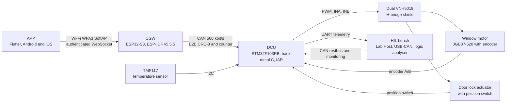

# LockSys

[](https://github.com/jlurg/locksys/actions/workflows/ci.yml)
[](https://github.com/jlurg/locksys/actions/workflows/codeql.yml)
[](LICENSE)

LockSys is a car door control system built as a bench demonstrator: a Flutter app commands
the door lock and the window of a vehicle door through a Wi-Fi to CAN gateway and a door
control unit. It shows a complete embedded product flow without AUTOSAR or commercial
middleware: requirements with traceability, layered MISRA C firmware, end-to-end protected
CAN communication, an authenticated mobile link, static analysis, hardware-in-the-loop
testing and reproducible, evidence-backed releases.

> [!WARNING]
> LockSys is a bench demonstrator. It is not designed, validated or certified for use in a
> vehicle. Never install it in a vehicle or test it on public roads.

## System overview



| Node | Hardware | Software | Responsibility |
|---|---|---|---|
| APP | Android 10 or later, iOS 15 or later | Flutter, Clean Architecture with BLoC | User interface, QR pairing, authenticated session, hold-to-run keep-alive, explicit stop; no safety decisions |
| CGW | ESP32-S3-DevKitC-1, SN65HVD230 CAN transceiver | ESP-IDF v5.5.5, FreeRTOS active objects, ports and adapters | WPA3 SoftAP, WebSocket session, single controller arbitration, keep-alive supervision, CAN gateway |
| DCU | NUCLEO-F103RB, Pololu Dual VNH5019 shield | Bare-metal MISRA C:2012, IAR EWARM with C-STAT, IAR Visual State state machines | H-bridges, encoder supervision, final interlocks, temperature, diagnostics |
| HIL | Windows Lab Host and bench instruments | Python 3.13 with pytest | System tests, fault injection, evidence |

The DCU is the last line of defence: it treats commands from the CGW and the APP as untrusted
and enforces every interlock and timeout itself.

## Scope of the current stage (stage A)

- **Window:** a free-spinning JGB37-520 12 V encoder motor turns up or down only while the app
  button is held. There are no mechanics, limit switches or position limits. Encoder
  supervision (no motion, direction mismatch), a current-sense over-current backstop, a soft
  start ramp and an 8 s maximum run time per press stop the motor.
- **Door lock:** a 12 V automotive lock actuator with its built-in position switch.
- **Temperature:** a TMP117 sensor read over I2C and reported on CAN and UART.
- **Not in this stage:** non-volatile memory, calibration data and CAN transceiver standby
  control. Virtual encoder limits, speed control, physical limit switches and anti-pinch
  follow in stages B to E.

## Repository map

| Path | Content |
|---|---|
| [`interfaces/`](interfaces) | Single sources of truth: CAN database, APP protocol, enumerations, timing parameters, DTC catalogue, shared test vectors |
| [`libs/`](libs) | Shared C libraries used by both firmwares (`ls_e2e`, `ls_common`) |
| [`firmware/dcu/`](firmware/dcu) | Door control unit firmware (STM32F103RB) |
| [`firmware/cgw/`](firmware/cgw) | Central gateway firmware (ESP32-S3) |
| [`app/`](app) | Flutter application |
| [`hil/`](hil) | Hardware-in-the-loop test framework and bench documentation |
| [`tools/`](tools) | Code generation, traceability, CI gates, repository governance; version pins in [`tools/versions.env`](tools/versions.env) |
| [`third_party/`](third_party) | Vendored CMSIS, nanopb and QR code generator |
| [`docs/`](docs/README.md) | Requirements, architecture, safety, security, verification, process and decision records |
| [`.github/`](.github) | Workflows, issue forms, pull request template, code owners, Dependabot |

Generated code is committed next to its consumers and is never edited by hand.

## Quick start

Tool versions are pinned in [`tools/versions.env`](tools/versions.env). Set up the Python
workspace and the Git hooks first:

```bash
uv sync
uv run pre-commit install --install-hooks
```

| Area | Command |
|---|---|
| Code generation | `uv run tools/codegen/regen.py` (`--check` reports drift) |
| Shared libraries, unit tests | `tools/docker/ceedling/run.sh libs/ls_e2e test:all` |
| DCU, unit tests | `tools/docker/ceedling/run.sh firmware/dcu test:all` |
| DCU, GCC shadow build | `cmake -S firmware/dcu -B build/dcu-gcc -G Ninja -DCMAKE_TOOLCHAIN_FILE=firmware/dcu/cmake/arm-none-eabi-gcc.cmake && cmake --build build/dcu-gcc` |
| DCU, IAR build (Lab Host, PowerShell) | `firmware/dcu/scripts/iar/Invoke-DcuBuild.ps1 -Configs Debug,Release -CStat` |
| CGW build | `docker run --rm -v "$PWD":/project -w /project/firmware/cgw espressif/idf:v5.5.5 idf.py build` |
| APP | `cd app && fvm flutter analyze && fvm flutter test` |
| Python tools and HIL unit tests | `uv run pytest` |
| Python lint | `uv run ruff check . && uv run mypy` |
| Traceability report | `uv run tools/trace/trace.py --report` |
| All hooks and linters | `uv run pre-commit run --all-files` |

## Documentation

The [documentation index](docs/README.md) lists every document. Starting points:

- [Roadmap](docs/00_project/roadmap.md): milestones M0 to M6 and the window stages.
- [Safety concept](docs/05_safety/safety_concept.md) and [security concept](docs/06_security/security_concept.md).
- [Verification strategy](docs/07_verification/verification_strategy.md).
- [Branching model](docs/08_process/branching.md) and [commits and pull requests](docs/08_process/commits_and_prs.md).
- [Architecture decision records](docs/adr/README.md).

## Status

Milestone M0 (foundation) is in progress: repository governance, interfaces, code
generation, shared libraries, skeletons of all subprojects, documentation and CI. The
[roadmap](docs/00_project/roadmap.md) describes the following milestones up to the v1.0.0
release.

## Contributing and security

See [CONTRIBUTING.md](CONTRIBUTING.md) and the [Code of Conduct](CODE_OF_CONDUCT.md). Report
vulnerabilities privately as described in [SECURITY.md](SECURITY.md).

## License

LockSys is licensed under the [Apache License, Version 2.0](LICENSE). Third-party components
and their licenses are listed in [THIRD_PARTY_NOTICES.md](THIRD_PARTY_NOTICES.md).
