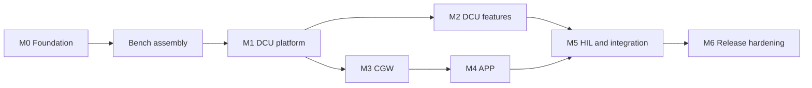

# Roadmap

| Field | Value |
| --- | --- |
| Document ID | LS-PRJ-001 |
| Version | 1.0 |
| Status | Approved |
| Owner | jlurg |

## Purpose and scope

This document defines the milestones from the repository foundation (M0) to the first release v1.0.0 (M6), with deliverables, exit criteria and effort estimates, the window stages after the MVP, the MVP and LATER cut, and the main project risks.

## Planning basis

- One developer. Estimates are in person-weeks (PW); 1 PW is 40 focused hours.
- Total effort for the MVP is about 36 PW: a subtotal of 31 PW plus 15 to 20 % contingency.
- Calendar time is about 9 to 10 months full-time, or 18 to 24 months at 15 to 20 hours per week.
- Each milestone is a GitHub milestone with an epic issue. When a milestone overruns, items move to LATER; exit criteria are not relaxed.
- A vertical slice is targeted around week 12: M0, M1, a minimal WinCtrl and the APP simulator talking to the DCU through the USB-CAN adapter, so that the window motor moves under hold-to-run with E2E protection.

## Milestones

| Milestone | Deliverables | Exit criteria | Estimate (PW) |
| --- | --- | --- | --- |
| M0 Foundation | Repository, governance and CI (`pr-policy`, `ci-gate`, `dcu-iar`); LS-SAIC v0.2 with a single amendment register; interfaces v1.0 (CAN matrix, APP protocol, enumerations, timing, DTC catalogue, test vectors) with code generation and the regenerate-and-compare gate; `ls_e2e` and `ls_common` implemented and tested; skeletons of DCU, CGW, APP and HIL; process documentation and ADRs; Lab Host runner and day-1 checks | A test PR passes `pr-policy` and `ci-gate`; an IAR test project produces a C-STAT report on the Lab Host runner; a commit with AI attribution is rejected locally and in CI; the code generation check is clean; the day-1 checks are recorded as GO or NO-GO | 3 |
| Bench assembly | Modules only: driver shield on the NUCLEO, window motor on its bracket, lock actuator, CAN boards, TMP117, fuse and connectors ([BOM](bom.md)) | Bench safety checklist complete; 60 Ω measured between CANH and CANL with the bus unpowered | 0.5 |
| M1 DCU platform | MCAL, scheduler, watchdog manager, Com with E2E, telemetry, ROM CRC | NodeSts transmitted every 100 ms ± 10 %; E2E test vectors pass on host and target; a hung task switches the outputs off within 100 ms; C-STAT has zero open findings | 5 |
| M2 DCU features | Visual State models WinCtrl, DoorCtrl and ModeMgr with their adapters; encoder speed, direction and stall supervision; TempMon; Dem; UDS-lite; tests with a restbus on the real hardware | The window motor turns while the CAN command is held and stops when it is released; the trace gate is blocking for DCU software requirements | 5 |
| M3 CGW | SoftAP with WPA3, WebSocket with authentication, command arbiter, TWAI, pairing, APP simulator | SYS-020, SYS-021 and SYS-050 to SYS-056 verified | 5.5 |
| M4 APP | Android application complete; iOS with manual Wi-Fi join | SYS-095 and SYS-096 verified; release-to-stop time of at most 150 ms measured | 5 |
| M5 HIL and integration | Stimulus firmware, HIL framework, about 20 automated tests, `hil-gate`; no interface board: direct wiring and relay modules | 3 consecutive green nightly runs and a passed soak run | 5 |
| M6 Release hardening | DCU hardening (background ROM CRC, clock failure handling); evidence pack; safety and security cases; demonstration video; immutable v1.0.0 | v1.0.0 published as an immutable release with its evidence pack; release checklist complete | 2 |
| **Total** | | | **31 + contingency ≈ 36** |

## M0 work packages

| Package | Content | Executed by |
| --- | --- | --- |
| Bootstrap | Root files, repository-local identity and signing, pre-commit, version pins | Local |
| Attribution barriers | Assistant settings and hook, `CLAUDE.md`, `tools/git/ai_attribution.py` with tests | Local |
| Interfaces and code generation | DBC, protobuf with options, YAML sources, test vectors, `tools/codegen/regen.py`, committed generated code | Local |
| Libraries and skeletons | `libs/` implemented and tested; DCU layers, startup, linker file, GCC shadow build, Ceedling project, IAR and C-STAT scripts, Visual State options and checks; CGW, APP and HIL skeletons | Local |
| Documentation | LS-SAIC v0.2, requirements, safety and security concepts, architectures, verification, process documents, ADRs, roadmap, BOM | Local |
| CI/CD | Workflows, issue forms, PR template, CODEOWNERS, Dependabot | Local |
| Publication | Signed initial commit, public repository, `develop`, settings, seed PR, rulesets ([GitHub settings](../08_process/github_settings.md)) | Maintainer |
| Lab Host (U4) | OpenSSH, git, uv, day-1 checks, IAR project created from the guide, runner `iar` and hooks | Maintainer |
| Visual State spike (U5) | Model project, Classic Coder, first generation, C-STAT baseline of the generated code, C-SPYLink test | Maintainer |

Early spikes, each recorded as GO or NO-GO:

- IAR licence, C-STAT and automated use (Lab Host day-1 checks D1 to D4).
- USB-CAN adapter in python-can at 500 kbit/s with an 87.5 % sample point, once the adapter is available.
- Logic analyser automation on the owned analyser model.
- Phone gate WP0, before M4 starts: WPA3 join and network binding on real Android and iOS phones against the first CGW SoftAP build.

## Window stages after the MVP

The MVP implements stage A: the window motor turns UP or DOWN only while the APP button is held, without position limits ([ADR 0014](../adr/0014-module-based-bench-hardware-and-free-spinning-encoder-motor.md)). Each later stage is decided when the previous one is complete.

| Stage | Content | Type |
| --- | --- | --- |
| B | Virtual limits from encoder counts: configurable travel in counts, position 0 to 100 %, stop on reaching 0 % or 100 %; fulfils the original "stops at the limit" requirement without mechanics | Software |
| C | PI speed control with ramps, using the encoder | Software |
| D | Physical limit switches (two microswitches) | Simple hardware |
| E | Anti-pinch from speed and current | Software and calibration |

## MVP and LATER

| Area | MVP | LATER |
| --- | --- | --- |
| DCU | Layered firmware, Visual State engines, encoder supervision, DTCs in RAM with a reset-surviving latch, UDS-lite, ROM CRC | Non-volatile memory and EEPROM emulation, calibration block, CAN transceiver standby control, extended UDS services |
| CGW | SoftAP WPA3, authenticated sessions, arbiter, TWAI, pairing, partition table prepared for OTA | OTA updates; Secure Boot and Flash Encryption (documented only, eFuses are irreversible) |
| APP | Android complete; iOS with manual Wi-Fi join | iOS network binding |
| Window | Stage A | Stages B to E |
| HIL | About 20 automated tests, direct wiring, relay modules, smoke, nightly and soak runs | Interface board PCB, oscilloscope automation, bit-level CAN disturbance, high-resolution capture on the stimulus MCU |
| Quality | MISRA with C-STAT and GEP, statement and branch coverage gates, MC/DC reported | MC/DC as a gate; CodeQL for C and C++ |
| Documentation | Markdown, trace report and trace gates | Sphinx with sphinx-needs and a published site |
| Governance | Rulesets, `pr-policy`, `ci-gate`, `iar-gate`, `hil-gate`, Dependabot, secret scanning, immutable releases | Merge audit workflow, OpenSSF Scorecard, signed-head check on the Lab Host |

## Project risks

| Risk | Mitigation |
| --- | --- |
| IAR licence: supported version, C-STAT inclusion, use from the runner, licence terms for automated builds | Day-1 checks; the GCC shadow build and the cppcheck MISRA addon keep cloud CI independent of the licence |
| Scope: about 36 PW for one person | MVP and LATER cut, vertical slice around week 12, timebox per milestone |
| Lab Host as single point of failure: licence, runners, bench, Windows updates, one interactive session shared with remote desktop | `bench.lock` before remote desktop, updates paused during soak runs, system image after M0 |
| Phones: WPA3 join from code on iOS, Android binding to a Wi-Fi network without internet, provisioning profile lifetime with a free Apple account | WP0 spikes, Android first, manual Wi-Fi join on iOS |
| Release-to-stop latency margin: 142 ms nominal against 150 ms required | Measure with the APP simulator early in M3; if needed, change the requirement formally, never silently |
| Bench electrical risks: 12 V reaching the NUCLEO, ground loops, current injection on PA6 | Bench safety checklist: JP9 removed, NUCLEO powered from USB only, supply limited to 3 A, 7.5 A fuse, isolated USB-CAN adapter; option B for the lock fault line if the injection is out of specification |
| Public repository exposure: self-hosted runner, secrets in logs | No PR-triggered self-hosted jobs, redaction markers, secret scanning with push protection |
| Visual State: MISRA findings in generated code, plugin support for the installed EWARM, coder without GUI under the runner account | Spike U5, path-scoped permit DP-05, "model as specification" fallback, manifest check in cloud CI |
| Free-spinning motor: exposed shaft, 12 V | Motor fixed on its bracket, shaft not touched while running, current-limited supply, fuse, attended HIL-REAL runs, soak runs in HIL-SIM only |

## Tracking

- GitHub milestones M0 to M6, each with an epic issue and sub-issues; items carry `scope:MVP` or `scope:LATER`.
- At each milestone exit, the exit criteria are checked against recorded evidence, and actual effort is compared with the estimate in this document.

## Rationale

- The milestone order follows the dependencies: the DCU platform before its functions, the CGW before the APP, and the HIL integration once all nodes exist.
- The vertical slice shows the complete safety chain on real hardware early, before the breadth of each node is built.

## References

- [Bill of materials](bom.md)
- [Glossary](glossary.md)
- [Release process](../08_process/release_process.md)
- [System requirements](../02_system/system_requirements.md)
- [Verification strategy](../07_verification/verification_strategy.md)
