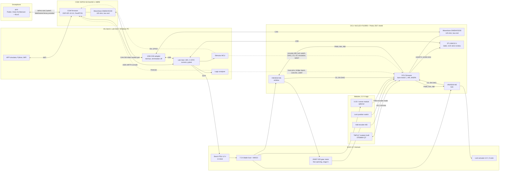
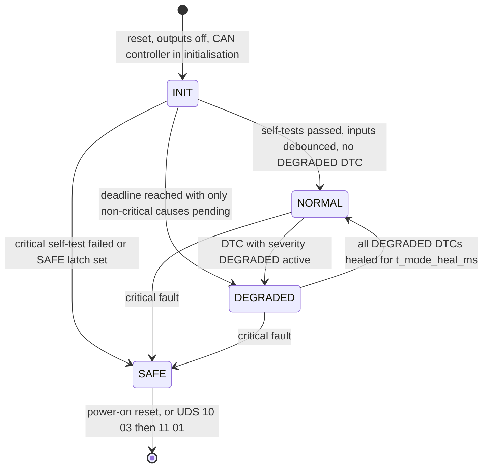
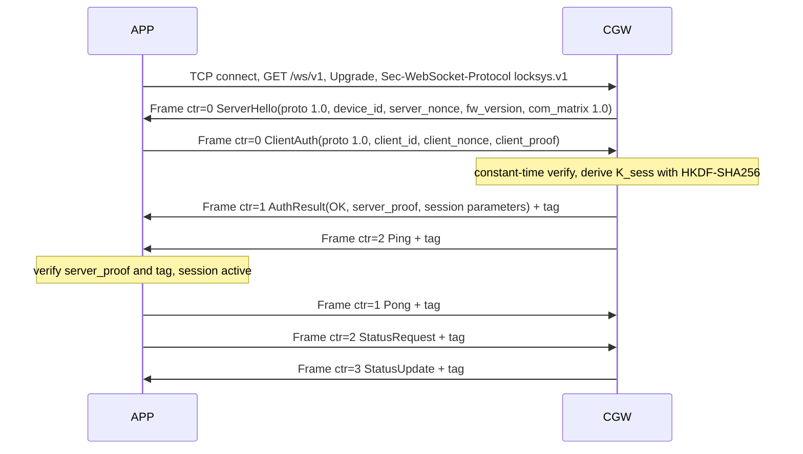

# LockSys System Architecture & Interface Contract

| Field | Value |
|---|---|
| Document ID | LS-SAIC-001 |
| Version | 0.2 |
| Status | Draft for baseline. Interfaces are pre-baseline. |
| Owner | jlurg |
| Date | 2026-10-03 |
| Interface versions defined here | CAN matrix **1.0**, APP protocol **1.0** (`locksys.app.v1`), UART telemetry **1** |
| Supersedes | LS-SAIC-001 v0.1 |
| Amendments applied | All entries of the amendment register `docs/02_system/amendment_register.md` with decision ACCEPTED or MODIFIED |
| Requirements | LS-SRS-001 (`docs/02_system/system_requirements.md`) |

---

## 0. Purpose, scope and conventions

### 0.1 Purpose

This document is the single system-level contract of LockSys. It defines the decomposition into nodes, the hardware and pin allocation of the bench, the functional chains with their timing budgets, the operating modes, every interface between nodes (CAN, APP protocol, UART telemetry, diagnostics), the canonical enumerations, the parameter registry, the DTC catalogue, and summaries of the safety and security concepts.

### 0.2 Scope

- LockSys is a bench demonstrator of a remotely controlled car door lock and power window. It borrows methods from ISO 26262 and ISO/SAE 21434 but is **not certified**. AUTOSAR and commercial automotive tooling are not used.
- The release v1.0 (MVP) implements **stage A** of the window function (§0.4).
- Detailed concepts are maintained in separate documents and are only summarised here: LS-SAF-001 (safety), LS-SEC-001 (security), LS-HIL-001 (HIL bench), LS-DCU-SAD-001, LS-CGW-SAD-001 and LS-APP-SAD-001 (node architectures), LS-VER-001 (verification strategy).

### 0.3 Precedence and change control

- Every node design (DCU, CGW, APP, HIL, repository/process) follows this contract. A deviation requires a pull request that changes this document first.
- The machine-readable artefacts under `interfaces/` (§1.5) are the single source of truth for code generation. Their content shall be identical to the normative tables and listings of this document. A pull request that changes one changes both; the codegen gate `uv run tools/codegen/regen.py --check` and the enum cross-check detect drift.
- Interface versions follow §14.3. CAN matrix 1.0 and APP protocol 1.0 are **pre-baseline**: the additive changes of v0.2 do not increment them. After the first baseline, any change is versioned.

### 0.4 Stage tags

| Tag | Meaning |
|---|---|
| **A** | Stage A, release v1.0 (MVP). Window = free-spinning JGB37-520 encoder gear motor: UP/DOWN only while the APP control is held. No mechanics, no position limits. |
| **B** | Virtual end positions from encoder counts (software only). Satisfies "stops at the limit" without mechanics. |
| **C** | PI speed control with the encoder. |
| **D** | Physical end-position switches (two microswitches). |
| **E** | Anti-pinch (speed and current signature), not certified. |
| **LATER** | Deferred beyond v1.0 and not tied to a window stage. |

Items without a stage tag apply to stage A and all later stages. Requirements, signals and parameters that only become active in a later stage are defined now so that the interfaces stay stable.

### 0.5 Other tags and conventions

- **[SAF]** marks safety-related items, **[SEC]** security-related items.
- **UNVERIFIED** marks a fact not confirmed against a primary source; such facts have a bring-up check (§15.3) or an open point (§15.2).
- "shall" is normative, "should" is a recommendation, "may" is permitted.
- Numbers: `0x` prefix = hexadecimal. Bit positions on CAN are DBC start bits in Intel (little-endian) order, bit 0 = least significant bit of byte 0.
- Units: ms, s, mA, A, mV, V, dV (0.1 V), cdeg (0.01 °C), rpm, % and counts (encoder edges with x4 decoding).
- Time references: "after X" means measured from the first observable evidence of X at the boundary named in the requirement.

---

## 1. System context and decomposition

### 1.1 Actors

| Actor | Role | Touchpoints |
|---|---|---|
| Owner / operator | Paired phone user. Locks and unlocks; holds the window control. | APP UI |
| Bystander | Person near the window; potential pinch victim of the target system. | none |
| Remote attacker | Within WiFi range, holds no key | SoftAP, WebSocket |
| Physical attacker | Has access to wiring and ports | CAN, UART, SWD, USB |
| Developer / tester | Builds, flashes, runs diagnostics and the HIL | SWD, USB-UART, CAN/UDS, logic analyser, SCPI |
| Bench supply | KL30 = +12 V permanent, KL31 = ground | SCPI power supply |

### 1.2 Nodes and responsibilities

| Node | Hardware | Software | Responsible for | Not responsible for |
|---|---|---|---|---|
| **APP** | Android ≥ 10 (API 29), iOS ≥ 15 | Flutter 3.47.6 (Dart 3.13.5), Clean Architecture + BLoC | UI, pairing by QR, session authentication, hold-to-run keep-alive, explicit STOP, display of status and status age | Any safety decision; its contribution is best effort |
| **CGW** | ESP32-S3-DevKitC-1-N8R8 v1.1 + Waveshare SN65HVD230 CAN board | ESP-IDF **v5.5.5** (pinned by Docker image digest), FreeRTOS active objects, ports and adapters | SoftAP, WebSocket server, authentication, single-controller arbitration, keep-alive supervision, `CGW_WinCmd` generation, door transactions, status cache and push | Driving actuators |
| **DCU** | NUCLEO-F103RB (MB1136 ≥ C-02) + Pololu Dual VNH5019 Motor Driver Shield #2507 + JGB37-520 encoder gear motor + 5-wire lock actuator + Adafruit TMP117 module + Waveshare SN65HVD230 CAN board (+ optional 0–25 V sense module) | Bare-metal C, MISRA C:2012 (AMD1–4), IAR EWARM (baseline 9.70) + C-STAT; WinCtrl, DoorCtrl and ModeMgr modelled in IAR Visual State (Classic Coder, readable code, no heap, no function pointers) | Window and lock H-bridges, encoder supervision, **all final interlocks**, temperature acquisition, UART telemetry, DTCs, UDS-lite | WiFi, user authentication |
| **HIL** | Windows Lab Host + instruments + stimulus MCU | Python 3.13 (uv), pytest, python-can 4.6.1, cantools 44.1.0, udsoncan 1.26.1, can-isotp 2.0.7, pyvisa 1.16.2, logic2-automation 1.0.11 | Automated integration and system tests, fault injection, evidence capture | Any product function |

**Principle [SAF]:** the DCU is the last line of defence. It re-checks every permission to move: E2E state, timeouts, HoldAge, PressId, supply, temperature, mode, active DTC inhibits, encoder plausibility and the CAN matrix version. For safety purposes the APP and the CGW are untrusted.

**Model-independent safety layer [SAF]:** the Visual State models sequence the DCU functions but do not protect. Reflex stops (VNH5019 DIAG, hang monitor), the current backstop, the lock pulse hard cap, SafeMon and the watchdog are hand-written and act below the models. A state-machine engine error brakes or switches off the affected actuator without the engine and enters SAFE (DTC B1A55).

### 1.3 Interfaces

| IF | Between | Physical | Contract | Load |
|---|---|---|---|---|
| IF-01 | APP ↔ CGW | WiFi 2.4 GHz, SoftAP | WebSocket binary + protobuf (§8) | ≤ 30 frames per rolling second |
| IF-02 | CGW ↔ DCU | CAN 2.0A, 500 kbit/s | CAN matrix 1.0 + E2E (§7) | 2.92 % steady state |
| IF-03 | DCU → Lab Host | USART2 → ST-LINK VCP (USB) | UART telemetry 1 (§9) | ≤ 20 % of the line |
| IF-04 | DCU ↔ TMP117 | I2C1, 100 kHz | TMP117 register map (§5.4) | 1 Hz |
| IF-05 | DCU ↔ VNH5019 M1 (window) | PWM 20 kHz, GPIO, ADC, EN/DIAG | §2.2, §3.1 | — |
| IF-06 | DCU ↔ VNH5019 M2 (lock) | PWM or GPIO, GPIO, ADC, EN/DIAG | §2.2, §3.1 | — |
| IF-07 | Lock position switch → DCU | GPIO with internal pull-up | §2.4 | — |
| IF-08 | KL30 sense module → DCU | ADC | §2.7 | — |
| IF-09 | Debug | SWD (ST-LINK); CGW USB-Serial-JTAG | — | development only |
| IF-10 | HIL → system | USB-CAN, logic analyser, stimulus MCU, SCPI | §2.10, LS-HIL-001 | test only |
| IF-11 | CGW console | UART0 through the DevKitC USB-UART bridge | Log text; secrets only between markers (§8.5) | development and pairing |
| IF-12 | Encoder → DCU | Two Hall channels A/B, 3.3 V | §2.3, §5.3 | ≤ 8.4 k edges/s |

### 1.4 System-level patterns

- **Single source of truth + code generation.** DBC → C with cantools 44.1.0 (`--node`, `--no-floating-point-numbers`, `--database-name ls_can`, `--prune`). `.proto` → nanopb 0.4.9.2 (C, CGW), Dart `protobuf` 6.1.0 / `protoc_plugin` 25.1.0 (APP) and Python protobuf 6.33.x (HIL). YAML files hold the canonical enums, the parameters and the DTC/notice catalogue and generate C, Dart and Python constants. Generated code is committed with a `DO NOT EDIT` header; the CI gate "regenerate and diff" detects drift. IAR project builds need no code-generation tooling; the Lab Host provides Python 3.13 (uv) for CI gates and the stdlib-only version-header generator.
- **Scheduling.** DCU: time-triggered cooperative scheduler on a 1 ms SysTick. CGW: event-driven active objects. APP: reactive streams (BLoC).
- **Dead-man (keep-alive) chain [SAF].** Each hop has its own timeout. After any non-release stop the PressId is latched; motion needs a new press.
- **E2E protection [SAF]** on every application frame except the version frames: CRC-8/SAE-J1850 + 4-bit alive counter + DataID (§7.2). E2E is a safety mechanism, not a security control.
- **Idempotent commands** (request ID, press ID). **Heartbeat + version handshake.** **Watchdog with alive supervision.**
- **Safe default value 0.** Every canonical enumeration uses 0 for the safe or unknown value, so zeroed memory is safe.
- **De-energised by default [SAF].** At reset all MCU pins are inputs; the VNH5019 PWM input then reads low and the bridge outputs are high impedance (coast). Software never relies on EN/DIAG to disable a bridge (§2.2).
- **Controller-silent start.** CAN controllers stay in initialisation mode (no transmission, no acknowledgement) until the node has initialised; the transceiver standby pin is not controlled in the MVP (§2.6).
- **Statechart + adapter.** DCU WinCtrl, DoorCtrl and ModeMgr are IAR Visual State models; each SWC adapter derives events with a prioritised bitset, keeps timers in a timestamp pool and applies outputs once per cycle.

### 1.5 Interface artefacts

| Artefact | Path | Generated outputs / consumers |
|---|---|---|
| CAN matrix | `interfaces/can/locksys.dbc`, output manifest `interfaces/can/codegen.yaml` | `firmware/dcu/gen/` (node DCU), `firmware/cgw/components/cgw_com/gen/` (node CGW), HIL (cantools at run time) |
| APP protocol | `interfaces/proto/locksys/app/v1/locksys_app.proto` + `locksys_app.options` | `firmware/cgw/components/cgw_proto/gen/` (nanopb), `app/packages/locksys_protocol/lib/src/gen/` (Dart), `hil/src/locksys_hil/gen/` (Python) |
| Canonical enums | `interfaces/enums/locksys_enums.yaml` | `libs/ls_common/gen/` (C), Dart, Python. CI cross-checks the YAML against DBC `VAL_` tables and proto enums. |
| Parameters | `interfaces/params/timing.yaml` | `libs/ls_common/gen/` (C header), Dart `LsParams`, Python constants, HIL limits |
| DTC and notice catalogue | `interfaces/dtc/dtc_catalog.yaml` | `firmware/dcu/gen/` (Dem table), CGW tables, Dart and Python constants |
| UART telemetry | `interfaces/uart/telemetry_v1.md` | DCU Tlm, HIL parser |
| Test vectors | `interfaces/vectors/e2e_v1.json`, `app_session_v1.json`, `crypto_kat.json` | `libs/` tests, CGW host tests, APP tests, HIL unit tests |
| Shared C | `libs/ls_e2e/` (E2E protect/check, receiver state machine), `libs/ls_common/` (LsCrc8, LsEvSet, LsTmr, LsRing + generated enums and parameters) | DCU (IAR and GCC shadow build), CGW (ESP-IDF component), host tests |
| Vendored code | `third_party/{cmsis_core-5.9.0, cmsis_device_f1-4.3.5, nanopb-0.4.9.2, qrcodegen-1.8.0}/` | DCU, CGW |

`interfaces/` holds contracts and vectors only, never code. One command regenerates every output: `uv run tools/codegen/regen.py` (`--check` fails on drift).

### 1.6 System diagram



---

## 2. Hardware architecture (stage A, modules only)

The bench uses ready-made modules only. There is no breadboard and no discrete component in any current path or signal path.

### 2.1 Bench bill of materials

| # | Item | Qty | Notes | Stage |
|---|---|---|---|---|
| 1 | NUCLEO-F103RB, board MB1136 rev C-02 or later | 1 | ST-LINK MCO 8 MHz drives the HSE bypass input. Check the sticker (BU-01). | A |
| 2 | ESP32-S3-DevKitC-1-N8R8, board v1.1 | 1 | On v1.0 the RGB LED is on GPIO48 instead of GPIO38. | A |
| 3 | Pololu Dual VNH5019 Motor Driver Shield for Arduino #2507 (rev ash02b) | 1 | Plugs onto the NUCLEO Arduino headers; stackable headers pass every signal to the top sockets. M1 = window, M2 = lock. JP9 never fitted. | A |
| 4 | JGB37-520 12 V gear motor 1:60 with 6-wire Hall encoder (Hiwonder R60; alternative Yahboom MD520 1:56) | 2 (one spare) | 2640 counts per output revolution with x4 decoding (1:60). Rated 0.53 A, stall 3.2 A (Hiwonder). | A |
| 5 | 37 mm L bracket, 6 mm flange coupling, light indicator disc (60–80 mm) | 1 set | Motor fixed to a board; nothing that can wind onto the shaft. | A |
| 6 | 12 V 5-wire central-locking actuator with built-in position switch | 1 | Vendor data about 2–4 A and about 0.2 s stroke (UNVERIFIED). | A |
| 7 | Waveshare SN65HVD230 CAN Board | 2 | One per node, placed at the two bus ends. 120 Ω fitted; Rs to GND through 10 kΩ. | A |
| 8 | Adafruit TMP117 #4821 + STEMMA QT to male-header cable #4209 | 1 + 1 | Address 0x48; 10 kΩ pull-ups on the module. | A |
| 9 | 0–25 V voltage sense module, 30 kΩ / 7.5 kΩ (ratio 1/5) | 1 | Optional for desk use; required to verify SYS-039 and SYS-043. | A |
| 10 | Blade fuse holder + 7.5 A blade fuse (KL30 main); optional 5 A fuse in the lock lead | 1 | | A |
| 11 | WAGO 221 lever connectors, 18 AWG wire (power), Dupont M-F and F-F jumpers (logic), twisted pair (CAN) | set | | A |
| 12 | Bench PSU 12 V with adjustable current limit, SCPI over LAN preferred (HIL) | 1 | Current limit 3 A (5 A only for attended lock stall tests); OVP 18.0 V where supported; power-on output state OFF. | A |
| 13 | Isolated USB-CAN adapter with python-can support | 1 | Requirements §2.10; recommended PEAK PCAN-USB FD IPEH-004022 (USB-A) or IPEH-004023 (USB-C). Termination off. | A (HIL) |
| 14 | Stimulus MCU board | 1 | Requirements §2.10; NUCLEO-144 family recommended (owned). | A (HIL) |
| 15 | Logic analyser (Saleae, owned), oscilloscope, DMM | — | | A (HIL) |
| 16 | Two microswitches for the end positions | 2 | | D |
| 17 | TCAN1042V-Q1 transceivers (AEC-Q100) with standby control | 2 | Production-intent physical layer | LATER |
| 18 | 12 V → 5 V buck converter (≥ 2 A) | 1 | Stand-alone power. Never power the DevKitC from USB and its 5V pin at the same time. | LATER |

### 2.2 H-bridge: Pololu Dual VNH5019 shield #2507

Facts (Pololu product page, user guide 0J49, schematic ash02b, ST VNH5019A-E datasheet DocID15701 Rev 11):

- Supply 5.5–24 V (over-voltage protection may trip from 24 V); 12 A continuous, 30 A peak per channel; PWM up to 20 kHz.
- Logic inputs: VIH 2.1 V, VIL 0.9 V, so 3.3 V logic drives them. INA, INB and PWM have 1 kΩ series resistors and **no discrete pull-downs**. The VNH5019 inputs sink a small input current, which implies weak internal pull-downs (inference; value UNVERIFIED).
- EN/DIAG (A and B tied per channel): 4.7 kΩ pull-up to VDD (5 V) and 1 kΩ series to the MCU pin. An MCU pulling low reaches only about 0.91 V, above VIL max: EN/DIAG cannot be used to disable a bridge. Low = fault (thermal, under/over-voltage, internal over-current).
- Current sense CS: about 140 mV/A through 10 kΩ + 33 nF on the shield (≈ 23 A full scale at 3.3 V); gain tolerance ±19 % at 3 A. CS is active only while the bridge drives and low while it coasts; behaviour during PWM off-time is UNVERIFIED, so filtered CS is treated as about I × duty. CS cannot resolve the 0.1–0.5 A free-running current.
- Logic VDD comes from the Arduino 5V pin; IOREF is a pass-through.
- Reverse-voltage protection down to −16 V on VIN.
- JP9 (ARDVIN = VOUT) would connect the motor supply to the NUCLEO VIN.

Normative drive rules:

| Command | INA | INB | PWM | Result |
|---|---|---|---|---|
| Drive UP | 1 | 0 | duty | motor driven, direction UP by definition |
| Drive DOWN | 0 | 1 | duty | motor driven, direction DOWN |
| Brake | 0 | 0 | 100 % | both low-side switches on: dynamic brake to GND |
| Off (coast) | 0 | 0 | 0 % | all four switches off, outputs high impedance |

- Stop sequence of a running window: Brake for `t_win_brake_ms`, then Off, then Off for at least `t_win_rev_dead_ms` before any new drive (§5.2).
- Immediate Off (no brake) is used for a VNH5019 fault, the hang monitor, a fault handler and SAFE entry.
- EN/DIAG pins are floating inputs. Firmware never drives them push-pull high and never relies on them to stop a motor. A latched VNH5019 fault is cleared by toggling INA/INB only when the per-DTC policy allows a test actuation (§13).
- Initialisation order: PWM pins low, INA = INB = 0, EN/DIAG floating inputs → AFIO MAPR → timers with compare value 0 → outputs enabled.
- The lock channel is driven at 100 % during a pulse (TIM4_CH1 at 100 % duty or PB6 as GPIO high).
- JP9 is never fitted.

### 2.3 Window motor and encoder

- JGB37-520 12 V 1:60 (Hiwonder R60): 170 rpm no load; 146 rpm and 0.53 A rated; 3.2 A stall; 6 mm D shaft; PH2.0-6P connector. Yahboom MD520 1:56 (205 rpm) is an alternative; its electrical data is UNVERIFIED. No-load current 0.1–0.3 A (UNVERIFIED); 5 A is the design worst case for unknown vendors.
- Encoder: AB quadrature from an 11-line magnetic ring, 44 counts per motor revolution with x4 decoding; counts per output revolution = 44 × ratio (2640 at 1:60, 2464 at 1:56). Built-in pull-ups and shaping on the encoder board; supply 3.3 V from the NUCLEO (3.3–5 V specified by Hiwonder). Worst case at 11,500 motor rpm: about 8.4 k counts/s, at least 119 µs between edges.
- `enc_cpr` is calibrated on the bench by turning the output ten revolutions by hand. `enc_dir_invert` aligns the count sign so that UP gives positive counts; polarity is a calibration value, not a code change.
- Wire colours are UNVERIFIED: the encoder PCB silkscreen is authoritative; the motor pair is confirmed with an ohmmeter (a few ohms). A 100 nF capacitor across the motor terminals is fitted if the motor has none.
- Mounting: fixed in its bracket; free-spinning output with a light indicator disc. Real-motor runs are attended.

### 2.4 Door lock actuator

- The two motor wires go to the shield M2A/M2B terminals. The built-in position switch (dry contact, UNVERIFIED) connects COM to GND (CN10-20) and the contact to PB12 (CN10-16) with the STM32 internal pull-up; software debounce `t_debounce_ms`.
- `lock_fb_locked_level` defines which debounced level means LOCKED. DoorLockState is always derived from the switch, never from the command.
- Each pulse is limited to `t_lock_pulse_hard_max_ms` by a hand-written cap independent of the state machine.
- With the PSU limited to 3 A the actuator may run current-limited. The limit is raised to 5 A only for attended lock stall tests.

### 2.5 Temperature sensor

- Adafruit TMP117 #4821: ±0.1 °C accuracy (−20…50 °C), 7.8125 m°C/LSB, address 0x48 (0x49 with the solder jumper), device ID register 0x0F = 0x0117 (TMP119 reads 0x2117), 10 kΩ pull-ups and level shifting on the module, powered from 3.3 V.
- Connection: STEMMA QT cable #4209 into the shield top sockets — red to 3.3 V, black to GND, blue to SDA (PB9), yellow to SCL (PB8).
- Placement: close to the shield, so the value is the ECU temperature used by the over-temperature interlock (SYS-040) and the measurement reported over UART (STK-009).
- The driver sits behind the TempSens port with link-time adapters: TMP117 (default), TMP102, LM75 and a simulated adapter for host tests.

### 2.6 CAN physical layer

- Waveshare SN65HVD230 CAN Board: 3.3 V supply, ESD protection, 120 Ω soldered across CANH/CANL, Rs to GND through 10 kΩ (slope control). Header order per the silkscreen (the 2011 schematic suggests CAN_TX, GND, 3.3V, CAN_RX; UNVERIFIED for current boards).
- Topology: the DCU board and the CGW board terminate the two bus ends; the USB-CAN adapter joins mid-bus with its termination off. Stubs ≤ 0.3 m; twisted pair with a ground reference conductor. With the bus unpowered, CANH–CANL measures 60 Ω ± 5 %.
- The module exposes no standby pin. **There is no transceiver standby control in the MVP**: a powered transceiver is always active. Standby control (CGW GPIO6, a spare DCU pin, TCAN1042V-Q1) is LATER.
- While an MCU is in reset its CAN TX pin floats. The SN65HVD230 driver function table gives a recessive bus for an open D input (UNVERIFIED for the module; BU-05). Until the controller is initialised it neither transmits nor acknowledges.
- The 10 kΩ slope control at 500 kbit/s has an UNVERIFIED timing margin; if the bit timing proves marginal, Rs is tied directly to GND (BU-05).
- DCU wiring: 3V3 CN7-16, GND CN7-20, CAN_TX → PA12 (CN10-12), CAN_RX → PA11 (CN10-14). CGW wiring: 3V3, GND, CAN_TX → GPIO4, CAN_RX → GPIO5.

### 2.7 Power, protection and grounding

| Domain | Source | Loads | Protection / limits |
|---|---|---|---|
| KL30 (12 V) | Bench PSU at 12.0 V, current limit 3.0 A; 5.0 A only for attended lock stall tests; never 8 A with a motor connected | Shield VIN (both VNH5019), KL30 sense module | PSU current limit, 7.5 A main blade fuse, shield reverse-voltage protection (−16 V), VNH5019 internal current limit, thermal and under/over-voltage shutdown, PSU OVP 18.0 V where supported |
| KL31 | PSU negative → shield GND terminal | Motor and actuator return | Single return path |
| 5V_DCU | USB through the ST-LINK (JP5 = U5V) | NUCLEO, shield logic VDD (Arduino 5V pin) | USB current limit |
| 3V3_DCU | NUCLEO regulator U4 (LD39050PU33R), 500 mA maximum | STM32, encoder, TMP117 module, DCU CAN board | Budget ≤ 150 mA |
| 5V/3V3_CGW | USB into the DevKitC UART port | ESP32-S3, CGW CAN board | Board regulator |

Rules:

1. Power path: PSU + → 7.5 A blade fuse → WAGO → shield VIN terminal; PSU − → shield GND terminal; 18 AWG. Motor and actuator leads go only to the shield M1A/M1B and M2A/M2B terminals.
2. JP9 is not fitted. Nothing is connected to the NUCLEO VIN or E5V pins; the NUCLEO is powered from USB only.
3. Motor and actuator return current flows only through the shield GND terminal, never through logic jumpers.
4. Logic grounds (NUCLEO, DevKitC, CAN boards, encoder, TMP117, stimulus MCU) share the USB grounds of the Lab Host. A ground reference conductor runs with CANH/CANL. The USB-CAN adapter is galvanically isolated.
5. The oscilloscope ground clip goes only to the PSU negative; motor current is measured with a current clamp or a differential probe.
6. The PSU output is OFF while anything is plugged or unplugged. The PSU power-on output state is OFF and the HIL job-completed hook switches KL30 off.
7. A bench PSU cannot sink current. With stage A currents (≤ 3.9 A stall, ≤ 0.5 A running) the braking energy is absorbed by the shield input capacitance; the margin is UNVERIFIED and checked at bring-up (BU-07). A discrete TVS and bulk capacitor are LATER.
8. Reversed KL30: the shield is protected to −16 V; the encoder never sees KL30; the sense module output goes to about −2.4 V at −12 V, giving roughly −0.35 mA of clamp current into PA4 through its ≈ 6 kΩ source impedance (within the injection limit stated in DS5319, UNVERIFIED) and invalid KL30 readings while reversed.

### 2.8 Signal conditioning (provided by the modules)

| Signal | Network |
|---|---|
| INA, INB, PWM (both channels) | 1 kΩ series on the shield; VNH5019 internal pull-downs (value UNVERIFIED) |
| EN/DIAG | 4.7 kΩ pull-up to 5 V + 1 kΩ series (shield) |
| CS → ADC | 10 kΩ + 33 nF (shield); ≈ 140 mV/A |
| Lock position switch | STM32 internal pull-up, 20 ms software debounce |
| Encoder A/B | Encoder-board pull-ups to 3.3 V; STM32 internal pull-ups optional and disabled if the encoder is ever powered from 5 V; TIM2 digital input filter |
| I2C | 10 kΩ pull-ups on the TMP117 module only |
| KL30 sense | Module divider 30 kΩ / 7.5 kΩ, ≈ 6 kΩ source impedance; ADC sample time 239.5 cycles |

### 2.9 Reset and de-energised state [SAF]

- From reset until the safe GPIO initialisation, every DCU pin is a floating input. The VNH5019 PWM inputs then read low and both bridges coast. Residual risk: the shield has no discrete pull-downs; SYS-036 verifies the absence of energisation over power cycles, NRST pulses and watchdog resets.
- The first initialisation step (before clock set-up) drives the PWM pins low and INA = INB = 0, and configures EN/DIAG as floating inputs.
- CGW: GPIO4 (TWAI TX) has no pull and its input is disabled until configured; the CAN board sees an open D input (BU-05, BU-11).

### 2.10 HIL bench interfaces (summary)

The normative bench design is LS-HIL-001 (`docs/07_verification/hil_architecture.md`). Contract-level elements:

**Topologies.** In T1 and T2 the board of the node held in reset stays on the bus as a termination; its controller is silent.

| Topology | USB-CAN role | Node held in reset | Used for |
|---|---|---|---|
| T1 DCU in the loop | CGW restbus (WinCmd, DoorCmd, NodeSts, Version), E2E applied per transmission | CGW (EN low) | DCU functions, E2E and timeout injection, UDS |
| T2 CGW in the loop | DCU restbus | DCU (NRST low) | Security, session, CGW supervision |
| T3 System | Listen-only monitor, or injecting | none | End-to-end chains |

**Configurations.**

- HIL-SIM: KL30 output off (bridges unpowered). The stimulus MCU generates encoder A/B on PA15/PB3 from the WIN_INA/INB/PWM taps at the model speed and can inject stall (no edges) and reversed direction; it emulates the lock switch on PB12, EN/DIAG on PB10 and PB4/PA6 (open drain), and CS at the A0/A1 sockets (the shield's 10 kΩ series resistor isolates the unpowered VNH5019 CS outputs), and it emulates the TMP117 as an I2C target at 0x48 (real module disconnected; never both). Unattended runs are allowed.
- HIL-REAL: real motor, actuator and TMP117; PSU limited to 3 A; attended only; the PSU output-off button is the emergency stop.

**Stimulus MCU requirements.** ≥ 20 GPIO at 3.3 V with open-drain capability (NRST, EN, GPIO0, EN/DIAG), I2C target with clock stretching (TMP117 one-shot, Data_Ready, NACK and stuck-SDA emulation), two DAC channels, input capture ≥ 10 MHz, native USB CDC. Recommended: a NUCLEO-144 board (F429ZI, F446ZE, F746ZG, F767ZI, H743ZI2 or H723ZG); the board is confirmed at M5. Stimulus outputs shall be high impedance whenever DCU 3V3 is absent (no back-feeding).

**USB-CAN requirements.** CAN 2.0A/B at 500 kbit/s with configurable bit timing (87.5 % sample point), maintained Windows 11 driver and python-can support, hardware timestamps ≤ 1 µs, galvanic isolation, listen-only mode with error-frame and bus-off reporting, known or switchable termination (off on this bench). Recommended: PEAK PCAN-USB FD; its 500 kbit/s setting BTR 0x001C gives 16 tq, TSEG1 13, TSEG2 2, SJW 1 (87.5 %).

**Logic analyser channel map** (16 channels, 3.3 V threshold, probes on the MCU side; CANH, CANL, KL30 and motor nets are never connected):

| Ch | Signal | Pin |
|---|---|---|
| D0 | SYNC from the stimulus (width-coded) | — |
| D1 / D2 / D3 | WIN_INA / WIN_INB / WIN_PWM | PA10 / PB5 / PC7 |
| D4 / D5 / D6 | LOCK_INA / LOCK_INB / LOCK_PWM | PA8 / PA9 / PB6 |
| D7 | LOCK_FB | PB12 |
| D8 / D9 | ENC_A / ENC_B | PA15 / PB3 |
| D10 | DCU CAN RX | PA11 |
| D11 | DCU USART2 TX | PA2 (CN3 "RX") |
| D12 / D13 | I2C1 SCL / SDA | PB8 / PB9 |
| D14 | DCU TRACE0 | PC0 |
| D15 | CGW TRACE0 | GPIO7 |

With an 8-channel unit, four probe profiles are used: A window timing (SYNC, WIN_INA, WIN_INB, WIN_PWM, ENC_A, ENC_B, DCU TRACE0, CGW TRACE0); B lock and communication (SYNC, LOCK_INA, LOCK_INB, LOCK_PWM, LOCK_FB, CAN RX, UART TX, DCU TRACE0); C I2C and telemetry (SYNC, SCL, SDA, UART TX, CAN RX, DCU TRACE0); D power glitch (SYNC, WIN_INA, WIN_INB, WIN_PWM, LOCK_INA, LOCK_INB, LOCK_PWM). A test whose profile is not wired is reported as skipped, never as passed.

**Other injection points.** DCU NRST (CN7-14) and CGW EN (J1-3) through open-drain stimulus outputs. CGW GPIO0 (J3-14) through an open-drain output that is high impedance during EN reset and during flashing and is never low when EN is released or at power-up. CANH–CANL short through a relay module or manually. KL30 ramps through SCPI.

**DCU power on the HIL bench (MVP).** USB from the Lab Host. A power-on reset of the DCU is a power cycle of its USB supply (switchable hub port, or manual). SAFE-latch clearing in automated tests uses UDS 10 03 followed by 11 01 (§6.1). An E5V supply from a PSU channel is LATER and needs a back-feed check (ST-LINK MCO and VCP links into an unpowered target).

---

## 3. Pin and resource allocation

### 3.1 DCU on NUCLEO-F103RB with shield #2507

FT (5 V tolerant) values are from DS5319 Table 5 by memory and UNVERIFIED (BU-02 re-checks PB4, PB5, PB10 and PA6). Morpho pin numbers follow the STM32duino variant order and are checked against the board silkscreen before wiring.

| Function | Pin | Access point | Peripheral / mode | FT | Notes |
|---|---|---|---|---|---|
| WIN_PWM (M1PWM) | PC7 | shield D9 | TIM3_CH2, full remap, AF push-pull, 20 kHz | yes | |
| WIN_INA (M1INA) | PA10 | shield D2 | GPIO push-pull | yes | |
| WIN_INB (M1INB) | PB5 | shield D4 | GPIO push-pull | no | Never configured as AF |
| WIN_EN_DIAG | PB10 | shield D6 | Floating input, EXTI10 falling edge | yes | 5 V through 5.7 kΩ; low = fault |
| WIN_CS (M1CS) | PA0 | shield A0 | ADC12_IN0, regular conversions only | no | ES096 §2.5.1 |
| LOCK_PWM (M2PWM) | PB6 | shield D10 | TIM4_CH1 AF push-pull at 20 kHz, or GPIO high during a pulse | yes | Blocks the default I2C1 and TIM4 pins |
| LOCK_INA (M2INA) | PA8 | shield D7 | GPIO push-pull | yes | TIM1_CH1 output never enabled |
| LOCK_INB (M2INB) | PA9 | shield D8 | GPIO push-pull | yes | TIM1_CH2 output never enabled |
| LOCK_EN_DIAG | PB4 (option B, recommended) or PA6 (option A) | D5 top socket by jumper after cutting the shield D12 trace, or shield D12 | Floating input, EXTI4 or EXTI6 falling edge | PB4 yes, PA6 no | Option A accepts ≈ 0.2 mA clamp injection (BU-02); the option is a build-time pin configuration |
| LOCK_CS (M2CS) | PA1 | shield A1 | ADC12_IN1, regular conversions | no | |
| ENC_A | PA15 | CN7-17 | TIM2_CH1 (remap 01), encoder mode 3 (x4, SMS = 011) | yes | Requires SWJ_CFG = 010 |
| ENC_B | PB3 | top D3 socket | TIM2_CH2 (remap 01) | yes | Shares the ST-LINK SWO net; SWO trace unavailable |
| CAN_RX | PA11 | CN10-14 | bxCAN, CAN_REMAP = 00 | yes | USB stays off (shared SRAM) |
| CAN_TX | PA12 | CN10-12 | bxCAN, AF push-pull | yes | |
| I2C1_SCL | PB8 | top SCL socket (D15) | I2C1_REMAP = 1, AF open-drain | yes | |
| I2C1_SDA | PB9 | top SDA socket (D14) | I2C1_REMAP = 1, AF open-drain | yes | |
| USART2_TX | PA2 | on-board, ST-LINK VCP | USART2 TX, 115200 8N1 | yes | Not routed to D1 by default; TIM2_CH3 output never enabled |
| USART2_RX | PA3 | on-board, ST-LINK VCP | USART2 RX, DEV and HIL builds only | yes | TIM2_CH4 output never enabled |
| LOCK_FB | PB12 | CN10-16 (GND at CN10-20) | GPIO input with pull-up, polled every 5 ms (EXTI12 optional) | yes | |
| KL30_SENSE | PA4 | top A2 socket | ADC12_IN4, 239.5-cycle sample time | no | Optional module (ratio 1/5) |
| TRACE0–TRACE3 | PC0, PC1, PC2, PC3 | top A5, top A4, CN7-35, CN7-37 | GPIO push-pull, all four written by one GPIOC BSRR store | no | DEV and HIL builds (§3.5) |
| LED (LD2) | PA5 | on-board (D13) | GPIO | — | Heartbeat; the shield does not use D13 |
| USER_BTN (B1) | PC13 | on-board | Input, EXTI13 | — | DEV builds only |
| SWDIO / SWCLK | PA13 / PA14 | on-board | SW-DP | — | Never reassigned |

- **Reserved:** PC14/PC15 (LSE, not used), PD0/PD1 (HSE bypass input from the ST-LINK MCO), PB2 (BOOT1).
- **Spare:** PA7, PB0, PB1, PB7, PB11, PB13, PB14, PB15, PC4, PC5, PC6, PC8, PC9, PC10, PC11, PC12, PD2, plus PA6 with option B or PB4 with option A.
- **AFIO_MAPR.** Enable AFIOEN, then write `AFIO->MAPR = 0x02000D02` once as a single store: SWJ_CFG = 010 (JTAG off, SWD on; frees PA15, PB3 and PB4), TIM3_REMAP = 11 (CH1–CH4 on PC6–PC9), TIM2_REMAP = 01 (CH1 PA15, CH2 PB3, CH3 PA2, CH4 PA3), I2C1_REMAP = 1 (PB8/PB9), CAN_REMAP = 00 (PA11/PA12), USART2_REMAP = 0 (PA2/PA3). SWJ_CFG is write-only: any later read-modify-write of MAPR re-asserts SWJ_CFG = 010.
- The remapped timer channels that are not used keep CCxE = 0, so their pins stay GPIO or unused: TIM3 CH1/CH3/CH4 (PC6, PC8, PC9), TIM2 CH3/CH4 (PA2, PA3), TIM1 CH1/CH2 (PA8, PA9).
- Conflict audit: no pin has two functions; the shield-occupied pins (PA0, PA1, PA6 or PB4, PA8, PA9, PA10, PB5, PB6, PB10, PC7) are not reused.

### 3.2 DCU peripheral and memory resources

| Resource | Use |
|---|---|
| Clock tree | SYSCLK/AHB/APB2 72 MHz from HSE bypass + PLL ×9; APB1 36 MHz; timer clocks 72 MHz; ADC 12 MHz (§4) |
| SysTick | 1 ms scheduler tick and hang monitor |
| TIM2 | Window encoder: encoder mode 3 (x4), ARR 0xFFFF, digital input filter (edge spacing ≥ 119 µs), no overflow interrupt; the 32-bit position is extended in software every 10 ms |
| TIM3 | Window PWM on CH2 (PC7), 20 kHz (PSC 0, ARR 3599 at 72 MHz) |
| TIM4 | Lock PWM on CH1 (PB6), 20 kHz, or unused when PB6 runs as GPIO |
| TIM1 | No output pins (CC1E–CC4E = 0). Internal time base or ADC trigger as chosen in LS-DCU-SAD-001 |
| ADC1 | Regular scan of IN0 (WIN_CS), IN1 (LOCK_CS), IN4 (KL30), IN17 (VREFINT, VDDA plausibility only) at 1 kHz; single-ADC mode; no injected conversions; DMA1 Ch1 circular |
| DMA1 | Ch1 = ADC1, Ch7 = USART2 TX |
| I2C1 | Interrupt driven at the highest NVIC priority (ES096 §2.8 workaround), 100 kHz (88 kHz fallback), no DMA |
| bxCAN | 500 kbit/s; ABOM = 0, TTCM = 0, TXFP = 0, NART = 0; filters FIFO0 = {0x100, 0x110}, FIFO1 = {0x500, 0x580, 0x7A0}; unused list entries hold duplicates of valid IDs |
| USART2 | 115200 8N1; TX through DMA1 Ch7; RX enabled only in DEV and HIL builds (§9.6) |
| IWDG | Prescaler /4, reload 499: 50 ms nominal, 33–67 ms over the LSI range 30–60 kHz; refreshed only by alive supervision, never from an ISR |
| PVD | PLS = 111 (falling 2.66 / 2.78 / 2.90 V min/typ/max), EXTI16 |
| CRC unit | ROM CRC-32, owned by SafeMon |
| EXTI | 4 or 6 (lock EN/DIAG, by option), 10 (window EN/DIAG), 12 (lock switch, optional), 13 (B1, DEV), 16 (PVD); each line maps to one port |
| NVIC priorities | I2C1 event/error 0; EN/DIAG EXTI and PVD 1; SysTick 2; CAN RX and status change 3; CAN TX 4; DMA1 Ch7 5. Critical sections mask priorities ≥ 3; reflex sections mask ≥ 1 for ≤ 2 µs; I2C is never masked |
| Flash | 0x08000000–0x0801EFFB application (ROM-CRC covered); 0x0801EFFC ROM CRC word; 0x0801F000–0x0801FFFF reserved for NvM (LATER), never filled by the post-link step |
| SRAM | CSTACK 2 KB at 0x20000000 (an overflow faults), noinit area 256 B above it (reset history, SAFE latch, fault record, DTC memory), data above; no heap |

### 3.3 Errata applicability

Reference: ST ES096 Rev 15 (30 March 2022), "STM32F101x8/B, STM32F102x8/B and STM32F103x8/B medium-density device errata". It supersedes DocID14574 Rev 13, whose section numbers v0.1 used; sections were renumbered by peripheral. ES0340 (Rev 17) covers the high-density STM32F101xC/D/E and STM32F103xC/D/E and does not apply to the STM32F103RB.

| ES096 Rev 15 | Topic | Rev 13 reference | Applicability and handling |
|---|---|---|---|
| §2.1.3 | Interrupted loads to SP (Arm 752419) | 1.1.5 | Applies: no `LDR SP,[…]` in hand-written assembly; use `LDR Rx,=…` then `MOV SP,Rx` |
| §2.2.9 | Silicon revisions Z/B and recent compilers | 2.10 | Check the device marking at bring-up (BU-01); software cannot read the revision |
| §2.2.12 | LSI stabilisation time | 2.18 | Not applicable: LSI is not measured |
| §2.3.1 | USART1_RTS and CAN_TX conflict | — | Not applicable: USART1 unused |
| §2.3.7, §2.3.8 | PB5 alternate-function conflicts (I2C1 SMBA, remapped TIM3_CH2) | 2.8.8 | Not applicable while PB5 stays GPIO and TIM3 uses the full remap (CH2 on PC7) |
| §2.3.9 | USART TX pin in receive-only mode | — | USART2 TE stays 1; TIM2_CH3 on PA2 stays disabled |
| §2.5.1 | Voltage glitch on ADC input 0 with injected conversions | 2.1 | Handled: regular conversions only, single-ADC mode |
| §2.6.4 | Output compare clear with external counter reset | 2.16.3 | Not applicable: OCREF_CLR unused |
| §2.8.1–§2.8.7 | I2C limitations, including §2.8.4 misplaced Stop, §2.8.5 repeated-Start setup time and §2.8.7 analog filter locking BUSY | 2.13.x | Handled in the I2C driver: highest priority, no repeated START, errata 2-byte read sequence, recovery chain of §5.4 |
| §2.11.1 | bxCAN time-triggered mode not supported | — | TTCM stays 0 |

Further Rev 13 items used by the DCU design (debug registers not readable by user software; flash BSY timing for NvM) are re-mapped to their ES096 Rev 15 sections during the bring-up applicability review (BU-01); flash programming is not used in the MVP.

### 3.4 CGW on ESP32-S3-DevKitC-1 v1.1 (N8R8)

| Function | GPIO | Header | Dir | Notes |
|---|---|---|---|---|
| TWAI_TX | 4 | J1-4 | out | Through the GPIO matrix to the CAN board CAN_TX |
| TWAI_RX | 5 | J1-5 | in | From the CAN board CAN_RX |
| CAN_STB | 6 | J1-6 | — | Reserved for transceiver standby control (LATER); not connected in the MVP |
| TRACE0 | 7 | J1-7 | out | RMT width-coded event pulses, all builds (§3.5) |
| TRACE1 / TRACE2 / TRACE3 | 15 / 16 / 17 | J1-8 / J1-9 / J1-10 | out | CGW profiling (§3.5); GPIO15/16 are the unused XTAL_32K pins |
| SELF_TEST | 18 | J1-11 | — | Reserved for the target self-test loopback; not wired on the bench |
| STATUS_LED | 38 (v1.1), 48 (v1.0) | on-board | out | Addressable RGB driven by RMT; board revision selected in Kconfig |
| PAIR_BTN | 0 (BOOT) | J3-14 | in | Strapping pin, read only after `t_boot_btn_ignore_ms`; HIL open-drain line with interlock (§2.10) |
| Console | 43 / 44 | J3-2 / J3-3 | — | UART0 through the USB-UART bridge, 115200 |
| Reset | EN | J1-3 | in | HIL stimulus open drain |

Do not use: GPIO0 except as the button; GPIO3, 45, 46 (strapping); GPIO19/20 (native USB D−/D+); GPIO26–32 (SPI flash and PSRAM); GPIO33–37 (octal PSRAM on N8R8; 35–37 appear on the header but are unusable); GPIO39–42 (JTAG, kept free); GPIO43/44 (console); GPIO47/48 (SPICLK_P/N; 48 drives the RGB LED on v1.0); ADC2 (unusable while WiFi runs).

### 3.5 Trace pins and measurement references

**DCU** (DEV and HIL build configurations; RC and RELEASE builds do not toggle them):

| Pin | Meaning |
|---|---|
| TRACE0 (PC0) | High while any scheduler task (T1…T1000) runs; held high during an injected hang. Scheduler-busy and hang marker. |
| TRACE1 (PC1) | Toggles on every window or lock bridge command change |
| TRACE2 (PC2) | Toggles on every CGW_WinCmd frame accepted with E2E status OK |
| TRACE3 (PC3) | Pulse inside a reflex ISR (VNH5019 EN/DIAG, hang monitor) |

The HIL build configuration uses the same sources and optimisation as RELEASE with trace pins and fault injection enabled; it is the evidence image for SYS-020…SYS-023.

**CGW** (all builds, including RC and RELEASE):

| Pin | Meaning |
|---|---|
| TRACE0 (GPIO7) | RMT width-coded pulse. Frame events are emitted by the WebSocket receive path as soon as the frame type is known, at most 0.5 ms after handler entry (the frame receipt time used for keep-alive ages). Widths: 5 µs WindowMove accepted as keep-alive, 20 µs WindowStop, 50 µs DoorCommand, 100 µs session authenticated, 200 µs session closed, 500 µs `WIFI_EVENT_AP_START`. Decoders classify by the nearest nominal width; tolerance ±1 µs or ±10 %, whichever is larger. |
| TRACE1 (GPIO15) | Set when `core` decides STOP; cleared when `can_io` enqueues the STOP frame |
| TRACE2 (GPIO16) | Pulse on every CGW_WinCmd enqueue |
| TRACE3 (GPIO17) | High while the `core` active object dispatches |

The offset between handler entry and the TRACE0 pulse (≤ 0.5 ms) is part of the HIL measurement uncertainty.

---

## 4. Clocks, CAN bit timing and toolchain pins

| Item | DCU (bxCAN) | CGW (TWAI) |
|---|---|---|
| Reference | HSE bypass, 8 MHz from the ST-LINK MCO (MB1136 ≥ C-02 default configuration, UM1724) | 40 MHz crystal → APB 80 MHz; `TWAI_CLK_SRC_DEFAULT` (APB) is the only TWAI clock on ESP32-S3 |
| System | PLL ×9 = 72 MHz SYSCLK/AHB/APB2; APB1 36 MHz; ADC 12 MHz (/6); flash 2 wait states + prefetch; CSS on | — |
| CAN clock | 36 MHz | 80 MHz |
| Prescaler | BRP = 9 (register value 8), tq = 250 ns | brp = 10 (even, 2–16384), tq = 125 ns |
| Segments | SYNC 1 + TS1 6 + TS2 1 = 8 tq | SYNC 1 + (prop_seg 0 + tseg_1 13) + tseg_2 2 = 16 tq |
| SJW | 1 tq = 250 ns | 2 tq = 250 ns |
| Sample point | 87.5 % | 87.5 %, single sample (`ssp_offset` 0) |
| Register / API | `CAN_BTR = 0x00050008` | `twai_timing_advanced_config_t` = {brp 10, prop_seg 0, tseg_1 13, tseg_2 2, sjw 2, ssp_offset 0}, applied with `twai_node_reconfig_timing()` before `twai_node_enable()` |
| Oscillator tolerance | ≤ 0.485 % allowed (computed); crystal-derived ≈ 0.01 % | same |

Notes:

- DCU fallback timing: BRP 4, 1 + 15 + 2 tq, SJW 2 → 88.9 % (`CAN_BTR = 0x011E0003`), used only if 8 tq proves marginal.
- CGW: legacy macros and basic-mode timing are never used (v5.5.1 basic mode yields 85 % and later versions compute differently). In ESP-IDF v5.5.5 `twai_timing_advanced_config_t` contains exactly the six fields above; designated initialisers with these fields also compile on v5.5.1–v5.5.4. The node-based driver (`esp_driver_twai`, `esp_twai_onchip.h`, `twai_new_node_onchip()`) is used and never mixed with the legacy `driver/twai.h`. Callbacks run in ISR context and only post to queues. `fail_retry_cnt = -1` (any other value is single-shot on ESP32-S3). `twai_node_recover()` starts bus-off recovery asynchronously; completion arrives through `on_state_change`.
- HSI is unusable for CAN: −1.1…+1.8 % at 25 °C and −2…+2.5 % over temperature (DS5319) exceed the 0.485 % tolerance and the ≈ 1.58 % theoretical maximum of classical CAN. An HSE or CSS failure therefore leads to SAFE with CAN silent (§6.1).
- The HIL USB-CAN adapter runs 500 kbit/s at 87.5 %; the framework sets the timing explicitly.
- **ESP-IDF v5.5.5** (released 2026-07-17) is pinned; container `espressif/idf:v5.5.5` by digest `sha256:a9231d0697ab8f7517cc072e93b7c83e04907bfbfba80b6440d7dbbf90665cf2`. Rationale: Espressif advisory AR2026-003 (a functional and interoperability advisory on WPA3-SAE H2E configuration that covers SoftAP; not a security advisory) affects v5.5.1, and v5.5.2–v5.5.5 fix WebSocket, LRU-purge and TWAI defects relevant to the CGW. `sae_pwe_h2e = WPA3_SAE_PWE_BOTH` is still set explicitly. ESP-IDF v6.x is LATER.
- esptool: the ESP-IDF v5.5 environment bundles esptool 4.12 (`esptool.py`, underscore sub-commands such as `write_flash`, `--before default_reset`). Scripts inside the IDF environment use `idf.py flash` or the v4 syntax. The HIL uses esptool 5.4.0 through its Python API in the uv workspace.
- DCU toolchain: IAR EWARM 9.70 baseline (10.10 only if the licence allows; the C-STAT command line differs between the two lines); GCC shadow build with Arm GNU Toolchain 13.3.rel1; CMSIS-Core 5.9.0 and cmsis_device_f1 v4.3.5 vendored. Exact pins live in `tools/versions.env`.

---

## 5. Functional chains, timing budgets and parameters

### 5.0 Parameter registry (`interfaces/params/timing.yaml`)

This section is the normative content of `interfaces/params/timing.yaml`. Every key below becomes one YAML record with the fields `value`, `unit`, `owner`, `stage`, `cal` (true for "yes"), optional `min`/`max` taken from the Range column (calibration range or tolerance) and `desc`; requirement and mechanism references go into `refs`.

Rules:

- Keys are unique `lower_snake_case`. The suffix gives the unit: `_ms`, `_us`, `_ma`, `_mv`, `_dv`, `_cdeg`, `_cdeg_s`, `_pct`, `_hz`, `_counts`, `_cps` (counts per second), `_cpr` (counts per output revolution), `_mv_per_a`, `_bytes`, `_x1000` (ratio × 1000), `_level` (logic level 0/1), `_baud`. The prefix `n_` marks a count. Boolean keys have no suffix.
- `cal = yes` marks a bench-tuned value. In the MVP all values are build-time constants (no NvM); a calibration block in NvM is LATER.
- Generated identifiers: C `LS_` + upper-case key (`LS_T_APP_KA_MS`), Dart `LsParams.` + lowerCamelCase key (`LsParams.tAppKaMs`), Python upper-case key (`T_APP_KA_MS`).
- CAN cycle times, minimum gaps, repetitions, E2E DataIDs, MaxDelta values and RX timeouts are defined only in the CAN matrix (§7.3, DBC attributes) and are not duplicated here.
- `lim_*` keys are verification limits used by tests; they never configure product behaviour.

#### 5.0.1 Hold-to-run chain

| Key | Value | Unit | Range | Owner | Stage | Cal | Description |
|---|---|---|---|---|---|---|---|
| `t_app_ka_ms` | 100 | ms | 80–120 | APP | A | — | WindowMove period while a press is held (SM-01) |
| `t_app_send_max_ms` | 20 | ms | — | APP | A | — | APP allocation: pointer event → frame handed to the socket |
| `t_app_render_max_ms` | 16 | ms | — | APP | A | — | APP allocation: frame received → displayed |
| `t_app_press_gap_min_ms` | 200 | ms | — | APP | A | — | Minimum time between the end of a press and the next press |
| `t_cgw_tick_ms` | 10 | ms | — | CGW | A | — | CGW core tick |
| `t_cgw_ka_to_ms` | 350 | ms | — | CGW | A | — | Keep-alive timeout, measured from frame receipt (SM-02) |
| `t_new_press_max_ms` | 300 | ms | — | CGW | A | — | Maximum `hold_ms` of the first WindowMove of a press |
| `t_ping_motion_ms` | 250 | ms | — | CGW | A | — | CGW Ping period while a press is active |
| `t_ping_idle_ms` | 1000 | ms | — | APP, CGW | A | — | Idle Ping period, both directions |
| `t_rtt_max_ms` | 200 | ms | — | CGW | A | — | RTT gate for starting and continuing a press |
| `t_pong_to_ms` | 500 | ms | — | CGW | A | — | No Pong within this time while moving → STOP latch |
| `t_rtt_sample_max_age_ms` | 2000 | ms | — | CGW | A | — | Maximum age of the RTT sample used to admit a press |
| `t_cgw_max_run_backstop_ms` | 8200 | ms | — | CGW | A | — | CGW per-press backstop; above `t_win_max_run_ms` |
| `t_holdage_max_ms` | 400 | ms | — | DCU | A | — | Maximum `WinCmd_HoldAge` that permits motion (SM-03) |
| `t_dcu_task_ms` | 10 | ms | — | DCU | A | — | Period of the DCU task that runs the window chain |

#### 5.0.2 Window motion (DCU)

| Key | Value | Unit | Range | Owner | Stage | Cal | Description |
|---|---|---|---|---|---|---|---|
| `t_win_max_run_ms` | 8000 | ms | 1000–15000 | DCU | A | yes | Maximum run time per press → MAX_RUNTIME |
| `t_win_brake_ms` | 100 | ms | — | DCU | A | — | Dynamic brake after a stop, then Off |
| `t_win_rev_dead_ms` | 150 | ms | — | DCU | A | — | Bridge Off after the brake before any new drive |
| `t_softstart_ms` | 200 | ms | 0–500 | DCU | A | yes | Linear duty ramp from 0 to `win_duty_run_pct` at every start |
| `win_duty_run_pct` | 100 | % | 25–100 | DCU | A | yes | Run duty after the ramp (stage C replaces it with speed control) |
| `win_pwm_freq_hz` | 20000 | Hz | — | DCU | A | — | Window and lock PWM frequency |
| `enc_cpr` | 2640 | counts | 836–3960 | DCU | A | yes | Counts per output revolution with x4 decoding |
| `enc_dir_invert` | false | bool | — | DCU | A | yes | Inverts the count sign so that UP yields positive counts |
| `enc_free_cps` | 7480 | counts/s | 1000–30000 | DCU | A | yes | Count rate at 100 % duty, 12.0 V, free running (170 rpm × 2640 / 60) |
| `t_start_grace_ms` | 250 | ms | 200–300 | DCU | A | yes | Encoder supervision inhibited after drive-on |
| `no_motion_window_ms` | 100 | ms | — | DCU | A | — | Sliding window of the NO_MOTION check |
| `no_motion_min_pct` | 12 | % | 10–15 | DCU | A | yes | NO_MOTION when the window counts are below this share of expected |
| `no_motion_duty_min_pct` | 25 | % | — | DCU | A | yes | Encoder supervision active only at or above this duty |
| `t_dir_mismatch_ms` | 100 | ms | — | DCU | A | — | Window of the DIR_MISMATCH check |
| `dir_mismatch_min_counts` | 20 | counts | 5–200 | DCU | A | yes | Opposite-direction counts that qualify DIR_MISMATCH |
| `i_oc_backstop_ma` | 2500 | mA | 2000–2500 | DCU | A | yes | Filtered CS over-current backstop threshold |
| `t_oc_backstop_ms` | 50 | ms | — | DCU | A | — | Qualification time of the backstop |
| `t_cs_blank_ms` | 100 | ms | — | DCU | A | — | Backstop blanking after drive-on |
| `cs_mv_per_a` | 140 | mV/A | — | DCU | A | — | VNH5019 CS gain, nominal (±19 % at 3 A) |
| `win_travel_counts` | 13200 | counts | 1000–1000000 | DCU | B | yes | Travel between the virtual end positions |
| `t_lim_debounce_ms` | 20 | ms | — | DCU | D | — | End-position switch debounce |
| `t_lim_leave_ms` | 1000 | ms | — | DCU | D | — | An active end position must clear within this time when driving away |
| `t_bothlim_ms` | 50 | ms | — | DCU | D | — | Both end positions active for this time → B1A12 |

#### 5.0.3 Door lock

| Key | Value | Unit | Range | Owner | Stage | Cal | Description |
|---|---|---|---|---|---|---|---|
| `t_lock_pulse_ms` | 300 | ms | 100–500 | DCU | A | yes | Actuation pulse at 100 % duty |
| `t_lock_pulse_hard_max_ms` | 500 | ms | — | DCU | A | — | Hand-written cap per pulse, independent of DoorCtrl (SM-09) |
| `t_lock_pulse_guard_ms` | 600 | ms | — | DCU | A | — | DoorCtrl model guard timer (bounded exit of the pulse state) |
| `t_lock_min_stroke_ms` | 150 | ms | — | DCU | A | yes | Over-current before this time = fault; after it = end of stroke |
| `i_oc_lock_ma` | 5500 | mA | — | DCU | A | yes | Lock over-current threshold |
| `t_oc_lock_ms` | 20 | ms | — | DCU | A | — | Qualification time of the lock over-current |
| `t_lock_settle_ms` | 50 | ms | — | DCU | A | — | Settle time after the pulse before the feedback check (plus debounce) |
| `t_debounce_ms` | 20 | ms | — | DCU | A | — | Lock position switch debounce (4 equal samples at 5 ms) |
| `n_lock_max_attempts` | 2 | count | — | DCU | A | — | Pulses per request |
| `t_lock_retry_pause_ms` | 500 | ms | — | DCU | A | — | Pause before the second pulse |
| `n_lock_rate_max` | 10 | count | — | DCU | A | — | Actuations allowed per rate window |
| `t_lock_rate_window_ms` | 60000 | ms | — | DCU | A | — | Rate window |
| `t_lock_fault_inhibit_ms` | 60000 | ms | — | DCU | A | — | Lock inhibit after B1A20 |
| `lock_fb_locked_level` | 0 | level | 0–1 | DCU | A | yes | Debounced PB12 level that means LOCKED |
| `act_serialise` | true | bool | — | DCU | A | yes | Window and lock never actuate at the same time (3 A supply) |
| `t_cgw_door_result_to_ms` | 2500 | ms | — | CGW | A | — | Door transaction timeout → FAILED_TIMEOUT |
| `t_cgw_door_cache_ms` | 10000 | ms | — | CGW | A | — | Completed request results kept for repeated `request_id` (per session) |
| `t_app_door_result_to_ms` | 3000 | ms | — | APP | A | — | APP door transaction timeout |
| `t_app_door_ack_hint_ms` | 1000 | ms | — | APP | A | — | "Waiting for vehicle" hint when no CommandAck arrived |
| `t_app_unlock_confirm_ms` | 800 | ms | — | APP | A | — | UNLOCK hold-to-confirm time |

#### 5.0.4 Supply

| Key | Value | Unit | Range | Owner | Stage | Cal | Description |
|---|---|---|---|---|---|---|---|
| `kl30_sense_fitted` | true | bool | — | DCU | A | yes | KL30 sense module fitted; false = Vbat INVALID and supply interlock inactive |
| `kl30_gain_x1000` | 5000 | ratio×1000 | 4500–5500 | DCU | A | yes | Module input / PA4 voltage × 1000 (30 kΩ / 7.5 kΩ nominal 5.000); 2-point calibration |
| `kl30_offset_mv` | 0 | mV | −500–500 | DCU | A | yes | Offset at the module input after calibration |
| `vbat_start_min_dv` | 90 | dV | — | DCU | A | — | Start window, low limit |
| `vbat_start_max_dv` | 160 | dV | — | DCU | A | — | Start window, high limit |
| `vbat_uv_dv` | 80 | dV | — | DCU | A | — | Undervoltage threshold while running |
| `t_vbat_uv_ms` | 100 | ms | — | DCU | A | — | Undervoltage filter |
| `vbat_ov_dv` | 165 | dV | — | DCU | A | — | Overvoltage threshold (an ADC reading at full scale also counts as over) |
| `t_vbat_ov_ms` | 20 | ms | — | DCU | A | — | Overvoltage filter |
| `t_vbat_heal_ms` | 1000 | ms | — | DCU | A | — | Inside the start window for this time heals B1A40 |
| `vdda_plaus_min_mv` | 3000 | mV | — | DCU | A | — | VREFINT-derived VDDA plausibility, low |
| `vdda_plaus_max_mv` | 3600 | mV | — | DCU | A | — | VDDA plausibility, high |

#### 5.0.5 Temperature

| Key | Value | Unit | Range | Owner | Stage | Cal | Description |
|---|---|---|---|---|---|---|---|
| `t_temp_period_ms` | 1000 | ms | — | DCU | A | — | One-shot trigger period |
| `t_temp_drdy_first_ms` | 130 | ms | — | DCU | A | — | First Data_Ready poll after the trigger |
| `t_temp_drdy_to_ms` | 200 | ms | — | DCU | A | — | Data_Ready timeout → failed sample |
| `t_temp_id_check_ms` | 60000 | ms | — | DCU | A | — | Identity re-check period |
| `t_tmp117_boot_ms` | 2 | ms | — | DCU | A | — | First sensor access after power-up (≥ 1.5 ms, EEPROM_Busy = 0) |
| `temp_valid_min_cdeg` | −4000 | cdeg | — | DCU | A | — | Valid range, low |
| `temp_valid_max_cdeg` | 12500 | cdeg | — | DCU | A | — | Valid range, high |
| `temp_grad_max_cdeg_s` | 500 | cdeg/s | — | DCU | A | — | Maximum plausible gradient |
| `n_temp_fail` | 3 | count | — | DCU | A | — | Consecutive failed samples → SENSOR_FAULT |
| `n_temp_heal` | 3 | count | — | DCU | A | — | Consecutive valid samples heal B1A30 / B1A31 |
| `temp_inhibit_cdeg` | 8500 | cdeg | — | DCU | A | — | Over-temperature: window starts inhibited above this value |
| `temp_release_cdeg` | 8000 | cdeg | — | DCU | A | — | Over-temperature released below this value |
| `n_overtemp_confirm` | 2 | count | — | DCU | A | — | Samples above `temp_inhibit_cdeg` that confirm B1A32 |
| `t_temp_stale_ms` | 3000 | ms | — | CGW, APP | A | — | No temperature update for this time → STALE at the receiver |
| `temp_push_delta_cdeg` | 5 | cdeg | — | CGW | A | — | Temperature change that triggers a StatusUpdate |
| `i2c_clock_hz` | 100000 | Hz | — | DCU | A | — | I2C1 clock (88 kHz fallback) |

#### 5.0.6 Communication, E2E and diagnostics

| Key | Value | Unit | Range | Owner | Stage | Cal | Description |
|---|---|---|---|---|---|---|---|
| `n_e2e_ok_valid` | 2 | count | — | CGW, DCU | A | — | Consecutive OK frames → VALID |
| `n_e2e_err_invalid` | 3 | count | — | CGW, DCU | A | — | Consecutive errors → INVALID |
| `t_busoff_fast_ms` | 100 | ms | — | CGW, DCU | A | — | Fast recovery period |
| `n_busoff_fast` | 5 | count | — | CGW, DCU | A | — | Fast recovery attempts |
| `t_busoff_slow_ms` | 500 | ms | — | CGW, DCU | A | — | Slow recovery period |
| `t_busoff_heal_ms` | 10000 | ms | — | CGW, DCU | A | — | Error-free time that resets the recovery counter and heals the bus-off DTC |
| `n_ver_debounce` | 3 | count | — | CGW, DCU | A | — | Consecutive NodeSts frames with a major mismatch → version fault |
| `t_comm_dtc_confirm_ms` | 1000 | ms | — | CGW, DCU | A | — | Confirmation time of the lost-node DTCs |
| `t_wincmd_lost_dtc_ms` | 1000 | ms | — | DCU | A | — | CGW_WinCmd missing for this time also sets U1A00 |
| `t_comm_heal_ms` | 1000 | ms | — | CGW, DCU | A | — | Frames VALID for this time heal communication and version DTCs |
| `t_status_push_gap_ms` | 40 | ms | — | CGW | A | — | Minimum gap between coalesced StatusUpdate pushes |
| `t_status_push_idle_ms` | 1000 | ms | — | CGW | A | — | Snapshot period while the window is idle |
| `t_status_push_motion_ms` | 100 | ms | — | CGW | A | — | Snapshot period while the window moves |
| `t_uds_s3_ms` | 5000 | ms | — | DCU | A | — | Non-default session timeout (S3) |
| `t_uds_p2_ms` | 50 | ms | — | DCU | A | — | P2 server maximum |
| `t_uds_p2star_ms` | 5000 | ms | — | DCU | A | — | P2* server maximum |
| `t_isotp_stmin_ms` | 5 | ms | — | DCU | A | — | STmin sent in DCU flow control |
| `n_isotp_bs` | 0 | count | — | DCU | A | — | Block size sent in DCU flow control |
| `t_isotp_n_bs_ms` | 1000 | ms | — | DCU | A | — | N_Bs timeout |
| `t_isotp_n_cr_ms` | 1000 | ms | — | DCU | A | — | N_Cr timeout |
| `isotp_max_payload_bytes` | 128 | bytes | — | DCU | A | — | Maximum UDS message size |
| `n_dtc_entries` | 16 | count | — | DCU | A | — | DCU fault memory entries |
| `n_dtc_aging_cycles` | 40 | count | — | CGW, DCU | A | — | Operation cycles without testFailed before a confirmed DTC is cleared |

#### 5.0.7 Session, WiFi and pairing

| Key | Value | Unit | Range | Owner | Stage | Cal | Description |
|---|---|---|---|---|---|---|---|
| `t_session_to_ms` | 3000 | ms | — | APP, CGW | A | — | No valid frame for this time → session lost (CGW closes 4004) |
| `t_cgw_handshake_to_ms` | 2000 | ms | — | CGW | A | — | Upgrade and valid ClientAuth after TCP accept |
| `n_auth_fail_throttle` | 3 | count | — | CGW | A | — | Authentication failures before throttling |
| `t_auth_throttle_ms` | 5000 | ms | — | CGW | A | — | Minimum time after a failure before the next verification |
| `t_auth_fail_decay_ms` | 60000 | ms | — | CGW | A | — | Failure-counter decay |
| `n_rate_limit_frames` | 30 | count | — | APP, CGW | A | — | Maximum APP → CGW frames per rolling window |
| `t_rate_window_ms` | 1000 | ms | — | APP, CGW | A | — | Rolling window of the rate limit |
| `ws_frame_max_bytes` | 256 | bytes | — | APP, CGW | A | — | Maximum WebSocket message size, both directions |
| `n_ws_sockets_max` | 3 | count | — | CGW | A | — | httpd `max_open_sockets` |
| `n_wifi_clients_max` | 2 | count | — | CGW | A | — | SoftAP `max_connection` |
| `t_ap_inactive_ms` | 60000 | ms | — | CGW | A | — | SoftAP station inactivity time |
| `t_ap_start_to_ms` | 3000 | ms | — | CGW | A | — | AP start supervision; 3 failed attempts → B1B10 |
| `t_pair_btn_hold_ms` | 5000 | ms | — | CGW | A | — | BOOT hold that opens the pairing window |
| `t_factory_reset_hold_ms` | 10000 | ms | — | CGW | A | — | BOOT hold that performs a factory reset |
| `t_boot_btn_ignore_ms` | 2000 | ms | — | CGW | A | — | BOOT ignored after boot (strapping pin) |
| `t_pairing_window_ms` | 120000 | ms | — | CGW | A | — | Pairing window |
| `t_app_ws_connect_to_ms` | 3000 | ms | — | APP | A | — | WebSocket connect timeout |
| `t_app_reconnect_min_ms` | 500 | ms | — | APP | A | — | Reconnect backoff minimum |
| `t_app_reconnect_max_ms` | 10000 | ms | — | APP | A | — | Reconnect backoff maximum |
| `t_app_busy_backoff_ms` | 3000 | ms | — | APP | A | — | Minimum wait after close 4003 |
| `t_app_status_stale_ms` | 3000 | ms | — | APP | A | — | Effective status age above which controls are disabled |

#### 5.0.8 Modes and supervision

| Key | Value | Unit | Range | Owner | Stage | Cal | Description |
|---|---|---|---|---|---|---|---|
| `t_init_max_ms` | 200 | ms | — | DCU | A | — | INIT completion deadline |
| `t_mode_heal_ms` | 1000 | ms | — | DCU | A | — | Non-latched DEGRADED causes healed for this time → NORMAL |
| `n_wdt_reset_safe` | 3 | count | — | CGW, DCU | A | — | Watchdog or fault resets within the window → SAFE |
| `t_wdt_reset_window_ms` | 600000 | ms | — | CGW, DCU | A | — | Window of the reset counter (per power cycle) |
| `n_driver_fault_safe` | 3 | count | — | DCU | A | — | VNH5019 faults within the window → SAFE |
| `t_driver_fault_window_ms` | 60000 | ms | — | DCU | A | — | Window of the driver-fault counter |
| `t_diag_heal_ms` | 1000 | ms | — | DCU | A | — | EN/DIAG high for this time allows one test actuation |
| `t_win_oc_inhibit_ms` | 5000 | ms | — | DCU | A | — | Window inhibit after B1A16 |
| `t_iwdg_nom_ms` | 50 | ms | 33–67 | DCU | A | — | IWDG timeout (prescaler /4, reload 499) |
| `t_hang_detect_ms` | 20 | ms | — | DCU | A | — | A task running longer than this → all outputs Off |
| `t_cgw_task_wdt_ms` | 2000 | ms | — | CGW | A | — | ESP-IDF task watchdog |
| `t_cgw_int_wdt_ms` | 300 | ms | — | CGW | A | — | ESP-IDF interrupt watchdog |
| `t_cgw_alive_deadline_ms` | 500 | ms | — | CGW | A | — | Task alive supervision deadline |

#### 5.0.9 Telemetry

| Key | Value | Unit | Range | Owner | Stage | Cal | Description |
|---|---|---|---|---|---|---|---|
| `uart_baud` | 115200 | baud | — | DCU | A | — | USART2 bit rate |
| `t_tlm_sta_ms` | 1000 | ms | — | DCU | A | — | `$LSSTA` period |
| `t_tlm_mot_ms` | 100 | ms | — | DCU | A | — | `$LSMOT` period while the window bridge drives or brakes |
| `t_tlm_ver_ms` | 60000 | ms | — | DCU | A | — | `$LSVER` period |
| `n_log_max_per_s` | 20 | count | — | DCU | A | — | `#LOG` lines per second |
| `tlm_ring_bytes` | 1024 | bytes | — | DCU | A | — | Telemetry transmit ring |

#### 5.0.10 Verification limits

| Key | Value | Unit | Owner | Stage | Requirement |
|---|---|---|---|---|---|
| `lim_release_stop_ms` | 150 | ms | SYS | A | SYS-020 end to end |
| `lim_release_stop_appsim_ms` | 130 | ms | SYS | A | SYS-020 with the APP simulator (APP send allocation subtracted) |
| `lim_release_stop_cgw_ms` | 25 | ms | SYS | A | SYS-020 component check: CGW TRACE0 (WindowStop) → bridge Off |
| `lim_ka_loss_stop_ms` | 400 | ms | SYS | A | SYS-021 |
| `lim_can_loss_stop_ms` | 130 | ms | SYS | A | SYS-022 |
| `lim_dcu_hang_off_ms` | 100 | ms | SYS | A | SYS-023 |
| `lim_door_transition_ms` | 300 | ms | SYS | A | SYS-024 |
| `lim_door_final_ms` | 1000 | ms | SYS | A | SYS-024 |
| `lim_door_final_retry_ms` | 2000 | ms | SYS | A | SYS-024 |
| `lim_door_transition_appsim_ms` | 264 | ms | SYS | A | SYS-024 with the APP simulator (send and render allocations subtracted) |
| `lim_door_final_appsim_ms` | 964 | ms | SYS | A | SYS-024 with the APP simulator |
| `lim_door_final_retry_appsim_ms` | 1964 | ms | SYS | A | SYS-024 with the APP simulator |
| `lim_status_push_ms` | 50 | ms | SYS | A | SYS-025 |
| `lim_can_cycle_tol_pct` | 10 | % | SYS | A | SYS-026 |
| `lim_bus_load_pct` | 10 | % | SYS | A | SYS-026 |
| `lim_oc_stop_ms` | 100 | ms | SYS | A | SYS-031 |
| `lim_e2e_stop_ms` | 70 | ms | SYS | A | SYS-037 |
| `lim_safe_entry_ms` | 200 | ms | SYS | A | SYS-038 |
| `lim_no_motion_stop_ms` | 110 | ms | SYS | A | SYS-042 |
| `lim_dir_mismatch_stop_ms` | 110 | ms | SYS | A | SYS-042 |
| `lim_kl30_accuracy_mv` | 200 | mV | SYS | A | SYS-043 |
| `lim_busoff_resume_ms` | 1000 | ms | SYS | A | SYS-063 |
| `lim_reset_glitch_us` | 10 | µs | SYS | A | SYS-036 |
| `lim_init_normal_ms` | 300 | ms | SYS | A | SYS-072 |
| `lim_ap_up_ms` | 3000 | ms | SYS | A | SYS-072 |
| `lim_cpu_load_pct` | 60 | % | SYS | A | SYS-070 |
| `lim_stack_pct` | 75 | % | SYS | A | SYS-070 |
| `lim_cgw_heap_free_pct` | 30 | % | SYS | A | SYS-070 |
| `lim_temp_period_tol_ms` | 50 | ms | SYS | A | SYS-008, SYS-009 |
| `lim_uart_jitter_us` | 50 | µs | SYS | A | SYS-090 |
| `lim_virtual_limit_stop_ms` | 10 | ms | SYS | B | SYS-006 (virtual end positions) |
| `lim_physical_limit_stop_ms` | 5 | ms | SYS | D | SYS-006 (end-position switches) |

### 5.1 Door lock and unlock chain

| Step | Budget typ / max |
|---|---|
| APP commit (tap, or end of the UNLOCK hold-to-confirm) → DoorCommand sent | 5 / 20 ms |
| WiFi one way | 30 / 100 ms |
| CGW: authentication, checks, CommandAck(ACCEPTED), first CGW_DoorCmd | 5 / 10 ms |
| DCU task: new ReqId accepted → LOCKING/UNLOCKING, DCU_DoorSts sent at once | 5 / 11 ms |
| CGW: StatusUpdate for the transaction change at the next tick | 5 / 10 ms |
| WiFi one way + APP render | 46 / 116 ms |
| **Transitional state displayed (SYS-024 ≤ 300 ms)** | **≈ 0.1 / ≤ 267 ms** |
| Actuator pulse | 300 ms |
| Settle + debounce → OK, or retry | 70 ms |
| DCU_DoorSts with LastReqId and the final LastResult | ≤ 11 ms |
| CGW → APP DoorCommandResult + StatusUpdate, render | ≤ 126 ms |
| **Final state displayed** | **≈ 0.5 s typ, ≤ 1.0 s max; ≤ 2.0 s with one retry (+ 500 + 300 + 70 ms)** |

Rules:

1. One door transaction is in flight system-wide, owned by the CGW. A DoorCommand received while a transaction is PENDING gets `CommandAck(DOOR, request_id, REJECTED_BUSY)`; only the CGW generates REJECTED_BUSY.
2. CGW: a valid DoorCommand is acknowledged with ACCEPTED at once; the next CAN ReqId (1…255, wrapping, skipping 0) is allocated; CGW_DoorCmd is sent three times at 0, 20 and 40 ms with a new alive counter each time. The transaction completes when `DoorSts_LastReqId` equals the ReqId and `DoorSts_LastResult` is neither UNSPECIFIED nor ACCEPTED; the CGW then sends `DoorCommandResult(request_id, result, lock_state)`. Without completion after `t_cgw_door_result_to_ms` the result is FAILED_TIMEOUT.
3. DCU: a CGW_DoorCmd frame with E2E OK whose ReqId is not 0 and differs from `DoorSts_LastReqId` is a new request. In the same DoorSts update the DCU sets `LastReqId` to that ReqId and `LastResult` to:
   - REJECTED_INVALID if Req is not LOCK or UNLOCK;
   - REJECTED_MODE if the mode does not allow lock actuation; REJECTED_VERSION if the CGW CAN matrix major version is unknown or different; REJECTED_INTERLOCK if a lock-inhibiting DTC is active, the supply is outside the start window (if `kl30_sense_fitted`) or (with `act_serialise`) the window bridge is driving; REJECTED_RATE_LIMIT if `n_lock_rate_max` actuations lie inside `t_lock_rate_window_ms`;
   - OK without a pulse if the position switch already shows the requested state;
   - ACCEPTED otherwise. LockState becomes LOCKING or UNLOCKING and DCU_DoorSts is sent at once (on-change transmission).
4. During execution the DCU pulses for `t_lock_pulse_ms`, waits `t_lock_settle_ms` + `t_debounce_ms` and compares the switch with the target. On a mismatch it pauses `t_lock_retry_pause_ms` and pulses again, up to `n_lock_max_attempts`. The final result is OK, or FAILED_ACTUATOR with LockState FAULT and DTC B1A20. EN/DIAG low, undervoltage, or over-current before `t_lock_min_stroke_ms` during a pulse ends the transaction with FAILED_ACTUATOR (B1A21 or B1A40); over-current after `t_lock_min_stroke_ms` is a normal end of stroke.
5. While a transaction executes (pulse, settle, pause), new ReqIds are ignored and logged; `LastReqId` keeps the executing ReqId. Frames repeating the current `LastReqId` are ignored. A ReqId therefore causes at most one actuation sequence.
6. DoorLockState always comes from the position switch, never from the command.
7. After a CGW reset the CGW seeds its ReqId counter with `DoorSts_LastReqId + 1` (skipping 0), or with a random value in 1…255 if no DCU_DoorSts has been received; until the first DCU_DoorSts arrives, door commands get FAILED_COMM. After a DCU reset `LastReqId` = 0 and `LastResult` = UNSPECIFIED.
8. Worst-case DCU execution with both pulses capped (2 × 500 + 2 × 70 + 500 ms ≈ 1.64 s) stays below the CGW timeout (2.5 s), which stays below the APP timeout (3.0 s). There is never an automatic retry at the CGW or the APP.

### 5.2 Window hold-to-run chain [SAF]

**APP.** On pointer-down on an enabled window control the APP sends `WindowMove(press_id, direction, hold_ms = 0)` at once, then every `t_app_ka_ms` with the same `press_id` and the time since press start in `hold_ms`. It sends `WindowStop(press_id)` on release, pointer cancel, slide-off, a second pointer on the other control, lifecycle inactive/hidden/paused/detached, link loss, a rejection or latch acknowledgement for the press, and a DCU-initiated stop (§8.7). A new press needs all pointers up and `t_app_press_gap_min_ms` since the last press ended.

**CGW.**

- Admits a new press only if all conditions of §8.7 hold; otherwise it answers `CommandAck(WINDOW, press_id, code)` and never moves.
- Refreshes its keep-alive reference time with the frame receipt time of each authenticated WindowMove carrying the current `press_id` and direction.
- Every `t_cgw_tick_ms` and on every intent change computes `Req` = direction only if a press is active, not latched and the keep-alive age (now − keep-alive reference time) is ≤ `t_cgw_ka_to_ms`; otherwise `Req` = STOP. `HoldAge` = min(255, keep-alive age / 10 ms) at send time; after any non-release STOP latch, `HoldAge` = 255.
- Latches STOP for the press on: keep-alive timeout, RTT gate failure or missing Pong, direction change within the press, session loss or pre-emption, controller station disconnect, bus-off, DCU lost, CGW or DCU mode change, DCU rejection or DCU stop reported in DCU_WinSts (§7.5), and the CGW backstop `t_cgw_max_run_backstop_ms`. Every non-release latch sends one more `CommandAck` with the mapped result and a Notice (§8.9).
- CAN `PressId` is the CGW's own 8-bit counter, 1…255, wrapping, skipping 0 and the current `WinSts_PressIdEcho`. After a CGW reset it is seeded with `WinSts_PressIdEcho + 1`, or a random value if no DCU_WinSts has been received.

**DCU start permission.** A window drive in direction d starts only from the idle state (brake and dead time elapsed) and only if all of the following hold for a CGW_WinCmd frame processed with E2E state VALID:

| # | Condition | Code reported in `WinSts_WinResult` when it fails (StopReason in brackets) |
|---|---|---|
| S1 | NodeMode is NORMAL or DEGRADED | REJECTED_MODE (MODE_INHIBIT) |
| S2 | Re-arm satisfied: since the last WinCmd INVALID state, WinCmd RX timeout or DCU reset, at least one VALID WinCmd with Req = STOP has been received | FAILED_COMM (E2E_ERROR after an INVALID state, otherwise CAN_TIMEOUT) |
| S3 | Req is UP or DOWN (Req = STOP is no request; Req = INVALID is rejected) | REJECTED_INVALID (unchanged) |
| S4 | HoldAge ≤ `t_holdage_max_ms` | FAILED_TIMEOUT (HOLD_TIMEOUT) |
| S5 | PressId ≠ 0 and PressId ≠ `lastLatchedPressId` | none: a zero or latched PressId is ignored |
| S6 | CGW CAN matrix major version known and equal to 1 | REJECTED_VERSION (MODE_INHIBIT) |
| S7 | Supply inside the start window (if `kl30_sense_fitted`) | REJECTED_INTERLOCK (UNDERVOLTAGE or OVERVOLTAGE) |
| S8 | Not over-temperature | REJECTED_INTERLOCK (OVERTEMP) |
| S9 | No reflex latch and no active window-inhibiting DTC (§13) for direction d | REJECTED_INTERLOCK (DRIVER_FAULT, STALL, OVERCURRENT, DIR_MISMATCH or MAX_RUNTIME, per the cause) |
| S10 | With `act_serialise`: no lock actuation in progress | REJECTED_INTERLOCK (unchanged) |
| S11 | Stage B/D: the end position in direction d is not active | REJECTED_INTERLOCK (UPPER_LIMIT or LOWER_LIMIT) |

A start refused for S1–S4 or S6–S11 latches that PressId (`lastLatchedPressId` := PressId), sets `WinSts_PressIdEcho` to it and reports the code above. `lastLatchedPressId` is initialised after reset with the first PressId received with E2E OK, so a press in progress before a DCU reset can never start motion.

**DCU run permission.** While moving in direction d, all of the following hold at every evaluation (every `t_dcu_task_ms`, reflexes immediately); the first failing condition by the priority below stops the motor:

| Condition | StopReason on failure |
|---|---|
| WinCmd VALID and no RX timeout | E2E_ERROR or CAN_TIMEOUT |
| Req = d and PressId = active PressId | RELEASED |
| HoldAge ≤ `t_holdage_max_ms` | HOLD_TIMEOUT |
| Mode allows the window, no SAFE request | MODE_INHIBIT |
| Supply inside the run window (filtered, `vbat_uv_dv` … `vbat_ov_dv`) | UNDERVOLTAGE or OVERVOLTAGE |
| Not over-temperature | OVERTEMP |
| Run time < `t_win_max_run_ms` | MAX_RUNTIME |
| EN/DIAG high | DRIVER_FAULT |
| Over-current backstop not qualified | OVERCURRENT |
| Encoder plausible (§5.3) | DIR_MISMATCH or STALL |
| Stage B/D: end position in direction d not reached | UPPER_LIMIT or LOWER_LIMIT |

- **Stop-reason priority** when several causes coincide: DRIVER_FAULT > OVERCURRENT > DIR_MISMATCH > STALL > OBSTACLE (stage E) > UPPER_LIMIT / LOWER_LIMIT > OVERVOLTAGE > UNDERVOLTAGE > OVERTEMP > MODE_INHIBIT > E2E_ERROR > CAN_TIMEOUT > HOLD_TIMEOUT > MAX_RUNTIME > RELEASED.
- **Stop sequence:** Brake for `t_win_brake_ms`, then Off, then Off for `t_win_rev_dead_ms` before any new drive (the dead time applies to every restart, not only to reversals). EN/DIAG faults, the hang monitor and SAFE entry switch Off immediately.
- **Latch:** every stop of a press, whatever the reason, latches the active PressId; `WinSts_WinResult` becomes OK for RELEASED and the mapped code of §6.5 for any other reason. **There is never an automatic restart**, including after a DCU or CGW reset (SYS-035).
- **Soft start:** at every start the duty ramps linearly from 0 to `win_duty_run_pct` within `t_softstart_ms`.
- **Reported WindowState:** INIT → UNKNOWN; idle → STOPPED, or BLOCKED after a STALL (or OBSTACLE) stop, or FULLY_CLOSED/FULLY_OPEN at an end position (stage B/D); moving → MOVING_UP or MOVING_DOWN; brake and dead time → STOPPED; window fault latched (EN/DIAG, DIR_MISMATCH, engine error) or SAFE → FAULT.
- **Position:** `WinSts_PosPct` = 255 (UNKNOWN) in stage A. Stage B derives 0–100 % from the encoder position relative to a homed reference and `win_travel_counts`; the homing procedure is defined with stage B.

| Stop scenario | Detection | Worst-case motor-off latency | Requirement |
|---|---|---|---|
| Button release, RTT ≤ 200 ms | WindowStop → immediate CAN STOP | 20 + 100 + 10 + 1 + 10 + 1 = **142 ms** | SYS-020 ≤ 150 ms |
| WindowStop lost, WiFi loss, APP crash or background | CGW keep-alive timeout | 350 + 10 + 1 + 10 + 1 = **372 ms** after the last keep-alive received by the CGW | SYS-021 ≤ 400 ms |
| CGW core task hung, CAN TX path alive | `can_io` computes STOP from the keep-alive age; DCU HoldAge check as backstop | ≤ 372 ms | SYS-021 |
| CGW reset, power loss or TX hang; CAN open or short | DCU WinCmd RX timeout (100 ms) or bus-off | 100 + 10 + 1 ≤ **130 ms** after the last valid frame | SYS-022 ≤ 130 ms |
| Corrupted, replayed or out-of-sequence frames | 3 consecutive E2E errors → INVALID → STOP | ≤ **70 ms** | SYS-037 |
| Stale WinCmd frames after bus-off recovery | CGW slot rewrite to STOP; DCU re-arm interlock (S2) | no start | SYS-037 |
| DCU task hang | Hang monitor → all outputs Off; IWDG reset as backstop | ≈ 21 ms; ≤ 67 + 10 ms with interrupts blocked | SYS-023 ≤ 100 ms |
| Encoder counts stop while driving (jam, open motor circuit, encoder failure) | NO_MOTION (§5.3) | ≤ **110 ms** after the count loss | SYS-042 |
| Encoder counts opposite to the command | DIR_MISMATCH (§5.3) | ≤ **110 ms** after the opposite motion starts (outside the start grace) | SYS-042 |
| Gross over-current | Filtered CS backstop | ≤ 51 ms after the threshold crossing (outside blanking) | SYS-031 ≤ 100 ms |
| VNH5019 internal fault | EN/DIAG low → EXTI reflex Off | ≤ 1 ms | — |
| Undervoltage / overvoltage | 100 ms / 20 ms filter | ≤ 111 ms / ≤ 31 ms | SYS-039 |
| Maximum run time | Run timer | 8.00 s ± 50 ms after drive-on | SYS-030 |
| Stage B: virtual end position | Position check every 10 ms | ≤ 10 ms after the position reaches the limit | SYS-006 (B) |
| Stage D: end-position switch | EXTI reflex | ≤ 5 ms (target ≤ 50 µs from the MCU pin threshold) | SYS-006 (D) |

### 5.3 Window motion supervision (encoder) [SAF]

- **Sampling.** Every `t_dcu_task_ms` the DCU reads the TIM2 counter, computes the 16-bit modular difference to the previous reading, applies the sign from `enc_dir_invert` and accumulates a 32-bit relative position (positive = UP). The difference stays unambiguous because at most ≈ 84 counts occur per 10 ms.
- **Speed.** Output-shaft speed in 0.1 rpm = counts over the last 50 ms × 12000 / `enc_cpr` (signed, positive = UP).
- **Supervision window.** Encoder supervision is active while the window bridge drives with a commanded duty ≥ `no_motion_duty_min_pct`, starting `t_start_grace_ms` after drive-on; it restarts at every start.
- **NO_MOTION.** Expected counts over the last `no_motion_window_ms` (sliding, evaluated every `t_dcu_task_ms`): E = `enc_free_cps` × duty / 100 × `no_motion_window_ms` / 1000. NO_MOTION is detected when the counts in the commanded direction over that window are below `no_motion_min_pct` % of E. Reaction: stop with StopReason STALL, WindowState BLOCKED, `WinSts_FltStall` = 1, EncoderStatus NO_MOTION, DTC B1A11. A stall, an open motor circuit and a dead encoder are indistinguishable and are all NO_MOTION. The fault is cleared by the next press that passes the supervision.
- **DIR_MISMATCH.** Detected when the net counts over the last `t_dir_mismatch_ms` are opposite to the commanded direction with a magnitude ≥ `dir_mismatch_min_counts`. It is evaluated before NO_MOTION. Reaction: stop with StopReason DIR_MISMATCH, WindowState FAULT, `WinSts_FltDirMismatch` = 1, EncoderStatus DIR_MISMATCH, DTC B1A15; the window stays inhibited until UDS 0x14 or a power-on reset (wiring or polarity error). Because every restart passes through brake and dead time, coast-down after a stop cannot trigger it.
- **Over-current backstop.** CS sampled at 1 kHz and averaged over `t_oc_backstop_ms`; above `i_oc_backstop_ma` continuously for `t_oc_backstop_ms`, evaluated from `t_cs_blank_ms` after drive-on → stop with OVERCURRENT, `WinSts_FltOverCur` = 1, DTC B1A16. With the PSU limited to 3 A the backstop is meaningful only because its threshold is below the PSU limit.
- **Driver fault.** EN/DIAG falling edge → the EXTI reflex switches the bridge Off within 1 ms and sets a reflex latch; StopReason DRIVER_FAULT, `WinSts_FltDriver` = 1, DTC B1A10 (window) or B1A21 (lock).
- **EncoderStatus reporting.** UNKNOWN until INIT completes; OK while no encoder fault is latched; NO_MOTION or DIR_MISMATCH while the respective fault is latched.
- **Telemetry.** DCU_WinMotion every 50 ms (§7.4); `$LSMOT` every `t_tlm_mot_ms` while the window bridge drives or brakes (§9).

Later stages (informative; normative text is added with each stage):

- **B** — virtual end positions: stop ≤ 10 ms after the position reaches 0 % or 100 % of `win_travel_counts`; motion into an active virtual end position is rejected; `WinSts_LimUp`/`WinSts_LimDn` report them; WindowState FULLY_CLOSED/FULLY_OPEN.
- **C** — PI speed control replaces the fixed run duty.
- **D** — normally-closed end-position switches (contact open = end position, which also covers a broken wire), EXTI reflex Off, both-switches plausibility (B1A12), an end position must clear within `t_lim_leave_ms`.
- **E** — anti-pinch from speed drop and current signature with reversal while closing (§11.4).

### 5.4 Temperature chain

- **Sensor set-up.** One-shot conversions (MOD = 11, AVG = 8, configuration 0x0C20) triggered every `t_temp_period_ms`. The first access happens ≥ 1.5 ms after power-up (EEPROM_Busy = 0). The factory configuration 0x0220 is always overwritten explicitly.
- **Completion.** Data_Ready (configuration bit 13, cleared by reading the configuration or the temperature register) is polled every 5 ms from `t_temp_drdy_first_ms`; the expected completion is ≤ 140 ms (8 × 17.5 ms); no Data_Ready by `t_temp_drdy_to_ms` is a failed sample.
- **Bus transactions.** Register reads use pointer write, STOP, then a new START (no repeated START), at `i2c_clock_hz`. The TMP117 retains the pointer.
- **Identity.** Register 0x0F is compared on all 16 bits with 0x0117 at initialisation and every `t_temp_id_check_ms`; a mismatch is SENSOR_FAULT (B1A30) and the raw ID is logged.
- **Conversion.** `cdeg = sign(raw) × ⌊(|raw| × 78125 + 50000) / 100000⌋` (7.8125 m°C per LSB, rounded half away from zero). Raw 0x8000 (no conversion yet) is a failed sample. CAN carries cdeg; UART prints cdeg / 100 with two decimals.
- **Plausibility.** Outside `temp_valid_min_cdeg` … `temp_valid_max_cdeg` → OUT_OF_RANGE; |ΔT| between consecutive samples > `temp_grad_max_cdeg_s` → IMPLAUSIBLE (both B1A31); `n_temp_fail` consecutive failed samples (I2C error, Data_Ready timeout, raw 0x8000) → SENSOR_FAULT (B1A30); `n_temp_heal` consecutive valid samples heal. STALE is produced only by receivers: the CGW after 3000 ms without DCU_TempSts, the APP after `t_temp_stale_ms` without an update.
- **I2C bus recovery** (non-blocking): (1) up to 9 SCL pulses and a STOP; (2) if SDA is still low, SCL held low ≥ 45 ms (TMP117 bus timeout 20–40 ms); (3) the ES096 §2.8.7 sequence; (4) full I2C re-initialisation after any peripheral software reset.
- **Outputs.** `$LSTMP` ≤ 10 ms after the sample completes; DCU_TempSts right after each sample with `TempSts_SampleSeq` = sample counter modulo 256 (equal to the `$LSTMP` sequence number modulo 256); the CGW pushes when the value changes by ≥ `temp_push_delta_cdeg` or the status changes; the APP shows 0.1 °C resolution and greys the value when stale.
- **Over-temperature interlock [SAF].** `n_overtemp_confirm` samples above `temp_inhibit_cdeg` → B1A32: window starts rejected and a running window stopped (OVERTEMP) until the value falls below `temp_release_cdeg`.
- **Age at display:** ≈ 1.2 s typical, ≤ 2.5 s maximum.

### 5.5 Status push (CGW → APP)

- Changes of DoorLockState, the last door result, WindowState or the window stop reason are pushed at the next CGW tick (≤ `t_cgw_tick_ms`), without waiting for the coalescing gap.
- Other field changes (temperature by ≥ `temp_push_delta_cdeg` or its status, fault flags, DTC counts, modes, inhibit flags, `dcu_alive`, `pairing_active`) are coalesced with a minimum gap of `t_status_push_gap_ms`, so a change is pushed ≤ 50 ms after the CAN frame carrying it (SYS-025). `seq`, `status_age_ms`, `vbat_dv` and `window_speed_rpm_x10` never trigger a push on their own.
- Snapshots every `t_status_push_idle_ms` when idle and every `t_status_push_motion_ms` while a press is active or DCU_WinSts reports MOVING_UP/MOVING_DOWN. StatusRequest triggers a push at the next tick.
- Every StatusUpdate carries `seq`, `status_age_ms` and `dcu_alive` (§8.8). The APP computes the effective age = (now − receive time) + `status_age_ms` and disables its controls when it exceeds `t_app_status_stale_ms`, when the DCU is not alive, when a mode does not allow the function, or when the session is not authenticated (SYS-095).

---

## 6. Operating modes, function availability and canonical enumerations

### 6.1 DCU modes



- **INIT.** CAN status is transmitted from scheduler start, ≤ 100 ms after reset, with NodeMode INIT and initial or UNKNOWN content. No actuation; commands are rejected (REJECTED_MODE).
- **INIT → NORMAL** within `t_init_max_ms` when the ROM CRC is correct, the HSE72 clock profile runs, the stack canary is intact, the lock switch is debounced and, if `kl30_sense_fitted`, a KL30 measurement is available (ADC fresh and VDDA plausible). "Vbat valid" means a measurement is available, not that it lies inside the window: KL30 outside the window reports B1A40 and leads to DEGRADED, never to SAFE.
- **INIT → DEGRADED** when the deadline expires with only non-critical causes pending; the affected functions stay inhibited (for example the lock while its switch is not debounced).
- **INIT → SAFE** only for a failed critical self-test (ROM CRC, clock, stack/RAM integrity) or a set SAFE latch.
- **SAFE.** Both bridges Off. CAN status, UDS and UART telemetry continue with NodeMode SAFE, **except after an HSE or CSS clock failure**: the DCU then runs on the HSI64 profile, keeps bxCAN in initialisation mode (no transmission, no acknowledgement), reports SAFE and B1A53 over UART, and leaves SAFE only by a power-on reset. The CGW then sees the DCU as lost (U1B00).
- **SAFE latch.** Stored in noinit RAM; survives software and watchdog resets. It is cleared only by a power-on reset, or by UDS 0x11 0x01 received in the extended session (0x10 0x03). 0x11 0x01 in the default session is a plain reset that keeps the latch. The extended session stays available in SAFE (not after a clock failure).
- **Critical faults (→ SAFE):** B1A50 ROM CRC, B1A51 stack/RAM integrity, B1A53 HSE/CSS, B1A55 state-machine engine error, B1A12 (stage D), `n_wdt_reset_safe` watchdog or fault resets (B1A52, B1A54) within `t_wdt_reset_window_ms`, `n_driver_fault_safe` VNH5019 faults (B1A10, B1A21) within `t_driver_fault_window_ms`.
- **Watchdog-reset counter.** Valid per power cycle only: it lives in backup registers that lose power with VDD (NUCLEO solder bridge SB45 ties VBAT to VDD). DEV and HIL builds clear it with `!LSFI,CLRRST`.
- **SERVICE** mode is LATER. In the MVP the extended diagnostic session exists without a mode change.
- **ResetReason (DCU).** Decoded from RCC_CSR with the priority IWDG > WWDG > SFT > LPWR > POR > PIN (PINRSTF accompanies internal resets). The STM32F103 has no brown-out flag, so the DCU never reports BROWNOUT; a PVD event is recorded in noinit RAM and logged.

### 6.2 CGW modes

- **INIT** until the SoftAP is started, the TWAI node is error-active and the first DCU_NodeSts is received.
- **NORMAL:** AP up, CAN error-active, DCU alive, CAN matrix major versions match.
- **DEGRADED:** DCU lost, bus-off or version mismatch. Window and door commands are rejected with FAILED_COMM or REJECTED_VERSION; status pushes continue with stale values (§8.8).
- **SAFE:** critical internal fault (B1B11 TWAI fault, B1B16 crypto self-test failure, watchdog reset storm). `CGW_WinCmd` stays STOP and every command is rejected.
- Pairing is a flag (`CgwSts_AppLink` = PAIRING, StatusUpdate `pairing_active`), not a mode.

ResetReason mapping (`esp_reset_reason()` → ResetReason):

| ESP-IDF reason | ResetReason | DTC |
|---|---|---|
| POWERON (on ESP32-S3 this includes EN pin resets) | POWER_ON | — |
| USB (USB-UART or USB-Serial-JTAG reset), EXT, JTAG | PIN | — |
| SW | SOFTWARE | — |
| PANIC, CPU_LOCKUP | SOFTWARE | B1B14 |
| INT_WDT, TASK_WDT, WDT | WATCHDOG | B1B12 |
| DEEPSLEEP | LOW_POWER | — |
| BROWNOUT, PWR_GLITCH | BROWNOUT | B1B13 |
| UNKNOWN, SDIO, EFUSE | UNKNOWN | — |

HIL tests never expect PIN after an EN reset of the CGW.

### 6.3 Function availability and per-DTC inhibit

| Function | INIT | NORMAL | DEGRADED | SAFE |
|---|---|---|---|---|
| Window motion | no | yes | yes, unless a window-inhibiting DTC is active | no |
| Lock actuation | no | yes | yes, unless a lock-inhibiting DTC is active | no |
| Temperature acquisition, UART telemetry | starting | yes | yes | yes |
| CAN status and diagnostics | from scheduler start | yes | yes | yes (silent after a clock failure) |

Rules:

- NodeMode follows the highest active DTC severity: CRITICAL → SAFE (latched); DEGRADED → DEGRADED while active; WARNING and INFO do not change the mode.
- Function inhibits are defined **per DTC** in the catalogue (§13.2), not per fault class. Each DTC has an inhibit target (`none`, `window`, `window_dir`, `lock`, `window_lock`) and a release condition:
  - `heal`: the inhibit ends when the DTC heals;
  - `timeout(T)`: the inhibit ends T after the failure;
  - `test_after(T)`: after the failing condition has been absent for T, one test actuation is allowed; success heals the DTC, failure re-arms the inhibit;
  - `clear`: the inhibit ends only by UDS 0x14 or a power-on reset.
- ModeMgr computes the inhibit mask from the active DTCs; WARNING DTCs may carry inhibits.
- `DcuSts_WinInhibit` and `DcuSts_LockInhibit` report the effective inhibits (by mode or by DTC).

### 6.4 Canonical enumerations

Names and values are identical in the DBC `VAL_` tables, the proto (`<ENUM_NAME>_<VALUE>`, e.g. `WINDOW_STATE_FULLY_OPEN`), `interfaces/enums/locksys_enums.yaml` and every generated constant set (C, Dart, Python), and in the UART telemetry. Value 0 is the safe or unknown default. Values are never renumbered; additions append. A receiver treats an unknown value as invalid input, never as a valid command.

| Enum | Bits | Values | Used by |
|---|---|---|---|
| NodeMode | 3 | 0 UNKNOWN, 1 INIT, 2 NORMAL, 3 DEGRADED, 4 SAFE, 5 SERVICE (LATER) | CgwSts_Mode, DcuSts_Mode, proto, UART |
| DoorLockState | 3 | 0 UNKNOWN, 1 LOCKED, 2 UNLOCKED, 3 LOCKING, 4 UNLOCKING, 5 FAULT (feedback implausible or actuation failed) | DoorSts_LockState, proto, UART |
| DoorRequest | 2 | 0 NONE, 1 LOCK, 2 UNLOCK, 3 INVALID | DoorCmd_Req |
| DoorAction | proto | 0 NONE, 1 LOCK, 2 UNLOCK | DoorCommand.action |
| WindowRequest | 2 | 0 STOP, 1 UP (closing), 2 DOWN (opening), 3 INVALID | WinCmd_Req |
| WindowDirection | proto | 0 STOP, 1 UP, 2 DOWN | WindowMove.direction |
| WindowState | 3 | 0 UNKNOWN, 1 STOPPED, 2 MOVING_UP, 3 MOVING_DOWN, 4 FULLY_CLOSED (B, D), 5 FULLY_OPEN (B, D), 6 BLOCKED, 7 FAULT | WinSts_State, proto, UART |
| WindowStopReason | 5 | 0 NONE, 1 RELEASED, 2 UPPER_LIMIT (B, D), 3 LOWER_LIMIT (B, D), 4 HOLD_TIMEOUT, 5 CAN_TIMEOUT, 6 E2E_ERROR, 7 STALL, 8 OVERCURRENT, 9 MAX_RUNTIME, 10 OBSTACLE (E), 11 UNDERVOLTAGE, 12 OVERVOLTAGE, 13 OVERTEMP, 14 DRIVER_FAULT, 15 MODE_INHIBIT, 16 DIR_MISMATCH | WinSts_StopReason, proto |
| EncoderStatus | 3 | 0 UNKNOWN, 1 OK, 2 NO_MOTION, 3 DIR_MISMATCH | WinMot_EncSts, proto, UART |
| TempStatus | 3 | 0 UNKNOWN, 1 VALID, 2 OUT_OF_RANGE, 3 IMPLAUSIBLE, 4 SENSOR_FAULT, 5 STALE | TempSts_Status, proto, UART |
| CommandResult | 4 | 0 UNSPECIFIED, 1 OK, 2 ACCEPTED, 3 REJECTED_BUSY, 4 REJECTED_MODE, 5 REJECTED_INTERLOCK, 6 REJECTED_RATE_LIMIT, 7 REJECTED_INVALID, 8 FAILED_ACTUATOR, 9 FAILED_TIMEOUT, 10 FAILED_COMM, 11 REJECTED_AUTH, 12 REJECTED_VERSION, 13 REJECTED_LINK_QUALITY | DoorSts_LastResult, WinSts_WinResult, proto |
| CommandKind | proto | 0 UNSPECIFIED, 1 DOOR, 2 WINDOW | CommandAck.kind |
| FaultSeverity | 2 | 0 INFO, 1 WARNING, 2 DEGRADED, 3 CRITICAL | DTC catalogue, Notice.severity |
| AppLinkState | 2 | 0 NONE, 1 CONNECTED, 2 AUTHENTICATED, 3 PAIRING | CgwSts_AppLink |
| ResetReason | 3 | 0 UNKNOWN, 1 POWER_ON, 2 PIN, 3 SOFTWARE, 4 WATCHDOG, 5 WINDOW_WATCHDOG, 6 LOW_POWER, 7 BROWNOUT | CgwSts_ResetReason, DcuSts_ResetReason, UART |
| BuildType | 2 | 0 DEV, 1 RC, 2 RELEASE | CgwVer_BuildType, DcuVer_BuildType, UART |

Signal-to-enumeration map (input of the enum cross-check):

| Signal | Enumeration |
|---|---|
| WinCmd_Req | WindowRequest |
| DoorCmd_Req | DoorRequest |
| WinSts_State | WindowState |
| WinSts_StopReason | WindowStopReason |
| WinSts_WinResult, DoorSts_LastResult | CommandResult |
| WinMot_EncSts | EncoderStatus |
| DoorSts_LockState | DoorLockState |
| TempSts_Status | TempStatus |
| CgwSts_Mode, DcuSts_Mode | NodeMode |
| CgwSts_AppLink | AppLinkState |
| CgwSts_ResetReason, DcuSts_ResetReason | ResetReason |
| CgwVer_BuildType, DcuVer_BuildType | BuildType |

Special values of numeric signals (not enumerations): WinCmd_PressId 0 = NONE; WinCmd_HoldAge raw 255 = NONE; WinSts_PosPct 255 = UNKNOWN; WinSts_Current raw 255 = INVALID; WinMot_Speed raw −32768 = INVALID; TempSts_Value raw −32768 = INVALID; DcuSts_Vbat raw 255 = INVALID.

### 6.5 Result mapping tables

WindowStopReason → CommandResult. Used for `WinSts_WinResult` after a stop and for the CGW acknowledgement of a DCU-originated stop:

| WindowStopReason | CommandResult |
|---|---|
| RELEASED | OK |
| UPPER_LIMIT, LOWER_LIMIT, OBSTACLE, UNDERVOLTAGE, OVERVOLTAGE, OVERTEMP | REJECTED_INTERLOCK |
| HOLD_TIMEOUT, MAX_RUNTIME | FAILED_TIMEOUT |
| CAN_TIMEOUT, E2E_ERROR | FAILED_COMM |
| STALL, OVERCURRENT, DRIVER_FAULT, DIR_MISMATCH | FAILED_ACTUATOR |
| MODE_INHIBIT | REJECTED_MODE |

CGW STOP-latch reason → CommandResult and notice code (§8.9):

| CGW latch reason | CommandResult in the second CommandAck | Notice code |
|---|---|---|
| Keep-alive timeout | FAILED_TIMEOUT | 0x0001 |
| RTT above `t_rtt_max_ms` or no Pong within `t_pong_to_ms` | REJECTED_LINK_QUALITY | 0x0002 |
| Direction change within a press | REJECTED_INVALID | 0x0003 |
| Bus-off or DCU lost | FAILED_COMM | 0x0004 |
| CGW or DCU mode change | REJECTED_MODE | 0x0005 |
| CGW backstop `t_cgw_max_run_backstop_ms` | FAILED_TIMEOUT | 0x0006 |
| DCU rejection or DCU stop (`WinSts_WinResult` for the active press) | value of `WinSts_WinResult` | 0x0007 |
| Session loss, pre-emption or controller station disconnect | none (no session to answer) | logged as 0x0008 |

---

## 7. CAN communication matrix 1.0

### 7.1 Bus rules and identifier plan

- ISO 11898-2, CAN 2.0A (11-bit identifiers), 500 kbit/s, sample point 87.5 % on every node (§4).
- All signals use Intel (little-endian) byte order. Every frame has a fixed DLC; a frame with a different DLC is an E2E error. Reserved bits are transmitted as 0 and ignored by receivers.
- Lower identifiers win arbitration, so commands precede status frames.

| Range | Use | Allocated | Spare |
|---|---|---|---|
| 0x100–0x1FF | Commands | 0x100, 0x110 | 0x120–0x1FF |
| 0x200–0x2FF | Status | 0x200, 0x201, 0x210, 0x220 | 0x202–0x20F, 0x211–0x21F, 0x221–0x2FF |
| 0x500–0x57F | Heartbeat / network management | 0x500, 0x510 | rest |
| 0x580–0x5FF | Software identification | 0x580, 0x590 | rest |
| 0x700–0x7FF | Diagnostics | 0x7A0 / 0x7A8 (DCU); 0x7B0 / 0x7B8 (CGW, LATER) | rest |

- The DCU receives 0x100, 0x110, 0x500, 0x580 and 0x7A0. The CGW receives 0x200, 0x201, 0x210, 0x220, 0x510 and 0x590; its hardware acceptance filter passes 0x200–0x23F and {0x510, 0x590}, and a software whitelist checks again. The HIL monitors every frame.

### 7.2 E2E protection [SAF]

- **Scope.** Every frame whose `LsE2eMode` is Cyclic or Event (all frames except the version and diagnostic frames).
- **Layout.** Byte 0 = CRC; byte 1 bits 0–3 = alive counter (0…15, wrapping).
- **CRC.** CRC-8/SAE-J1850: polynomial 0x1D, initial value 0xFF, final XOR 0xFF, no reflection; check value of the ASCII string "123456789" = 0x4B. Input = [DataID low byte, DataID high byte, frame bytes 1 … DLC−1]. The DataID is not transmitted; a frame received under the wrong identifier therefore fails its CRC.
- **Sender.** The alive counter increments by one for every frame handed to the CAN controller or driver (mailbox load or driver enqueue), including on-change frames and repetitions. A pending frame overwritten before transmission leaves a counter gap, which receivers tolerate up to MaxDelta.
- **Receiver (Cyclic mode).**
  1. Every received frame of the message is checked in arrival order; frames are never skipped in favour of the newest.
  2. DLC mismatch or CRC mismatch → CRC error: frame discarded, error count +1, OK count reset, reference counter unchanged.
  3. The first frame after start-up or after an RX timeout is OK and sets the reference counter.
  4. Δ = (counter − reference) mod 16. Δ = 0 → REPEATED: discarded, error +1, OK reset, reference unchanged. 1 ≤ Δ ≤ MaxDelta → OK: OK +1, error reset, reference := counter. Δ > MaxDelta → WRONG_SEQUENCE: discarded, error +1, OK reset, reference := counter (resynchronisation).
  5. `n_e2e_ok_valid` consecutive OK frames → VALID; `n_e2e_err_invalid` consecutive errors or an RX timeout → INVALID (a timeout also clears the reference). The data of a frame reaches the application only if the frame is OK and the state after processing it is VALID.
- **Receiver (Event mode, CGW_DoorCmd).** DLC and CRC are checked; the alive counter is not sequence-checked (only logged); repetitions are identified by ReqId (§5.1). There is no RX timeout.
- **MaxDelta** is 2 for CGW_WinCmd (one lost frame tolerated) and 3 for the other cyclic frames (`LsE2eMaxDelta`).
- **Counters.** CRC, sequence, repeated and timeout counts are kept per received message; the DCU exposes them in DID 0xFD08.
- E2E protects against corruption, repetition, loss, delay and masquerading inside the system. **It is not a security control** (§12).

### 7.3 Frame overview

| Frame | ID | Sender → receivers | DLC | Send type | Cycle, gap, repetitions | E2E mode, DataID, MaxDelta | Receiver timeout → substitute and reaction |
|---|---|---|---|---|---|---|---|
| CGW_WinCmd | 0x100 | CGW → DCU | 4 | Cyclic and on change | 20 ms; on a Req change with a minimum gap of 5 ms | Cyclic, 0x1001, 2 | DCU 100 ms → Req treated as STOP (CAN_TIMEOUT), E2E state INVALID, re-arm required; U1A00 after 1 s |
| CGW_DoorCmd | 0x110 | CGW → DCU | 4 | Event | 3 transmissions at 0, 20, 40 ms per new ReqId | Event, 0x1002, — | none; duplicates dropped by ReqId |
| DCU_WinSts | 0x200 | DCU → CGW | 8 | Cyclic and on change | 50 ms; on change with a minimum gap of 10 ms | Cyclic, 0x2001, 3 | CGW 250 ms → window status stale (§8.8); new presses rejected with FAILED_COMM |
| DCU_WinMotion | 0x201 | DCU → CGW | 8 | Cyclic | 50 ms | Cyclic, 0x2004, 3 | CGW 250 ms → speed 0, encoder status UNKNOWN (§8.8) |
| DCU_DoorSts | 0x210 | DCU → CGW | 8 | Cyclic and on change | 100 ms; on change with a minimum gap of 10 ms | Cyclic, 0x2002, 3 | CGW 500 ms → door status stale; door commands rejected with FAILED_COMM |
| DCU_TempSts | 0x220 | DCU → CGW | 8 | Cyclic | 1000 ms, sent right after each sample | Cyclic, 0x2003, 3 | CGW 3000 ms → TempStatus STALE |
| CGW_NodeSts | 0x500 | CGW → DCU | 8 | Cyclic | 100 ms | Cyclic, 0x5001, 3 | DCU 500 ms → CGW lost: U1A00 (confirmed after 1 s), window inhibited, DEGRADED, CGW version unknown |
| DCU_NodeSts | 0x510 | DCU → CGW | 8 | Cyclic | 100 ms | Cyclic, 0x5002, 3 | CGW 500 ms → `dcu_alive` false, U1B00 (confirmed after 1 s), STOP latch, DEGRADED |
| CGW_Version | 0x580 | CGW → all | 8 | Cyclic | 1000 ms | none | informational |
| DCU_Version | 0x590 | DCU → all | 8 | Cyclic | 1000 ms | none | informational |
| DIAG_DcuReq | 0x7A0 | tester → DCU | 8 | Event | ISO-TP | none | ISO-TP N_Bs / N_Cr 1000 ms |
| DIAG_DcuResp | 0x7A8 | DCU → tester | 8 | Event | ISO-TP | none | — |

The matrix attributes in the DBC (§7.9) are authoritative for cycle times, gaps, repetitions, DataIDs, MaxDelta and RX timeouts.

### 7.4 Signal definitions

All signals are unsigned unless "s" is given and use Intel byte order. "Start" is the DBC start bit; physical = raw × factor + offset. The start value is the raw value sent until the first valid content exists.

**CGW_WinCmd (0x100, DLC 4).** Reserved bits 14–15.

| Signal | Start | Len | Factor, offset | Range | Unit | Values / semantics | Start value |
|---|---|---|---|---|---|---|---|
| WinCmd_Crc | 0 | 8 | 1, 0 | 0–255 | — | E2E CRC | computed |
| WinCmd_AliveCtr | 8 | 4 | 1, 0 | 0–15 | — | E2E alive counter | 0 |
| WinCmd_Req | 12 | 2 | 1, 0 | 0–3 | — | WindowRequest | 0 STOP |
| WinCmd_PressId | 16 | 8 | 1, 0 | 0–255 | — | CGW press counter 1–255 (wraps, skips 0); 0 = NONE | 0 |
| WinCmd_HoldAge | 24 | 8 | 10, 0 | 0–2550 | ms | Keep-alive age at send time; raw 255 = NONE (no keep-alive, age ≥ 2550 ms, or after a non-release STOP latch) | raw 255 |

**CGW_DoorCmd (0x110, DLC 4).** Reserved bits 14–15, 24–31.

| Signal | Start | Len | Factor, offset | Range | Unit | Values / semantics | Start value |
|---|---|---|---|---|---|---|---|
| DoorCmd_Crc | 0 | 8 | 1, 0 | 0–255 | — | E2E CRC | computed |
| DoorCmd_AliveCtr | 8 | 4 | 1, 0 | 0–15 | — | E2E alive counter (incremented per transmission) | 0 |
| DoorCmd_Req | 12 | 2 | 1, 0 | 0–3 | — | DoorRequest | 0 NONE |
| DoorCmd_ReqId | 16 | 8 | 1, 0 | 0–255 | — | CGW request counter 1–255 (wraps, skips 0) | 0 |

**DCU_WinSts (0x200, DLC 8).** Reserved bits 15, 31, 61–63.

| Signal | Start | Len | Factor, offset | Range | Unit | Values / semantics | Start value |
|---|---|---|---|---|---|---|---|
| WinSts_Crc | 0 | 8 | 1, 0 | 0–255 | — | E2E CRC | computed |
| WinSts_AliveCtr | 8 | 4 | 1, 0 | 0–15 | — | E2E alive counter | 0 |
| WinSts_State | 12 | 3 | 1, 0 | 0–7 | — | WindowState | 0 UNKNOWN |
| WinSts_PosPct | 16 | 8 | 1, 0 | 0–255 | % | 0 = fully closed, 100 = fully open, 255 = UNKNOWN; stage A always 255 | 255 |
| WinSts_StopReason | 24 | 5 | 1, 0 | 0–31 | — | WindowStopReason of the last stop or rejected start; NONE until then | 0 NONE |
| WinSts_LimUp | 29 | 1 | 1, 0 | 0–1 | — | Upper end position active. Reserved in stage A (0). Stage B: virtual; stage D: switch | 0 |
| WinSts_LimDn | 30 | 1 | 1, 0 | 0–1 | — | Lower end position active. Reserved in stage A (0) | 0 |
| WinSts_Current | 32 | 8 | 0.1, 0 | 0–25.5 | A | Filtered window motor current from CS; raw 255 = INVALID | raw 255 |
| WinSts_PressIdEcho | 40 | 8 | 1, 0 | 0–255 | — | Active PressId while moving, otherwise the last latched PressId; after reset the first PressId received with E2E OK (0 before any) | 0 |
| WinSts_FltStall | 48 | 1 | 1, 0 | 0–1 | — | 1 = the last press ended with STALL (NO_MOTION); cleared at the next start | 0 |
| WinSts_FltOverCur | 49 | 1 | 1, 0 | 0–1 | — | 1 = over-current backstop tripped for the last press or B1A16 inhibit active | 0 |
| WinSts_FltMaxRun | 50 | 1 | 1, 0 | 0–1 | — | 1 = the last press ended with MAX_RUNTIME | 0 |
| WinSts_FltLimPlaus | 51 | 1 | 1, 0 | 0–1 | — | 1 = end-position plausibility fault (B1A12); stage D only, 0 otherwise | 0 |
| WinSts_FltDriver | 52 | 1 | 1, 0 | 0–1 | — | 1 = window EN/DIAG fault active or latched (B1A10) | 0 |
| WinSts_FltSupply | 53 | 1 | 1, 0 | 0–1 | — | 1 = supply outside the run window or KL30 implausible (B1A40 active) | 0 |
| WinSts_FltComm | 54 | 1 | 1, 0 | 0–1 | — | 1 = WinCmd not VALID or U1A00, U1A01 or U1A03 active | 0 |
| WinSts_FltOverTemp | 55 | 1 | 1, 0 | 0–1 | — | 1 = over-temperature (B1A32) active | 0 |
| WinSts_WinResult | 56 | 4 | 1, 0 | 0–15 | — | CommandResult for the PressIdEcho press: UNSPECIFIED = no decision, ACCEPTED = moving, OK = ended by release, other = start rejected (§5.2 S-table) or ended by a non-release stop (§6.5) | 0 |
| WinSts_FltDirMismatch | 60 | 1 | 1, 0 | 0–1 | — | 1 = DIR_MISMATCH latched (B1A15) | 0 |

**DCU_WinMotion (0x201, DLC 8).** Reserved bit 15.

| Signal | Start | Len | Factor, offset | Range | Unit | Values / semantics | Start value |
|---|---|---|---|---|---|---|---|
| WinMot_Crc | 0 | 8 | 1, 0 | 0–255 | — | E2E CRC | computed |
| WinMot_AliveCtr | 8 | 4 | 1, 0 | 0–15 | — | E2E alive counter | 0 |
| WinMot_EncSts | 12 | 3 | 1, 0 | 0–7 | — | EncoderStatus | 0 UNKNOWN |
| WinMot_Speed | 16 | 16 s | 0.1, 0 | −3276.8–3276.7 | rpm | Output-shaft speed over the last 50 ms, positive = UP; raw −32768 = INVALID | raw −32768 |
| WinMot_DutyPct | 32 | 8 | 1, 0 | 0–100 | % | Commanded PWM duty magnitude of the window bridge | 0 |
| WinMot_PosCounts | 40 | 24 s | 1, 0 | −8388608–8388607 | counts | Relative position since reset, positive = UP; low 24 bits of the DCU 32-bit counter, wrapping modulo 2^24 | 0 |

**DCU_DoorSts (0x210, DLC 8).** Reserved bits 15, 48–63.

| Signal | Start | Len | Factor, offset | Range | Unit | Values / semantics | Start value |
|---|---|---|---|---|---|---|---|
| DoorSts_Crc | 0 | 8 | 1, 0 | 0–255 | — | E2E CRC | computed |
| DoorSts_AliveCtr | 8 | 4 | 1, 0 | 0–15 | — | E2E alive counter | 0 |
| DoorSts_LockState | 12 | 3 | 1, 0 | 0–7 | — | DoorLockState, from the position switch | 0 UNKNOWN |
| DoorSts_LastReqId | 16 | 8 | 1, 0 | 0–255 | — | ReqId of the last new request (set with LastResult = ACCEPTED when execution starts) | 0 |
| DoorSts_LastResult | 24 | 4 | 1, 0 | 0–15 | — | CommandResult for LastReqId: ACCEPTED while executing, then OK, FAILED_x or REJECTED_x | 0 UNSPECIFIED |
| DoorSts_FbSwitch | 28 | 1 | 1, 0 | 0–1 | — | Debounced switch after polarity calibration, 1 = locked position | 0 |
| DoorSts_FltActuator | 29 | 1 | 1, 0 | 0–1 | — | 1 = B1A20 active | 0 |
| DoorSts_FltDriver | 30 | 1 | 1, 0 | 0–1 | — | 1 = B1A21 active | 0 |
| DoorSts_RateLimited | 31 | 1 | 1, 0 | 0–1 | — | 1 while `n_lock_rate_max` actuations lie inside the rate window | 0 |
| DoorSts_ActCount | 32 | 8 | 1, 0 | 0–255 | — | Lock actuation pulses since reset, modulo 256 | 0 |
| DoorSts_PeakCurrent | 40 | 8 | 0.1, 0 | 0–25.5 | A | Peak lock current of the last pulse | 0 |

**DCU_TempSts (0x220, DLC 8).** Reserved bits 15, 40–63.

| Signal | Start | Len | Factor, offset | Range | Unit | Values / semantics | Start value |
|---|---|---|---|---|---|---|---|
| TempSts_Crc | 0 | 8 | 1, 0 | 0–255 | — | E2E CRC | computed |
| TempSts_AliveCtr | 8 | 4 | 1, 0 | 0–15 | — | E2E alive counter | 0 |
| TempSts_Status | 12 | 3 | 1, 0 | 0–7 | — | TempStatus (the DCU never sends STALE) | 0 UNKNOWN |
| TempSts_Value | 16 | 16 s | 0.01, 0 | −327.68–327.67 | degC | ECU temperature, rounding per §5.4; valid −40…125 °C; raw −32768 = INVALID | raw −32768 |
| TempSts_SampleSeq | 32 | 8 | 1, 0 | 0–255 | — | Sample counter modulo 256 = `$LSTMP` sequence modulo 256 | 0 |

**CGW_NodeSts (0x500, DLC 8).** Reserved bits 15, 29–31, 35–39, 56–63.

| Signal | Start | Len | Factor, offset | Range | Unit | Values / semantics | Start value |
|---|---|---|---|---|---|---|---|
| CgwSts_Crc | 0 | 8 | 1, 0 | 0–255 | — | E2E CRC | computed |
| CgwSts_AliveCtr | 8 | 4 | 1, 0 | 0–15 | — | E2E alive counter | 0 |
| CgwSts_Mode | 12 | 3 | 1, 0 | 0–7 | — | NodeMode of the CGW | 1 INIT |
| CgwSts_ComVerMajor | 16 | 4 | 1, 0 | 0–15 | — | CAN matrix major version (1) | 1 |
| CgwSts_ComVerMinor | 20 | 4 | 1, 0 | 0–15 | — | CAN matrix minor version (0) | 0 |
| CgwSts_AppLink | 24 | 2 | 1, 0 | 0–3 | — | AppLinkState | 0 NONE |
| CgwSts_WifiClients | 26 | 3 | 1, 0 | 0–7 | — | Associated SoftAP stations | 0 |
| CgwSts_ResetReason | 32 | 3 | 1, 0 | 0–7 | — | ResetReason of the last CGW reset (§6.2), known before the first transmission | 0 |
| CgwSts_DtcCount | 40 | 8 | 1, 0 | 0–255 | — | CGW DTCs with status bit 3 (confirmed) set | 0 |
| CgwSts_HeapFreePct | 48 | 8 | 1, 0 | 0–100 | % | ⌊100 × free internal heap / total internal heap⌋, updated every 1 s | 0 |

**DCU_NodeSts (0x510, DLC 8).** Reserved bits 15, 35–39, 58–63.

| Signal | Start | Len | Factor, offset | Range | Unit | Values / semantics | Start value |
|---|---|---|---|---|---|---|---|
| DcuSts_Crc | 0 | 8 | 1, 0 | 0–255 | — | E2E CRC | computed |
| DcuSts_AliveCtr | 8 | 4 | 1, 0 | 0–15 | — | E2E alive counter | 0 |
| DcuSts_Mode | 12 | 3 | 1, 0 | 0–7 | — | NodeMode of the DCU | 1 INIT |
| DcuSts_ComVerMajor | 16 | 4 | 1, 0 | 0–15 | — | CAN matrix major version (1) | 1 |
| DcuSts_ComVerMinor | 20 | 4 | 1, 0 | 0–15 | — | CAN matrix minor version (0) | 0 |
| DcuSts_Vbat | 24 | 8 | 0.1, 0 | 0–25.5 | V | KL30 voltage; raw 255 = INVALID or not fitted | raw 255 |
| DcuSts_ResetReason | 32 | 3 | 1, 0 | 0–7 | — | ResetReason of the last DCU reset (§6.1), known before the first transmission | 0 |
| DcuSts_DtcCount | 40 | 8 | 1, 0 | 0–255 | — | DCU DTCs with status bit 3 (confirmed) set | 0 |
| DcuSts_CpuLoadMax | 48 | 8 | 1, 0 | 0–100 | % | Maximum CPU load over 1 s windows since reset | 0 |
| DcuSts_WinInhibit | 56 | 1 | 1, 0 | 0–1 | — | 1 = window starts inhibited by mode or by a DTC | 1 |
| DcuSts_LockInhibit | 57 | 1 | 1, 0 | 0–1 | — | 1 = lock actuation inhibited by mode or by a DTC | 1 |

**CGW_Version (0x580) and DCU_Version (0x590), DLC 8, no E2E.** Prefix `CgwVer_` or `DcuVer_`; reserved bit 63.

| Signal | Start | Len | Factor, offset | Range | Values / semantics |
|---|---|---|---|---|---|
| …_SwMajor | 0 | 8 | 1, 0 | 0–255 | Software major from `VERSION` |
| …_SwMinor | 8 | 8 | 1, 0 | 0–255 | Software minor |
| …_SwPatch | 16 | 8 | 1, 0 | 0–255 | Software patch (a pre-release suffix is not encoded) |
| …_ComVerMajor | 24 | 4 | 1, 0 | 0–15 | CAN matrix major version |
| …_ComVerMinor | 28 | 4 | 1, 0 | 0–15 | CAN matrix minor version |
| …_GitHash | 32 | 28 | 1, 0 | 0–268435455 | First 7 hex digits of the git commit |
| …_Dirty | 60 | 1 | 1, 0 | 0–1 | 1 = built from a modified working tree |
| …_BuildType | 61 | 2 | 1, 0 | 0–3 | BuildType |

**DIAG_DcuReq (0x7A0) and DIAG_DcuResp (0x7A8), DLC 8.** ISO-TP PDUs; no signals; excluded from signal code generation.

### 7.5 Start-up, re-arm and versions

**Start-up.**

1. During MCU reset the CAN TX pin floats and the bus stays recessive (BU-05); the controller is in initialisation mode and neither transmits nor acknowledges.
2. A node leaves initialisation mode (bxCAN INRQ cleared; TWAI `twai_node_enable()`) only when it is ready to transmit valid frames; the first transmission follows. With transceiver standby control (LATER) standby is released ≥ 1 ms before the controller is enabled, and a controller never runs in normal mode while its transceiver is in standby.
3. DCU: CAN starts at scheduler start; the first DCU_NodeSts is sent ≤ 100 ms after reset with NodeMode INIT; status frames carry start values until the inputs are debounced.
4. CGW: the first CGW_WinCmd is STOP with PressId 0 and HoldAge raw 255; CGW_NodeSts follows within 100 ms of the controller enable.
5. The DCU initialises `lastLatchedPressId` with the first PressId received with E2E OK.

**Re-arm and stale-frame defence [SAF].**

- DCU: after any WinCmd INVALID state, WinCmd RX timeout or DCU reset, a start additionally requires at least one VALID CGW_WinCmd with Req = STOP (§5.2, S2).
- CGW: on BUS_OFF, before `twai_node_recover()` is called, every CGW_WinCmd transmit slot still owned by the driver is rewritten in place to a complete frame with Req = STOP, HoldAge raw 255 and a new alive counter, so any frame transmitted after recovery is a STOP. Slots without a completion callback are reclaimed 50 ms after recovery completes. At most two CGW_WinCmd slots exist.

**DCU decision feedback.** For its active press the CGW compares `WinSts_PressIdEcho` with the CAN PressId of that press. If they match and `WinSts_WinResult` is neither UNSPECIFIED, ACCEPTED nor OK, the CGW latches the press, sends `CommandAck(WINDOW, press_id, WinSts_WinResult)` and Notice 0x0007. A press already latched by the CGW gets no further acknowledgement (at most one acknowledgement after the first, §8.7).

**Versions.**

- NodeSts and Version frames carry the CAN matrix major and minor version (1.0).
- `n_ver_debounce` consecutive NodeSts frames of the peer with a different major version → version fault (DCU U1A03, CGW U1B03), DEGRADED, window and door commands rejected with REJECTED_VERSION. Before the first NodeSts of the peer, its version is unknown and treated as not matching for commands (DCU start condition S6 and door REJECTED_VERSION; the CGW rejects commands with FAILED_COMM because the DCU is not yet alive).
- Minor differences are accepted and logged. A minor change only adds frames or signals in reserved bits.

### 7.6 Bus-off handling

- On entry, the node stops its actuator path (DCU: window brake then Off, lock Off; CGW: STOP latch and slot rewrite of §7.5) and sets its DTC (U1A01 or U1B01).
- Recovery: `n_busoff_fast` attempts every `t_busoff_fast_ms`, then every `t_busoff_slow_ms`. The attempt counter resets, and the DTC heals, after `t_busoff_heal_ms` without errors. Rejoining requires 128 occurrences of 11 consecutive recessive bits (≈ 2.8 ms at 500 kbit/s). Worst-case resumption is ≤ 0.51 s after the fault is removed (SYS-063).
- DCU: ABOM = 0; recovery by setting and clearing INRQ. CGW: `twai_node_recover()` (asynchronous; completion reported by `on_state_change`).
- After recovery, motion still requires the re-arm STOP (S2) and a new press.

### 7.7 Bus load

Worst-case frame length for an 11-bit identifier and n data bytes, including stuffing and the 3-bit interframe space: 47 + 8n + ⌊(34 + 8n − 1) / 4⌋ bits (95 bits for DLC 4, 135 bits for DLC 8).

| Frame | Bits | Frames/s | bit/s |
|---|---|---|---|
| CGW_WinCmd | 95 | 50 | 4,750 |
| DCU_WinSts | 135 | 20 | 2,700 |
| DCU_WinMotion | 135 | 20 | 2,700 |
| DCU_DoorSts | 135 | 10 | 1,350 |
| DCU_TempSts | 135 | 1 | 135 |
| CGW_NodeSts | 135 | 10 | 1,350 |
| DCU_NodeSts | 135 | 10 | 1,350 |
| CGW_Version, DCU_Version | 135 | 2 | 270 |
| **Total** | | | **14,605 = 2.92 %** |

On-change transmissions are bounded by their minimum gaps and occur at the rate of user interaction; the SYS-026 limit is 10 %.

### 7.8 Diagnostics: UDS-lite on ISO-TP

**Transport.** ISO 15765-2, normal addressing, physical identifiers 0x7A0 (request) and 0x7A8 (response), padding 0xCC. DCU flow control: BS = `n_isotp_bs` (0), STmin = `t_isotp_stmin_ms` (5 ms); N_Bs and N_Cr 1000 ms; maximum message 128 bytes. CGW diagnostics on 0x7B0/0x7B8 are LATER.

**Services (MVP).**

| SID | Sub-function / parameter | Sessions | Notes |
|---|---|---|---|
| 0x10 | 0x01 default, 0x03 extended | all | Response carries P2 = `t_uds_p2_ms`, P2* = `t_uds_p2star_ms`; S3 = `t_uds_s3_ms` in the extended session |
| 0x11 | 0x01 hard reset | all | Positive response, then reset; clears the SAFE latch only when received in the extended session |
| 0x14 | group 0xFFFFFF | default, extended | Clears all DTCs and the fault memory |
| 0x19 | 0x02 reportDTCByStatusMask | default, extended | Status availability mask 0x2D |
| 0x22 | one DID per request (table below) | default, extended | |
| 0x3E | 0x00, suppress-positive-response bit supported | all | |

LATER: 0x19 0x04 (snapshot record 0x01) and 0x19 0x0A, 0x27, 0x2E, 0x31 (routines, e.g. stage B homing), SERVICE mode.

Negative response codes: 0x11 serviceNotSupported, 0x12 subFunctionNotSupported, 0x13 incorrectMessageLengthOrInvalidFormat, 0x22 conditionsNotCorrect, 0x31 requestOutOfRange, 0x78 requestCorrectlyReceived-ResponsePending, 0x7F serviceNotSupportedInActiveSession.

DTC status byte: bit 0 testFailed, bit 2 pendingDTC, bit 3 confirmedDTC, bit 5 testFailedSinceLastClear (availability mask 0x2D). DTCs are 3 bytes (§13.1).

**Data identifiers** (multi-byte values big-endian):

| DID | Name | Bytes | Content |
|---|---|---|---|
| 0xF18C | ECU serial number | 24 | 96-bit device UID (address 0x1FFFF7E8) as 24 uppercase hexadecimal ASCII characters |
| 0xF195 | Software version | ≤ 32 | ASCII `<VERSION>+<git7>[.dirty]`, for example `0.1.0-dev+a1b2c3d` |
| 0xFD00 | CAN matrix version | 2 | major, minor |
| 0xFD01 | Temperature | 4 | TempStatus (u8), cdeg (s16), sample sequence (u8) |
| 0xFD02 | KL30 | 6 | KL30 in dV (u16, 0xFFFF = invalid or not fitted), ADC raw (u16), VDDA in mV (u16) |
| 0xFD03 | Window | 13 | WindowState, StopReason, PressIdEcho, WinResult, EncoderStatus, duty % (u8 each); speed in 0.1 rpm (s16); position in counts (s32); current in 0.1 A (u8) |
| 0xFD04 | Lock | 7 | DoorLockState, LastReqId, LastResult, switch level, actuation count, peak current in 0.1 A, RateLimited (u8 each) |
| 0xFD05 | Reset and fault history | 13 | Last ResetReason (u8), resets since power-on (u16), watchdog/fault resets in the window (u8), fault record valid (u8), faulting PC (u32), CFSR (u32) |
| 0xFD06 | Stack | 5 | Used bytes (u16), stack size (u16), high-water % (u8) |
| 0xFD07 | CPU load | 4 | Maximum % (u8), last-second % (u8), scheduler overruns (u16) |
| 0xFD08 | E2E counters | 24 | For CGW_WinCmd, CGW_DoorCmd and CGW_NodeSts in this order: CRC errors, sequence errors, repeated frames, timeouts (u16 each) |
| 0xFD09 | State-machine coverage and trace | 18 | Layout version (u8 = 1); transition coverage bitmap (u64; bit n = transition ID n as assigned in LS-DCU-SAD-001; DEV and HIL builds only, 0 otherwise); trace count (u8, 0–8); last 8 transition IDs (u8 each, oldest first; all builds) |
| 0xFD0A–0xFD0F | reserved | — | — |

The identification DIDs follow common ISO 14229-1 usage; their exact standard names are UNVERIFIED (O9).

### 7.9 DBC listing (normative)

This listing is the content of `interfaces/can/locksys.dbc`. It is ASCII-only and loads with cantools 44.1.0 in strict mode; C code generated from it with `--node DCU` and `--node CGW` compiles without warnings under `-std=c99 -pedantic`.

```dbc
VERSION "1.0"


NS_ :
    CM_
    BA_DEF_
    BA_
    VAL_
    BA_DEF_DEF_

BS_:

BU_: CGW DCU HIL


BO_ 256 CGW_WinCmd: 4 CGW
 SG_ WinCmd_Crc : 0|8@1+ (1,0) [0|255] "" DCU,HIL
 SG_ WinCmd_AliveCtr : 8|4@1+ (1,0) [0|15] "" DCU,HIL
 SG_ WinCmd_Req : 12|2@1+ (1,0) [0|3] "" DCU,HIL
 SG_ WinCmd_PressId : 16|8@1+ (1,0) [0|255] "" DCU,HIL
 SG_ WinCmd_HoldAge : 24|8@1+ (10,0) [0|2550] "ms" DCU,HIL

BO_ 272 CGW_DoorCmd: 4 CGW
 SG_ DoorCmd_Crc : 0|8@1+ (1,0) [0|255] "" DCU,HIL
 SG_ DoorCmd_AliveCtr : 8|4@1+ (1,0) [0|15] "" DCU,HIL
 SG_ DoorCmd_Req : 12|2@1+ (1,0) [0|3] "" DCU,HIL
 SG_ DoorCmd_ReqId : 16|8@1+ (1,0) [0|255] "" DCU,HIL

BO_ 512 DCU_WinSts: 8 DCU
 SG_ WinSts_Crc : 0|8@1+ (1,0) [0|255] "" CGW,HIL
 SG_ WinSts_AliveCtr : 8|4@1+ (1,0) [0|15] "" CGW,HIL
 SG_ WinSts_State : 12|3@1+ (1,0) [0|7] "" CGW,HIL
 SG_ WinSts_PosPct : 16|8@1+ (1,0) [0|255] "%" CGW,HIL
 SG_ WinSts_StopReason : 24|5@1+ (1,0) [0|31] "" CGW,HIL
 SG_ WinSts_LimUp : 29|1@1+ (1,0) [0|1] "" CGW,HIL
 SG_ WinSts_LimDn : 30|1@1+ (1,0) [0|1] "" CGW,HIL
 SG_ WinSts_Current : 32|8@1+ (0.1,0) [0|25.5] "A" CGW,HIL
 SG_ WinSts_PressIdEcho : 40|8@1+ (1,0) [0|255] "" CGW,HIL
 SG_ WinSts_FltStall : 48|1@1+ (1,0) [0|1] "" CGW,HIL
 SG_ WinSts_FltOverCur : 49|1@1+ (1,0) [0|1] "" CGW,HIL
 SG_ WinSts_FltMaxRun : 50|1@1+ (1,0) [0|1] "" CGW,HIL
 SG_ WinSts_FltLimPlaus : 51|1@1+ (1,0) [0|1] "" CGW,HIL
 SG_ WinSts_FltDriver : 52|1@1+ (1,0) [0|1] "" CGW,HIL
 SG_ WinSts_FltSupply : 53|1@1+ (1,0) [0|1] "" CGW,HIL
 SG_ WinSts_FltComm : 54|1@1+ (1,0) [0|1] "" CGW,HIL
 SG_ WinSts_FltOverTemp : 55|1@1+ (1,0) [0|1] "" CGW,HIL
 SG_ WinSts_WinResult : 56|4@1+ (1,0) [0|15] "" CGW,HIL
 SG_ WinSts_FltDirMismatch : 60|1@1+ (1,0) [0|1] "" CGW,HIL

BO_ 513 DCU_WinMotion: 8 DCU
 SG_ WinMot_Crc : 0|8@1+ (1,0) [0|255] "" CGW,HIL
 SG_ WinMot_AliveCtr : 8|4@1+ (1,0) [0|15] "" CGW,HIL
 SG_ WinMot_EncSts : 12|3@1+ (1,0) [0|7] "" CGW,HIL
 SG_ WinMot_Speed : 16|16@1- (0.1,0) [-3276.8|3276.7] "rpm" CGW,HIL
 SG_ WinMot_DutyPct : 32|8@1+ (1,0) [0|100] "%" CGW,HIL
 SG_ WinMot_PosCounts : 40|24@1- (1,0) [-8388608|8388607] "counts" CGW,HIL

BO_ 528 DCU_DoorSts: 8 DCU
 SG_ DoorSts_Crc : 0|8@1+ (1,0) [0|255] "" CGW,HIL
 SG_ DoorSts_AliveCtr : 8|4@1+ (1,0) [0|15] "" CGW,HIL
 SG_ DoorSts_LockState : 12|3@1+ (1,0) [0|7] "" CGW,HIL
 SG_ DoorSts_LastReqId : 16|8@1+ (1,0) [0|255] "" CGW,HIL
 SG_ DoorSts_LastResult : 24|4@1+ (1,0) [0|15] "" CGW,HIL
 SG_ DoorSts_FbSwitch : 28|1@1+ (1,0) [0|1] "" CGW,HIL
 SG_ DoorSts_FltActuator : 29|1@1+ (1,0) [0|1] "" CGW,HIL
 SG_ DoorSts_FltDriver : 30|1@1+ (1,0) [0|1] "" CGW,HIL
 SG_ DoorSts_RateLimited : 31|1@1+ (1,0) [0|1] "" CGW,HIL
 SG_ DoorSts_ActCount : 32|8@1+ (1,0) [0|255] "" CGW,HIL
 SG_ DoorSts_PeakCurrent : 40|8@1+ (0.1,0) [0|25.5] "A" CGW,HIL

BO_ 544 DCU_TempSts: 8 DCU
 SG_ TempSts_Crc : 0|8@1+ (1,0) [0|255] "" CGW,HIL
 SG_ TempSts_AliveCtr : 8|4@1+ (1,0) [0|15] "" CGW,HIL
 SG_ TempSts_Status : 12|3@1+ (1,0) [0|7] "" CGW,HIL
 SG_ TempSts_Value : 16|16@1- (0.01,0) [-327.68|327.67] "degC" CGW,HIL
 SG_ TempSts_SampleSeq : 32|8@1+ (1,0) [0|255] "" CGW,HIL

BO_ 1280 CGW_NodeSts: 8 CGW
 SG_ CgwSts_Crc : 0|8@1+ (1,0) [0|255] "" DCU,HIL
 SG_ CgwSts_AliveCtr : 8|4@1+ (1,0) [0|15] "" DCU,HIL
 SG_ CgwSts_Mode : 12|3@1+ (1,0) [0|7] "" DCU,HIL
 SG_ CgwSts_ComVerMajor : 16|4@1+ (1,0) [0|15] "" DCU,HIL
 SG_ CgwSts_ComVerMinor : 20|4@1+ (1,0) [0|15] "" DCU,HIL
 SG_ CgwSts_AppLink : 24|2@1+ (1,0) [0|3] "" DCU,HIL
 SG_ CgwSts_WifiClients : 26|3@1+ (1,0) [0|7] "" DCU,HIL
 SG_ CgwSts_ResetReason : 32|3@1+ (1,0) [0|7] "" DCU,HIL
 SG_ CgwSts_DtcCount : 40|8@1+ (1,0) [0|255] "" DCU,HIL
 SG_ CgwSts_HeapFreePct : 48|8@1+ (1,0) [0|100] "%" DCU,HIL

BO_ 1296 DCU_NodeSts: 8 DCU
 SG_ DcuSts_Crc : 0|8@1+ (1,0) [0|255] "" CGW,HIL
 SG_ DcuSts_AliveCtr : 8|4@1+ (1,0) [0|15] "" CGW,HIL
 SG_ DcuSts_Mode : 12|3@1+ (1,0) [0|7] "" CGW,HIL
 SG_ DcuSts_ComVerMajor : 16|4@1+ (1,0) [0|15] "" CGW,HIL
 SG_ DcuSts_ComVerMinor : 20|4@1+ (1,0) [0|15] "" CGW,HIL
 SG_ DcuSts_Vbat : 24|8@1+ (0.1,0) [0|25.5] "V" CGW,HIL
 SG_ DcuSts_ResetReason : 32|3@1+ (1,0) [0|7] "" CGW,HIL
 SG_ DcuSts_DtcCount : 40|8@1+ (1,0) [0|255] "" CGW,HIL
 SG_ DcuSts_CpuLoadMax : 48|8@1+ (1,0) [0|100] "%" CGW,HIL
 SG_ DcuSts_WinInhibit : 56|1@1+ (1,0) [0|1] "" CGW,HIL
 SG_ DcuSts_LockInhibit : 57|1@1+ (1,0) [0|1] "" CGW,HIL

BO_ 1408 CGW_Version: 8 CGW
 SG_ CgwVer_SwMajor : 0|8@1+ (1,0) [0|255] "" DCU,HIL
 SG_ CgwVer_SwMinor : 8|8@1+ (1,0) [0|255] "" DCU,HIL
 SG_ CgwVer_SwPatch : 16|8@1+ (1,0) [0|255] "" DCU,HIL
 SG_ CgwVer_ComVerMajor : 24|4@1+ (1,0) [0|15] "" DCU,HIL
 SG_ CgwVer_ComVerMinor : 28|4@1+ (1,0) [0|15] "" DCU,HIL
 SG_ CgwVer_GitHash : 32|28@1+ (1,0) [0|268435455] "" DCU,HIL
 SG_ CgwVer_Dirty : 60|1@1+ (1,0) [0|1] "" DCU,HIL
 SG_ CgwVer_BuildType : 61|2@1+ (1,0) [0|3] "" DCU,HIL

BO_ 1424 DCU_Version: 8 DCU
 SG_ DcuVer_SwMajor : 0|8@1+ (1,0) [0|255] "" CGW,HIL
 SG_ DcuVer_SwMinor : 8|8@1+ (1,0) [0|255] "" CGW,HIL
 SG_ DcuVer_SwPatch : 16|8@1+ (1,0) [0|255] "" CGW,HIL
 SG_ DcuVer_ComVerMajor : 24|4@1+ (1,0) [0|15] "" CGW,HIL
 SG_ DcuVer_ComVerMinor : 28|4@1+ (1,0) [0|15] "" CGW,HIL
 SG_ DcuVer_GitHash : 32|28@1+ (1,0) [0|268435455] "" CGW,HIL
 SG_ DcuVer_Dirty : 60|1@1+ (1,0) [0|1] "" CGW,HIL
 SG_ DcuVer_BuildType : 61|2@1+ (1,0) [0|3] "" CGW,HIL

BO_ 1952 DIAG_DcuReq: 8 HIL

BO_ 1960 DIAG_DcuResp: 8 DCU


CM_ BU_ CGW "Connectivity Gateway, ESP32-S3-DevKitC-1-N8R8";
CM_ BU_ DCU "Door Control Unit, NUCLEO-F103RB";
CM_ BU_ HIL "Test bench node: restbus, monitor and UDS tester";
CM_ BO_ 256 "Window hold-to-run command. E2E cyclic, DataID 0x1001. Sent every 20 ms and on a WinCmd_Req change (minimum gap 5 ms)";
CM_ SG_ 256 WinCmd_Req "Requested direction. The DCU moves only while Req is UP or DOWN and every motion permission holds";
CM_ SG_ 256 WinCmd_PressId "CGW 8-bit press counter 1..255, wraps and skips 0. 0 = no press. A latched PressId never starts motion";
CM_ SG_ 256 WinCmd_HoldAge "Age of the last authenticated APP keep-alive at send time, 10 ms per bit. Raw 255 = no keep-alive or age >= 2550 ms; sent after any non-release stop latch. The DCU rejects motion if the age exceeds 400 ms";
CM_ BO_ 272 "Door lock command. E2E event mode, DataID 0x1002. Sent 3 times at 0, 20 and 40 ms per new ReqId";
CM_ SG_ 272 DoorCmd_ReqId "CGW 8-bit request counter 1..255, wraps and skips 0. Repetitions of one ReqId cause at most one actuation";
CM_ BO_ 512 "Window status. E2E cyclic, DataID 0x2001. Sent every 50 ms and on change (minimum gap 10 ms)";
CM_ SG_ 512 WinSts_PosPct "0 = fully closed, 100 = fully open, 255 = UNKNOWN. Stage A: always 255. Stage B: derived from encoder counts and the configured travel";
CM_ SG_ 512 WinSts_StopReason "Reason of the last stop (WindowStopReason). NONE until the first stop after reset";
CM_ SG_ 512 WinSts_LimUp "Upper end position active. Reserved in stage A (sent as 0). Stage B: virtual limit, stage D: limit switch";
CM_ SG_ 512 WinSts_LimDn "Lower end position active. Reserved in stage A (sent as 0). Stage B: virtual limit, stage D: limit switch";
CM_ SG_ 512 WinSts_Current "Filtered window motor current from the VNH5019 CS output, 0.1 A per bit. Raw 255 = INVALID";
CM_ SG_ 512 WinSts_PressIdEcho "Active PressId while moving, otherwise the last latched PressId. After reset: the first PressId received with E2E OK";
CM_ SG_ 512 WinSts_FltStall "Motion not confirmed by the encoder (NO_MOTION) or stall, latched for the press";
CM_ SG_ 512 WinSts_FltLimPlaus "End-position plausibility fault. Stage D only (sent as 0 in stages A and B)";
CM_ SG_ 512 WinSts_WinResult "DCU decision for the PressIdEcho press (CommandResult): UNSPECIFIED = none yet, ACCEPTED = moving, OK = ended by release, other = start rejected or press ended by a non-release stop";
CM_ SG_ 512 WinSts_FltDirMismatch "Encoder counts opposite to the commanded direction (DIR_MISMATCH), latched";
CM_ BO_ 513 "Window motion telemetry. E2E cyclic, DataID 0x2004. Sent every 50 ms";
CM_ SG_ 513 WinMot_EncSts "Encoder supervision verdict (EncoderStatus)";
CM_ SG_ 513 WinMot_Speed "Output-shaft speed averaged over the last 50 ms, 0.1 rpm per bit, positive = UP. Raw -32768 = INVALID";
CM_ SG_ 513 WinMot_DutyPct "Commanded PWM duty magnitude of the window bridge, 0..100 %";
CM_ SG_ 513 WinMot_PosCounts "Relative position in encoder counts (x4 decoding) since reset, positive = UP. Low 24 bits of the DCU 32-bit counter, wraps modulo 2^24";
CM_ BO_ 528 "Door lock status. E2E cyclic, DataID 0x2002. Sent every 100 ms and on change (minimum gap 10 ms)";
CM_ SG_ 528 DoorSts_LockState "Derived from the actuator position switch, never from the command";
CM_ SG_ 528 DoorSts_LastReqId "ReqId of the last accepted door request. Set together with LastResult = ACCEPTED when execution starts";
CM_ SG_ 528 DoorSts_LastResult "Result for LastReqId: ACCEPTED while executing, then OK, FAILED_x or REJECTED_x";
CM_ SG_ 528 DoorSts_FbSwitch "Debounced raw level of the lock position switch after polarity calibration (1 = locked position)";
CM_ SG_ 528 DoorSts_RateLimited "1 while 10 actuations lie inside the last 60 s";
CM_ SG_ 528 DoorSts_ActCount "Lock actuation pulses since reset, modulo 256";
CM_ SG_ 528 DoorSts_PeakCurrent "Peak lock current of the last pulse, 0.1 A per bit";
CM_ BO_ 544 "Temperature status. E2E cyclic, DataID 0x2003. Sent every 1000 ms right after each sample";
CM_ SG_ 544 TempSts_Value "ECU temperature in 0.01 degC, cdeg = sign(raw)*floor((abs(raw)*78125 + 50000)/100000) from the TMP117 register. Valid -40..125 degC. Raw -32768 = INVALID";
CM_ SG_ 544 TempSts_SampleSeq "Sample counter modulo 256. Equals the UART LSTMP sequence number modulo 256";
CM_ BO_ 1280 "CGW heartbeat and status. E2E cyclic, DataID 0x5001. Sent every 100 ms";
CM_ SG_ 1280 CgwSts_HeapFreePct "floor(100 * free internal heap / total internal heap), updated every 1 s";
CM_ SG_ 1280 CgwSts_DtcCount "Number of CGW DTCs with status bit 3 (confirmed) set";
CM_ BO_ 1296 "DCU heartbeat and status. E2E cyclic, DataID 0x5002. Sent every 100 ms from scheduler start (NodeMode INIT reported)";
CM_ SG_ 1296 DcuSts_Vbat "KL30 voltage, 0.1 V per bit. Raw 255 = INVALID or KL30 sense not fitted";
CM_ SG_ 1296 DcuSts_DtcCount "Number of DCU DTCs with status bit 3 (confirmed) set";
CM_ SG_ 1296 DcuSts_CpuLoadMax "Maximum CPU load over 1 s windows since reset";
CM_ SG_ 1296 DcuSts_WinInhibit "1 = window starts inhibited by mode or by an active DTC inhibit";
CM_ SG_ 1296 DcuSts_LockInhibit "1 = lock actuation inhibited by mode or by an active DTC inhibit";
CM_ BO_ 1408 "CGW software identification. No E2E. Sent every 1000 ms";
CM_ SG_ 1408 CgwVer_GitHash "First 7 hex digits of the git commit hash";
CM_ BO_ 1424 "DCU software identification. No E2E. Sent every 1000 ms";
CM_ SG_ 1424 DcuVer_GitHash "First 7 hex digits of the git commit hash";
CM_ BO_ 1952 "UDS-lite physical request to the DCU. ISO 15765-2 normal addressing, padding 0xCC. Excluded from signal code generation";
CM_ BO_ 1960 "UDS-lite physical response from the DCU. ISO 15765-2 normal addressing, padding 0xCC. Excluded from signal code generation";


BA_DEF_ "BusType" STRING ;
BA_DEF_ "Baudrate" INT 0 1000000;
BA_DEF_ "ComMatrixVersion" STRING ;
BA_DEF_ BO_ "GenMsgCycleTime" INT 0 65535;
BA_DEF_ BO_ "GenMsgSendType" ENUM "Cyclic","Event","CyclicAndEvent";
BA_DEF_ BO_ "GenMsgNrOfRepetition" INT 0 255;
BA_DEF_ BO_ "GenMsgDelayTime" INT 0 65535;
BA_DEF_ BO_ "LsE2eMode" ENUM "None","Cyclic","Event";
BA_DEF_ BO_ "LsE2eDataId" INT 0 65535;
BA_DEF_ BO_ "LsE2eMaxDelta" INT 0 14;
BA_DEF_ BO_ "LsRxTimeoutMs" INT 0 65535;
BA_DEF_ SG_ "GenSigStartValue" INT -8388608 268435455;
BA_DEF_DEF_ "BusType" "CAN";
BA_DEF_DEF_ "Baudrate" 500000;
BA_DEF_DEF_ "ComMatrixVersion" "1.0";
BA_DEF_DEF_ "GenMsgCycleTime" 0;
BA_DEF_DEF_ "GenMsgSendType" "Cyclic";
BA_DEF_DEF_ "GenMsgNrOfRepetition" 0;
BA_DEF_DEF_ "GenMsgDelayTime" 0;
BA_DEF_DEF_ "LsE2eMode" "None";
BA_DEF_DEF_ "LsE2eDataId" 0;
BA_DEF_DEF_ "LsE2eMaxDelta" 0;
BA_DEF_DEF_ "LsRxTimeoutMs" 0;
BA_DEF_DEF_ "GenSigStartValue" 0;
BA_ "BusType" "CAN";
BA_ "Baudrate" 500000;
BA_ "ComMatrixVersion" "1.0";
BA_ "GenMsgCycleTime" BO_ 256 20;
BA_ "GenMsgSendType" BO_ 256 2;
BA_ "GenMsgDelayTime" BO_ 256 5;
BA_ "LsE2eMode" BO_ 256 1;
BA_ "LsE2eDataId" BO_ 256 4097;
BA_ "LsE2eMaxDelta" BO_ 256 2;
BA_ "LsRxTimeoutMs" BO_ 256 100;
BA_ "GenMsgSendType" BO_ 272 1;
BA_ "GenMsgNrOfRepetition" BO_ 272 2;
BA_ "GenMsgDelayTime" BO_ 272 20;
BA_ "LsE2eMode" BO_ 272 2;
BA_ "LsE2eDataId" BO_ 272 4098;
BA_ "GenMsgCycleTime" BO_ 512 50;
BA_ "GenMsgSendType" BO_ 512 2;
BA_ "GenMsgDelayTime" BO_ 512 10;
BA_ "LsE2eMode" BO_ 512 1;
BA_ "LsE2eDataId" BO_ 512 8193;
BA_ "LsE2eMaxDelta" BO_ 512 3;
BA_ "LsRxTimeoutMs" BO_ 512 250;
BA_ "GenMsgCycleTime" BO_ 513 50;
BA_ "LsE2eMode" BO_ 513 1;
BA_ "LsE2eDataId" BO_ 513 8196;
BA_ "LsE2eMaxDelta" BO_ 513 3;
BA_ "LsRxTimeoutMs" BO_ 513 250;
BA_ "GenMsgCycleTime" BO_ 528 100;
BA_ "GenMsgSendType" BO_ 528 2;
BA_ "GenMsgDelayTime" BO_ 528 10;
BA_ "LsE2eMode" BO_ 528 1;
BA_ "LsE2eDataId" BO_ 528 8194;
BA_ "LsE2eMaxDelta" BO_ 528 3;
BA_ "LsRxTimeoutMs" BO_ 528 500;
BA_ "GenMsgCycleTime" BO_ 544 1000;
BA_ "LsE2eMode" BO_ 544 1;
BA_ "LsE2eDataId" BO_ 544 8195;
BA_ "LsE2eMaxDelta" BO_ 544 3;
BA_ "LsRxTimeoutMs" BO_ 544 3000;
BA_ "GenMsgCycleTime" BO_ 1280 100;
BA_ "LsE2eMode" BO_ 1280 1;
BA_ "LsE2eDataId" BO_ 1280 20481;
BA_ "LsE2eMaxDelta" BO_ 1280 3;
BA_ "LsRxTimeoutMs" BO_ 1280 500;
BA_ "GenMsgCycleTime" BO_ 1296 100;
BA_ "LsE2eMode" BO_ 1296 1;
BA_ "LsE2eDataId" BO_ 1296 20482;
BA_ "LsE2eMaxDelta" BO_ 1296 3;
BA_ "LsRxTimeoutMs" BO_ 1296 500;
BA_ "GenMsgCycleTime" BO_ 1408 1000;
BA_ "GenMsgCycleTime" BO_ 1424 1000;
BA_ "GenMsgSendType" BO_ 1952 1;
BA_ "GenMsgSendType" BO_ 1960 1;
BA_ "GenSigStartValue" SG_ 256 WinCmd_HoldAge 255;
BA_ "GenSigStartValue" SG_ 512 WinSts_PosPct 255;
BA_ "GenSigStartValue" SG_ 512 WinSts_Current 255;
BA_ "GenSigStartValue" SG_ 513 WinMot_Speed -32768;
BA_ "GenSigStartValue" SG_ 544 TempSts_Value -32768;
BA_ "GenSigStartValue" SG_ 1296 DcuSts_Vbat 255;
BA_ "GenSigStartValue" SG_ 1280 CgwSts_Mode 1;
BA_ "GenSigStartValue" SG_ 1280 CgwSts_ComVerMajor 1;
BA_ "GenSigStartValue" SG_ 1296 DcuSts_Mode 1;
BA_ "GenSigStartValue" SG_ 1296 DcuSts_ComVerMajor 1;
BA_ "GenSigStartValue" SG_ 1296 DcuSts_WinInhibit 1;
BA_ "GenSigStartValue" SG_ 1296 DcuSts_LockInhibit 1;
BA_ "GenSigStartValue" SG_ 1408 CgwVer_ComVerMajor 1;
BA_ "GenSigStartValue" SG_ 1424 DcuVer_ComVerMajor 1;


VAL_ 256 WinCmd_Req 0 "STOP" 1 "UP" 2 "DOWN" 3 "INVALID" ;
VAL_ 256 WinCmd_PressId 0 "NONE" ;
VAL_ 256 WinCmd_HoldAge 255 "NONE" ;
VAL_ 272 DoorCmd_Req 0 "NONE" 1 "LOCK" 2 "UNLOCK" 3 "INVALID" ;
VAL_ 512 WinSts_State 0 "UNKNOWN" 1 "STOPPED" 2 "MOVING_UP" 3 "MOVING_DOWN" 4 "FULLY_CLOSED" 5 "FULLY_OPEN" 6 "BLOCKED" 7 "FAULT" ;
VAL_ 512 WinSts_PosPct 255 "UNKNOWN" ;
VAL_ 512 WinSts_StopReason 0 "NONE" 1 "RELEASED" 2 "UPPER_LIMIT" 3 "LOWER_LIMIT" 4 "HOLD_TIMEOUT" 5 "CAN_TIMEOUT" 6 "E2E_ERROR" 7 "STALL" 8 "OVERCURRENT" 9 "MAX_RUNTIME" 10 "OBSTACLE" 11 "UNDERVOLTAGE" 12 "OVERVOLTAGE" 13 "OVERTEMP" 14 "DRIVER_FAULT" 15 "MODE_INHIBIT" 16 "DIR_MISMATCH" ;
VAL_ 512 WinSts_Current 255 "INVALID" ;
VAL_ 512 WinSts_WinResult 0 "UNSPECIFIED" 1 "OK" 2 "ACCEPTED" 3 "REJECTED_BUSY" 4 "REJECTED_MODE" 5 "REJECTED_INTERLOCK" 6 "REJECTED_RATE_LIMIT" 7 "REJECTED_INVALID" 8 "FAILED_ACTUATOR" 9 "FAILED_TIMEOUT" 10 "FAILED_COMM" 11 "REJECTED_AUTH" 12 "REJECTED_VERSION" 13 "REJECTED_LINK_QUALITY" ;
VAL_ 513 WinMot_EncSts 0 "UNKNOWN" 1 "OK" 2 "NO_MOTION" 3 "DIR_MISMATCH" ;
VAL_ 513 WinMot_Speed -32768 "INVALID" ;
VAL_ 528 DoorSts_LockState 0 "UNKNOWN" 1 "LOCKED" 2 "UNLOCKED" 3 "LOCKING" 4 "UNLOCKING" 5 "FAULT" ;
VAL_ 528 DoorSts_LastResult 0 "UNSPECIFIED" 1 "OK" 2 "ACCEPTED" 3 "REJECTED_BUSY" 4 "REJECTED_MODE" 5 "REJECTED_INTERLOCK" 6 "REJECTED_RATE_LIMIT" 7 "REJECTED_INVALID" 8 "FAILED_ACTUATOR" 9 "FAILED_TIMEOUT" 10 "FAILED_COMM" 11 "REJECTED_AUTH" 12 "REJECTED_VERSION" 13 "REJECTED_LINK_QUALITY" ;
VAL_ 544 TempSts_Status 0 "UNKNOWN" 1 "VALID" 2 "OUT_OF_RANGE" 3 "IMPLAUSIBLE" 4 "SENSOR_FAULT" 5 "STALE" ;
VAL_ 544 TempSts_Value -32768 "INVALID" ;
VAL_ 1280 CgwSts_Mode 0 "UNKNOWN" 1 "INIT" 2 "NORMAL" 3 "DEGRADED" 4 "SAFE" 5 "SERVICE" ;
VAL_ 1280 CgwSts_AppLink 0 "NONE" 1 "CONNECTED" 2 "AUTHENTICATED" 3 "PAIRING" ;
VAL_ 1280 CgwSts_ResetReason 0 "UNKNOWN" 1 "POWER_ON" 2 "PIN" 3 "SOFTWARE" 4 "WATCHDOG" 5 "WINDOW_WATCHDOG" 6 "LOW_POWER" 7 "BROWNOUT" ;
VAL_ 1296 DcuSts_Mode 0 "UNKNOWN" 1 "INIT" 2 "NORMAL" 3 "DEGRADED" 4 "SAFE" 5 "SERVICE" ;
VAL_ 1296 DcuSts_Vbat 255 "INVALID" ;
VAL_ 1296 DcuSts_ResetReason 0 "UNKNOWN" 1 "POWER_ON" 2 "PIN" 3 "SOFTWARE" 4 "WATCHDOG" 5 "WINDOW_WATCHDOG" 6 "LOW_POWER" 7 "BROWNOUT" ;
VAL_ 1408 CgwVer_BuildType 0 "DEV" 1 "RC" 2 "RELEASE" ;
VAL_ 1424 DcuVer_BuildType 0 "DEV" 1 "RC" 2 "RELEASE" ;
```

### 7.10 E2E test vectors

Computed with an independent Python reference of CRC-8/SAE-J1850 and the frame packing of §7.9 (cantools 44.1.0). The first five vectors are carried over from v0.1 and the CGW design and still hold with the v0.2 layout. These values seed `interfaces/vectors/e2e_v1.json`.

| Frame | Content | DataID | Bytes |
|---|---|---|---|
| — | CRC check value of ASCII "123456789" | — | `4B` |
| CGW_WinCmd | UP, counter 3, PressId 7, HoldAge 50 ms | 0x1001 | `5B 13 07 05` |
| CGW_WinCmd | STOP, counter 4, PressId 7, HoldAge 0 | 0x1001 | `A0 04 07 00` |
| CGW_WinCmd | CGW start-up: STOP, counter 0, PressId 0, HoldAge raw 255 | 0x1001 | `9B 00 00 FF` |
| CGW_DoorCmd | LOCK, counter 0, ReqId 0x2A | 0x1002 | `4E 10 2A 00` |
| CGW_NodeSts | counter 0, NORMAL, CAN matrix 1.0, AUTHENTICATED, 1 client, POWER_ON, 0 DTCs, heap 0 % | 0x5001 | `0B 20 01 06 01 00 00 00` |
| DCU_WinSts | counter 5, MOVING_UP, PosPct 255, StopReason NONE, 0.4 A, PressIdEcho 7, WinResult ACCEPTED | 0x2001 | `9A 25 FF 00 04 07 00 02` |
| DCU_WinSts | counter 6, BLOCKED, PosPct 255, StopReason STALL, 0.0 A, PressIdEcho 7, FltStall 1, WinResult FAILED_ACTUATOR | 0x2001 | `78 66 FF 07 00 07 01 08` |
| DCU_WinMotion | counter 2, EncoderStatus OK, +170.0 rpm, duty 100 %, PosCounts −2640 | 0x2004 | `0A 12 A4 06 64 B0 F5 FF` |
| DCU_DoorSts | counter 0, LOCKING, LastReqId 0x2A, LastResult ACCEPTED | 0x2002 | `35 30 2A 02 00 00 00 00` |
| DCU_TempSts | counter 1, VALID, 23.45 °C, SampleSeq 42 | 0x2003 | `90 11 29 09 2A 00 00 00` |
| DCU_NodeSts | counter 0, NORMAL, CAN matrix 1.0, 12.0 V, POWER_ON, 0 DTCs, CPU 7 %, no inhibits | 0x5002 | `FB 20 01 78 01 00 07 00` |

---

## 8. APP ↔ CGW protocol 1.0

### 8.1 SoftAP

| Parameter | Value |
|---|---|
| SSID | `LockSys-XXXX`, XXXX = last 2 bytes of the AP MAC in uppercase hex; not hidden |
| Security (RC and RELEASE) | WPA3-SAE only (`WIFI_AUTH_WPA3_PSK`), PMF required, `sae_pwe_h2e = WPA3_SAE_PWE_BOTH` (hunting-and-pecking and hash-to-element; Android 10/11 support only hunting-and-pecking), CCMP. Open, WEP, WPA1 and TKIP are never offered. |
| Transition mode (DEV builds only) | Kconfig option: `WIFI_AUTH_WPA2_WPA3_PSK`, PMF capable but not required, transition disable 0, pairing QR `sec=wpa2wpa3`. Never present in RC or RELEASE builds. |
| Passphrase | 20 random RFC 4648 base32 characters (≈ 100 bits) from the hardware RNG, generated at first boot and at factory reset; stored in NVS; WiFi driver storage in RAM (`WIFI_STORAGE_RAM`) |
| Radio | Channel 6 (Kconfig 1/6/11); country code from Kconfig, default "01" (world-safe), set once before `esp_wifi_start()` (O5); beacon 100 TU; DTIM 1 |
| Clients | `max_connection` = 2 (controller plus one for busy handling or the HIL); station inactivity `t_ap_inactive_ms` |
| IP | 192.168.4.1/24 with DHCP server. Offers carry **no router option** (Kconfig `CONFIG_LS_SOFTAP_OFFER_ROUTER`, default n) and **no DNS option** (`CONFIG_LWIP_DHCPS_ADD_DNS=n`). IPv6 off. |
| Controller station loss | `WIFI_EVENT_AP_STADISCONNECTED` for the controller's MAC → immediate STOP latch and session close |

iOS WPA3 join (decision L3): the manual test TST-MAN-APP-003 in work package WP0 checks, on an iPhone with iOS ≥ 18 and on Android 10 and 12+, the programmatic join of the WPA3-only SoftAP and the phone behaviour without a router option. If iOS cannot join programmatically, iOS uses a manual join in Settings (fallback 1); SYS-053 is unchanged. The transition mode is never used to work around it outside DEV builds.

### 8.2 Transport and framing

- Endpoint `ws://192.168.4.1:80/ws/v1` with subprotocol **`locksys.v1`**, compared exactly (same length and bytes); a mismatch is closed with 4001. A plain HTTP request to `/ws/v1` without upgrade gets 400 and is closed; other URIs get 404.
- Binary frames only. A text frame, a continuation frame or a fragmented message → close 1003. A message larger than `ws_frame_max_bytes` → the CGW closes with 1009, the APP with 1002. permessage-deflate is never negotiated.
- CGW HTTP server: `max_open_sockets` = `n_ws_sockets_max`, `lru_purge_enable = false`, at most one unauthenticated connection at a time (further connections refused in the open callback).
- Clients never send WebSocket PONG frames and the CGW never sends WebSocket PING frames; a client WebSocket PING is tolerated. Liveness uses protobuf Ping/Pong only.
- One WebSocket message carries exactly one `Frame` (§8.6).
- `tag` = first 16 bytes of HMAC-SHA256(K_sess, dir ‖ counter_BE32 ‖ body), with dir = 0x41 for APP → CGW and 0x43 for CGW → APP. It is computed and verified over the received raw `body` bytes, never over re-serialised data.
- Handshake frames (ServerHello, ClientAuth, a failed AuthResult) use counter 0 and an empty tag. Inside a session counters start at 1 and strictly increase per direction. A bad tag, a non-increasing counter, counter 0 inside a session, a malformed protobuf or a known message type in the wrong direction → close 1008 and STOP latch.
- Receive order: raw payload → Frame → tag over the raw body → counter → Body → enum and range validation (proto3 enums are open). Unknown fields are ignored; an unknown Body member is ignored and counted.

### 8.3 Session establishment



| Value | Definition |
|---|---|
| device_id | 8 bytes: first 8 bytes of SHA-256 over the 6-byte eFuse base MAC; stable for the chip |
| server_nonce, client_nonce | 16 random bytes per handshake (CGW hardware RNG after AP start; APP `Random.secure()`) |
| client_id | 16 random bytes generated by the APP for each pairing |
| client_proof | HMAC-SHA256(K_pair, "LSv1\|cli" ‖ device_id ‖ server_nonce ‖ client_nonce ‖ client_id) |
| server_proof | HMAC-SHA256(K_pair, "LSv1\|srv" ‖ device_id ‖ client_nonce ‖ server_nonce ‖ client_id); mutual authentication against rogue access points |
| K_sess | HKDF-SHA256 (RFC 5869) with IKM = K_pair, salt = server_nonce ‖ client_nonce, info = "LSv1\|session" ‖ device_id ‖ client_id, L = 32. RAM only (CGW: PSA key store), zeroised at close. |

The labels are ASCII: "LSv1\|cli" = `4c5376317c636c69`, "LSv1\|srv" = `4c5376317c737276`, "LSv1\|session" = `4c5376317c73657373696f6e`.

- AuthResult(OK) uses counter 1 and a valid tag and carries `server_proof`, a random 32-bit `session_id`, `session_timeout_ms` = `t_session_to_ms` (3000), `keepalive_period_ms` = `t_app_ka_ms` (100) and `keepalive_timeout_ms` = `t_cgw_ka_to_ms` (350). The APP compares these values with its own parameters and logs a mismatch.
- A failed AuthResult (result ≠ OK) uses counter 0 and an empty tag; its `server_proof` is empty or all zero and is ignored by the APP. The connection is then closed: REJECTED_AUTH → 4002, REJECTED_BUSY → 4003, REJECTED_VERSION → 4001, REJECTED_RATE_LIMIT → 4006.
- The CGW sends a Ping right after AuthResult(OK), so that an RTT sample exists before the first press.
- The WebSocket upgrade and a valid ClientAuth must complete within `t_cgw_handshake_to_ms` of TCP accept; otherwise the CGW closes with 4006 if upgraded, or closes the TCP connection otherwise.

### 8.4 Session policies

- **Single controller.** At most one authenticated session exists (the controller).
  - A valid authentication with the controller's `client_id` pre-empts the old session at once (old session: SessionClose, close 4004) and latches STOP for any press of the old session (CGW_WinCmd STOP in the next cycle).
  - A valid authentication with a different `client_id` while the controller session is alive (a valid frame within `t_session_to_ms`) gets AuthResult(REJECTED_BUSY) and close 4003. If the controller session has been silent for ≥ `t_session_to_ms`, it is closed with 4004 and the new client is accepted.
  - A WebSocket close frame or a TCP FIN frees the session at once.
  - A successful authentication with the pending pairing key pre-empts the controller with a STOP latch (§8.5).
- **Session timeout.** `t_session_to_ms` without a valid frame → SessionClose, close 4004, STOP latch.
- **Authentication throttling.** Failed proofs, handshake timeouts and garbage before authentication count as failures; a peer that closes before the upgrade (local-network probe) does not. After `n_auth_fail_throttle` failures, an attempt within `t_auth_throttle_ms` after the previous failure is answered at once with AuthResult(REJECTED_RATE_LIMIT) and close 4006. The counter decays after `t_auth_fail_decay_ms` without failures. Security events are counted and logged at W level without key material.
- **Rate limit.** More than `n_rate_limit_frames` APP → CGW frames in any rolling `t_rate_window_ms` window, all frame types counted (WindowStop and Pong included) → close 1008 and STOP latch.
- **Session scope.** `press_id` and `request_id` restart at 1 in every session. The CGW keys the press_id monotonicity check and the door request cache by session and clears both when a new session authenticates. A DoorCommand of a new session while a transaction of an earlier session is PENDING gets REJECTED_BUSY. Commands are never buffered or replayed across disconnects or sessions; WindowStop on connectivity loss is best effort.
- **SessionClose.** Before closing an authenticated session for timeout or pre-emption (4004) or for a pairing replacement (4005), the CGW sends SessionClose(reason) on a best-effort basis. Integrity violations (1008) close without it.

| Close code | Meaning | APP reaction |
|---|---|---|
| 1000 | Normal closure | Reconnect with backoff (or stay disconnected when paused) |
| 1002 | APP received a frame larger than 256 B | Reconnect with backoff, security log |
| 1003 | Text or fragmented frame | Reconnect with backoff, log |
| 1008 | Integrity violation or rate limit | Reconnect after ≥ 2 s, log |
| 1009 | CGW received a frame larger than 256 B | Reconnect with backoff, log |
| 4001 | Version mismatch (subprotocol or protocol major) | Blocked: update required |
| 4002 | Authentication failed (after REJECTED_AUTH) | Blocked: re-pair required, no automatic retry |
| 4003 | Busy: another controller session is alive | Reconnect after ≥ `t_app_busy_backoff_ms` |
| 4004 | Session timeout or pre-emption | Reconnect with backoff |
| 4005 | Pairing required (no K_pair, or the pairing was replaced) | Unpaired |
| 4006 | Handshake timeout or authentication throttled | Reconnect after ≥ `t_auth_throttle_ms` |

APP reconnect backoff: d_n = min(`t_app_reconnect_max_ms`, `t_app_reconnect_min_ms` × 2^(n−1)) × U(0.8, 1.2); n resets after 10 s in the authenticated state; no attempts while the APP is not resumed.

### 8.5 Pairing and factory reset [SEC]

1. Holding BOOT (GPIO0) for ≥ `t_pair_btn_hold_ms` opens a pairing window of `t_pairing_window_ms` (physical-presence proof). BOOT is ignored for `t_boot_btn_ignore_ms` after boot and accepted only while no press is active. The LED blinks blue; `CgwSts_AppLink` = PAIRING; ServerHello `pairing_window_open` = true; StatusUpdate `pairing_active` = true.
2. The CGW generates a pending 32-byte K_pair with the hardware RNG (RF on).
3. The console prints the pairing QR code, encoded by Nayuki qrcodegen v1.8.0 (vendored, static buffers, error correction MEDIUM, versions 1–10), between the lines `<<LS-SECRET-BEGIN>>` and `<<LS-SECRET-END>>`, by raw stdout writes and never through the logging system. Rendering: one text line per module row, two characters per module; a dark module is two spaces and a light module is two U+2588 FULL BLOCK characters, with a 4-module light quiet zone, so the code scans from a dark-background terminal. The HIL decoder uses the same mapping. All buffers are zeroised after printing.
4. Payload, a data format and not an OS-registered URI scheme (≤ 256 characters):
   `locksys://pair?v=1&id=<device_id, 16 uppercase hex>&s=<SSID>&p=<passphrase, base32 without padding>&k=<K_pair, base64url without padding, 43 characters>&b=<AP BSSID as AA:BB:CC:DD:EE:FF>&sec=<wpa3|wpa2wpa3>`.
   `h=<host:port>` exists only in simulator builds. Receivers ignore unknown parameters and reject duplicates; `s` must match the last two bytes of `b`.
5. During the window, ClientAuth is verified against the pending K_pair first, then against the current one. The CGW commits the pending K_pair, its generation and the `client_id` to NVS on the first valid tagged APP → CGW frame (counter ≥ 1) of a session authenticated with the pending key (key confirmation), then closes sessions using the old key with 4005 and closes the window. The window stays open until that commit or until it expires.
6. The APP keeps its previous pairing record until the first successful authentication with the new key; during the window it may fall back once to the other key.
7. On expiry the pending key and buffers are zeroised; the previous pairing stays valid.
8. One paired controller in the MVP; a new pairing replaces the old one. LATER: up to four per-client keys with revocation; the QR code on a display.
9. **Factory reset:** holding BOOT for ≥ `t_factory_reset_hold_ms` latches STOP, erases K_pair, generates a new passphrase, restarts the AP with it and requires re-pairing (SYS-057).
10. Keys are never logged. Every log consumer (HIL, CI, developer tools) redacts the marker block and masks `locksys://pair`, `p=`, `k=` and key material; console captures are never streamed. HIL secrets use a redacting type and pytest never runs with `--showlocals`. Routine HIL pairing uses an NVS partition image built from the Lab Host secret store; TST-HIL-SYS-020 decodes the printed QR code in memory.

### 8.6 Message catalogue (normative proto3 listing)

This listing is the content of `interfaces/proto/locksys/app/v1/locksys_app.proto`. It compiles with protoc and reproduces the session vectors of `interfaces/vectors/app_session_v1.json` byte for byte.

```proto
syntax = "proto3";

// LockSys APP protocol 1.0 (LS-SAIC-001 v0.2, section 8).
// The major version is also carried in the package name and in the
// WebSocket subprotocol "locksys.v1". Field numbers are never reused.
package locksys.app.v1;

enum NodeMode {
  NODE_MODE_UNKNOWN = 0;
  NODE_MODE_INIT = 1;
  NODE_MODE_NORMAL = 2;
  NODE_MODE_DEGRADED = 3;
  NODE_MODE_SAFE = 4;
  NODE_MODE_SERVICE = 5;
}

enum DoorLockState {
  DOOR_LOCK_STATE_UNKNOWN = 0;
  DOOR_LOCK_STATE_LOCKED = 1;
  DOOR_LOCK_STATE_UNLOCKED = 2;
  DOOR_LOCK_STATE_LOCKING = 3;
  DOOR_LOCK_STATE_UNLOCKING = 4;
  DOOR_LOCK_STATE_FAULT = 5;
}

enum DoorAction {
  DOOR_ACTION_NONE = 0;
  DOOR_ACTION_LOCK = 1;
  DOOR_ACTION_UNLOCK = 2;
}

enum WindowDirection {
  WINDOW_DIRECTION_STOP = 0;
  WINDOW_DIRECTION_UP = 1;
  WINDOW_DIRECTION_DOWN = 2;
}

enum WindowState {
  WINDOW_STATE_UNKNOWN = 0;
  WINDOW_STATE_STOPPED = 1;
  WINDOW_STATE_MOVING_UP = 2;
  WINDOW_STATE_MOVING_DOWN = 3;
  WINDOW_STATE_FULLY_CLOSED = 4;
  WINDOW_STATE_FULLY_OPEN = 5;
  WINDOW_STATE_BLOCKED = 6;
  WINDOW_STATE_FAULT = 7;
}

enum WindowStopReason {
  WINDOW_STOP_REASON_NONE = 0;
  WINDOW_STOP_REASON_RELEASED = 1;
  WINDOW_STOP_REASON_UPPER_LIMIT = 2;
  WINDOW_STOP_REASON_LOWER_LIMIT = 3;
  WINDOW_STOP_REASON_HOLD_TIMEOUT = 4;
  WINDOW_STOP_REASON_CAN_TIMEOUT = 5;
  WINDOW_STOP_REASON_E2E_ERROR = 6;
  WINDOW_STOP_REASON_STALL = 7;
  WINDOW_STOP_REASON_OVERCURRENT = 8;
  WINDOW_STOP_REASON_MAX_RUNTIME = 9;
  WINDOW_STOP_REASON_OBSTACLE = 10;
  WINDOW_STOP_REASON_UNDERVOLTAGE = 11;
  WINDOW_STOP_REASON_OVERVOLTAGE = 12;
  WINDOW_STOP_REASON_OVERTEMP = 13;
  WINDOW_STOP_REASON_DRIVER_FAULT = 14;
  WINDOW_STOP_REASON_MODE_INHIBIT = 15;
  WINDOW_STOP_REASON_DIR_MISMATCH = 16;
}

enum EncoderStatus {
  ENCODER_STATUS_UNKNOWN = 0;
  ENCODER_STATUS_OK = 1;
  ENCODER_STATUS_NO_MOTION = 2;
  ENCODER_STATUS_DIR_MISMATCH = 3;
}

enum TempStatus {
  TEMP_STATUS_UNKNOWN = 0;
  TEMP_STATUS_VALID = 1;
  TEMP_STATUS_OUT_OF_RANGE = 2;
  TEMP_STATUS_IMPLAUSIBLE = 3;
  TEMP_STATUS_SENSOR_FAULT = 4;
  TEMP_STATUS_STALE = 5;
}

enum CommandResult {
  COMMAND_RESULT_UNSPECIFIED = 0;
  COMMAND_RESULT_OK = 1;
  COMMAND_RESULT_ACCEPTED = 2;
  COMMAND_RESULT_REJECTED_BUSY = 3;
  COMMAND_RESULT_REJECTED_MODE = 4;
  COMMAND_RESULT_REJECTED_INTERLOCK = 5;
  COMMAND_RESULT_REJECTED_RATE_LIMIT = 6;
  COMMAND_RESULT_REJECTED_INVALID = 7;
  COMMAND_RESULT_FAILED_ACTUATOR = 8;
  COMMAND_RESULT_FAILED_TIMEOUT = 9;
  COMMAND_RESULT_FAILED_COMM = 10;
  COMMAND_RESULT_REJECTED_AUTH = 11;
  COMMAND_RESULT_REJECTED_VERSION = 12;
  COMMAND_RESULT_REJECTED_LINK_QUALITY = 13;
}

enum FaultSeverity {
  FAULT_SEVERITY_INFO = 0;
  FAULT_SEVERITY_WARNING = 1;
  FAULT_SEVERITY_DEGRADED = 2;
  FAULT_SEVERITY_CRITICAL = 3;
}

enum CommandKind {
  COMMAND_KIND_UNSPECIFIED = 0;
  COMMAND_KIND_DOOR = 1;
  COMMAND_KIND_WINDOW = 2;
}

// One Frame per WebSocket binary message. body = serialized Body.
// tag = first 16 bytes of HMAC-SHA256(K_sess, dir || counter_be32 || body).
message Frame {
  uint32 counter = 1;
  bytes body = 2;
  bytes tag = 3;
}

message Body {
  oneof msg {
    ServerHello server_hello = 1;
    ClientAuth client_auth = 2;
    AuthResult auth_result = 3;
    Ping ping = 4;
    Pong pong = 5;
    DoorCommand door_command = 10;
    WindowMove window_move = 11;
    WindowStop window_stop = 12;
    StatusRequest status_request = 13;
    CommandAck command_ack = 20;
    DoorCommandResult door_command_result = 21;
    StatusUpdate status_update = 22;
    Notice notice = 23;
    SessionClose session_close = 24;
  }
}

message ProtoVersion {
  uint32 major = 1;
  uint32 minor = 2;
}

message ServerHello {
  ProtoVersion proto = 1;
  bytes device_id = 2;
  bytes server_nonce = 3;
  string fw_version = 4;
  ProtoVersion com_matrix = 5;
  bool pairing_window_open = 6;
}

message ClientAuth {
  ProtoVersion proto = 1;
  bytes client_id = 2;
  bytes client_nonce = 3;
  bytes client_proof = 4;
  string app_version = 5;
}

message AuthResult {
  CommandResult result = 1;
  bytes server_proof = 2;
  uint32 session_id = 3;
  uint32 session_timeout_ms = 4;
  uint32 keepalive_period_ms = 5;
  uint32 keepalive_timeout_ms = 6;
}

message Ping {
  uint32 timestamp_ms = 1;
}

message Pong {
  uint32 echo_timestamp_ms = 1;
}

message DoorCommand {
  uint32 request_id = 1;
  DoorAction action = 2;
}

message WindowMove {
  uint32 press_id = 1;
  WindowDirection direction = 2;
  uint32 hold_ms = 3;
}

message WindowStop {
  uint32 press_id = 1;
}

message StatusRequest {}

message CommandAck {
  CommandKind kind = 1;
  uint32 ref_id = 2;
  CommandResult result = 3;
}

message DoorCommandResult {
  uint32 request_id = 1;
  CommandResult result = 2;
  DoorLockState lock_state = 3;
}

message StatusUpdate {
  uint32 seq = 1;
  DoorLockState door_lock_state = 2;
  WindowState window_state = 3;
  uint32 window_position_pct = 4;
  WindowStopReason window_stop_reason = 5;
  sint32 temperature_cdeg = 6;
  TempStatus temp_status = 7;
  NodeMode dcu_mode = 8;
  NodeMode cgw_mode = 9;
  uint32 dcu_dtc_count = 10;
  uint32 cgw_dtc_count = 11;
  bool dcu_alive = 12;
  uint32 vbat_dv = 13;
  uint32 status_age_ms = 14;
  uint32 last_door_request_id = 15;
  CommandResult last_door_result = 16;
  uint32 door_fault_flags = 17;
  uint32 window_fault_flags = 18;
  bool pairing_active = 19;
  sint32 window_speed_rpm_x10 = 20;
  EncoderStatus window_encoder_status = 21;
  bool window_inhibited = 22;
  bool door_inhibited = 23;
}

message Notice {
  FaultSeverity severity = 1;
  uint32 code = 2;
  string text = 3;
}

message SessionClose {
  CommandResult reason = 1;
}
```

nanopb options (`locksys_app.options`); all buffers are static, without `PB_ENABLE_MALLOC` and without callbacks. `PB_BUFFER_ONLY`, `PB_WITHOUT_64BIT` and `PB_MESSAGE_NESTING_MAX=4` are public definitions of the nanopb component.

| Field | Option |
|---|---|
| `Frame.body` | `max_size:224` |
| `Frame.tag` | `max_size:16` |
| `ServerHello.device_id` | `max_size:8 fixed_length:true` |
| `ServerHello.server_nonce`, `ClientAuth.client_nonce`, `ClientAuth.client_id` | `max_size:16 fixed_length:true` |
| `ClientAuth.client_proof`, `AuthResult.server_proof` | `max_size:32 fixed_length:true` |
| `ServerHello.fw_version`, `ClientAuth.app_version` | `max_size:24` |
| `Notice.text` | `max_size:48` |

Encoded sizes (computed): largest Body 102 B (ClientAuth); worst-case StatusUpdate Body 78 B; a Frame with a 224-byte body is 251 B, within the 256-byte limit.

Session vectors (computed with Python `hmac`/`hashlib` and an RFC 5869 HKDF; inputs K_pair = 0x00…0x1F, device_id = `0102030405060708`, server_nonce = 0x10…0x1F, client_nonce = 0x20…0x2F, client_id = 0x30…0x3F):

| Item | Value (hex) |
|---|---|
| client_proof | `1160faa48fbf464cb8cd77f1d0408080f735e4554fbd8c8397120ae618950f99` |
| server_proof | `4a1567ac13dc8410db9924ea4a6d68f93a9b73e2ad1ca5d3ccca2dedc5f22dc4` |
| K_sess | `6e2205fa6bf18b9f8a05ba93e0268d83cce903289407e3fadb56a776780e499f` |
| APP → CGW ctr 1, WindowMove(1, UP, 0) | body `5a0408011001`, tag `9a8bb35b86289aaa442691d8d8ef5b19` |
| APP → CGW ctr 2, WindowMove(1, UP, 100) | body `5a06080110011864`, tag `dc652e49d4a56b55874e2762568dd7e8` |
| APP → CGW ctr 3, WindowStop(1) | body `62020801`, tag `a722e591b17be2d30b94c432b002c4d9` |
| APP → CGW ctr 4, DoorCommand(1, UNLOCK) | body `520408011002`, tag `992221f90289f54bc95060d51a6230aa` |
| CGW → APP ctr 2, Pong(1000) | body `2a0308e807`, tag `4daf856ed6c48677e1a72a67be07c98e` |
| Negative: ctr-1 body tagged with dir 0x43 | tag `4f792c9bbf369001b40ed5b2c67ed10c`; must not verify as APP → CGW |

### 8.7 Command semantics

**Window press.**

- APP: `press_id` strictly increases per session from 1; the first WindowMove (`hold_ms` = 0, time since press start) is sent synchronously on pointer-down, then every `t_app_ka_ms`; WindowStop(press_id) ends the press; at most one press exists system-wide.
- CGW admission of a new press; every check must pass, otherwise `CommandAck(WINDOW, press_id, code)`:

| Check | Code on failure |
|---|---|
| Frame belongs to the authenticated controller session | not processed |
| CGW mode NORMAL; no pairing window or factory reset in progress | REJECTED_MODE |
| DCU alive (DCU_NodeSts fresh) | FAILED_COMM |
| DCU mode NORMAL or DEGRADED | REJECTED_MODE |
| `DcuSts_WinInhibit` = 0 | REJECTED_INTERLOCK |
| CAN matrix major version equal | REJECTED_VERSION |
| Bus not off; DCU_WinSts VALID and fresh | FAILED_COMM |
| Stage B/D: not moving into an active end position | REJECTED_INTERLOCK |
| Last RTT ≤ `t_rtt_max_ms`, sampled within `t_rtt_sample_max_age_ms` | REJECTED_LINK_QUALITY |
| `press_id` greater than the last `press_id` of the session; direction UP or DOWN; `hold_ms` ≤ `t_new_press_max_ms` | REJECTED_INVALID |

- Acknowledgements (`ref_id` = `press_id`): exactly one CommandAck for the first WindowMove of a press (ACCEPTED or the rejection code), and at most one further CommandAck when the press ends other than by release (§6.5 tables).
- A newer press (higher `press_id`) while moving releases the old one; the DCU stops it (RELEASED) and starts the new one after brake and dead time.
- While a press is latched, its WindowMove frames are ignored; its WindowStop returns the arbiter to idle; only a newer `press_id` can move again.

**APP stop triggers (SYS-096).** Release; pointer cancel; slide-off; a pointer on the other window control or a second window pointer; lifecycle inactive, hidden, paused or detached; link loss (socket closed or failed, `t_session_to_ms` without a valid inbound frame, WiFi lost); `CommandAck(WINDOW, press_id, ≠ ACCEPTED)`; SessionClose; controls becoming unavailable; disposal of the control; end of the session; a DCU-initiated stop (after MOVING_UP or MOVING_DOWN was seen in this press, a StatusUpdate shows a non-moving state with a stop reason other than NONE and RELEASED). A Notice alone never stops a press.

**Door.**

- CGW checks for DoorCommand(request_id, action): action LOCK or UNLOCK (else REJECTED_INVALID); DCU_DoorSts fresh (else FAILED_COMM); `DoorSts_RateLimited` = 0 (else REJECTED_RATE_LIMIT); `DcuSts_LockInhibit` = 0 (else REJECTED_INTERLOCK); mode, communication and version as for the window; no transaction PENDING (else REJECTED_BUSY).
- `CommandAck(DOOR, request_id, ACCEPTED)` at once; `DoorCommandResult(request_id, result, lock_state)` on completion (§5.1), or FAILED_TIMEOUT after `t_cgw_door_result_to_ms`.
- A repeated `request_id` of the current session is handled before the checks above: while in flight it is re-acknowledged without a new CAN request; when completed within `t_cgw_door_cache_ms` the cached DoorCommandResult is sent again.
- APP: one door command in flight; the pending state is shown ≤ 100 ms after commit; after `t_app_door_result_to_ms` without a result the APP sends StatusRequest and shows the authoritative state; there is never an automatic retry. UNLOCK requires a hold-to-confirm of `t_app_unlock_confirm_ms`; LOCK is a tap. The lock-state control shows DoorLockState from fresh status only and requests a status refresh (at most once per second) without ever actuating (SYS-002).

**Ping/Pong.** Both ends answer a Ping with a Pong carrying the echoed timestamp. The APP pings every `t_ping_idle_ms` when idle. The CGW pings once right after AuthResult(OK), every `t_ping_motion_ms` during a press and every `t_ping_idle_ms` otherwise, and measures RTT from its own Pings.

### 8.8 StatusUpdate content and mapping

| Field | Source | Rule when stale or invalid |
|---|---|---|
| `seq` | Push counter, +1 per push, per session | — |
| `door_lock_state` | DoorSts_LockState | UNKNOWN when DCU_DoorSts is stale |
| `window_state` | WinSts_State | UNKNOWN when DCU_WinSts is stale |
| `window_position_pct` | WinSts_PosPct | 255 when stale (stage A: always 255) |
| `window_stop_reason` | WinSts_StopReason | NONE when stale |
| `temperature_cdeg` | TempSts_Value | 0 when the raw value is −32768 or the status is not VALID; the status carries the meaning |
| `temp_status` | TempSts_Status | STALE after 3000 ms without DCU_TempSts |
| `dcu_mode` | DcuSts_Mode | UNKNOWN when DCU_NodeSts is stale |
| `cgw_mode` | CGW mode | — |
| `dcu_dtc_count` | DcuSts_DtcCount | 0 when stale |
| `cgw_dtc_count` | CGW confirmed DTCs | — |
| `dcu_alive` | DCU_NodeSts received within its 500 ms timeout | — |
| `vbat_dv` | DcuSts_Vbat | 0 when raw 255 or stale |
| `status_age_ms` | Maximum age of the last valid DCU_WinSts, DCU_DoorSts and DCU_NodeSts at send time | — |
| `last_door_request_id`, `last_door_result` | Door transaction of the current session | 0 / UNSPECIFIED until the session sends its first DoorCommand |
| `door_fault_flags` | bit 0 DoorSts_FltActuator, bit 1 DoorSts_FltDriver, bit 2 DoorSts_RateLimited | 0 when stale |
| `window_fault_flags` | bits 0–7 = WinSts_FltStall, FltOverCur, FltMaxRun, FltLimPlaus, FltDriver, FltSupply, FltComm, FltOverTemp; bit 8 = WinSts_FltDirMismatch | 0 when stale |
| `pairing_active` | CGW pairing window open | — |
| `window_speed_rpm_x10` | WinMot_Speed (raw, 0.1 rpm) | 0 when raw −32768 or DCU_WinMotion stale |
| `window_encoder_status` | WinMot_EncSts | UNKNOWN when stale |
| `window_inhibited` | DcuSts_WinInhibit | true when DCU_NodeSts is stale |
| `door_inhibited` | DcuSts_LockInhibit | true when DCU_NodeSts is stale |

### 8.9 Notices

- `Notice.code` ≥ 0x010000 is a 24-bit DTC value (§13.1), sent when a CGW DTC changes its testFailed bit. Codes < 0x010000 are non-DTC notices:

| Code | Name | Severity | Meaning |
|---|---|---|---|
| 0x0001 | WINDOW_STOP_KA_TIMEOUT | WARNING | The keep-alive timeout latched the press |
| 0x0002 | WINDOW_STOP_LINK_QUALITY | WARNING | The RTT gate or a missing Pong latched the press |
| 0x0003 | WINDOW_STOP_DIR_CHANGE | WARNING | Direction change within a press |
| 0x0004 | WINDOW_STOP_COMM | WARNING | Bus-off or DCU lost during a press |
| 0x0005 | WINDOW_STOP_MODE | WARNING | CGW or DCU mode change during a press |
| 0x0006 | WINDOW_STOP_BACKSTOP | WARNING | CGW backstop `t_cgw_max_run_backstop_ms` reached |
| 0x0007 | WINDOW_STOP_DCU | INFO | DCU rejected or stopped the press; the reason is in `window_stop_reason` |
| 0x0008 | WINDOW_STOP_SESSION | INFO | Session loss, pre-emption or station disconnect latched the press (logged only) |
| 0x0010 | PAIRING_WINDOW_OPEN | INFO | Pairing window opened |
| 0x0011 | PAIRING_WINDOW_CLOSED | INFO | Pairing window closed without a new pairing |
| 0x0012 | PAIRING_COMMITTED | INFO | A new pairing was committed |

- `Notice.text` is ≤ 48 characters of English without secrets. The catalogue lives in `interfaces/dtc/dtc_catalog.yaml` (section `notices`) and generates C, Dart and Python constants.

### 8.10 Rates and limits

| Rule | Value |
|---|---|
| APP WindowMove | Every `t_app_ka_ms` (100 ± 20 ms) while held |
| APP idle Ping | Every `t_ping_idle_ms` |
| CGW Ping | Once after AuthResult(OK); every `t_ping_motion_ms` during a press; every `t_ping_idle_ms` otherwise |
| RTT gate | RTT > `t_rtt_max_ms`, or no Pong within `t_pong_to_ms`, during a press → STOP latch + REJECTED_LINK_QUALITY |
| Rate limit | > `n_rate_limit_frames` APP → CGW frames in any rolling `t_rate_window_ms` → close 1008 + STOP latch |
| Door | One transaction in flight; result within `t_cgw_door_result_to_ms` at the CGW and `t_app_door_result_to_ms` at the APP |
| Status push | §5.5 |
| Frame size | ≤ `ws_frame_max_bytes` in both directions |

### 8.11 Versioning

- The APP protocol major version is carried in the package name (`locksys.app.v1`), the subprotocol (`locksys.v1`) and the `proto` fields of ServerHello and ClientAuth. A major mismatch → AuthResult(REJECTED_VERSION) and close 4001, or close 4001 directly on a subprotocol mismatch.
- Minor changes only add fields, enum values or Body members. Field numbers are never renumbered or reused; removed fields are listed as `reserved`. Receivers ignore unknown fields, ignore and count unknown Body members, and treat unknown enum values as invalid input (Dart maps unknown values to the default 0).
- ServerHello carries `fw_version` and `com_matrix` (1.0).

### 8.12 APP platform facts

- Android: join with `WifiNetworkSpecifier` (SSID and BSSID from the QR code; WPA3 passphrase, or WPA2 for `sec=wpa2wpa3` when SAE is unsupported) and bind the process to that network, which has no internet capability. Android 17 `ACCESS_LOCAL_NETWORK` applies only from targetSdk 37; the APP stays on targetSdk 36. A Network Security Config (cleartext not permitted for platform stacks) replaces `usesCleartextTraffic`; Dart-owned sockets are not subject to cleartext policy.
- iOS: `NEHotspotConfiguration` with `joinOnce`, or the manual-join fallback (L3). `NSLocalNetworkUsageDescription` is required; the local-network prompt may deny the first attempt, so the APP probes with a TCP connect followed by an immediate close and retries a refused WebSocket connect once after 250 ms. App Transport Security does not apply to Dart-owned sockets.
- Minimum platforms: Android 10 (API 29) for WPA3-SAE, iOS 15; Flutter 3.47.6 (Dart 3.13.5).

---

## 9. UART telemetry contract (version 1)

### 9.1 Physical layer

USART2 → ST-LINK virtual COM port; 115200 baud, 8N1, no flow control; ASCII; every line ends with CRLF. The DCU receive direction is used only in DEV and HIL builds (§9.6).

### 9.2 Grammar

```text
data-line = "$LS" TYP "," fields "*" CS CRLF      ; DCU -> host, <= 82 characters including CRLF
log-line  = "#LOG," fields "*" CS CRLF            ; DCU -> host, <= 120 characters including CRLF
fi-line   = "!LSFI," cmd *("," arg) "*" CS CRLF   ; host -> DCU, DEV and HIL builds only
TYP       = 3 uppercase letters
fields    = field *("," field)
CS        = 2 uppercase hexadecimal digits: XOR of all bytes between the start
            character ("$", "#" or "!") and "*", both excluded
```

Fields never contain `,`, `*`, `$`, `#`, `!`, CR or LF.

| Field type | Format |
|---|---|
| seq | 5 decimal digits, zero-padded; one counter per sentence type, 00000–65535 wrapping |
| t_ms | 10 decimal digits, zero-padded; uptime in ms modulo 2^32 |
| temp | `[+-]D.DD` with 1–3 integer digits (cdeg / 100); empty when no valid value |
| enum | Canonical name (§6.4) |
| pos | 0–100, or `UNK` |
| kl30 | `D.D` volts with 1–2 integer digits; empty when invalid or not fitted |
| speed | `[+-]D.D` rpm with 1–4 integer digits; empty when invalid |
| counts | `[+-]D` with 1–10 digits (32-bit signed) |
| hex | Uppercase hexadecimal, width given per field |

### 9.3 Sentences

| Sentence | Fields | Rate |
|---|---|---|
| `$LSTMP` | seq, t_ms, temp, TempStatus | Each sample (1 Hz), ≤ 10 ms after it completes |
| `$LSSTA` | seq, t_ms, NodeMode, DoorLockState, WindowState, pos, kl30, confirmed DTC count, speed | Every `t_tlm_sta_ms` |
| `$LSMOT` | seq, t_ms, WindowState, duty % (0–100), speed, position counts, EncoderStatus | Every `t_tlm_mot_ms` while the window bridge drives or brakes, and once after it switches Off |
| `$LSVER` | software version (string from `VERSION`), git7, CAN matrix version (major.minor), telemetry version (1), BuildType | At boot and every `t_tlm_ver_ms` |
| `$LSRST` | ResetReason, resets since power-on | At boot |
| `$LSDTC` | seq, t_ms, DTC (6 hex), status byte (2 hex), `SET` or `CLR` | On every testFailed change; once per stored entry after boot |
| `#LOG` | seq, t_ms, level (`E`, `W`, `I`, `D`), module (2–4 uppercase letters), code (4 hex), text (≤ 40 printable characters) | Events, ≤ `n_log_max_per_s` lines per second |

Examples (checksums computed):

```text
$LSTMP,00042,0000043012,+23.45,VALID*37
$LSTMP,00043,0000044012,,SENSOR_FAULT*61
$LSSTA,00042,0000043020,NORMAL,LOCKED,STOPPED,UNK,12.6,0,+0.0*68
$LSSTA,00043,0000044020,NORMAL,UNLOCKED,MOVING_UP,UNK,12.4,0,+169.8*76
$LSMOT,00007,0000051230,MOVING_UP,100,+169.8,+12345,OK*35
$LSMOT,00008,0000051330,BLOCKED,0,+0.0,+12401,NO_MOTION*79
$LSVER,0.1.0-dev,a1b2c3d,1.0,1,DEV*64
$LSRST,POWER_ON,1*7A
$LSDTC,00001,0000051000,9A1171,2D,SET*1F
$LSDTC,00002,0000062000,9A1171,2C,CLR*04
#LOG,00107,0000051002,W,WIN,0207,NO_MOTION N=3 EXP=90*0F
#LOG,00108,0000051010,W,TLM,0001,DROPPED 4*37
!LSFI,HANG,500*25
```

Worst-case lengths including CRLF: `$LSSTA` 81, `$LSMOT` 78, `$LSVER` 56, `$LSTMP` 49, `$LSDTC` 42 characters.

### 9.4 Implementation constraints

- A `tlm_ring_bytes` ring buffer feeds USART2 TX through DMA and never blocks. On overflow whole lines are dropped, never partial lines, and a line `#LOG,…,W,TLM,0001,DROPPED n` follows.
- D-level logs are compiled out of RELEASE builds.
- Telemetry load stays ≤ 20 % of the line capacity (11.5 kB/s); UART activity adds < 50 µs jitter to the 1 ms tick (SYS-090).

### 9.5 HIL parser checks

- Line regex after stripping CRLF: `^(\$LS[A-Z]{3}|#LOG|!LSFI),(.*)\*([0-9A-F]{2})$`.
- Checksum and maximum length.
- Per-type sequence continuity; a gap fails the test unless a DROPPED line accounts for it.
- The t_ms field is monotonic (modulo the 32-bit wrap).
- `$LSTMP` seq modulo 256 = `TempSts_SampleSeq`, and the UART value equals the CAN value (both in cdeg).
- `$LSMOT` position modulo 2^24 equals `WinMot_PosCounts` of the DCU_WinMotion frame sent closest in time, within one frame period of motion.

### 9.6 Fault injection channel (DEV and HIL builds only)

- Inbound sentence `!LSFI,<cmd>[,<arg>]*CS`. RC and RELEASE builds disable USART2 RX and contain no `Fi_` symbols; CI checks the ELF (and `cgw_fi_` symbols in the CGW ELF).

| Command | Argument | Effect |
|---|---|---|
| HANG | ms (optional; default: forever) | The 10 ms task blocks → hang-monitor path |
| HANG_IRQOFF | ms (optional) | Interrupts disabled while spinning → IWDG path |
| SKIP_CHECKPOINT | — | One supervised entity misses its checkpoint → alive supervision → IWDG |
| HARDFAULT | — | Executes a faulting access → fault-handler path |
| STACK | — | Provokes a stack overflow → canary or fault path |
| ROMCRC | — | The next ROM CRC comparison fails → B1A50 → SAFE |
| E2E_TX | n | Corrupts the CRC of the next n transmitted E2E frames |
| CLRRST | — | Clears the watchdog-reset counter |
| CSS | — | Runs the CSS/NMI handler path (clock-failure reaction) |
| SEED | n | Arms negative-control defect n (catalogue in LS-HIL-001) |

- The DCU acknowledges each accepted command with `#LOG,…,I,FI,<code>,ACK <cmd>` and answers a malformed or unknown command with `#LOG,…,W,FI,<code>,NAK`.
- CGW fault injection (DEV builds, console commands): `fi core_hang <ms>`, `fi canio_hang`, `fi can_silent`, `fi e2e_crc <n>`, `fi e2e_ctr <n>`, `fi drop_stop`, `fi wifi_off`.

---

## 10. System requirements (index)

The requirement text, acceptance criteria, allocation and verification methods are normative in LS-SRS-001 (`docs/02_system/system_requirements.md`). This index lists the IDs and stages.

| ID | Short title | Stage | Tag |
|---|---|---|---|
| SYS-001 | Door-lock state shown from DCU feedback | A | — |
| SYS-002 | Lock-state control and one lock/unlock control | A | — |
| SYS-003 | Lock actuation pulse and feedback verification | A | — |
| SYS-004 | No actuation when already in the requested state | A | — |
| SYS-005 | Window moves only while the APP control is held | A | [SAF] |
| SYS-006 | Stop at the end positions; reject motion into an active end position | B (virtual), D (switches) | [SAF] |
| SYS-007 | Window state and position reporting | A (state; position UNKNOWN), B (position) | — |
| SYS-008 | Temperature sampling period and resolution | A | — |
| SYS-009 | Temperature telemetry over UART | A | — |
| SYS-010 | Temperature on CAN and in the APP | A | — |
| SYS-020 | Release-to-stop latency | A | [SAF] |
| SYS-021 | Stop on keep-alive loss | A | [SAF] |
| SYS-022 | Stop on CAN command loss | A | [SAF] |
| SYS-023 | Outputs off on a DCU software hang | A | [SAF] |
| SYS-024 | Door command latency | A | — |
| SYS-025 | Status push latency, rates and staleness | A | — |
| SYS-026 | CAN cyclic timing and bus load | A | — |
| SYS-027 | Single door transaction in flight | A | — |
| SYS-030 | Maximum run time per press | A | [SAF] |
| SYS-031 | Over-current backstop | A | [SAF] |
| SYS-032 | End-position plausibility | D | [SAF] |
| SYS-033 | Brake and dead time before any restart | A | [SAF] |
| SYS-034 | Lock actuation limits and rate limit | A | [SAF] |
| SYS-035 | No restart without a new press | A | [SAF] |
| SYS-036 | No energisation during reset and INIT | A | [SAF] |
| SYS-037 | Corrupt, replayed or stale frames never cause motion | A | [SAF] |
| SYS-038 | ROM CRC or clock failure → SAFE | A | [SAF] |
| SYS-039 | Supply interlock | A | [SAF] |
| SYS-040 | ECU over-temperature interlock | A | [SAF] |
| SYS-041 | Obstacle detection with reversal | E | [SAF] |
| SYS-042 | Window motion plausibility (NO_MOTION, DIR_MISMATCH) | A | [SAF] |
| SYS-043 | KL30 measurement accuracy | A | [SAF] |
| SYS-050 | Only authenticated sessions command | A | [SEC] |
| SYS-051 | Replay rejection | A | [SEC] |
| SYS-052 | Single controller | A | [SEC] |
| SYS-053 | SoftAP security | A | [SEC] |
| SYS-054 | Pairing with physical presence; secrets never logged | A | [SEC] |
| SYS-055 | Flooding and malformed frames | A | [SEC] |
| SYS-056 | Authentication throttling | A | [SEC] |
| SYS-057 | Factory reset | A | [SEC] |
| SYS-060 | UDS-lite services | A | — |
| SYS-061 | DTC storage and readout | A | — |
| SYS-062 | Heartbeat, version frames and version mismatch | A | — |
| SYS-063 | Bus-off recovery | A | — |
| SYS-070 | Resource budgets | A | — |
| SYS-071 | Soak endurance | A | — |
| SYS-072 | Start-up times | A | — |
| SYS-080 | Power path and reversed-supply robustness | A | — |
| SYS-081 | Modules only; no actuator current through logic wiring | A | — |
| SYS-090 | UART telemetry conformance and timing impact | A | — |
| SYS-095 | APP disables unavailable controls | A | — |
| SYS-096 | APP sends WindowStop on every stop trigger | A | [SAF] |

---

## 11. Safety concept summary (ISO 26262-inspired)

The detailed concept is LS-SAF-001 (`docs/05_safety/safety_concept.md`) with the FMEA-lite. This section fixes the IDs.

**Scope.** The hazard analysis addresses the target function (a vehicle window lift and door lock controlled from a phone). The bench implements the mechanisms. The stage A bench motor is free spinning and has no pinch point; bench operating hazards (rotating shaft, 12 V wiring) are handled by the bench rules (§2.7, LS-HIL-001), not by the hazard analysis.

### 11.1 Hazards and indicative ratings

| ID | Hazard | S | E | C | Rating | Rationale |
|---|---|---|---|---|---|---|
| HAZ-01 | Window closes on a body part during remote hold-to-run | S3 | E2 | C3 | B | The remote operator may not see the window; the victim cannot control it; remote closing is rare |
| HAZ-02 | Unintended closing (request stale or absent) | S3 | E2 | C3 | B | As HAZ-01 |
| HAZ-03 | Window does not stop on release, at an end position or when blocked | S3 | E2 | C3 | B | As HAZ-01 |
| HAZ-04 | Motor or actuator overheats from continuous energisation | S2 | E2 | C3 | A | Parked and unattended |
| HAZ-05 | Unintended lock or unlock | — | — | — | QM | No injury mechanism; handled as a security goal |
| HAZ-06 | Wrong or stale status shown | — | — | — | QM | Mitigated by freshness information |

### 11.2 Safety goals and safe states

| Goal | Rating | Statement |
|---|---|---|
| SG-01 | B | Closing motion only while an authenticated operator continuously requests it; motor off ≤ 400 ms after the request stops or cannot be confirmed. FTTI 500 ms (assumed, A7). |
| SG-02 | B | The window stops at the end positions (stage B/D) and when commanded motion is blocked or not confirmed by the encoder, within the reaction times of SYS-006 and SYS-042. |
| SG-03 | A | No energisation of the window motor or lock actuator beyond their thermal limits. |
| SG-04 | QM | Displayed status is either fresh or marked stale. |

| Safe state | Definition |
|---|---|
| SS-W | Window bridge braked for `t_win_brake_ms`, then Off (coast); Off at once for driver faults, hang and SAFE entry |
| SS-L | Lock bridge Off; position held mechanically |
| SS-DCU | SAFE: both bridges Off; CAN status, diagnostics and UART continue, except after a clock failure (CAN silent) |
| SS-CGW | CGW_WinCmd = STOP and every command rejected |

### 11.3 Safety mechanisms

| SM | Mechanism | Allocation | Goal | Stage |
|---|---|---|---|---|
| SM-01 | APP keep-alive every 100 ms and explicit STOP on every stop trigger | APP | SG-01 | A |
| SM-02 | CGW keep-alive timeout 350 ms, per-press STOP latch, RTT gate, session timeout 3 s | CGW | SG-01 | A |
| SM-03 | Cyclic CGW_WinCmd, DCU RX timeout 100 ms, HoldAge ≤ 400 ms | CGW → DCU | SG-01 | A |
| SM-04 | E2E (CRC-8, alive counter, DataID), VALID after 2 OK, INVALID after 3 errors; stale-frame defence (CGW slot rewrite, DCU re-arm) | CGW, DCU | SG-01, SG-02 | A |
| SM-05 | PressId latch: every stop and every rejected start latches; the first PressId after reset is latched | CGW, DCU | SG-01 | A |
| SM-06 | End-position protection: virtual limits from the encoder position (B); normally-closed switches with EXTI reflex and plausibility (D) | DCU, H | SG-02 | B, D |
| SM-07 | Over-current backstop from CS (`i_oc_backstop_ma`, 50 ms, after blanking); VNH5019 EN/DIAG reflex; VNH5019 internal protections | DCU, H | SG-02, SG-03 | A |
| SM-08 | Maximum run time 8 s per press; brake 100 ms and dead time 150 ms before any restart; soft-start ramp | DCU | SG-02, SG-03 | A |
| SM-09 | Lock pulse cap 500 ms, ≤ 2 attempts, ≤ 10 actuations per 60 s | DCU | SG-03 | A |
| SM-10 | Supply window, PVD, ECU over-temperature interlock | DCU | SG-01, SG-03 | A |
| SM-11 | IWDG (33–67 ms) with alive supervision, hang monitor, fault handler with safe outputs and reset, SAFE after repeated resets | DCU | all | A |
| SM-12 | ROM CRC-32 at start-up (post-link checksum) and in the background (M6) | DCU | all | A |
| SM-13 | Stack painting and canary; stack at the bottom of SRAM so an overflow faults | DCU | all | A |
| SM-14 | Clock security system on HSE → NMI → SAFE with CAN silent | DCU | all | A |
| SM-15 | De-energised by default: VNH5019 PWM low at reset (coast), safe GPIO initialisation first, controller-silent CAN start | DCU, H | all | A |
| SM-16 | CGW task watchdog 2 s, interrupt watchdog 300 ms, brown-out detector; `can_io` computes STOP independently of `core` | CGW | SG-01 | A |
| SM-17 | Hardware PWM kill independent of software (needs a timer with a break input or an external enable gate) | DCU, H | SG-02 | LATER |
| SM-18 | Encoder motion plausibility: NO_MOTION and DIR_MISMATCH | DCU | SG-01, SG-02 | A |
| SM-19 | Model-independent safety layer: reflexes, backstops and caps act below the Visual State models; an engine error bypasses the engine, switches the actuator off, sets B1A55 and enters SAFE | DCU | all | A |

### 11.4 Anti-pinch (stage E, not certified)

- Detection from encoder speed drop and current signature while closing; reaction: stop, then reverse toward open.
- Regulatory note: FMVSS 118 S4(d) allows closing by continuous remote activation only if the remote cannot close the window from more than 6 m (S4(g): 11 m with an opaque-surface condition); otherwise S5 auto-reverse (stop and reverse before 100 N) is required. WiFi range exceeds 6 m, so remote closing is acceptable on the bench only; a vehicle would need auto-reverse or proximity limiting.

### 11.5 Out of scope

Certified ISO 26262 process, FMEDA and hardware metrics; ISO 7637 / ISO 16750 transients, EMC and load dump; vehicle integration (KL15, network management); certified anti-pinch and regulatory conformance; CAN FD; OTA updates.

---

## 12. Security concept summary (ISO/SAE 21434-inspired)

The detailed concept is LS-SEC-001 (`docs/06_security/security_concept.md`) with the TARA-lite; cybersecurity requirements CSR-nnn are defined there.

**Assets.** AS-01 lock integrity; AS-02 window integrity and availability; AS-03 K_pair; AS-04 K_sess; AS-05 WiFi passphrase; AS-06 firmware and configuration integrity; AS-07 status privacy (the lock state reveals presence); AS-08 CI and HIL infrastructure (self-hosted runner, future signing keys).

**Attack surfaces.** SoftAP; WebSocket API; CAN (physical); CGW UART0 console; DCU VCP (receive only in DEV/HIL builds); SWD and USB-JTAG; the APP binary and its storage; supply chain (pub.dev, component registry, PyPI, GitHub Actions); the public repository and CI.

| TS | Threat (STRIDE) | Feasibility | Controls | Residual |
|---|---|---|---|---|
| TS-01 | Spoofed APP commands (S) | Medium | WPA3-SAE; challenge-response; per-frame HMAC tag | Low |
| TS-02 | Replay (T) | Medium | Fresh nonces per session; strictly increasing counters; session-scoped caches | Low |
| TS-03 | Guessing the passphrase or key (S) | Low | SAE resists offline dictionary attacks; 256-bit K_pair; authentication throttling | Low |
| TS-04 | WiFi denial of service: deauthentication, jamming, flooding (D) | High | PMF required; rate limit; at most 2 clients; jamming ends in a safe stop (SG-01) | Availability only |
| TS-05 | Rogue access point (S) | Medium | `server_proof` mutual authentication; the APP pins `device_id` and the BSSID | Low |
| TS-06 | Sniffing (I) | Medium | WPA3 link encryption; no application-layer encryption | Accepted; LATER: AEAD keyed from K_sess |
| TS-07 | CAN injection with physical access (S, T) | Low (needs door access) | Out of scope for the MVP. E2E is not a security control. | LATER: truncated AES-CMAC with freshness on CGW_DoorCmd |
| TS-08 | Firmware extraction or tampering through debug ports (T, I) | Medium | DCU: readout protection level 1 in RELEASE builds; CGW: release-hardening step below | Medium in the MVP |
| TS-09 | Key extraction from the phone (I) | Low | Keychain / Keystore; jailbreak and root out of scope | Low |
| TS-10 | Supply-chain or CI compromise (T) | Medium | Pinned versions and digests; actions pinned by commit SHA; Dependabot; secret scanning and push protection; self-hosted jobs only on `push`, `schedule` and `workflow_dispatch` from repository branches; fail-closed host pre-job hook (repository, event, actor allowlist); PR creation limited to collaborators; workflow approval for all external contributors; `contents: read` on self-hosted jobs; immutable releases; bot changes reach the Lab Host only after a maintainer re-run. LATER: signed-head check, just-in-time runners. | Low–Medium |

**Cybersecurity goals.** CSG-01 only paired, authenticated controllers can lock, unlock or move the window. CSG-02 commands cannot be replayed or tampered with. CSG-03 K_pair stays confidential. CSG-04 a loss of availability ends in a safe state. CSG-05 firmware integrity (release hardening).

| Key | Generated | Stored | Lifecycle |
|---|---|---|---|
| K_pair (32 B) | CGW hardware RNG with RF on | CGW: NVS (plaintext in the MVP); APP: secure storage | Re-pairing rotates it; factory reset erases it |
| K_sess | HKDF per session | RAM only (CGW PSA key store) | Zeroised at session close |
| WiFi passphrase | CGW hardware RNG | NVS; WiFi driver storage in RAM | Factory reset regenerates it |
| HIL test K_pair | Pairing on the bench | Lab Host secret store (OS keyring); never in the repository | Rotated per bench |
| Secure Boot signing key | Offline (LATER) | Offline, never on the runner | — |

**Secret handling.** Secrets reach the console only between `<<LS-SECRET-BEGIN>>` and `<<LS-SECRET-END>>` (§8.5); every log consumer redacts them; no secret is stored in the repository or in CI artefacts.

**Deferred release hardening (documented only).** ESP32-S3 Secure Boot v2 and flash encryption; HMAC-based NVS encryption (one eFuse key block); JTAG disable by eFuse. eFuse programming is one-time and irreversible and is never done on the development board. The CGW partition table already uses `CONFIG_PARTITION_TABLE_OFFSET=0x11000` (the smallest offset that fits a 64 KB Secure Boot v2 bootloader and its 4 KB signature) and reserves the `efuse_em` and `nvs_keys` partitions. DCU: readout protection and write protection; removing readout protection mass-erases the flash.

---

## 13. DTC and notice catalogue

This section is the normative content of `interfaces/dtc/dtc_catalog.yaml`.

### 13.1 Encoding and policy

- A DTC is 3 bytes: the SAE J2012 two-byte code followed by the failure type byte (FTB). In the two-byte code, bits 15–14 encode the letter (P = 00, C = 01, B = 10, U = 11), bits 13–12 the first digit, and bits 11–8, 7–4 and 3–0 the remaining hex digits. Examples: B1A11-71 = 0x9A1171; U1B00-87 = 0xDB0087.
- FTB meanings follow common SAE J2012-DA usage; the standard is not available to the project, so FTB values are UNVERIFIED (O9).
- DCU codes use B1Axx and U1Axx; CGW codes use B1Bxx and U1Bxx.
- Status byte (ISO 14229-1): bit 0 testFailed, bit 2 pendingDTC, bit 3 confirmedDTC, bit 5 testFailedSinceLastClear; availability mask 0x2D.
- A DTC is confirmed on its first qualified failure unless stated otherwise. A confirmed DTC ages out after `n_dtc_aging_cycles` operation cycles (start-up to the next reset) without testFailed.
- DCU fault memory: `n_dtc_entries` entries in noinit RAM protected by CRC-32. It survives software and watchdog resets and is lost at a power-on reset. Persistence in NvM and snapshot records are LATER.
- Readout: UDS 0x19 0x02 (DCU), `$LSDTC` (DCU), `DcuSts_DtcCount` and `CgwSts_DtcCount` (confirmed DTCs), Notices for CGW DTCs (§8.9).
- Severity drives the mode (§6.3); the inhibit is defined per DTC with the vocabulary of §6.3.

### 13.2 DCU DTCs

| Code | Value | Name | Stage | Detection and qualification | Reaction | Severity | Inhibit (target, release) | Healing |
|---|---|---|---|---|---|---|---|---|
| B1A10-96 | 0x9A1096 | Window bridge fault | A | Window EN/DIAG low, or bridge output readback mismatch; immediate | Reflex Off, latch, DRIVER_FAULT; counts toward `n_driver_fault_safe` | DEGRADED | window, test_after(`t_diag_heal_ms`) | Test drive without fault |
| B1A11-71 | 0x9A1171 | Window motion not detected (NO_MOTION: stall, open motor circuit or encoder failure) | A | §5.3 | Brake; STALL; BLOCKED; press latched | WARNING | none | Next press passes the supervision |
| B1A12-64 | 0x9A1264 | End-position plausibility | D | Both end positions active ≥ `t_bothlim_ms`, or an active end position not cleared within `t_lim_leave_ms` | Off; SAFE | CRITICAL | SAFE | Power-on reset |
| B1A13-92 | 0x9A1392 | Maximum run time exceeded | A | Driving ≥ `t_win_max_run_ms` within one press | Brake; MAX_RUNTIME; press latched | A: WARNING; B, D: DEGRADED | A: none; B, D: window_dir until an end position is reached | A: next press; B, D: end position reached |
| B1A14-13 | 0x9A1413 | Window motor open circuit (current-based) | LATER | Requires CS calibration; stage A reports an open circuit as B1A11 | — | DEGRADED | window, test_after(5000 ms) | Drive with current |
| B1A15-64 | 0x9A1564 | Window encoder direction mismatch (DIR_MISMATCH) | A | §5.3 | Brake; DIR_MISMATCH; WindowState FAULT | DEGRADED | window, clear | UDS 0x14 or power-on reset |
| B1A16-19 | 0x9A1619 | Window over-current backstop | A | Filtered CS > `i_oc_backstop_ma` for `t_oc_backstop_ms`, from `t_cs_blank_ms` after drive-on | Brake; OVERCURRENT | WARNING | window, timeout(`t_win_oc_inhibit_ms`) | Next press without over-current |
| B1A20-71 | 0x9A2071 | Lock: no feedback | A | Switch ≠ target after `n_lock_max_attempts` | FAILED_ACTUATOR; LockState FAULT | DEGRADED | lock, timeout(`t_lock_fault_inhibit_ms`) | Next transaction OK |
| B1A21-96 | 0x9A2196 | Lock bridge fault | A | Lock EN/DIAG low, or over-current before `t_lock_min_stroke_ms` | Off; FAILED_ACTUATOR; counts toward `n_driver_fault_safe` | DEGRADED | lock, test_after(`t_diag_heal_ms`) | Test actuation without fault |
| B1A22-98 | 0x9A2298 | Lock rate limit reached | A | Request beyond `n_lock_rate_max` actuations within `t_lock_rate_window_ms` | REJECTED_RATE_LIMIT | WARNING | lock, heal | A rate slot is free |
| B1A30-96 | 0x9A3096 | Temperature sensor communication or identity | A | `n_temp_fail` consecutive failed samples, or ID ≠ 0x0117 | SENSOR_FAULT; raw ID logged | DEGRADED | none (the VNH5019 thermal shutdown remains the backstop) | `n_temp_heal` valid samples |
| B1A31-64 | 0x9A3164 | Temperature implausible | A | Outside the valid range, or gradient > `temp_grad_max_cdeg_s` | OUT_OF_RANGE or IMPLAUSIBLE | WARNING | none | `n_temp_heal` valid samples |
| B1A32-98 | 0x9A3298 | ECU over-temperature | A | `n_overtemp_confirm` samples above `temp_inhibit_cdeg` | OVERTEMP stop; starts rejected | DEGRADED | window, heal | Below `temp_release_cdeg` |
| B1A40-16 | 0x9A4016 | KL30 below threshold, or VDDA implausible | A (sense fitted) | < `vbat_uv_dv` for `t_vbat_uv_ms`; VDDA outside `vdda_plaus_min_mv`…`vdda_plaus_max_mv` | UNDERVOLTAGE stop | DEGRADED | window_lock, heal | Inside the start window for `t_vbat_heal_ms` |
| B1A40-17 | 0x9A4017 | KL30 above threshold | A (sense fitted) | > `vbat_ov_dv`, or ADC at full scale, for `t_vbat_ov_ms` | OVERVOLTAGE stop | DEGRADED | window_lock, heal | Inside the start window for `t_vbat_heal_ms` |
| B1A50-45 | 0x9A5045 | ROM CRC failure | A | Start-up or background mismatch | SAFE | CRITICAL | SAFE | None |
| B1A51-44 | 0x9A5144 | Stack or RAM integrity | A | Stack canary corrupted | SAFE | CRITICAL | SAFE | None |
| B1A52-47 | 0x9A5247 | Watchdog reset | A | ResetReason WATCHDOG at start-up | Logged; counts toward `n_wdt_reset_safe` | WARNING (CRITICAL at the reset limit) | none | Aging |
| B1A53-96 | 0x9A5396 | HSE or CSS failure | A | HSE not ready at start-up, or CSS NMI | HSI64 profile, SAFE, CAN silent | CRITICAL | SAFE | Power-on reset |
| B1A54-48 | 0x9A5448 | Software exception (HardFault, BusFault, UsageFault) | A | Fault record found in noinit RAM after reset | Logged with PC and CFSR (DID 0xFD05); counts toward `n_wdt_reset_safe` | WARNING (CRITICAL at the reset limit) | none | Aging |
| B1A55-48 | 0x9A5548 | State-machine engine error (DTC_SWC_FSM_ERROR) | A | A Visual State engine call returns an error code (contradiction, range error, signal queue full) | Affected actuator braked or Off without the engine; FAULT; SAFE | CRITICAL | SAFE | None |
| U1A00-87 | 0xDA0087 | Lost communication with the CGW | A | CGW_NodeSts missing > 500 ms, or CGW_WinCmd missing > `t_wincmd_lost_dtc_ms`; confirmed after `t_comm_dtc_confirm_ms` | DEGRADED | DEGRADED | window, heal | Both frames VALID for `t_comm_heal_ms` |
| U1A01-88 | 0xDA0188 | CAN bus-off | A | Bus-off state | Window brake then Off, lock Off; recovery per §7.6 | DEGRADED | none (no valid command during bus-off; re-arm afterwards) | `t_busoff_heal_ms` without errors |
| U1A02-82 | 0xDA0282 | E2E alive-counter errors | A | `n_e2e_err_invalid` consecutive sequence or repetition errors | Frame INVALID; window STOP (E2E_ERROR) | WARNING | none | VALID again |
| U1A02-83 | 0xDA0283 | E2E CRC or DataID errors | A | `n_e2e_err_invalid` consecutive CRC or DLC errors | Frame INVALID; window STOP (E2E_ERROR) | WARNING | none | VALID again |
| U1A03-56 | 0xDA0356 | CAN matrix version mismatch | A | `n_ver_debounce` consecutive CGW_NodeSts with a different major | REJECTED_VERSION | DEGRADED | window_lock, heal | Matching major for `t_comm_heal_ms` |

### 13.3 CGW DTCs

CGW DTCs send a Notice with their 24-bit value on every testFailed change.

| Code | Value | Name | Detection and qualification | Reaction | Severity | Healing |
|---|---|---|---|---|---|---|
| U1B00-87 | 0xDB0087 | Lost communication with the DCU | DCU_NodeSts missing > 500 ms; confirmed after `t_comm_dtc_confirm_ms` | STOP latch; commands FAILED_COMM | DEGRADED | DCU_NodeSts VALID for `t_comm_heal_ms` |
| U1B01-88 | 0xDB0188 | CAN bus-off | Bus-off state | STOP latch, slot rewrite, recovery per §7.6 | DEGRADED | `t_busoff_heal_ms` without errors |
| U1B02-82 | 0xDB0282 | E2E alive-counter errors | 3 consecutive sequence or repetition errors | Frame data invalid | WARNING | VALID again |
| U1B02-83 | 0xDB0283 | E2E CRC or DataID errors | 3 consecutive CRC or DLC errors | Frame data invalid | WARNING | VALID again |
| U1B03-56 | 0xDB0356 | CAN matrix version mismatch | `n_ver_debounce` consecutive DCU_NodeSts with a different major | REJECTED_VERSION | DEGRADED | Matching major for `t_comm_heal_ms` |
| B1B10-96 | 0x9B1096 | SoftAP start failure | No AP start within `t_ap_start_to_ms` after 3 attempts | No APP link | DEGRADED | AP started |
| B1B11-96 | 0x9B1196 | TWAI initialisation or driver fault | Driver error | SAFE | CRITICAL | Reset |
| B1B12-47 | 0x9B1247 | Watchdog reset (task or interrupt watchdog) | Reset reason | Logged; `n_wdt_reset_safe` within `t_wdt_reset_window_ms` → SAFE | WARNING (CRITICAL at the reset limit) | Aging |
| B1B13-16 | 0x9B1316 | Brown-out reset | Reset reason | Logged | WARNING | Aging |
| B1B14-47 | 0x9B1447 | Panic reset | Reset reason, core dump present | Logged; counts toward the reset limit | WARNING (CRITICAL at the reset limit) | Aging |
| B1B15-44 | 0x9B1544 | NVS or key store fault (erase performed) | NVS error | Unpaired; sessions closed with 4005 | DEGRADED | New pairing |
| B1B16-96 | 0x9B1696 | Cryptographic self-test failure | RFC 4231 / RFC 5869 known-answer tests at start-up | SAFE | CRITICAL | Reset |

### 13.4 Notices

Non-DTC notice codes are listed in §8.9 and are part of the same catalogue file (section `notices`).

---

## 14. Naming, identifiers and versioning

### 14.1 Identifiers

| Item | Format | Example |
|---|---|---|
| Stakeholder requirement | `STK-nnn` | STK-003 |
| System requirement | `SYS-nnn` | SYS-021 |
| Hardware requirement | `HWR-nnn` | HWR-004 |
| Software requirement | `SWR-DCU-nnn`, `SWR-CGW-nnn`, `SWR-APP-nnn`, `SWR-LIB-nnn` | SWR-DCU-042 |
| Safety | `HAZ-nn`, `SG-nn`, `SM-nn`; [SAF] tag | SM-04 |
| Security | `AS-nn`, `TS-nn`, `CSG-nn`, `CSR-nnn`; [SEC] tag | CSR-007 |
| Test | `TST-<UT\|IT\|HIL\|MAN>-<DCU\|CGW\|APP\|SYS\|LIB>-nnn` | TST-HIL-SYS-021 |
| Contract amendment | `CA-<SYS\|DCU\|CGW\|APP\|HIL\|GOV>-nn` | CA-SYS-11 |
| MISRA deviation / project permit | `DEV-<DCU\|CGW\|LIB>-nnn` / `DP-nn` | DEV-DCU-003 |
| Bring-up check, assumption, open point | `BU-nn`, `An`, `On` | BU-05 |
| State-machine transition (trace key) | `Wn` (WinCtrl), `Dn` (DoorCtrl), `Mn` (ModeMgr) | W5 |
| Architecture decision record | `docs/adr/NNNN-title.md` (MADR 4.0.0) | 0007 |

The trace tool checks the digit count per prefix (three digits for STK, SYS, HWR, SWR and CSR; two for HAZ, SG, SM, AS, TS and CSG). Trace tags: C `/* @satisfies SWR-DCU-042 */` (the only implementation tag) and `/* @verifies SWR-DCU-042 */`; Python `@pytest.mark.verifies("SYS-021")`; Dart `// @verifies SWR-APP-012` on its own line above the test. `tools/trace/trace.py` builds the matrix.

### 14.2 Code and interface naming

- **DCU C (MISRA C:2012):** files `lower_snake.c/.h`, `<module>_cfg.c/.h`, `<module>_priv.h`, generated `gen/*_gen.c`; functions `Module_Verb()` (`WinCtrl_Main10ms`); types `Module_NameType`; macros and constants `MODULE_NAME`; file-scope statics `s_name`; no cross-module globals except the RTE; file names unique without regard to case.
- **DCU prefixes:** MCAL `Clk_ Gpio_ Nvic_ Exti_ Stk_ Can_ I2c_ Uart_ Dma_ Pwm_ Adc_ Enc_ Wdg_ Crc_ Pwr_`; ECUAL `HBridge_ WinPos_ LockAct_ DigIn_ TempSens_ CanIf_ CanTrcv_ VbatMon_`; services `Sched_ TBase_ Com_ Dem_ Dcm_ IsoTp_ WdgM_ Tlm_ EcuM_ SafeMon_ Det_ Fi_`; RTE `Rte_Read_<Sig>` / `Rte_Write_<Sig>`; SWCs `WinCtrl_ DoorCtrl_ TempMon_ CmdArb_ ModeMgr_ DiagHdl_`.
- **Visual State:** generated code in `firmware/dcu/gen_vs/{release,debug}/`, never hand-edited; API names prefixed with the system name (`WinCtrlVSDeduct`).
- **Shared C libraries:** `Ls` prefix (`LsE2e_Check`, `LsCrc8_J1850`, `LsEvSet_Post`, `LsTmr_Start`, `LsRing_Push`).
- **CGW:** components `cgw_<area>`, functions `cgw_<area>_<verb>()`, types `*_t`, ports `*_port.h`, adapters `*_esp.c` or `*_<backend>.c` when host-portable (`cgw_crypto_psa.c`); fault-injection symbols `cgw_fi_*`.
- **APP:** Effective Dart; features `lib/features/<feature>/{data,domain,presentation}`; files `snake_case`.
- **HIL and tools:** Python PEP 8; tests `test_<topic>.py`.
- **CAN:** messages `<Sender>_<Content>`; signals `<MsgAbbrev>_<Name>` with the abbreviations WinCmd, DoorCmd, WinSts, WinMot, DoorSts, TempSts, CgwSts, DcuSts, CgwVer, DcuVer; E2E signals `<MsgAbbrev>_Crc` and `<MsgAbbrev>_AliveCtr`; value-table names = canonical enumeration names.
- **Proto:** package `locksys.app.v1`; messages UpperCamelCase; fields `lower_snake_case`; enum values `<ENUM>_<VALUE>`.
- **Parameters:** §5.0. **DTCs:** §13.1.
- Generated files start with a `DO NOT EDIT — generated by <tool> from <source>` line.

### 14.3 Versioning

- **System:** one SemVer for the repository, read from the `VERSION` file (currently `0.1.0-dev`). Final tags `vMAJOR.MINOR.PATCH` on `main`; release candidates `vX.Y.Z-rc.N` on `release/*` and `hotfix/*` heads.
- **BuildType:** DEV for builds not made from a tag, RC for `-rc.N` tags, RELEASE for final tags. Every build reports the version, the 7-digit git hash, the dirty flag and the BuildType (`$LSVER`, Version frames, DID 0xF195, ServerHello `fw_version`). One stdlib-only generator produces the version header for the IAR, GCC, ESP-IDF and Ceedling builds.
- **Interfaces** are versioned separately: CAN matrix major.minor (DBC `VERSION` and `ComMatrixVersion`; NodeSts and Version frames); APP protocol major.minor (package name, subprotocol, hello messages); UART telemetry version (`$LSVER`). Major = breaking change, minor = additive change.
- **Compatibility table** in the release notes: system 1.0.0 ⇒ CAN matrix 1.0, APP protocol 1.0, UART telemetry 1.
- Release evidence is attached to the immutable GitHub Release; CI artefacts and check runs of a public repository expire after 90 days.

---

## 15. Assumptions, open points and bring-up checks

### 15.1 Assumptions

| # | Assumption |
|---|---|
| A1 | NUCLEO board MB1136 revision ≥ C-02 (MCO into HSE bypass). Otherwise the solder bridges are reworked per UM1724; HSI is unusable for CAN. |
| A2 | ESP32-S3-DevKitC-1 v1.1 with module N8R8. |
| A3 | The two Waveshare SN65HVD230 boards with fixed 120 Ω terminate the bus ends; the USB-CAN adapter termination is off. |
| A4 | JGB37-520 stall current ≤ 3.9 A (5 A for unknown vendors); lock actuator ≤ 5 A. |
| A5 | Bench PSU 12 V with a 3 A current limit; window and lock actuations are serialised (`act_serialise`). |
| A6 | The Lab Host has a USB WiFi adapter with WPA3-SAE for the APP simulator; Ethernet keeps the default route and the simulator binds to the SoftAP interface. |
| A7 | FTTI 500 ms for the target window function (assumed); the stage A bench motor is free spinning. |
| A8 | The encoder works from 3.3 V with an output high level ≥ 2.0 V (BU-06). |

### 15.2 Open points

| # | Topic | Status |
|---|---|---|
| O1 | USB-CAN adapter | Requirements and recommendation in §2.10 (PEAK PCAN-USB FD); purchase pending |
| O2 | Stimulus MCU | NUCLEO-144 family recommended; board confirmed at the start of M5 |
| O3 | Logic analyser | Owned Saleae; 16 channels preferred; 8-channel profiles defined (§2.10) |
| O4 | SCPI instruments | LAN SCPI preferred; VISA resource strings recorded in the HIL bench configuration |
| O5 | WiFi country code | Kconfig default "01"; final code set by the owner |
| O6 | Phone networking | Narrowed to the L3 gate (programmatic WPA3 join on iOS) and phone behaviour on a SoftAP without router and DNS options (TST-MAN-APP-003) |
| O7 | TWAI timing field split | Closed (§4) |
| O8 | ielftool checksum parameters | Closed: `--fill "0xFF;0x08000000-0x0801EFFB"` and `--checksum "ls_rom_crc:4,crc32:Li,0xFFFFFFFF;0x08000000-0x0801EFFB"`; CRC word at 0x0801EFFC; the release artefact is the post-ielftool image and CI recomputes the CRC; on-target confirmation pending (BU-13) |
| O9 | ISO 14229-1 identification DID names; SAE J2012 FTB values | Open (UNVERIFIED) |
| O10 | AEC-Q100 variant of the TMP117 | Open (informative) |
| O11 | TMP117 reset configuration | Closed: factory default 0x0220 confirmed; the configuration is still written explicitly |
| O12 | Single interactive Windows session shared by RDP and the HIL runner (Logic 2 automation needs it) | Open: `bench.lock` procedure |
| O13 | Dependabot pull requests when PR creation is limited to collaborators | Open |
| O14 | actionlint support for `concurrency.queue` | Open |
| O15 | Lock EN/DIAG option A (PA6, ≈ 0.2 mA clamp injection) vs option B (trace cut, PB4) | Open until BU-02; option B recommended |
| O16 | SN65HVD230 module: recessive bus with an open D input during MCU reset; bit-timing margin with 10 kΩ slope control | Open until BU-05 and BU-11 |
| O17 | VNH5019 inputs low at MCU reset without discrete pull-downs | Open until BU-04 and SYS-036 |
| O18 | Stage B homing procedure and configured travel | Open (stage B) |
| O19 | Hardware PWM kill (SM-17): TIM3 and TIM4 have no break input | Open (LATER) |
| O20 | IAR EWARM version allowed by the licence (9.70 baseline, 10.10 conditional) and the matching C-STAT command line | Open until the day-1 Lab Host check |

### 15.3 Bring-up checks

| ID | Check | Closes |
|---|---|---|
| BU-01 | NUCLEO MB1136 revision ≥ C-02; device marking (ES096 §2.2.9); HSE bypass from the MCO reaches 72 MHz; ES096 Rev 15 applicability review | A1 |
| BU-02 | FT status of PB4, PB5, PB10 and PA6 (DS5319 Table 5); PA6 injection current with option A | O15 |
| BU-03 | AFIO_MAPR 0x02000D02 on target: PWM on PC7, encoder on PA15/PB3, I2C on PB8/PB9, SWD still working | — |
| BU-04 | No bridge energisation over 20 power cycles with floating MCU pins (pre-check of SYS-036); JP9 absent | O17 |
| BU-05 | CANH–CANL = 60 Ω ± 5 % unpowered; recessive bus while each MCU is held in reset; bit-timing margin at 500 kbit/s with Rs = 10 kΩ | O16, A3 |
| BU-06 | Encoder supply 3.3 V and output levels; polarity (`enc_dir_invert`); `enc_cpr` from 10 output turns; `enc_free_cps` at 12.0 V and 100 % duty | A8 |
| BU-07 | CS reading at 0 A and in free run; KL30 overshoot during braking with the PSU at 3 A | — |
| BU-08 | Lock actuator current and stroke time at 12 V with a 3 A limit; switch polarity (`lock_fb_locked_level`) | A4 |
| BU-09 | KL30 module ratio and 2-point calibration at 9.00 V and 16.00 V (`kl30_gain_x1000`, `kl30_offset_mv`) | SYS-043 |
| BU-10 | TMP117 identity 0x0117 at 0x48; one-shot completion time | — |
| BU-11 | ESP32-S3 GPIO4 floating during reset keeps the bus recessive | O16 |
| BU-12 | PSU: 3 A current limit, OVP 18.0 V where supported, output OFF at power-on | — |
| BU-13 | The ielftool ROM CRC equals the STM32 CRC unit result on target | O8 |

---

## 16. Rationale

- **Free-spinning encoder motor in stage A.** Owner decision for simple, module-only hardware. The encoder gives stall detection without per-unit current calibration and enables stages B, C and E in software. Requirements that need end positions move to stages B and D instead of being dropped, which keeps STK-004 traceable.
- **Separate DCU_WinMotion frame.** DCU_WinSts has only five free bits; speed (16 bits), relative position (24 bits), duty and encoder status do not fit. A 50 ms E2E-protected frame adds 0.54 % bus load and leaves the meaning of DCU_WinSts unchanged.
- **WindowStopReason widened to 5 bits.** The 4-bit range was full and DIR_MISMATCH needs its own reason. WinSts_LimUp and WinSts_LimDn are reserved in stage A, so shifting them by one bit costs nothing before the baseline.
- **WinResult on CAN and latching on rejection.** A DCU rejection must reach the CGW so that the APP gets a deterministic result, and a rejected press must never start later in the same hold.
- **Stale-frame defence on both nodes.** The TWAI driver has no transmit-queue flush and transmits queued frames after recovery; the DCU re-arm rule covers the remaining case where the DCU never saw the press.
- **500 ms slow bus-off phase on both nodes.** With 1000 ms the worst case (1000 ms + rejoin) violates SYS-063.
- **Per-DTC inhibit instead of fault classes.** Fault-class inhibits blocked the very actuation that some DTCs need to heal.
- **No NvM in the MVP.** Removes the riskiest DCU module (flash-erase stalls, watchdog extension, timing exceptions); DTCs still survive software and watchdog resets in noinit RAM.
- **No transceiver standby control.** The module does not expose the pin; controller-silent start and the open-input recessive behaviour provide fail-silence at reset.
- **ESP-IDF v5.5.5 by digest.** Fixes the AR2026-003 configuration issues and WebSocket, LRU and TWAI defects present in v5.5.1; a digest keeps builds reproducible.
- **Immediate push for transaction changes.** Keeps the SYS-024 budget inside 300 ms under worst-case allocations (267 ms).
- **SYS-043 for KL30 accuracy.** The approved plan assigns SYS-042 to motion plausibility.
- **Actuation serialisation.** A 3 A supply cannot feed a lock pulse and a window start at the same time without current limiting.

---

## 17. References

- ST: UM1724 Rev 14 (STM32 Nucleo-64 user manual); DS5319 Rev 18 (STM32F103x8/B datasheet); RM0008 (STM32F101xx–F107xx reference manual); ES096 Rev 15 (STM32F101x8/B, F102x8/B, F103x8/B errata); ES0340 Rev 17 (high-density errata, not applicable); VNH5019A-E datasheet DocID15701 Rev 11.
- Pololu: Dual VNH5019 Motor Driver Shield #2507 product page, user guide 0J49, schematic ash02b (<https://www.pololu.com/product/2507>, <https://www.pololu.com/docs/0J49>).
- Hiwonder 520 Hall-encoder gear motor data; Yahboom MD520 product page.
- Waveshare SN65HVD230 CAN Board wiki and schematic; TI SN65HVD230 datasheet.
- Adafruit TMP117 #4821 product page and learn guide; TI TMP117 datasheet SNOSD82D.
- Espressif: ESP32-S3-DevKitC-1 v1.1 user guide; ESP-IDF v5.5.5 release (<https://github.com/espressif/esp-idf/releases/tag/v5.5.5>) and TWAI headers `esp_twai.h`, `esp_twai_onchip.h`, `hal/twai_types.h`; advisory AR2026-003; ESP-IDF WiFi security guide; `esp_http_server`; esptool migration guide.
- IAR: ielftool `--checksum`; iarbuild (EWARM 9.70 and 10.10); C-STAT; IAR Visual State User Guide.
- Standards and RFCs: ISO 11898-1/-2, ISO 15765-2, ISO 14229-1, SAE J2012-DA (not available; FTB values UNVERIFIED), RFC 2104 and RFC 4231 (HMAC), RFC 5869 (HKDF), RFC 4648 (base32, base64url), RFC 6455 (WebSocket); FMVSS 118 (49 CFR 571.118).
- Project: LS-SRS-001, amendment register, LS-SAF-001, LS-SEC-001, LS-HIL-001, LS-DCU-SAD-001, LS-CGW-SAD-001, LS-APP-SAD-001, LS-VER-001.

---

## Appendix A. Change history

| Version | Date | Change |
|---|---|---|
| 0.1 | 2026-10-03 | Initial contract draft |
| 0.2 | 2026-10-03 | Consolidated contract: stage A scope (free-spinning encoder motor; limit-related content moved to stages B/D); module-based hardware, pin and power tables; encoder supervision and DCU_WinMotion; WinResult, re-arm and stale-frame defence; per-DTC inhibit; 500 ms bus-off slow phase; no NvM and no transceiver standby control in the MVP; ESP-IDF v5.5.5; full CAN matrix, DBC, proto, parameter registry and DTC catalogue; new SYS-027, SYS-042, SYS-043, SYS-057. Every change is listed in the amendment register. |
