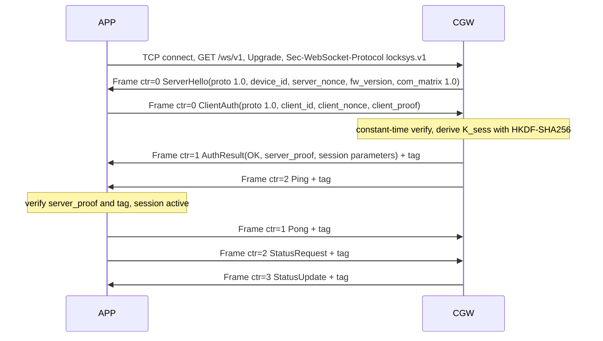

# LockSys APP Protocol 1.0

| Field | Value |
|---|---|
| Document ID | LS-IF-002 |
| Version | 0.1 |
| Status | Draft |
| Owner | jlurg |
| Interface version | APP protocol 1.0 (`locksys.app.v1`, pre-baseline) |
| Source of truth | `interfaces/proto/locksys/app/v1/locksys_app.proto` and `locksys_app.options`; vectors `interfaces/vectors/app_session_v1.json` |
| Normative text | LS-SAIC-001 §8 ([LS-SAIC](../02_system/LS-SAIC.md)) |

## 1. Purpose and scope

This document renders the protocol between the phone APP and the CGW: the SoftAP, the WebSocket transport, the framing and integrity tag, session establishment and policies, pairing, the message catalogue, command semantics, the status mapping, rates and limits, and the shared test vectors.

- The `.proto` and `.options` files are the single source of truth for code generation: nanopb 0.4.9.2 for the CGW, Dart `protobuf` 6.1.0 with `protoc_plugin` 25.1.0 for the APP, and Python protobuf 6.33.x for the HIL and the CGW simulator. LS-SAIC-001 §8 holds the same content as normative text. This document is informative.
- Security rationale and threats are in the [security concept](../06_security/security_concept.md) (LS-SEC-001); the CGW and APP implementations are described in [LS-CGW-SAD-001](../04_software/cgw/architecture.md) and [LS-APP-SAD-001](../04_software/app/architecture.md).

## 2. Protocol stack

| Layer | Definition |
|---|---|
| Link | Wi-Fi 2.4 GHz SoftAP, WPA3-SAE (§3) |
| Network | IPv4 192.168.4.0/24, CGW at 192.168.4.1, DHCP; IPv6 off |
| Transport | TCP port 80, WebSocket (RFC 6455), endpoint `/ws/v1`, subprotocol `locksys.v1` |
| Framing | One binary WebSocket message = one protobuf `Frame` {counter, body, tag} |
| Integrity | `tag` = first 16 bytes of HMAC-SHA256(K_sess, dir ‖ counter_BE32 ‖ body) |
| Application | `body` = serialised `Body`, a `oneof` of 14 messages (§7) |

## 3. SoftAP

| Parameter | Value |
|---|---|
| SSID | `LockSys-XXXX`, XXXX = last 2 bytes of the AP MAC in uppercase hexadecimal; not hidden |
| Security (RC and RELEASE) | WPA3-SAE only (`WIFI_AUTH_WPA3_PSK`), PMF required, `sae_pwe_h2e = WPA3_SAE_PWE_BOTH`, CCMP. Open, WEP, WPA1 and TKIP are never offered. |
| Transition mode (DEV builds only) | `WIFI_AUTH_WPA2_WPA3_PSK`, PMF capable but not required, transition disable 0, pairing QR `sec=wpa2wpa3`. Never present in RC or RELEASE builds. |
| Passphrase | 20 random RFC 4648 base32 characters (≈ 100 bits) from the hardware RNG, generated at first boot and at factory reset; stored in NVS; Wi-Fi driver storage in RAM |
| Radio | Channel 6 (Kconfig 1, 6 or 11); country code from Kconfig, default "01", set once before `esp_wifi_start()`; beacon 100 TU; DTIM 1 |
| Clients | `max_connection` = `n_wifi_clients_max` (2); station inactivity `t_ap_inactive_ms` (60 s) |
| IP | 192.168.4.1/24 with DHCP server; offers carry no router option and no DNS option |
| Controller station loss | `WIFI_EVENT_AP_STADISCONNECTED` for the controller's MAC → immediate STOP latch and session close |

iOS: if the programmatic WPA3 join fails (gate TST-MAN-APP-003), iOS joins manually in Settings; the transition mode is never used to work around it outside DEV builds.

## 4. Transport and framing

| Rule | Value |
|---|---|
| Endpoint | `ws://192.168.4.1:80/ws/v1` |
| Subprotocol | `locksys.v1`, compared exactly (same length and bytes); mismatch → close 4001 |
| Plain HTTP to `/ws/v1` | 400, then close; other URIs → 404 |
| Frame types | Binary only. Text, continuation or fragmented message → close 1003 |
| Size | ≤ `ws_frame_max_bytes` (256 B) in both directions; larger → the CGW closes with 1009, the APP with 1002 |
| Compression | permessage-deflate is never negotiated |
| WebSocket PING/PONG | Clients never send WebSocket PONG; the CGW never sends WebSocket PING; a client PING is tolerated. Liveness uses protobuf Ping and Pong. |
| Sockets | CGW: `max_open_sockets` = `n_ws_sockets_max` (3), `lru_purge_enable = false`, at most one unauthenticated connection at a time |

### 4.1 Frame and tag

| Item | Definition |
|---|---|
| `Frame.counter` | 0 for handshake frames (ServerHello, ClientAuth, a failed AuthResult); inside a session it starts at 1 and strictly increases per direction |
| `Frame.body` | Serialised `Body` (≤ 224 B) |
| `Frame.tag` | Empty for handshake frames; otherwise the first 16 bytes of HMAC-SHA256(K_sess, dir ‖ counter_BE32 ‖ body) |
| dir | 0x41 (`A`) for APP → CGW, 0x43 (`C`) for CGW → APP |
| Tag input | The received raw `body` bytes, never re-serialised data |

### 4.2 Receive order

1. Raw payload → decode `Frame`.
2. Verify the tag over the raw body.
3. Check the counter (strictly greater than the last one; never 0 inside a session).
4. Decode `Body`.
5. Validate enumerations and ranges (proto3 enumerations are open).

A bad tag, a non-increasing counter, counter 0 inside a session, a malformed protobuf, or a known message type in the wrong direction → close 1008 and STOP latch. Unknown fields are ignored; an unknown `Body` member is ignored and counted.

## 5. Session

### 5.1 Establishment

| Value | Definition |
|---|---|
| `device_id` | 8 bytes: first 8 bytes of SHA-256 over the 6-byte eFuse base MAC; stable for the chip |
| `server_nonce`, `client_nonce` | 16 random bytes per handshake (CGW hardware RNG after AP start; APP `Random.secure()`) |
| `client_id` | 16 random bytes generated by the APP for each pairing |
| `client_proof` | HMAC-SHA256(K_pair, "LSv1\|cli" ‖ device_id ‖ server_nonce ‖ client_nonce ‖ client_id) |
| `server_proof` | HMAC-SHA256(K_pair, "LSv1\|srv" ‖ device_id ‖ client_nonce ‖ server_nonce ‖ client_id) |
| K_sess | HKDF-SHA256 (RFC 5869): IKM = K_pair, salt = server_nonce ‖ client_nonce, info = "LSv1\|session" ‖ device_id ‖ client_id, L = 32; RAM only, zeroised at close |

Labels in ASCII hex: "LSv1\|cli" = `4c5376317c636c69`, "LSv1\|srv" = `4c5376317c737276`, "LSv1\|session" = `4c5376317c73657373696f6e`.

- AuthResult(OK) uses counter 1 and a valid tag; it carries `server_proof`, a random 32-bit `session_id`, `session_timeout_ms` = `t_session_to_ms` (3000), `keepalive_period_ms` = `t_app_ka_ms` (100) and `keepalive_timeout_ms` = `t_cgw_ka_to_ms` (350). The APP compares these values with its own parameters and logs a mismatch.
- A failed AuthResult uses counter 0 and an empty tag; its `server_proof` is empty or all zero and is ignored. The connection is then closed: REJECTED_AUTH → 4002, REJECTED_BUSY → 4003, REJECTED_VERSION → 4001, REJECTED_RATE_LIMIT → 4006.
- The CGW sends a Ping right after AuthResult(OK), so that an RTT sample exists before the first press.
- The WebSocket upgrade and a valid ClientAuth must complete within `t_cgw_handshake_to_ms` (2000 ms) of TCP accept; otherwise the CGW closes with 4006 if upgraded, or closes the TCP connection otherwise.

### 5.2 Policies

| Policy | Rule |
|---|---|
| Single controller | At most one authenticated session (the controller). A valid authentication with the controller's `client_id` pre-empts the old session at once (SessionClose, close 4004) and latches STOP for any press of the old session. A different `client_id` gets AuthResult(REJECTED_BUSY) and close 4003 while the controller session is alive; if the controller has been silent for ≥ `t_session_to_ms`, it is closed with 4004 and the new client is accepted. A WebSocket close or TCP FIN frees the session at once. |
| Session timeout | `t_session_to_ms` (3000 ms) without a valid frame → SessionClose, close 4004, STOP latch |
| Authentication throttling | Failed proofs, handshake timeouts and garbage before authentication count as failures; a peer that closes before the upgrade does not. After `n_auth_fail_throttle` (3) failures, an attempt within `t_auth_throttle_ms` (5000 ms) of the previous failure gets AuthResult(REJECTED_RATE_LIMIT) at once and close 4006. The counter decays after `t_auth_fail_decay_ms` (60 s) without failures. |
| Rate limit | More than `n_rate_limit_frames` (30) APP → CGW frames in any rolling `t_rate_window_ms` (1000 ms), all frame types counted → close 1008, STOP latch |
| Session scope | `press_id` and `request_id` restart at 1 in every session. The CGW keys the press monotonicity check and the door request cache by session and clears both when a new session authenticates. A DoorCommand of a new session while a transaction of an earlier session is PENDING gets REJECTED_BUSY. Commands are never buffered or replayed across disconnects or sessions. |
| SessionClose | Sent best effort before a 4004 or 4005 close; integrity violations (1008) close without it |

### 5.3 Close codes

| Code | Meaning | APP reaction |
|---|---|---|
| 1000 | Normal closure | Reconnect with backoff, or stay disconnected while paused |
| 1002 | APP received a frame larger than 256 B | Reconnect with backoff, security log |
| 1003 | Text or fragmented frame | Reconnect with backoff, log |
| 1008 | Integrity violation or rate limit | Reconnect after ≥ 2 s, log |
| 1009 | CGW received a frame larger than 256 B | Reconnect with backoff, log |
| 4001 | Version mismatch (subprotocol or protocol major) | Blocked: update required |
| 4002 | Authentication failed (after REJECTED_AUTH) | Blocked: re-pair required, no automatic retry |
| 4003 | Busy: another controller session is alive | Reconnect after ≥ `t_app_busy_backoff_ms` (3 s) |
| 4004 | Session timeout or pre-emption | Reconnect with backoff |
| 4005 | Pairing required (no K_pair, or the pairing was replaced) | Unpaired |
| 4006 | Handshake timeout or authentication throttled | Reconnect after ≥ `t_auth_throttle_ms` (5 s) |

APP reconnect backoff: d_n = min(`t_app_reconnect_max_ms`, `t_app_reconnect_min_ms` × 2^(n−1)) × U(0.8, 1.2); n resets after 10 s in the authenticated state; no attempts while the APP is not resumed.

## 6. Pairing and factory reset [SEC]

1. Holding BOOT (GPIO0) for ≥ `t_pair_btn_hold_ms` (5 s) opens a pairing window of `t_pairing_window_ms` (120 s). BOOT is ignored for `t_boot_btn_ignore_ms` after boot and accepted only while no press is active. During the window: LED blinks blue, `CgwSts_AppLink` = PAIRING, ServerHello `pairing_window_open` = true, StatusUpdate `pairing_active` = true.
2. The CGW generates a pending 32-byte K_pair with the hardware RNG (RF on).
3. The console prints the pairing QR code between `<<LS-SECRET-BEGIN>>` and `<<LS-SECRET-END>>`, by raw stdout writes and never through the logging system. Rendering: one text line per module row, two characters per module; a dark module is two spaces and a light module is two U+2588 FULL BLOCK characters, with a 4-module light quiet zone. Encoder: Nayuki qrcodegen v1.8.0, error correction MEDIUM, versions 1–10.
4. During the window ClientAuth is verified against the pending K_pair first, then against the current one. The CGW commits the pending K_pair, its generation and the `client_id` to NVS on the first valid tagged APP → CGW frame (counter ≥ 1) of a session authenticated with the pending key, then closes sessions using the old key with 4005 and closes the window.
5. The APP keeps its previous pairing record until the first successful authentication with the new key; during the window it may fall back once to the other key.
6. On expiry the pending key and buffers are zeroised; the previous pairing stays valid.
7. Factory reset: holding BOOT for ≥ `t_factory_reset_hold_ms` (10 s) latches STOP, erases K_pair, generates a new passphrase, restarts the AP and requires re-pairing.
8. Keys are never logged; every log consumer redacts the marker block and masks `locksys://pair`, `p=`, `k=` and key material.

Pairing payload (a data format, not an OS-registered URI scheme; ≤ 256 characters):

`locksys://pair?v=1&id=<device_id>&s=<SSID>&p=<passphrase>&k=<K_pair>&b=<BSSID>&sec=<wpa3|wpa2wpa3>`

| Parameter | Encoding |
|---|---|
| `v` | Exactly `1` |
| `id` | `device_id` as 16 uppercase hexadecimal characters |
| `s` | SSID `LockSys-XXXX`; XXXX must match the last two bytes of `b` |
| `p` | Passphrase, RFC 4648 base32 without padding (20 characters) |
| `k` | K_pair, base64url without padding (43 characters) |
| `b` | AP BSSID as `AA:BB:CC:DD:EE:FF` |
| `sec` | `wpa3`, or `wpa2wpa3` in DEV transition-mode builds |
| `h` | `host:port`, accepted only by simulator builds |

Receivers ignore unknown parameters and reject duplicates.

## 7. Message catalogue

### 7.1 Body members

| Field | Message | Direction | Purpose |
|---|---|---|---|
| 1 | `ServerHello` | CGW → APP | Protocol version, device identity, server nonce, firmware and CAN matrix versions, pairing window flag |
| 2 | `ClientAuth` | APP → CGW | Protocol version, client identity, client nonce, client proof, APP version |
| 3 | `AuthResult` | CGW → APP | Result, server proof, session parameters |
| 4 | `Ping` | Both | Liveness and RTT measurement |
| 5 | `Pong` | Both | Answer to a Ping with the echoed timestamp |
| 10 | `DoorCommand` | APP → CGW | Lock or unlock request |
| 11 | `WindowMove` | APP → CGW | Start or keep alive a window press |
| 12 | `WindowStop` | APP → CGW | End a window press |
| 13 | `StatusRequest` | APP → CGW | Request an immediate StatusUpdate |
| 20 | `CommandAck` | CGW → APP | Acceptance or rejection of a door or window command |
| 21 | `DoorCommandResult` | CGW → APP | Final result of a door transaction |
| 22 | `StatusUpdate` | CGW → APP | Vehicle status snapshot with freshness |
| 23 | `Notice` | CGW → APP | DTC change or non-DTC notice |
| 24 | `SessionClose` | CGW → APP | Reason before a 4004 or 4005 close |

### 7.2 Message fields

| Message | Field | No. | Type | Meaning |
|---|---|---|---|---|
| `Frame` | `counter` | 1 | uint32 | §4.1 |
| | `body` | 2 | bytes | Serialised `Body`, ≤ 224 B |
| | `tag` | 3 | bytes | 16 bytes, or empty for handshake frames |
| `ProtoVersion` | `major` | 1 | uint32 | 1 |
| | `minor` | 2 | uint32 | 0 |
| `ServerHello` | `proto` | 1 | ProtoVersion | APP protocol version |
| | `device_id` | 2 | bytes | 8 bytes |
| | `server_nonce` | 3 | bytes | 16 bytes |
| | `fw_version` | 4 | string | ≤ 24 characters |
| | `com_matrix` | 5 | ProtoVersion | CAN matrix version |
| | `pairing_window_open` | 6 | bool | Pairing window open |
| `ClientAuth` | `proto` | 1 | ProtoVersion | APP protocol version |
| | `client_id` | 2 | bytes | 16 bytes |
| | `client_nonce` | 3 | bytes | 16 bytes |
| | `client_proof` | 4 | bytes | 32 bytes |
| | `app_version` | 5 | string | ≤ 24 characters |
| `AuthResult` | `result` | 1 | CommandResult | OK, REJECTED_AUTH, REJECTED_BUSY, REJECTED_VERSION or REJECTED_RATE_LIMIT |
| | `server_proof` | 2 | bytes | 32 bytes (empty or zero when not OK) |
| | `session_id` | 3 | uint32 | Random per session |
| | `session_timeout_ms` | 4 | uint32 | 3000 |
| | `keepalive_period_ms` | 5 | uint32 | 100 |
| | `keepalive_timeout_ms` | 6 | uint32 | 350 |
| `Ping` | `timestamp_ms` | 1 | uint32 | Sender time |
| `Pong` | `echo_timestamp_ms` | 1 | uint32 | Timestamp of the answered Ping |
| `DoorCommand` | `request_id` | 1 | uint32 | Per session, from 1 |
| | `action` | 2 | DoorAction | LOCK or UNLOCK |
| `WindowMove` | `press_id` | 1 | uint32 | Per session, strictly increasing from 1 |
| | `direction` | 2 | WindowDirection | UP or DOWN |
| | `hold_ms` | 3 | uint32 | Time since press start; 0 in the first WindowMove |
| `WindowStop` | `press_id` | 1 | uint32 | Press being ended |
| `StatusRequest` | — | — | — | No fields |
| `CommandAck` | `kind` | 1 | CommandKind | DOOR or WINDOW |
| | `ref_id` | 2 | uint32 | `request_id` or `press_id` |
| | `result` | 3 | CommandResult | ACCEPTED or the rejection or stop code |
| `DoorCommandResult` | `request_id` | 1 | uint32 | Transaction |
| | `result` | 2 | CommandResult | Final result |
| | `lock_state` | 3 | DoorLockState | State from the position switch |
| `StatusUpdate` | fields 1–23 | — | — | §8 |
| `Notice` | `severity` | 1 | FaultSeverity | INFO, WARNING, DEGRADED or CRITICAL |
| | `code` | 2 | uint32 | DTC value (≥ 0x010000) or notice code ([LS-IF-004](dtc_catalog.md) §7) |
| | `text` | 3 | string | ≤ 48 characters, English, no secrets |
| `SessionClose` | `reason` | 1 | CommandResult | Close reason |

Enumerations use the canonical names of LS-SAIC-001 §6.4 with the prefix `<ENUM_NAME>_`, for example `WINDOW_STATE_FULLY_OPEN`; the value tables are listed in [LS-IF-001](can_matrix.md) §7.1. The protocol-only enumerations are `DoorAction` (0 NONE, 1 LOCK, 2 UNLOCK), `WindowDirection` (0 STOP, 1 UP, 2 DOWN) and `CommandKind` (0 UNSPECIFIED, 1 DOOR, 2 WINDOW).

### 7.3 nanopb options and sizes

All CGW buffers are static: no `PB_ENABLE_MALLOC`, no callbacks. `PB_BUFFER_ONLY`, `PB_WITHOUT_64BIT` and `PB_MESSAGE_NESTING_MAX=4` are public definitions of the nanopb component.

| Field | Option |
|---|---|
| `Frame.body` | `max_size:224` |
| `Frame.tag` | `max_size:16` |
| `ServerHello.device_id` | `max_size:8 fixed_length:true` |
| `ServerHello.server_nonce`, `ClientAuth.client_nonce`, `ClientAuth.client_id` | `max_size:16 fixed_length:true` |
| `ClientAuth.client_proof`, `AuthResult.server_proof` | `max_size:32 fixed_length:true` |
| `ServerHello.fw_version`, `ClientAuth.app_version` | `max_size:24` |
| `Notice.text` | `max_size:48` |

Largest body 102 B (ClientAuth); worst-case StatusUpdate body 78 B; a Frame with a 224-byte body is 251 B, within the 256-byte limit.

## 8. Command semantics

### 8.1 Window press

APP: `press_id` strictly increases per session from 1; the first WindowMove (`hold_ms` = 0) is sent synchronously on pointer-down, then every `t_app_ka_ms` (100 ms); WindowStop(press_id) ends the press; at most one press exists system-wide.

CGW admission of a new press; every check must pass, otherwise `CommandAck(WINDOW, press_id, code)`:

| Check | Code on failure |
|---|---|
| Frame belongs to the authenticated controller session | Not processed |
| CGW mode NORMAL; no pairing window or factory reset in progress | REJECTED_MODE |
| DCU alive (DCU_NodeSts fresh) | FAILED_COMM |
| DCU mode NORMAL or DEGRADED | REJECTED_MODE |
| `DcuSts_WinInhibit` = 0 | REJECTED_INTERLOCK |
| CAN matrix major version equal | REJECTED_VERSION |
| Bus not off; DCU_WinSts VALID and fresh | FAILED_COMM |
| Stage B/D: not moving into an active end position | REJECTED_INTERLOCK |
| Last RTT ≤ `t_rtt_max_ms` (200 ms), sampled within `t_rtt_sample_max_age_ms` (2 s) | REJECTED_LINK_QUALITY |
| `press_id` greater than the last `press_id` of the session; direction UP or DOWN; `hold_ms` ≤ `t_new_press_max_ms` (300 ms) | REJECTED_INVALID |

- Acknowledgements (`ref_id` = `press_id`): exactly one CommandAck for the first WindowMove (ACCEPTED or the rejection code), and at most one further CommandAck when the press ends other than by release.
- A newer press while moving releases the old one; the DCU stops it (RELEASED) and starts the new one after brake and dead time.
- While a press is latched its WindowMove frames are ignored; its WindowStop returns the arbiter to idle; only a newer `press_id` can move again.

STOP-latch reasons at the CGW and the second acknowledgement:

| CGW latch reason | CommandResult | Notice code |
|---|---|---|
| Keep-alive timeout (`t_cgw_ka_to_ms`, 350 ms from frame receipt) | FAILED_TIMEOUT | 0x0001 |
| RTT above `t_rtt_max_ms` or no Pong within `t_pong_to_ms` | REJECTED_LINK_QUALITY | 0x0002 |
| Direction change within a press | REJECTED_INVALID | 0x0003 |
| Bus-off or DCU lost | FAILED_COMM | 0x0004 |
| CGW or DCU mode change | REJECTED_MODE | 0x0005 |
| CGW backstop `t_cgw_max_run_backstop_ms` (8200 ms) | FAILED_TIMEOUT | 0x0006 |
| DCU rejection or DCU stop (`WinSts_WinResult` for the active press) | Value of `WinSts_WinResult` | 0x0007 |
| Session loss, pre-emption or controller station disconnect | None (no session to answer) | Logged as 0x0008 |

APP stop triggers (SYS-096): release; pointer cancel; slide-off; a pointer on the other window control or a second window pointer; lifecycle inactive, hidden, paused or detached; link loss (socket closed or failed, `t_session_to_ms` without a valid inbound frame, Wi-Fi lost); `CommandAck(WINDOW, press_id, ≠ ACCEPTED)`; SessionClose; controls becoming unavailable; disposal of the control; end of the session; a DCU-initiated stop (after MOVING_UP or MOVING_DOWN was seen in this press, a StatusUpdate shows a non-moving state with a stop reason other than NONE and RELEASED). A Notice alone never stops a press.

### 8.2 Door

- CGW checks for DoorCommand(request_id, action): action LOCK or UNLOCK (else REJECTED_INVALID); DCU_DoorSts fresh (else FAILED_COMM); `DoorSts_RateLimited` = 0 (else REJECTED_RATE_LIMIT); `DcuSts_LockInhibit` = 0 (else REJECTED_INTERLOCK); mode, communication and version as for the window; no transaction PENDING (else REJECTED_BUSY).
- `CommandAck(DOOR, request_id, ACCEPTED)` at once; `DoorCommandResult(request_id, result, lock_state)` on completion, or FAILED_TIMEOUT after `t_cgw_door_result_to_ms` (2500 ms).
- A repeated `request_id` of the current session is handled before the checks: while in flight it is re-acknowledged without a new CAN request; when completed within `t_cgw_door_cache_ms` (10 s) the cached DoorCommandResult is sent again.
- APP: one door command in flight; the pending state is shown ≤ 100 ms after commit; after `t_app_door_result_to_ms` (3000 ms) without a result the APP sends StatusRequest and shows the authoritative state; there is never an automatic retry. UNLOCK requires a hold-to-confirm of `t_app_unlock_confirm_ms` (800 ms); LOCK is a tap. The lock-state control requests a status refresh at most once per second and never actuates.

### 8.3 Ping and Pong

Both ends answer a Ping with a Pong carrying the echoed timestamp. The APP pings every `t_ping_idle_ms` (1000 ms) when idle. The CGW pings once right after AuthResult(OK), every `t_ping_motion_ms` (250 ms) during a press and every `t_ping_idle_ms` otherwise, and measures RTT from its own Pings.

## 9. StatusUpdate

### 9.1 Push policy

- Changes of DoorLockState, the last door result, WindowState or the window stop reason are pushed at the next CGW tick (≤ `t_cgw_tick_ms`, 10 ms).
- Other field changes are coalesced with a minimum gap of `t_status_push_gap_ms` (40 ms), so a change is pushed ≤ 50 ms after the CAN frame carrying it. `seq`, `status_age_ms`, `vbat_dv` and `window_speed_rpm_x10` never trigger a push on their own.
- Snapshots every `t_status_push_idle_ms` (1000 ms) when idle and every `t_status_push_motion_ms` (100 ms) while a press is active or DCU_WinSts reports MOVING_UP or MOVING_DOWN. StatusRequest triggers a push at the next tick.
- The APP computes the effective age = (now − receive time) + `status_age_ms` and disables its controls when it exceeds `t_app_status_stale_ms` (3000 ms), when the DCU is not alive, when a mode or inhibit flag does not allow the function, or when the session is not authenticated.

### 9.2 Field mapping

| No. | Field | Source | Rule when stale or invalid |
|---|---|---|---|
| 1 | `seq` | Push counter, +1 per push, per session | — |
| 2 | `door_lock_state` | `DoorSts_LockState` | UNKNOWN when DCU_DoorSts is stale |
| 3 | `window_state` | `WinSts_State` | UNKNOWN when DCU_WinSts is stale |
| 4 | `window_position_pct` | `WinSts_PosPct` | 255 when stale (stage A: always 255) |
| 5 | `window_stop_reason` | `WinSts_StopReason` | NONE when stale |
| 6 | `temperature_cdeg` | `TempSts_Value` | 0 when the raw value is −32768 or the status is not VALID; the status carries the meaning |
| 7 | `temp_status` | `TempSts_Status` | STALE after 3000 ms without DCU_TempSts |
| 8 | `dcu_mode` | `DcuSts_Mode` | UNKNOWN when DCU_NodeSts is stale |
| 9 | `cgw_mode` | CGW mode | — |
| 10 | `dcu_dtc_count` | `DcuSts_DtcCount` | 0 when stale |
| 11 | `cgw_dtc_count` | CGW confirmed DTCs | — |
| 12 | `dcu_alive` | DCU_NodeSts received within its 500 ms timeout | — |
| 13 | `vbat_dv` | `DcuSts_Vbat` | 0 when raw 255 or stale |
| 14 | `status_age_ms` | Maximum age of the last valid DCU_WinSts, DCU_DoorSts and DCU_NodeSts at send time | — |
| 15, 16 | `last_door_request_id`, `last_door_result` | Door transaction of the current session | 0 / UNSPECIFIED until the session sends its first DoorCommand |
| 17 | `door_fault_flags` | Bit 0 `DoorSts_FltActuator`, bit 1 `DoorSts_FltDriver`, bit 2 `DoorSts_RateLimited` | 0 when stale |
| 18 | `window_fault_flags` | Bits 0–7 = `WinSts_FltStall`, `FltOverCur`, `FltMaxRun`, `FltLimPlaus`, `FltDriver`, `FltSupply`, `FltComm`, `FltOverTemp`; bit 8 = `WinSts_FltDirMismatch` | 0 when stale |
| 19 | `pairing_active` | CGW pairing window open | — |
| 20 | `window_speed_rpm_x10` | `WinMot_Speed` (raw, 0.1 rpm) | 0 when raw −32768 or DCU_WinMotion stale |
| 21 | `window_encoder_status` | `WinMot_EncSts` | UNKNOWN when stale |
| 22 | `window_inhibited` | `DcuSts_WinInhibit` | true when DCU_NodeSts is stale |
| 23 | `door_inhibited` | `DcuSts_LockInhibit` | true when DCU_NodeSts is stale |

## 10. Rates and limits

| Rule | Value |
|---|---|
| APP WindowMove | Every `t_app_ka_ms` (100 ± 20 ms) while held |
| APP minimum gap between presses | `t_app_press_gap_min_ms` (200 ms) |
| APP idle Ping | Every `t_ping_idle_ms` |
| CGW Ping | Once after AuthResult(OK); every `t_ping_motion_ms` during a press; every `t_ping_idle_ms` otherwise |
| RTT gate | RTT > `t_rtt_max_ms`, or no Pong within `t_pong_to_ms`, during a press → STOP latch and REJECTED_LINK_QUALITY |
| Rate limit | > `n_rate_limit_frames` APP → CGW frames in any rolling `t_rate_window_ms` → close 1008 and STOP latch |
| Door | One transaction in flight; result within `t_cgw_door_result_to_ms` at the CGW and `t_app_door_result_to_ms` at the APP |
| Frame size | ≤ `ws_frame_max_bytes` in both directions |

## 11. Test vectors

Source of truth: `interfaces/vectors/app_session_v1.json`. Inputs: K_pair = 0x00…0x1F, `device_id` = `0102030405060708`, `server_nonce` = 0x10…0x1F, `client_nonce` = 0x20…0x2F, `client_id` = 0x30…0x3F. The values below were recomputed for this document with Python `hmac` and an RFC 5869 HKDF.

| Item | Value (hex) |
|---|---|
| `client_proof` | `1160faa48fbf464cb8cd77f1d0408080f735e4554fbd8c8397120ae618950f99` |
| `server_proof` | `4a1567ac13dc8410db9924ea4a6d68f93a9b73e2ad1ca5d3ccca2dedc5f22dc4` |
| K_sess | `6e2205fa6bf18b9f8a05ba93e0268d83cce903289407e3fadb56a776780e499f` |
| APP → CGW ctr 1, WindowMove(1, UP, 0) | body `5a0408011001`, tag `9a8bb35b86289aaa442691d8d8ef5b19` |
| APP → CGW ctr 2, WindowMove(1, UP, 100) | body `5a06080110011864`, tag `dc652e49d4a56b55874e2762568dd7e8` |
| APP → CGW ctr 3, WindowStop(1) | body `62020801`, tag `a722e591b17be2d30b94c432b002c4d9` |
| APP → CGW ctr 4, DoorCommand(1, UNLOCK) | body `520408011002`, tag `992221f90289f54bc95060d51a6230aa` |
| CGW → APP ctr 2, Pong(1000) | body `2a0308e807`, tag `4daf856ed6c48677e1a72a67be07c98e` |
| Negative: ctr-1 body tagged with dir 0x43 | tag `4f792c9bbf369001b40ed5b2c67ed10c`; must not verify as APP → CGW |

`interfaces/vectors/crypto_kat.json` holds the RFC 4231 HMAC and RFC 5869 HKDF known-answer tests used by the CGW start-up self-test and by the APP and HIL unit tests.

## 12. Versioning

- The APP protocol major version is carried in the package name (`locksys.app.v1`), the subprotocol (`locksys.v1`) and the `proto` fields of ServerHello and ClientAuth. A major mismatch → AuthResult(REJECTED_VERSION) and close 4001, or close 4001 directly on a subprotocol mismatch.
- Minor changes only add fields, enumeration values or Body members. Field numbers are never renumbered or reused; removed fields are listed as `reserved`.
- Receivers ignore unknown fields, ignore and count unknown Body members, and treat unknown enumeration values as invalid input (Dart maps unknown values to the default 0).
- ServerHello carries `fw_version` and `com_matrix` (1.0).

## 13. Platform notes

- Android: join with `WifiNetworkSpecifier` (SSID and BSSID from the QR code; WPA3 passphrase, or WPA2 for `sec=wpa2wpa3` when SAE is unsupported) and bind the process to that network, which has no internet capability. The APP stays on targetSdk 36; Android 17 `ACCESS_LOCAL_NETWORK` applies only from targetSdk 37. A Network Security Config (cleartext not permitted for platform stacks) replaces `usesCleartextTraffic`; Dart-owned sockets are not subject to the cleartext policy.
- iOS: in the MVP the user joins the SoftAP manually in Settings and the APP verifies the network with a local-network probe; a programmatic join with `NEHotspotConfiguration` (`joinOnce`) is LATER and depends on the WP0 gate. `NSLocalNetworkUsageDescription` is required; the local-network prompt may deny the first attempt, so the APP probes with a TCP connect followed by an immediate close and retries a refused WebSocket connect once after 250 ms.
- Minimum platforms: Android 10 (API 29) for WPA3-SAE, iOS 15; Flutter 3.47.6 (Dart 3.13.5).

## 14. Rationale

- **HMAC tag over the raw body.** Authenticity and replay protection without depending on deterministic re-serialisation across nanopb, Dart and Python.
- **Mutual proofs.** `server_proof` protects the APP against a rogue access point that knows the SSID but not K_pair.
- **Session-scoped identifiers.** `press_id` and `request_id` restart per session, so no state of an earlier session can be confused with a new command.
- **No transport encryption above WPA3.** Confidentiality comes from the link; application-layer AEAD keyed from K_sess is LATER (TS-06).

## 15. References

- [LS-SAIC-001](../02_system/LS-SAIC.md) §5.2, §5.5, §8, §12
- [LS-SRS-001](../02_system/system_requirements.md): SYS-020, SYS-021, SYS-024, SYS-025, SYS-050 to SYS-057, SYS-095, SYS-096
- [Security concept](../06_security/security_concept.md) (LS-SEC-001): CSR-001 to CSR-014
- [LS-IF-001 CAN matrix](can_matrix.md), [LS-IF-004 DTC catalogue](dtc_catalog.md)
- RFC 2104, RFC 4231 (HMAC); RFC 5869 (HKDF); RFC 4648 (base32, base64url); RFC 6455 (WebSocket)
