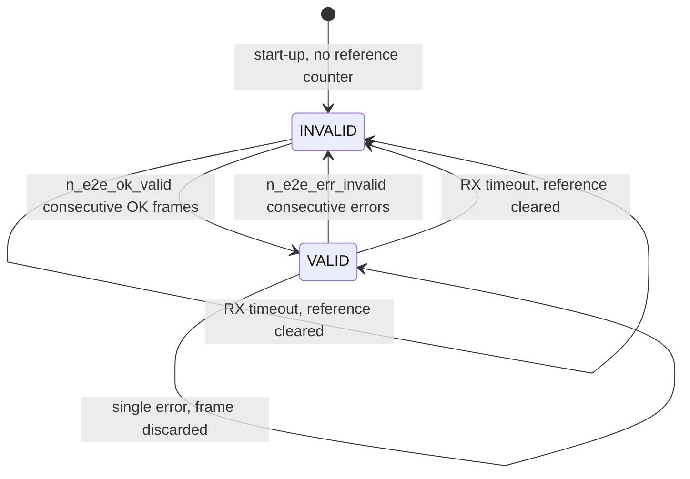

# LockSys CAN Matrix 1.0

| Field | Value |
|---|---|
| Document ID | LS-IF-001 |
| Version | 0.1 |
| Status | Draft |
| Owner | jlurg |
| Interface version | CAN matrix 1.0 (pre-baseline) |
| Source of truth | `interfaces/can/locksys.dbc` |
| Normative text | LS-SAIC-001 §4, §6.4, §7 ([LS-SAIC](../02_system/LS-SAIC.md)) |

## 1. Purpose and scope

This document renders CAN matrix 1.0 of LockSys for readers: identifier plan, frame timing, byte layouts, signal semantics, end-to-end (E2E) protection, start-up and recovery rules, the UDS-lite transport and the E2E test vectors.

- The DBC file `interfaces/can/locksys.dbc` is the single source of truth for code generation. LS-SAIC-001 §7 holds the same content as normative text. This document is informative; where it differs from the DBC or LS-SAIC-001, those govern and this document is corrected.
- A change to the matrix is made in one pull request that changes LS-SAIC-001, the DBC, the regenerated code and this document (LS-SAIC-001 §0.3).
- Scope: the bench bus between the CGW, the DCU and the HIL USB-CAN adapter. The DTC catalogue is in [LS-IF-004](dtc_catalog.md).

## 2. Conventions

- CAN 2.0A (11-bit identifiers), ISO 11898-2, 500 kbit/s, sample point 87.5 % on every node.
- All signals use Intel (little-endian) byte order. "Start bit" is the DBC start bit: bit 0 is the least significant bit of byte 0. "Byte.bit" gives the first and last bit of a signal.
- Physical value = raw × factor + offset. Signals are unsigned unless marked signed.
- Every frame has a fixed DLC. A frame received with a different DLC is an E2E error.
- Reserved bits are transmitted as 0 and ignored by receivers.
- Signal names are `<MsgAbbrev>_<Name>`; value tables use the canonical enumeration names of LS-SAIC-001 §6.4 (`interfaces/enums/locksys_enums.yaml`).
- The start value is the raw value sent until the first valid content exists.

## 3. Nodes, identifiers and bit timing

### 3.1 Identifier plan

Lower identifiers win arbitration, so commands precede status frames.

| Range | Use | Allocated | Spare |
|---|---|---|---|
| 0x100–0x1FF | Commands | 0x100, 0x110 | 0x120–0x1FF |
| 0x200–0x2FF | Status | 0x200, 0x201, 0x210, 0x220 | 0x202–0x20F, 0x211–0x21F, 0x221–0x2FF |
| 0x500–0x57F | Heartbeat and network management | 0x500, 0x510 | rest |
| 0x580–0x5FF | Software identification | 0x580, 0x590 | rest |
| 0x700–0x7FF | Diagnostics | 0x7A0 / 0x7A8 (DCU); 0x7B0 / 0x7B8 (CGW, LATER) | rest |

### 3.2 Reception per node

| Node | Receives | Acceptance filtering |
|---|---|---|
| DCU | 0x100, 0x110, 0x500, 0x580, 0x7A0 | bxCAN 16-bit identifier lists: FIFO0 = {0x100, 0x110}, FIFO1 = {0x500, 0x580, 0x7A0}; unused list entries hold duplicates of valid identifiers |
| CGW | 0x200, 0x201, 0x210, 0x220, 0x510, 0x590 | TWAI dual filter: 0x200–0x23F and {0x510, 0x590}; a software whitelist checks again |
| HIL | All frames | Listen-only monitor, or restbus sender in topologies T1 and T2 |

### 3.3 Bit timing

| Item | DCU (bxCAN) | CGW (TWAI) |
|---|---|---|
| CAN clock | 36 MHz (APB1) | 80 MHz (APB) |
| Prescaler | BRP = 9 (register value 8), tq = 250 ns | brp = 10, tq = 125 ns |
| Segments | SYNC 1 + TS1 6 + TS2 1 = 8 tq | SYNC 1 + (prop_seg 0 + tseg_1 13) + tseg_2 2 = 16 tq |
| SJW | 1 tq = 250 ns | 2 tq = 250 ns |
| Sample point | 87.5 % | 87.5 %, single sample |
| Setting | `CAN_BTR = 0x00050008` | `twai_timing_advanced_config_t` {10, 0, 13, 2, 2, 0} applied before `twai_node_enable()` |

The DCU fallback timing `CAN_BTR = 0x011E0003` (BRP 4, 1 + 15 + 2 tq, SJW 2, 88.9 %) is used only if bring-up check BU-05 shows the 8 tq setting to be marginal.

## 4. Frame overview

| Frame | ID | Sender → receivers | DLC | Send type | Cycle, gap, repetitions | E2E mode, DataID, MaxDelta | Receiver timeout → reaction |
|---|---|---|---|---|---|---|---|
| CGW_WinCmd | 0x100 | CGW → DCU | 4 | Cyclic and on change | 20 ms; on a Req change with a minimum gap of 5 ms | Cyclic, 0x1001, 2 | DCU 100 ms → Req treated as STOP (CAN_TIMEOUT), E2E state INVALID, re-arm required; U1A00 after 1 s |
| CGW_DoorCmd | 0x110 | CGW → DCU | 4 | Event | 3 transmissions at 0, 20 and 40 ms per new ReqId | Event, 0x1002, — | None; duplicates dropped by ReqId |
| DCU_WinSts | 0x200 | DCU → CGW | 8 | Cyclic and on change | 50 ms; on change with a minimum gap of 10 ms | Cyclic, 0x2001, 3 | CGW 250 ms → window status stale; new presses rejected with FAILED_COMM |
| DCU_WinMotion | 0x201 | DCU → CGW | 8 | Cyclic | 50 ms | Cyclic, 0x2004, 3 | CGW 250 ms → speed 0, encoder status UNKNOWN |
| DCU_DoorSts | 0x210 | DCU → CGW | 8 | Cyclic and on change | 100 ms; on change with a minimum gap of 10 ms | Cyclic, 0x2002, 3 | CGW 500 ms → door status stale; door commands rejected with FAILED_COMM |
| DCU_TempSts | 0x220 | DCU → CGW | 8 | Cyclic | 1000 ms, sent right after each sample | Cyclic, 0x2003, 3 | CGW 3000 ms → TempStatus STALE |
| CGW_NodeSts | 0x500 | CGW → DCU | 8 | Cyclic | 100 ms | Cyclic, 0x5001, 3 | DCU 500 ms → CGW lost: U1A00 (confirmed after 1 s), window inhibited, DEGRADED, CGW version unknown |
| DCU_NodeSts | 0x510 | DCU → CGW | 8 | Cyclic | 100 ms | Cyclic, 0x5002, 3 | CGW 500 ms → `dcu_alive` false, U1B00 (confirmed after 1 s), STOP latch, DEGRADED |
| CGW_Version | 0x580 | CGW → all | 8 | Cyclic | 1000 ms | None | Informational |
| DCU_Version | 0x590 | DCU → all | 8 | Cyclic | 1000 ms | None | Informational |
| DIAG_DcuReq | 0x7A0 | Tester → DCU | 8 | Event | ISO-TP | None | ISO-TP N_Bs / N_Cr 1000 ms |
| DIAG_DcuResp | 0x7A8 | DCU → tester | 8 | Event | ISO-TP | None | — |

The DBC attributes `GenMsgCycleTime`, `GenMsgSendType`, `GenMsgDelayTime` (minimum gap or repetition spacing), `GenMsgNrOfRepetition`, `LsE2eMode`, `LsE2eDataId`, `LsE2eMaxDelta` and `LsRxTimeoutMs` carry these values; the generated code takes them from the DBC.

## 5. E2E protection [SAF]

### 5.1 Profile

| Item | Definition |
|---|---|
| Scope | Every frame with `LsE2eMode` Cyclic or Event: all frames except the Version and DIAG frames |
| Layout | Byte 0 = CRC; byte 1 bits 0–3 = alive counter (0…15, wrapping) |
| CRC | CRC-8/SAE-J1850: polynomial 0x1D, initial value 0xFF, final XOR 0xFF, no reflection; check value of ASCII "123456789" = 0x4B |
| CRC input | DataID low byte, DataID high byte, frame bytes 1 … DLC−1. The DataID is not transmitted, so a frame received under the wrong identifier fails its CRC. |
| Sender | The counter increments by one for every frame handed to the CAN controller or driver (mailbox load or driver enqueue), including on-change frames and repetitions |
| MaxDelta | 2 for CGW_WinCmd (one lost frame tolerated); 3 for the other cyclic frames |
| Purpose | Protection against corruption, repetition, loss, delay and masquerading inside the system. E2E is a safety mechanism, not a security control. |

### 5.2 Receiver, cyclic mode

1. Every received frame of the message is checked in arrival order; frames are never skipped in favour of the newest.
2. DLC or CRC mismatch: CRC error. The frame is discarded, the error count increments, the OK count resets and the reference counter is unchanged.
3. The first frame after start-up or after an RX timeout is OK and sets the reference counter.
4. Δ = (counter − reference) mod 16:
   - Δ = 0: REPEATED. Discarded, error count +1, OK count reset, reference unchanged.
   - 1 ≤ Δ ≤ MaxDelta: OK. OK count +1, error count reset, reference := counter.
   - Δ > MaxDelta: WRONG_SEQUENCE. Discarded, error count +1, OK count reset, reference := counter (resynchronisation).
5. `n_e2e_ok_valid` (2) consecutive OK frames make the message VALID; `n_e2e_err_invalid` (3) consecutive errors or an RX timeout make it INVALID. A timeout also clears the reference.
6. Frame data reaches the application only if the frame is OK and the state after processing it is VALID.

The receiver is implemented once in `ls_e2e` and shared by both nodes ([shared libraries architecture](../04_software/libs/architecture.md)).

### 5.3 Receiver, event mode (CGW_DoorCmd)

DLC and CRC are checked; the alive counter is logged but not sequence-checked; repetitions are identified by ReqId (LS-SAIC-001 §5.1). There is no RX timeout.

### 5.4 Counters

CRC errors, sequence errors, repeated frames and timeouts are counted per received message. The DCU exposes them in DID 0xFD08 (§10.3).

## 6. Frame layouts and signals

Each frame has a byte map (bit ranges `[high:low]`, bit 7 first) and a signal table. The tables are produced from `interfaces/can/locksys.dbc`; section references in the meaning column point to LS-SAIC-001.

### CGW_WinCmd (0x100, DLC 4)

| Byte | Content, bit 7 to bit 0 |
|---|---|
| 0 | Crc [7:0] |
| 1 | reserved [7:6] · Req [5:4] · AliveCtr [3:0] |
| 2 | PressId [7:0] |
| 3 | HoldAge [7:0] |

| Signal | Start bit | Bits | Byte.bit | Signed | Factor, offset | Unit | Values and meaning | Start value |
|---|---|---|---|---|---|---|---|---|
| `WinCmd_Crc` | 0 | 8 | 0.0–0.7 | no | 1, 0 | — | E2E CRC | computed |
| `WinCmd_AliveCtr` | 8 | 4 | 1.0–1.3 | no | 1, 0 | — | E2E alive counter | 0 |
| `WinCmd_Req` | 12 | 2 | 1.4–1.5 | no | 1, 0 | — | WindowRequest | 0 STOP |
| `WinCmd_PressId` | 16 | 8 | 2.0–2.7 | no | 1, 0 | — | CGW press counter 1–255 (wraps, skips 0); 0 = NONE | 0 |
| `WinCmd_HoldAge` | 24 | 8 | 3.0–3.7 | no | 10, 0 | ms | Keep-alive age at send time; raw 255 = NONE (no keep-alive, age ≥ 2550 ms, or after a non-release STOP latch) | raw 255 |

### CGW_DoorCmd (0x110, DLC 4)

| Byte | Content, bit 7 to bit 0 |
|---|---|
| 0 | Crc [7:0] |
| 1 | reserved [7:6] · Req [5:4] · AliveCtr [3:0] |
| 2 | ReqId [7:0] |
| 3 | reserved [7:0] |

| Signal | Start bit | Bits | Byte.bit | Signed | Factor, offset | Unit | Values and meaning | Start value |
|---|---|---|---|---|---|---|---|---|
| `DoorCmd_Crc` | 0 | 8 | 0.0–0.7 | no | 1, 0 | — | E2E CRC | computed |
| `DoorCmd_AliveCtr` | 8 | 4 | 1.0–1.3 | no | 1, 0 | — | E2E alive counter (incremented per transmission) | 0 |
| `DoorCmd_Req` | 12 | 2 | 1.4–1.5 | no | 1, 0 | — | DoorRequest | 0 NONE |
| `DoorCmd_ReqId` | 16 | 8 | 2.0–2.7 | no | 1, 0 | — | CGW request counter 1–255 (wraps, skips 0) | 0 |

### DCU_WinSts (0x200, DLC 8)

| Byte | Content, bit 7 to bit 0 |
|---|---|
| 0 | Crc [7:0] |
| 1 | reserved [7] · State [6:4] · AliveCtr [3:0] |
| 2 | PosPct [7:0] |
| 3 | reserved [7] · LimDn [6] · LimUp [5] · StopReason [4:0] |
| 4 | Current [7:0] |
| 5 | PressIdEcho [7:0] |
| 6 | FltOverTemp [7] · FltComm [6] · FltSupply [5] · FltDriver [4] · FltLimPlaus [3] · FltMaxRun [2] · FltOverCur [1] · FltStall [0] |
| 7 | reserved [7:5] · FltDirMismatch [4] · WinResult [3:0] |

| Signal | Start bit | Bits | Byte.bit | Signed | Factor, offset | Unit | Values and meaning | Start value |
|---|---|---|---|---|---|---|---|---|
| `WinSts_Crc` | 0 | 8 | 0.0–0.7 | no | 1, 0 | — | E2E CRC | computed |
| `WinSts_AliveCtr` | 8 | 4 | 1.0–1.3 | no | 1, 0 | — | E2E alive counter | 0 |
| `WinSts_State` | 12 | 3 | 1.4–1.6 | no | 1, 0 | — | WindowState | 0 UNKNOWN |
| `WinSts_PosPct` | 16 | 8 | 2.0–2.7 | no | 1, 0 | % | 0 = fully closed, 100 = fully open, 255 = UNKNOWN; stage A always 255 | 255 |
| `WinSts_StopReason` | 24 | 5 | 3.0–3.4 | no | 1, 0 | — | WindowStopReason of the last stop or rejected start; NONE until then | 0 NONE |
| `WinSts_LimUp` | 29 | 1 | 3.5 | no | 1, 0 | — | Upper end position active. Reserved in stage A (0). Stage B: virtual; stage D: switch | 0 |
| `WinSts_LimDn` | 30 | 1 | 3.6 | no | 1, 0 | — | Lower end position active. Reserved in stage A (0) | 0 |
| `WinSts_Current` | 32 | 8 | 4.0–4.7 | no | 0.1, 0 | A | Filtered window motor current from CS; raw 255 = INVALID | raw 255 |
| `WinSts_PressIdEcho` | 40 | 8 | 5.0–5.7 | no | 1, 0 | — | Active PressId while moving, otherwise the last latched PressId; after reset the first PressId received with E2E OK (0 before any) | 0 |
| `WinSts_FltStall` | 48 | 1 | 6.0 | no | 1, 0 | — | 1 = the last press ended with STALL (NO_MOTION); cleared at the next start | 0 |
| `WinSts_FltOverCur` | 49 | 1 | 6.1 | no | 1, 0 | — | 1 = over-current backstop tripped for the last press or B1A16 inhibit active | 0 |
| `WinSts_FltMaxRun` | 50 | 1 | 6.2 | no | 1, 0 | — | 1 = the last press ended with MAX_RUNTIME | 0 |
| `WinSts_FltLimPlaus` | 51 | 1 | 6.3 | no | 1, 0 | — | 1 = end-position plausibility fault (B1A12); stage D only, 0 otherwise | 0 |
| `WinSts_FltDriver` | 52 | 1 | 6.4 | no | 1, 0 | — | 1 = window EN/DIAG fault active or latched (B1A10) | 0 |
| `WinSts_FltSupply` | 53 | 1 | 6.5 | no | 1, 0 | — | 1 = supply outside the run window or KL30 implausible (B1A40 active) | 0 |
| `WinSts_FltComm` | 54 | 1 | 6.6 | no | 1, 0 | — | 1 = WinCmd not VALID or U1A00, U1A01 or U1A03 active | 0 |
| `WinSts_FltOverTemp` | 55 | 1 | 6.7 | no | 1, 0 | — | 1 = over-temperature (B1A32) active | 0 |
| `WinSts_WinResult` | 56 | 4 | 7.0–7.3 | no | 1, 0 | — | CommandResult for the PressIdEcho press: UNSPECIFIED = no decision, ACCEPTED = moving, OK = ended by release, other = start rejected (LS-SAIC §5.2 S-table) or ended by a non-release stop (LS-SAIC §6.5) | 0 |
| `WinSts_FltDirMismatch` | 60 | 1 | 7.4 | no | 1, 0 | — | 1 = DIR_MISMATCH latched (B1A15) | 0 |

### DCU_WinMotion (0x201, DLC 8)

| Byte | Content, bit 7 to bit 0 |
|---|---|
| 0 | Crc [7:0] |
| 1 | reserved [7] · EncSts [6:4] · AliveCtr [3:0] |
| 2 | Speed [7:0] |
| 3 | Speed [7:0] |
| 4 | DutyPct [7:0] |
| 5 | PosCounts [7:0] |
| 6 | PosCounts [7:0] |
| 7 | PosCounts [7:0] |

| Signal | Start bit | Bits | Byte.bit | Signed | Factor, offset | Unit | Values and meaning | Start value |
|---|---|---|---|---|---|---|---|---|
| `WinMot_Crc` | 0 | 8 | 0.0–0.7 | no | 1, 0 | — | E2E CRC | computed |
| `WinMot_AliveCtr` | 8 | 4 | 1.0–1.3 | no | 1, 0 | — | E2E alive counter | 0 |
| `WinMot_EncSts` | 12 | 3 | 1.4–1.6 | no | 1, 0 | — | EncoderStatus | 0 UNKNOWN |
| `WinMot_Speed` | 16 | 16 | 2.0–3.7 | yes | 0.1, 0 | rpm | Output-shaft speed over the last 50 ms, positive = UP; raw −32768 = INVALID | raw −32768 |
| `WinMot_DutyPct` | 32 | 8 | 4.0–4.7 | no | 1, 0 | % | Commanded PWM duty magnitude of the window bridge | 0 |
| `WinMot_PosCounts` | 40 | 24 | 5.0–7.7 | yes | 1, 0 | counts | Relative position since reset, positive = UP; low 24 bits of the DCU 32-bit counter, wrapping modulo 2^24 | 0 |

### DCU_DoorSts (0x210, DLC 8)

| Byte | Content, bit 7 to bit 0 |
|---|---|
| 0 | Crc [7:0] |
| 1 | reserved [7] · LockState [6:4] · AliveCtr [3:0] |
| 2 | LastReqId [7:0] |
| 3 | RateLimited [7] · FltDriver [6] · FltActuator [5] · FbSwitch [4] · LastResult [3:0] |
| 4 | ActCount [7:0] |
| 5 | PeakCurrent [7:0] |
| 6 | reserved [7:0] |
| 7 | reserved [7:0] |

| Signal | Start bit | Bits | Byte.bit | Signed | Factor, offset | Unit | Values and meaning | Start value |
|---|---|---|---|---|---|---|---|---|
| `DoorSts_Crc` | 0 | 8 | 0.0–0.7 | no | 1, 0 | — | E2E CRC | computed |
| `DoorSts_AliveCtr` | 8 | 4 | 1.0–1.3 | no | 1, 0 | — | E2E alive counter | 0 |
| `DoorSts_LockState` | 12 | 3 | 1.4–1.6 | no | 1, 0 | — | DoorLockState, from the position switch | 0 UNKNOWN |
| `DoorSts_LastReqId` | 16 | 8 | 2.0–2.7 | no | 1, 0 | — | ReqId of the last new request (set with LastResult = ACCEPTED when execution starts) | 0 |
| `DoorSts_LastResult` | 24 | 4 | 3.0–3.3 | no | 1, 0 | — | CommandResult for LastReqId: ACCEPTED while executing, then OK, FAILED_x or REJECTED_x | 0 UNSPECIFIED |
| `DoorSts_FbSwitch` | 28 | 1 | 3.4 | no | 1, 0 | — | Debounced switch after polarity calibration, 1 = locked position | 0 |
| `DoorSts_FltActuator` | 29 | 1 | 3.5 | no | 1, 0 | — | 1 = B1A20 active | 0 |
| `DoorSts_FltDriver` | 30 | 1 | 3.6 | no | 1, 0 | — | 1 = B1A21 active | 0 |
| `DoorSts_RateLimited` | 31 | 1 | 3.7 | no | 1, 0 | — | 1 while `n_lock_rate_max` actuations lie inside the rate window | 0 |
| `DoorSts_ActCount` | 32 | 8 | 4.0–4.7 | no | 1, 0 | — | Lock actuation pulses since reset, modulo 256 | 0 |
| `DoorSts_PeakCurrent` | 40 | 8 | 5.0–5.7 | no | 0.1, 0 | A | Peak lock current of the last pulse | 0 |

### DCU_TempSts (0x220, DLC 8)

| Byte | Content, bit 7 to bit 0 |
|---|---|
| 0 | Crc [7:0] |
| 1 | reserved [7] · Status [6:4] · AliveCtr [3:0] |
| 2 | Value [7:0] |
| 3 | Value [7:0] |
| 4 | SampleSeq [7:0] |
| 5 | reserved [7:0] |
| 6 | reserved [7:0] |
| 7 | reserved [7:0] |

| Signal | Start bit | Bits | Byte.bit | Signed | Factor, offset | Unit | Values and meaning | Start value |
|---|---|---|---|---|---|---|---|---|
| `TempSts_Crc` | 0 | 8 | 0.0–0.7 | no | 1, 0 | — | E2E CRC | computed |
| `TempSts_AliveCtr` | 8 | 4 | 1.0–1.3 | no | 1, 0 | — | E2E alive counter | 0 |
| `TempSts_Status` | 12 | 3 | 1.4–1.6 | no | 1, 0 | — | TempStatus (the DCU never sends STALE) | 0 UNKNOWN |
| `TempSts_Value` | 16 | 16 | 2.0–3.7 | yes | 0.01, 0 | degC | ECU temperature, rounding per LS-SAIC §5.4; valid −40…125 °C; raw −32768 = INVALID | raw −32768 |
| `TempSts_SampleSeq` | 32 | 8 | 4.0–4.7 | no | 1, 0 | — | Sample counter modulo 256 = `$LSTMP` sequence modulo 256 | 0 |

### CGW_NodeSts (0x500, DLC 8)

| Byte | Content, bit 7 to bit 0 |
|---|---|
| 0 | Crc [7:0] |
| 1 | reserved [7] · Mode [6:4] · AliveCtr [3:0] |
| 2 | ComVerMinor [7:4] · ComVerMajor [3:0] |
| 3 | reserved [7:5] · WifiClients [4:2] · AppLink [1:0] |
| 4 | reserved [7:3] · ResetReason [2:0] |
| 5 | DtcCount [7:0] |
| 6 | HeapFreePct [7:0] |
| 7 | reserved [7:0] |

| Signal | Start bit | Bits | Byte.bit | Signed | Factor, offset | Unit | Values and meaning | Start value |
|---|---|---|---|---|---|---|---|---|
| `CgwSts_Crc` | 0 | 8 | 0.0–0.7 | no | 1, 0 | — | E2E CRC | computed |
| `CgwSts_AliveCtr` | 8 | 4 | 1.0–1.3 | no | 1, 0 | — | E2E alive counter | 0 |
| `CgwSts_Mode` | 12 | 3 | 1.4–1.6 | no | 1, 0 | — | NodeMode of the CGW | 1 INIT |
| `CgwSts_ComVerMajor` | 16 | 4 | 2.0–2.3 | no | 1, 0 | — | CAN matrix major version (1) | 1 |
| `CgwSts_ComVerMinor` | 20 | 4 | 2.4–2.7 | no | 1, 0 | — | CAN matrix minor version (0) | 0 |
| `CgwSts_AppLink` | 24 | 2 | 3.0–3.1 | no | 1, 0 | — | AppLinkState | 0 NONE |
| `CgwSts_WifiClients` | 26 | 3 | 3.2–3.4 | no | 1, 0 | — | Associated SoftAP stations | 0 |
| `CgwSts_ResetReason` | 32 | 3 | 4.0–4.2 | no | 1, 0 | — | ResetReason of the last CGW reset (LS-SAIC §6.2), known before the first transmission | 0 |
| `CgwSts_DtcCount` | 40 | 8 | 5.0–5.7 | no | 1, 0 | — | CGW DTCs with status bit 3 (confirmed) set | 0 |
| `CgwSts_HeapFreePct` | 48 | 8 | 6.0–6.7 | no | 1, 0 | % | ⌊100 × free internal heap / total internal heap⌋, updated every 1 s | 0 |

### DCU_NodeSts (0x510, DLC 8)

| Byte | Content, bit 7 to bit 0 |
|---|---|
| 0 | Crc [7:0] |
| 1 | reserved [7] · Mode [6:4] · AliveCtr [3:0] |
| 2 | ComVerMinor [7:4] · ComVerMajor [3:0] |
| 3 | Vbat [7:0] |
| 4 | reserved [7:3] · ResetReason [2:0] |
| 5 | DtcCount [7:0] |
| 6 | CpuLoadMax [7:0] |
| 7 | reserved [7:2] · LockInhibit [1] · WinInhibit [0] |

| Signal | Start bit | Bits | Byte.bit | Signed | Factor, offset | Unit | Values and meaning | Start value |
|---|---|---|---|---|---|---|---|---|
| `DcuSts_Crc` | 0 | 8 | 0.0–0.7 | no | 1, 0 | — | E2E CRC | computed |
| `DcuSts_AliveCtr` | 8 | 4 | 1.0–1.3 | no | 1, 0 | — | E2E alive counter | 0 |
| `DcuSts_Mode` | 12 | 3 | 1.4–1.6 | no | 1, 0 | — | NodeMode of the DCU | 1 INIT |
| `DcuSts_ComVerMajor` | 16 | 4 | 2.0–2.3 | no | 1, 0 | — | CAN matrix major version (1) | 1 |
| `DcuSts_ComVerMinor` | 20 | 4 | 2.4–2.7 | no | 1, 0 | — | CAN matrix minor version (0) | 0 |
| `DcuSts_Vbat` | 24 | 8 | 3.0–3.7 | no | 0.1, 0 | V | KL30 voltage; raw 255 = INVALID or not fitted | raw 255 |
| `DcuSts_ResetReason` | 32 | 3 | 4.0–4.2 | no | 1, 0 | — | ResetReason of the last DCU reset (LS-SAIC §6.1), known before the first transmission | 0 |
| `DcuSts_DtcCount` | 40 | 8 | 5.0–5.7 | no | 1, 0 | — | DCU DTCs with status bit 3 (confirmed) set | 0 |
| `DcuSts_CpuLoadMax` | 48 | 8 | 6.0–6.7 | no | 1, 0 | % | Maximum CPU load over 1 s windows since reset | 0 |
| `DcuSts_WinInhibit` | 56 | 1 | 7.0 | no | 1, 0 | — | 1 = window starts inhibited by mode or by a DTC | 1 |
| `DcuSts_LockInhibit` | 57 | 1 | 7.1 | no | 1, 0 | — | 1 = lock actuation inhibited by mode or by a DTC | 1 |

### CGW_Version (0x580, DLC 8)

| Byte | Content, bit 7 to bit 0 |
|---|---|
| 0 | SwMajor [7:0] |
| 1 | SwMinor [7:0] |
| 2 | SwPatch [7:0] |
| 3 | ComVerMinor [7:4] · ComVerMajor [3:0] |
| 4 | GitHash [7:0] |
| 5 | GitHash [7:0] |
| 6 | GitHash [7:0] |
| 7 | reserved [7] · BuildType [6:5] · Dirty [4] · GitHash [3:0] |

| Signal | Start bit | Bits | Byte.bit | Signed | Factor, offset | Unit | Values and meaning | Start value |
|---|---|---|---|---|---|---|---|---|
| `CgwVer_SwMajor` | 0 | 8 | 0.0–0.7 | no | 1, 0 | — | Software major from `VERSION` | 0 |
| `CgwVer_SwMinor` | 8 | 8 | 1.0–1.7 | no | 1, 0 | — | Software minor | 0 |
| `CgwVer_SwPatch` | 16 | 8 | 2.0–2.7 | no | 1, 0 | — | Software patch (a pre-release suffix is not encoded) | 0 |
| `CgwVer_ComVerMajor` | 24 | 4 | 3.0–3.3 | no | 1, 0 | — | CAN matrix major version | 1 |
| `CgwVer_ComVerMinor` | 28 | 4 | 3.4–3.7 | no | 1, 0 | — | CAN matrix minor version | 0 |
| `CgwVer_GitHash` | 32 | 28 | 4.0–7.3 | no | 1, 0 | — | First 7 hex digits of the git commit | 0 |
| `CgwVer_Dirty` | 60 | 1 | 7.4 | no | 1, 0 | — | 1 = built from a modified working tree | 0 |
| `CgwVer_BuildType` | 61 | 2 | 7.5–7.6 | no | 1, 0 | — | BuildType | 0 |

### DCU_Version (0x590, DLC 8)

| Byte | Content, bit 7 to bit 0 |
|---|---|
| 0 | SwMajor [7:0] |
| 1 | SwMinor [7:0] |
| 2 | SwPatch [7:0] |
| 3 | ComVerMinor [7:4] · ComVerMajor [3:0] |
| 4 | GitHash [7:0] |
| 5 | GitHash [7:0] |
| 6 | GitHash [7:0] |
| 7 | reserved [7] · BuildType [6:5] · Dirty [4] · GitHash [3:0] |

| Signal | Start bit | Bits | Byte.bit | Signed | Factor, offset | Unit | Values and meaning | Start value |
|---|---|---|---|---|---|---|---|---|
| `DcuVer_SwMajor` | 0 | 8 | 0.0–0.7 | no | 1, 0 | — | Software major from `VERSION` | 0 |
| `DcuVer_SwMinor` | 8 | 8 | 1.0–1.7 | no | 1, 0 | — | Software minor | 0 |
| `DcuVer_SwPatch` | 16 | 8 | 2.0–2.7 | no | 1, 0 | — | Software patch (a pre-release suffix is not encoded) | 0 |
| `DcuVer_ComVerMajor` | 24 | 4 | 3.0–3.3 | no | 1, 0 | — | CAN matrix major version | 1 |
| `DcuVer_ComVerMinor` | 28 | 4 | 3.4–3.7 | no | 1, 0 | — | CAN matrix minor version | 0 |
| `DcuVer_GitHash` | 32 | 28 | 4.0–7.3 | no | 1, 0 | — | First 7 hex digits of the git commit | 0 |
| `DcuVer_Dirty` | 60 | 1 | 7.4 | no | 1, 0 | — | 1 = built from a modified working tree | 0 |
| `DcuVer_BuildType` | 61 | 2 | 7.5–7.6 | no | 1, 0 | — | BuildType | 0 |

### DIAG_DcuReq (0x7A0) and DIAG_DcuResp (0x7A8), DLC 8

ISO 15765-2 PDUs with padding 0xCC. They carry no signals and are excluded from signal code generation (§10.1).

## 7. Enumerations and special values

### 7.1 Value tables

| Enumeration | Bits | Values | Signals |
|---|---|---|---|
| WindowRequest | 2 | 0 STOP, 1 UP (closing), 2 DOWN (opening), 3 INVALID | `WinCmd_Req` |
| DoorRequest | 2 | 0 NONE, 1 LOCK, 2 UNLOCK, 3 INVALID | `DoorCmd_Req` |
| WindowState | 3 | 0 UNKNOWN, 1 STOPPED, 2 MOVING_UP, 3 MOVING_DOWN, 4 FULLY_CLOSED (B, D), 5 FULLY_OPEN (B, D), 6 BLOCKED, 7 FAULT | `WinSts_State` |
| WindowStopReason | 5 | 0 NONE, 1 RELEASED, 2 UPPER_LIMIT (B, D), 3 LOWER_LIMIT (B, D), 4 HOLD_TIMEOUT, 5 CAN_TIMEOUT, 6 E2E_ERROR, 7 STALL, 8 OVERCURRENT, 9 MAX_RUNTIME, 10 OBSTACLE (E), 11 UNDERVOLTAGE, 12 OVERVOLTAGE, 13 OVERTEMP, 14 DRIVER_FAULT, 15 MODE_INHIBIT, 16 DIR_MISMATCH | `WinSts_StopReason` |
| EncoderStatus | 3 | 0 UNKNOWN, 1 OK, 2 NO_MOTION, 3 DIR_MISMATCH | `WinMot_EncSts` |
| DoorLockState | 3 | 0 UNKNOWN, 1 LOCKED, 2 UNLOCKED, 3 LOCKING, 4 UNLOCKING, 5 FAULT | `DoorSts_LockState` |
| TempStatus | 3 | 0 UNKNOWN, 1 VALID, 2 OUT_OF_RANGE, 3 IMPLAUSIBLE, 4 SENSOR_FAULT, 5 STALE (receivers only) | `TempSts_Status` |
| CommandResult | 4 | 0 UNSPECIFIED, 1 OK, 2 ACCEPTED, 3 REJECTED_BUSY, 4 REJECTED_MODE, 5 REJECTED_INTERLOCK, 6 REJECTED_RATE_LIMIT, 7 REJECTED_INVALID, 8 FAILED_ACTUATOR, 9 FAILED_TIMEOUT, 10 FAILED_COMM, 11 REJECTED_AUTH, 12 REJECTED_VERSION, 13 REJECTED_LINK_QUALITY | `WinSts_WinResult`, `DoorSts_LastResult` |
| NodeMode | 3 | 0 UNKNOWN, 1 INIT, 2 NORMAL, 3 DEGRADED, 4 SAFE, 5 SERVICE (LATER) | `CgwSts_Mode`, `DcuSts_Mode` |
| AppLinkState | 2 | 0 NONE, 1 CONNECTED, 2 AUTHENTICATED, 3 PAIRING | `CgwSts_AppLink` |
| ResetReason | 3 | 0 UNKNOWN, 1 POWER_ON, 2 PIN, 3 SOFTWARE, 4 WATCHDOG, 5 WINDOW_WATCHDOG, 6 LOW_POWER, 7 BROWNOUT | `CgwSts_ResetReason`, `DcuSts_ResetReason` |
| BuildType | 2 | 0 DEV, 1 RC, 2 RELEASE | `CgwVer_BuildType`, `DcuVer_BuildType` |

Value 0 is the safe or unknown default. A receiver treats an unknown value as invalid input, never as a valid command. Values are never renumbered; additions append. The enumeration cross-check in the `codegen` CI job compares these tables with `interfaces/enums/locksys_enums.yaml` and the protocol enumerations.

### 7.2 Special values of numeric signals

| Signal | Raw value | Meaning |
|---|---|---|
| `WinCmd_PressId` | 0 | NONE (no press) |
| `WinCmd_HoldAge` | 255 | NONE: no keep-alive, age ≥ 2550 ms, or a non-release STOP latch |
| `WinSts_PosPct` | 255 | UNKNOWN (always in stage A) |
| `WinSts_Current` | 255 | INVALID |
| `WinMot_Speed` | −32768 | INVALID |
| `TempSts_Value` | −32768 | INVALID |
| `DcuSts_Vbat` | 255 | INVALID or KL30 sense module not fitted |

## 8. Start-up, re-arm, decision feedback and versions

### 8.1 Start-up

1. During MCU reset the CAN TX pin floats and the bus stays recessive (bring-up check BU-05); the controller is in initialisation mode and neither transmits nor acknowledges.
2. A node leaves initialisation mode (bxCAN INRQ cleared; TWAI `twai_node_enable()`) only when it is ready to transmit valid frames.
3. DCU: CAN starts at scheduler start; the first DCU_NodeSts is sent ≤ 100 ms after reset with NodeMode INIT; status frames carry start values until the inputs are debounced.
4. CGW: the first CGW_WinCmd is STOP with PressId 0 and HoldAge raw 255; CGW_NodeSts follows within 100 ms of the controller enable.
5. The DCU initialises its last latched PressId with the first PressId received with E2E OK.

There is no transceiver standby control in the MVP: a powered SN65HVD230 board is always active.

### 8.2 Re-arm and stale-frame defence [SAF]

- DCU: after any CGW_WinCmd INVALID state, CGW_WinCmd RX timeout or DCU reset, a window start additionally requires at least one VALID CGW_WinCmd with Req = STOP (start condition S2 of LS-SAIC-001 §5.2).
- CGW: on BUS_OFF, before `twai_node_recover()` is called, every CGW_WinCmd transmit slot still owned by the driver is rewritten in place to a complete frame with Req = STOP, HoldAge raw 255 and a new alive counter. Slots without a completion callback are reclaimed 50 ms after recovery completes. At most two CGW_WinCmd slots exist.

### 8.3 DCU decision feedback

`WinSts_PressIdEcho` carries the active PressId while moving, otherwise the last latched PressId. `WinSts_WinResult` carries the DCU decision for that press: UNSPECIFIED (no decision), ACCEPTED (moving), OK (ended by release), or the rejection or stop code (LS-SAIC-001 §5.2, §6.5). When the echo matches the CAN PressId of the CGW's active press and the result is neither UNSPECIFIED, ACCEPTED nor OK, the CGW latches the press, sends `CommandAck(WINDOW, press_id, WinSts_WinResult)` and Notice 0x0007.

The door transaction uses `DoorSts_LastReqId` and `DoorSts_LastResult` in the same way: the DCU sets `LastReqId` and `LastResult` = ACCEPTED in the same DCU_DoorSts update that starts execution, and writes the final result when execution ends (LS-SAIC-001 §5.1).

### 8.4 Versions

- NodeSts and Version frames carry the CAN matrix major and minor version (1.0).
- `n_ver_debounce` (3) consecutive NodeSts frames of the peer with a different major version set the version fault (DCU U1A03, CGW U1B03), cause DEGRADED and reject window and door commands with REJECTED_VERSION.
- Before the first NodeSts of the peer its version is unknown and treated as not matching for commands.
- Minor differences are accepted and logged. A minor change only adds frames, or signals in reserved bits.

## 9. Bus-off and bus load

### 9.1 Bus-off

| Step | Rule |
|---|---|
| Entry | Stop the actuator path (DCU: window brake then off, lock off; CGW: STOP latch and slot rewrite of §8.2); set U1A01 (DCU) or U1B01 (CGW) |
| Recovery | `n_busoff_fast` (5) attempts every `t_busoff_fast_ms` (100 ms), then every `t_busoff_slow_ms` (500 ms) |
| Rejoin | 128 occurrences of 11 consecutive recessive bits (≈ 2.8 ms at 500 kbit/s) |
| Healing | The attempt counter resets and the DTC heals after `t_busoff_heal_ms` (10 s) without errors |
| Mechanism | DCU: ABOM = 0, recovery by setting and clearing INRQ. CGW: `twai_node_recover()`, completion reported by `on_state_change` |
| After recovery | Motion still requires the re-arm STOP and a new press |

Worst-case resumption is ≤ 0.51 s after the fault is removed (SYS-063 ≤ 1 s).

### 9.2 Bus load

Worst-case frame length with an 11-bit identifier and n data bytes, including stuffing and the 3-bit interframe space: 47 + 8n + ⌊(34 + 8n − 1) / 4⌋ bits (95 bits for DLC 4, 135 bits for DLC 8).

| Frame | Bits | Frames/s | bit/s |
|---|---|---|---|
| CGW_WinCmd | 95 | 50 | 4,750 |
| DCU_WinSts | 135 | 20 | 2,700 |
| DCU_WinMotion | 135 | 20 | 2,700 |
| DCU_DoorSts | 135 | 10 | 1,350 |
| DCU_TempSts | 135 | 1 | 135 |
| CGW_NodeSts | 135 | 10 | 1,350 |
| DCU_NodeSts | 135 | 10 | 1,350 |
| CGW_Version, DCU_Version | 135 | 2 | 270 |
| **Total** | | | **14,605 = 2.92 %** |

On-change transmissions are bounded by their minimum gaps and occur at the rate of user interaction. The SYS-026 limit is 10 %.

## 10. Diagnostics: UDS-lite on ISO-TP

### 10.1 Transport

ISO 15765-2, normal addressing, physical identifiers 0x7A0 (request) and 0x7A8 (response), padding 0xCC. DCU flow control: BS = `n_isotp_bs` (0), STmin = `t_isotp_stmin_ms` (5 ms); N_Bs and N_Cr 1000 ms; maximum message 128 bytes. CGW diagnostics on 0x7B0/0x7B8 are LATER.

### 10.2 Services (MVP)

| SID | Sub-function or parameter | Sessions | Notes |
|---|---|---|---|
| 0x10 | 0x01 default, 0x03 extended | All | Response carries P2 = `t_uds_p2_ms` (50 ms) and P2* = `t_uds_p2star_ms` (5000 ms); S3 = `t_uds_s3_ms` (5000 ms) in the extended session |
| 0x11 | 0x01 hard reset | All | Positive response, then reset; clears the SAFE latch only when received in the extended session |
| 0x14 | Group 0xFFFFFF | Default, extended | Clears all DTCs and the fault memory |
| 0x19 | 0x02 reportDTCByStatusMask | Default, extended | Status availability mask 0x2D |
| 0x22 | One DID per request (§10.3) | Default, extended | |
| 0x3E | 0x00, suppress-positive-response bit supported | All | |

Negative response codes: 0x11 serviceNotSupported, 0x12 subFunctionNotSupported, 0x13 incorrectMessageLengthOrInvalidFormat, 0x22 conditionsNotCorrect, 0x31 requestOutOfRange, 0x78 requestCorrectlyReceived-ResponsePending, 0x7F serviceNotSupportedInActiveSession.

LATER: 0x19 0x04 (snapshot record 0x01) and 0x19 0x0A, 0x27, 0x2E, 0x31 (routines, for example stage B homing), SERVICE mode.

### 10.3 Data identifiers

Multi-byte values are big-endian.

| DID | Name | Bytes | Content |
|---|---|---|---|
| 0xF18C | ECU serial number | 24 | 96-bit device UID (address 0x1FFFF7E8) as 24 uppercase hexadecimal ASCII characters |
| 0xF195 | Software version | ≤ 32 | ASCII `<VERSION>+<git7>[.dirty]`, for example `0.1.0-dev+a1b2c3d` |
| 0xFD00 | CAN matrix version | 2 | Major, minor |
| 0xFD01 | Temperature | 4 | TempStatus (u8), cdeg (s16), sample sequence (u8) |
| 0xFD02 | KL30 | 6 | KL30 in dV (u16, 0xFFFF = invalid or not fitted), ADC raw (u16), VDDA in mV (u16) |
| 0xFD03 | Window | 13 | WindowState, StopReason, PressIdEcho, WinResult, EncoderStatus, duty % (u8 each); speed in 0.1 rpm (s16); position in counts (s32); current in 0.1 A (u8) |
| 0xFD04 | Lock | 7 | DoorLockState, LastReqId, LastResult, switch level, actuation count, peak current in 0.1 A, RateLimited (u8 each) |
| 0xFD05 | Reset and fault history | 13 | Last ResetReason (u8), resets since power-on (u16), watchdog or fault resets in the window (u8), fault record valid (u8), faulting PC (u32), CFSR (u32) |
| 0xFD06 | Stack | 5 | Used bytes (u16), stack size (u16), high-water % (u8) |
| 0xFD07 | CPU load | 4 | Maximum % (u8), last-second % (u8), scheduler overruns (u16) |
| 0xFD08 | E2E counters | 24 | For CGW_WinCmd, CGW_DoorCmd and CGW_NodeSts in this order: CRC errors, sequence errors, repeated frames, timeouts (u16 each) |
| 0xFD09 | State-machine coverage and trace | 18 | Layout version (u8 = 1); transition coverage bitmap (u64; bit n = transition ID n of [LS-DCU-SAD-001](../04_software/dcu/architecture.md) §8.8; DEV and HIL builds only, 0 otherwise); trace count (u8, 0–8); last 8 transition IDs (u8 each, oldest first; all builds) |
| 0xFD0A–0xFD0F | Reserved | — | — |

The identification DIDs follow common ISO 14229-1 usage; their exact standard names are UNVERIFIED (open point O9). The DTC status byte and the DTC list are defined in [LS-IF-004](dtc_catalog.md).

## 11. Code generation and test vectors

### 11.1 Generated code

The output manifest `interfaces/can/codegen.yaml` defines every generated file; `uv run tools/codegen/regen.py` regenerates them and `--check` fails on drift.

| Consumer | Generator and options | Output |
|---|---|---|
| DCU | cantools 44.1.0 C source, node DCU, database name `locksys_dcu`, no floating-point numbers, no bit fields, pruned value tables | `firmware/dcu/gen/locksys_dcu.{h,c}` |
| CGW | cantools 44.1.0 C source, node CGW, database name `locksys_cgw`, same options; unused generated helpers are tolerated by a diagnostic pragma in the generated source so that it builds with `-Werror` | `firmware/cgw/components/cgw_com/gen/locksys_cgw.{h,c}` |
| Both nodes | Frame attributes: identifiers, DLC, cycle, gap, repetitions, E2E mode, DataID, MaxDelta, RX timeout | `libs/ls_common/gen/ls_can_matrix_gen.h` |
| HIL | cantools loads the DBC at run time | — |

- The DIAG frames carry no signals and are excluded from signal code generation.
- Generated files start with a `DO NOT EDIT` line and are never edited by hand.

### 11.2 E2E test vectors

Source of truth: `interfaces/vectors/e2e_v1.json`. The values below were recomputed for this document with an independent CRC-8/SAE-J1850 implementation and the DBC packing.

| Frame | Content | DataID | Bytes |
|---|---|---|---|
| — | CRC check value of ASCII "123456789" | — | `4B` |
| CGW_WinCmd | UP, counter 3, PressId 7, HoldAge 50 ms | 0x1001 | `5B 13 07 05` |
| CGW_WinCmd | STOP, counter 4, PressId 7, HoldAge 0 | 0x1001 | `A0 04 07 00` |
| CGW_WinCmd | CGW start-up: STOP, counter 0, PressId 0, HoldAge raw 255 | 0x1001 | `9B 00 00 FF` |
| CGW_DoorCmd | LOCK, counter 0, ReqId 0x2A | 0x1002 | `4E 10 2A 00` |
| CGW_NodeSts | Counter 0, NORMAL, CAN matrix 1.0, AUTHENTICATED, 1 client, POWER_ON, 0 DTCs, heap 0 % | 0x5001 | `0B 20 01 06 01 00 00 00` |
| DCU_WinSts | Counter 5, MOVING_UP, PosPct 255, StopReason NONE, 0.4 A, PressIdEcho 7, WinResult ACCEPTED | 0x2001 | `9A 25 FF 00 04 07 00 02` |
| DCU_WinSts | Counter 6, BLOCKED, PosPct 255, StopReason STALL, 0.0 A, PressIdEcho 7, FltStall 1, WinResult FAILED_ACTUATOR | 0x2001 | `78 66 FF 07 00 07 01 08` |
| DCU_WinMotion | Counter 2, EncoderStatus OK, +170.0 rpm, duty 100 %, PosCounts −2640 | 0x2004 | `0A 12 A4 06 64 B0 F5 FF` |
| DCU_DoorSts | Counter 0, LOCKING, LastReqId 0x2A, LastResult ACCEPTED | 0x2002 | `35 30 2A 02 00 00 00 00` |
| DCU_TempSts | Counter 1, VALID, 23.45 °C, SampleSeq 42 | 0x2003 | `90 11 29 09 2A 00 00 00` |
| DCU_NodeSts | Counter 0, NORMAL, CAN matrix 1.0, 12.0 V, POWER_ON, 0 DTCs, CPU 7 %, no inhibits | 0x5002 | `FB 20 01 78 01 00 07 00` |

## 12. Change rules

- CAN matrix 1.0 is pre-baseline: the additive changes of LS-SAIC-001 v0.2 (DCU_WinMotion, `WinSts_WinResult`, `CgwSts_HeapFreePct`) did not change the version number.
- After the first baseline, an additive change (new frame, or signal in reserved bits) increments the minor version; any other change increments the major version.
- Identifiers, DataIDs and enumeration values are never reused for a different meaning.

## 13. Rationale

- **Fixed DLC and DataID in the CRC.** A frame of the wrong length or received under the wrong identifier is detected without transmitting the DataID.
- **MaxDelta 2 for CGW_WinCmd.** One lost frame is tolerated, while three consecutive errors stop the window within 70 ms (SYS-037).
- **Separate DCU_WinMotion frame.** DCU_WinSts had five free bits only; speed, position, duty and encoder status need a frame of their own (0.54 % bus load).
- **Re-arm STOP on the DCU and slot rewrite on the CGW.** The TWAI driver transmits queued frames after bus-off recovery; both defences are needed so that a stale UP frame can never start motion.

## 14. References

- [LS-SAIC-001 System architecture and interface contract](../02_system/LS-SAIC.md), §4, §5.1, §5.2, §6.4, §6.5, §7
- [LS-SRS-001 System requirements](../02_system/system_requirements.md): SYS-022, SYS-026, SYS-037, SYS-060, SYS-062, SYS-063
- [LS-IF-004 DTC catalogue](dtc_catalog.md)
- [Shared libraries architecture](../04_software/libs/architecture.md) (`ls_e2e`)
- ISO 11898-1/-2, ISO 15765-2, ISO 14229-1; SAE J1850 (CRC-8 polynomial)
