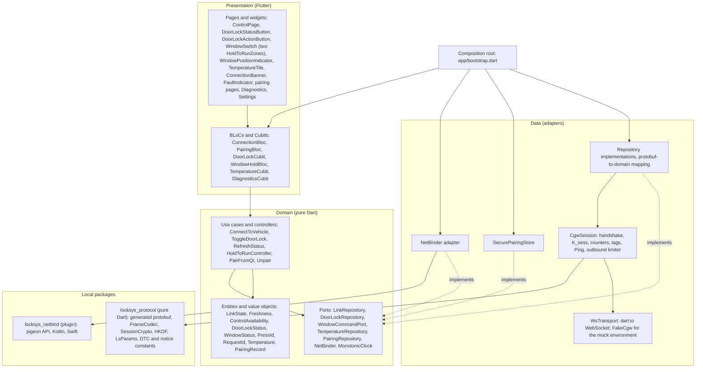
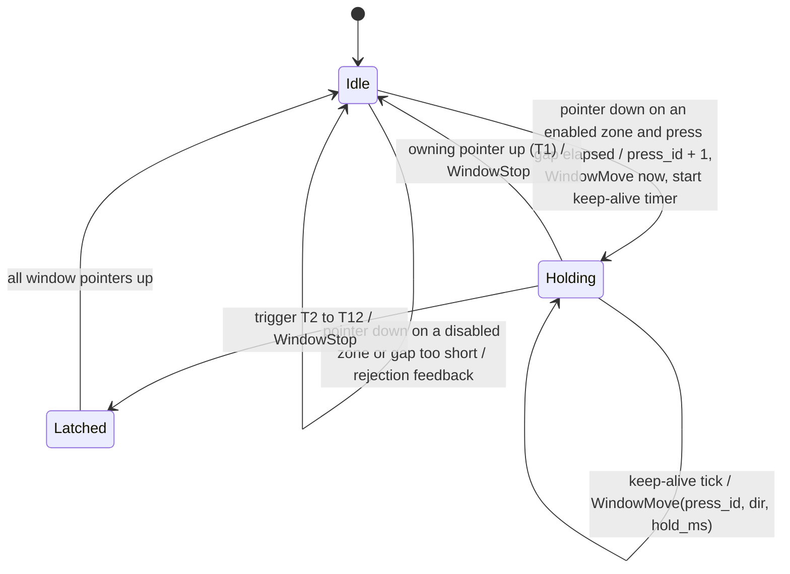
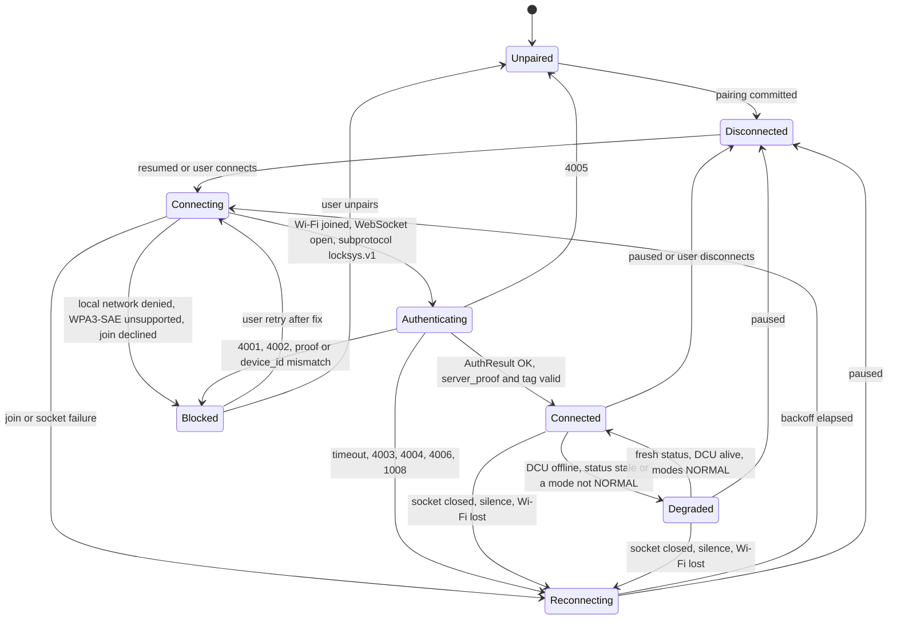

# LockSys APP Software Architecture

| Field | Value |
|---|---|
| Document ID | LS-APP-SAD-001 |
| Version | 0.1 |
| Status | Draft |
| Owner | jlurg |
| Contract | LS-SAIC-001 v0.2 ([LS-SAIC](../../02_system/LS-SAIC.md)) |
| Requirements | [APP software requirements](software_requirements.md) (LS-APP-SRS-001) |
| Scope | Stage A (release v1.0); Android first, iOS with manual Wi-Fi join |

## 1. Purpose and scope

This document defines the software architecture of the LockSys mobile application (APP): layers and packages, state management, the hold-to-run window control, the door-lock controls, connection management, platform integration, security on the phone, the user interface structure and the quality measures.

- The APP is a Flutter 3.47.6 (Dart 3.13.5) application, pinned through `app/.fvmrc`. Minimum platforms: Android 10 (API 29), iOS 15; targetSdk 36 (LS-SAIC-001 §8.12).
- **Android first.** The MVP is complete on Android. iOS uses the manual Wi-Fi join in Settings (decision L3) unless the WP0 gate TST-MAN-APP-003 shows that `NEHotspotConfiguration` joins the WPA3-only SoftAP programmatically; the rest of the APP is identical on both platforms.
- The APP is untrusted for safety purposes; its keep-alive and explicit STOP are best effort, and the CGW and the DCU enforce the safety goals (LS-SAIC-001 §1.2).
- The protocol is [LS-IF-002](../../03_interfaces/app_protocol.md); its normative source is `interfaces/proto/locksys/app/v1/`.

## 2. Architectural principles

1. **Clean Architecture per feature.** Presentation, domain and data layers per feature; protocol and crypto in a pure-Dart package; platform networking in a plugin package. The package boundary enforces the dependency rule.
2. **All [SAF] APP logic in one domain class.** `HoldToRunController` owns the press, the keep-alive timer, the stop triggers, the latch, the interlock and the minimum press gap.
3. **State only from the vehicle.** Door and window states are displayed only from fresh StatusUpdate or DoorCommandResult content, never inferred from a command (SYS-001).
4. **Deterministic and synchronous on the stop path.** The handler from pointer-up to `WindowStop` on the socket contains no `await`.
5. **No buffering across links.** Commands are never queued or replayed across disconnects or sessions; `press_id` and `request_id` restart at 1 per session.
6. **Minimal tooling.** No build_runner: code generation is limited to protoc, the parameter, enumeration and DTC generators and gen-l10n. Manual dependency injection.

## 3. Structure

### 3.1 Layers and packages



### 3.2 Dependency rules

| Rule | Enforcement |
|---|---|
| Presentation depends on domain; data depends on domain (implements its ports); domain depends only on `dart:core`, `dart:async`, `equatable` and `meta` | `test/architecture/layering_test.dart` parses the imports of `lib/**` |
| Protobuf types appear only in `features/*/data/` and `core/link/`; domain enumerations are hand-written and mapped with exhaustive `switch` | Layering test; enumeration mapping test |
| A feature never imports another feature; shared domain types live in `core/domain/` | Layering test |
| `package:locksys_netbind` is imported only by `core/platform/` and the NetBinder adapter | Layering test |
| No pass-through use cases: Cubits read repository streams; use cases exist where logic lives (hold-to-run, door transaction, connect, pairing) | Review |

### 3.3 Composition root

`lib/app/bootstrap.dart` builds the object graph once per process and selects adapters by environment. Singletons: `CgwSession`, `HoldToRunController`, the lifecycle observer, the repositories and `NetBinder`. BLoCs are page-scoped except `ConnectionBloc` (application-scoped). Objects are exposed with `MultiRepositoryProvider` and `MultiBlocProvider`; tests override them with fake providers. `WindowHoldBloc.close()` aborts an active press (trigger T10) before closing.

### 3.4 Environments

| Environment | Transport | Network join | Pairing store | Use |
|---|---|---|---|---|
| `mock` | In-process `FakeCgw` plant model | None | In memory | UI development, widget tests |
| `sim` | `ws://<host>:<port>/ws/v1` to `tools/simulators/cgw_sim` | None | Secure storage | Host integration tests, emulators, phones |
| `real` | `ws://192.168.4.1:80/ws/v1` | `locksys_netbind` | Secure storage | Bench |

The environment is selected with `--dart-define-from-file=config/<env>.json` and read through `const String.fromEnvironment`, so mock and simulator code is removed from real builds. The QR parameter `h` (simulator host) is accepted only in `sim` builds.

## 4. Runtime model

- **Isolate.** Everything runs on the UI isolate; dart:io sockets are owned by Dart. A worker isolate for the session is LATER, only if the HIL shows keep-alive jitter above 20 ms at the 99th percentile.
- **Clocks.** The keep-alive uses `Timer.periodic(t_app_ka_ms)`. Ages and timeouts use the `MonotonicClock` port (production: `Stopwatch`; tests: a fake driven by `fake_async`). `DateTime.now()` is never used for timeouts.
- **Event ordering.** `WindowHoldBloc` and `ConnectionBloc` process events sequentially. `WindowHoldBloc` handlers are synchronous; a unit test asserts that `WindowStop` is written within the same microtask turn as the triggering event.
- **Transport.** `WebSocket.connect(url, protocols: ['locksys.v1'], compression: CompressionOptions.compressionOff)` with a `t_app_ws_connect_to_ms` timeout, wrapped in `IOWebSocketChannel`; inbound frames larger than `ws_frame_max_bytes` close the socket with 1002.
- **Rendering budget.** Frames of the control page build in ≤ 8 ms; no heavy animation while a control is held; the maximum keep-alive gap is recorded in Diagnostics.

## 5. Window hold-to-run [SAF]

### 5.1 Input

The window control is one rocker-style **WindowSwitch** with two hold zones, CLOSE (UP) and OPEN (DOWN), in a fixed, non-scrolling bottom panel outside the system gesture insets and view padding (edge-to-edge). In landscape and on large screens the panel docks to the right edge.

Each zone is a raw `Listener` (pointer down, move, up, cancel) with `HitTestBehavior.opaque`. Gesture detectors are not used: tap-down may be delayed by 100 ms and the 18 px touch slop cancels long holds. The zone rectangle is frozen at pointer-down; leaving it by more than 8 dp is a slide-off. The `Listener` stays mounted with a stable identity while a pointer is down; enablement is checked inside the handlers. No route or dialog is pushed while a press is active.

### 5.2 HoldToRunController



- One press exists system-wide; it is identified by (pointer, direction, `press_id`) and lasts as long as its first pointer. The controller tracks every window-zone pointer that is down.
- `press_id` is a per-session counter starting at 1. A new press needs all pointers up and `t_app_press_gap_min_ms` since the previous press ended.
- The first `WindowMove(press_id, direction, hold_ms = 0)` is sent synchronously in the pointer-down handler, then every `t_app_ka_ms` with `hold_ms` = monotonic time since press start. A periodic Dart timer does not queue missed ticks, so a UI stall never produces a burst of stale moves.
- `WindowStop` is idempotent: it is always attempted and silently dropped if the socket is gone.

### 5.3 Stop triggers

Each trigger sends `WindowStop` and cancels the keep-alive within `t_app_send_max_ms` (SYS-096).

| ID | Trigger | Detection | End state |
|---|---|---|---|
| T1 | Owning pointer lifted | `onPointerUp` | Idle |
| T2 | System took the pointer (call UI, notification shade, edge or back gesture) | `onPointerCancel` | Latched |
| T3 | Slide-off beyond the frozen rectangle + 8 dp | `onPointerMove` | Latched; re-entry never resumes |
| T4 | Pointer down on the other zone or a second window pointer | Pointer down while holding | Latched until all pointers are up |
| T5 | Extra pointer on the same zone | Tracked, ignored | — |
| T6 | Lifecycle inactive, hidden, paused or detached | `AppLifecycleListener` (application-scoped) | Latched |
| T7 | Link loss: socket closed or failed, `t_session_to_ms` without a valid inbound frame, Wi-Fi lost | `CgwSession`, `NetBinder` | Latched |
| T8 | `CommandAck(WINDOW, press_id, ≠ ACCEPTED)` or SessionClose | Inbound frame | Latched |
| T9 | Controls become unavailable (§7.3) | `ControlAvailability` stream | Latched |
| T10 | Zone widget disposed, route changed or `WindowHoldBloc` closed while held | `dispose`, `close` | Latched |
| T11 | Session ended by the user (disconnect, unpair) | Use case | Latched, then close 1000 |
| T12 | DCU-initiated stop: after MOVING_UP or MOVING_DOWN was seen in this press, a StatusUpdate shows a non-moving state with a stop reason other than NONE and RELEASED | StatusUpdate stream | Latched |

A Notice alone never stops a press (LS-SAIC-001 §8.7).

### 5.4 Display and enablement

- The pressed visual is local and immediate; motion ("Closing…", "Opening…") is shown only when `window_state` is MOVING_UP or MOVING_DOWN. Without a MOVING status within 1 s of a hold the hint "No movement reported" is shown.
- Position from `window_position_pct`; 255 is shown as "Position unknown" (always in stage A). A stop-reason chip is shown for reasons other than NONE and RELEASED.
- Zones are enabled by `ControlAvailability`; UP is disabled at FULLY_CLOSED, DOWN at FULLY_OPEN (stages B and D), both at FAULT and while `window_inhibited`. This is a user aid; the DCU stays authoritative.
- Semantic actions (screen readers, keyboard) never start motion; they announce the hold hint.

### 5.5 Lifecycle

| Transition | Effect |
|---|---|
| `inactive` | T6 for an active press; cancels an unlock hold in progress; never tears down the link (the join dialog and permission prompts cause `inactive`) |
| `hidden` | Also suspends door commands |
| `paused` | `ConnectionBloc` closes the session with 1000; Android keeps the network binding for 60 s, then releases it |
| `resumed` | Reconnect, then StatusRequest |

Predictive back (targetSdk 36) is handled with `PopScope`; a back gesture during a hold arrives as T2 or T10.

## 6. Door-lock controls

| Control | Behaviour |
|---|---|
| **DoorLockStatusButton** | Shows DoorLockState (icon and text for all six states, plus age; greyed with "Last known" when stale). A tap sends StatusRequest (at most once per second) and opens a details sheet (last result, its age, last request); it never actuates (SYS-002) |
| **DoorLockActionButton** | One action control: UNLOCK when the fresh state is LOCKED, LOCK otherwise. UNLOCK requires a hold-to-confirm of `t_app_unlock_confirm_ms` (progress ring, haptic at completion; a semantic tap opens a confirmation dialog); LOCK is a tap. Disabled while a command is pending, the state is LOCKING or UNLOCKING, the status is stale, `door_inhibited` is set or controls are unavailable |

Door transaction (use case `ToggleDoorLock`):

1. Commit (tap, or completion of the hold): `request_id` + 1 (per session), DoorCommand sent, "Sending…" shown ≤ 100 ms after commit.
2. `CommandAck(DOOR, request_id, ACCEPTED)` → "Accepted"; a rejection clears the pending state and shows the mapped message; without an acknowledgement within `t_app_door_ack_hint_ms` the hint "Waiting for vehicle…" is shown.
3. LOCKING or UNLOCKING is displayed from the status (SYS-024 ≤ 300 ms).
4. Completion by DoorCommandResult, or by a StatusUpdate with `last_door_request_id` = `request_id` and a final result that arrives after the CommandAck of this request.
5. Without completion within `t_app_door_result_to_ms`: "No confirmation, showing current status" and StatusRequest. There is never an automatic retry.
6. Session lost while pending: "Outcome unknown"; the state comes from the status after reconnecting.

Result messages (English strings in `app_en.arb`):

| CommandResult | Door | Window |
|---|---|---|
| OK | State shown by the status | — |
| REJECTED_BUSY | Another lock operation is in progress | Another phone is in control |
| REJECTED_MODE | Unavailable: door unit in mode MODE | Same |
| REJECTED_INTERLOCK | Blocked by a safety interlock | Blocked: supply, temperature, fault or limit |
| REJECTED_RATE_LIMIT | Too many lock operations; try again later | — |
| REJECTED_INVALID | Invalid request (logged) | Same |
| REJECTED_LINK_QUALITY | — | Stopped: Wi-Fi link too slow |
| FAILED_ACTUATOR | Lock did not reach the requested position | — |
| FAILED_TIMEOUT | No response from the door unit | Stopped: keep-alive or run-time limit |
| FAILED_COMM | Door unit offline | Same |
| REJECTED_AUTH | Re-pair required (session blocked) | Same |
| REJECTED_VERSION | APP and vehicle versions incompatible | Same |

## 7. Connection management

### 7.1 State machine



Only `paused` or the user leads to Disconnected.

### 7.2 Failures and backoff

| Event | Next state |
|---|---|
| Join refused, AP not found, join timeout | Reconnecting; after 3 failures Blocked ("Vehicle Wi-Fi not available") |
| iOS `alreadyAssociated` | Treated as joined |
| Join declined by the user, invalid pairing data, local network denied, WPA3-SAE unsupported | Blocked with a reason-specific fix action |
| WebSocket connect timeout or refused | Reconnecting |
| Subprotocol not selected, protocol major ≠ 1, close 4001 | Blocked ("Update required") |
| `server_proof` invalid or `device_id` ≠ paired | Blocked ("Untrusted vehicle"), security log |
| 4002 | Blocked ("Re-pair required"); no retry, which avoids CGW throttling (SYS-056) |
| 4003 | Reconnecting after ≥ `t_app_busy_backoff_ms` |
| 4006 | Reconnecting after ≥ `t_auth_throttle_ms` |
| 1008 | Reconnecting after ≥ 2 s, logged |
| 1000, 1001, 1002, 1003, 1009, 4004, network error | Reconnecting with backoff |
| 4005 | Unpaired; the old record is kept until a new pairing succeeds |

Backoff: d_n = min(`t_app_reconnect_max_ms`, `t_app_reconnect_min_ms` × 2^(n−1)) × U(0.8, 1.2); n resets after 10 s authenticated; no attempts unless resumed.

### 7.3 Liveness and availability

- Idle Ping every `t_ping_idle_ms`; a CGW Ping is answered with Pong synchronously in the receive handler; any valid inbound frame refreshes the receive timer; `t_session_to_ms` without one, a lost network callback or the socket ending means link loss.
- Effective status age = (monotonic now − receive time) + `status_age_ms`.
- **ControlAvailability** = AUTHENTICATED ∧ `dcu_alive` ∧ effective age ≤ `t_app_status_stale_ms` ∧ `dcu_mode` ∈ {NORMAL, DEGRADED} ∧ `cgw_mode` = NORMAL, per function also ¬`window_inhibited` or ¬`door_inhibited` (SYS-095). The disabled reason is always stated.
- **Degraded** = AUTHENTICATED ∧ ¬(`dcu_alive` ∧ age ≤ `t_app_status_stale_ms` ∧ both modes NORMAL).

### 7.4 Outbound limiter

All outbound frames pass one limiter: ≤ 20 frames per second on average and never more than `n_rate_limit_frames` in any rolling `t_rate_window_ms`; WindowStop and Pong are never throttled but are counted. The press gap bounds the keep-alive traffic.

## 8. Platform integration

### 8.1 `locksys_netbind` plugin

| Platform | Join | Routing | Notes |
|---|---|---|---|
| Android (API 29+) | `WifiNetworkSpecifier` with exact SSID and BSSID from the QR code; `sec=wpa3` → WPA3 passphrase; `sec=wpa2wpa3` → WPA3 if `isWpa3SaeSupported`, else WPA2; request without `NET_CAPABILITY_INTERNET` | `bindProcessToNetwork` in `onAvailable`, so dart:io sockets use the SoftAP; unbind and unregister on release or loss | Permissions INTERNET, ACCESS_NETWORK_STATE, CHANGE_NETWORK_STATE, ACCESS/CHANGE_WIFI_STATE, CAMERA; no location and no NEARBY_WIFI_DEVICES; targetSdk 36 (Android 17 `ACCESS_LOCAL_NETWORK` applies from targetSdk 37) |
| iOS (15+) | Manual join in Settings (MVP fallback): the SSID is shown and the passphrase is revealed only while the user holds "Show", never copied to the clipboard; `NEHotspotConfiguration(joinOnce)` if the WP0 gate passes | No binding; the local-network probe (TCP connect and immediate close) triggers the Local Network prompt; a refused WebSocket connect is retried once after 250 ms | `NSLocalNetworkUsageDescription`, `NSCameraUsageDescription`; Hotspot Configuration entitlement only if the programmatic join is used |

API (pigeon): `capabilities()`, `join(request)` (result joined, alreadyJoined, userDenied, notFound, timeout, wpa3Unsupported, invalidCredentials, notForeground, error), `probe(host, port, timeoutMs)`, `release()`, `setSecureWindow(on)` (Android `FLAG_SECURE`), and an event stream (available, lost, unavailable). Native code never logs the passphrase.

### 8.2 Cleartext and local network

Dart-owned sockets are not subject to Android cleartext policy or iOS App Transport Security. Android uses a Network Security Config with cleartext disabled for platform stacks instead of `usesCleartextTraffic`. The SoftAP offers no router and no DNS option, so the phone keeps its cellular default route.

## 9. Security on the phone [SEC]

| Topic | Design |
|---|---|
| Pairing input | Only the in-app QR scanner (`mobile_scanner`, QR only, ML Kit bundled); no URL scheme, no deep link, no intent filters beyond the launcher |
| Payload validation | `v` = 1; `id` 16 uppercase hex; `s` = `LockSys-XXXX` matching the last two bytes of `b`; `p` 20 base32 characters; `k` base64url decoding to 32 bytes; `b` BSSID; `sec` `wpa3` or `wpa2wpa3`; `h` only in `sim`; unknown parameters ignored; duplicates rejected; ≤ 256 characters |
| Two-phase pairing | Candidate in RAM with a new 16-byte `client_id` from `Random.secure()`; join, connect, handshake with the candidate key; require `device_id` = `id` and `pairing_window_open`; persist the record atomically only after AuthResult OK with a verified `server_proof` and tag |
| Key storage | One record `ls.pairing.v1` in `flutter_secure_storage` (iOS Keychain `unlocked_this_device`; Android Keystore-wrapped); `allowBackup=false` and data-extraction rules excluding all domains from cloud backup and device transfer; a decryption failure wipes the record (re-pair); the record is deleted on the first run after installation |
| Session | `server_proof` verified in constant time before any server data is trusted, except the `device_id` pin; K_sess by HKDF-SHA256 (own RFC 5869 implementation over `package:crypto` HMAC-SHA256); tags verified over the received body bytes; counters strictly increasing; any violation → close 1008, stop, reconnect |
| Key lifetime | K_sess and K_pair held in `Uint8List`s and zeroised at session end (best effort; garbage-collector copies are a documented residual risk); a session never outlives an application pause |
| Logs | `package:logging` with a `Secret` wrapper whose `toString()` is `<redacted>`; frame logs limited to type, counter, length and result; release builds keep a 500-entry RAM ring only; no analytics, no crash SDK, no network traffic except to the CGW; status data is never persisted |
| Screens | Android `FLAG_SECURE` on pairing screens; iOS privacy cover while not resumed |
| Later | Optional biometric gate before unlock; application-layer AEAD keyed from K_sess (TS-06) |

## 10. User interface

| ID | Screen | Content |
|---|---|---|
| SCR-01 | Bootstrap | Loads the pairing record, then the root gate |
| SCR-02 | Welcome and safety notice | Hold-to-run and remote-closing notice; acknowledgement required before first window use |
| SCR-03 | Pairing primer | Camera, Wi-Fi join and Local Network prompts explained |
| SCR-04 | QR scanner | QR only; secure window |
| SCR-05 | Pairing progress | Join Wi-Fi → local network → authenticate → done, with failure reasons |
| SCR-05b | Manual Wi-Fi join (iOS) | SSID, hold-to-reveal passphrase, link to Settings; resumes at the local-network step |
| SCR-06 | Control (home) | Connection banner, fault indicator, door status and action buttons, temperature tile, window status tile, fixed window control panel |
| SCR-07 | Diagnostics | Link state, RTT, maximum keep-alive gap, frame counters, last close code, versions (APP SemVer and git SHA, protocol, CGW firmware, CAN matrix), modes, DTC counts, last 20 Notices, log ring |
| SCR-08 | Settings | Haptics, theme, unpair, licences, about |

- Navigation: root gate plus `Navigator.push`; no router package and no deep links.
- Accessibility: tap targets ≥ 48 dp (Android) and 44 pt (iOS), hold zones ≥ 96 × 96 dp; every state with icon and text (never colour only); WCAG AA contrast; full function at 200 % text scale; reduced motion honoured; checked with the Flutter accessibility guidelines in widget tests.
- Theme: Material 3 from a seed colour, system theme mode with manual override, semantic colour roles (locked, unlocked, moving, warning, fault, stale) for light, dark and high contrast.
- Localisation: gen-l10n, English only (`app_en.arb`); canonical enumeration names appear verbatim in Diagnostics.
- Haptics: medium impact on accept, selection click on release, two heavy impacts on a forced stop or rejection; can be disabled.

## 11. Repository layout and generated code

```text
app/
├── .fvmrc  pubspec.yaml  pubspec.lock  analysis_options.yaml  l10n.yaml
├── config/        mock.json, sim_*.json, real.json
├── lib/
│   ├── main.dart
│   ├── app/       bootstrap.dart, app.dart, lifecycle observer, privacy cover, theme, control page
│   ├── core/      config, domain, link (CgwSession, transports, limiter), platform, time, logging, ui
│   ├── features/  connection, pairing, door_lock, window, temperature, diagnostics, settings
│   │              each with data/, domain/, presentation/
│   └── l10n/      arb/app_en.arb, gen/ (generated, committed)
├── packages/
│   ├── locksys_protocol/   lib/src/{frame_codec, session_crypto, hkdf, ct_equal, close_codes}.dart
│   │                       lib/src/gen/ (protobuf, ls_params.dart, ls_dtc.dart; generated, committed)
│   └── locksys_netbind/    pigeon API, Kotlin and Swift sources (Swift Package Manager)
├── android/  ios/
├── test/                   mirrors lib/; architecture/; integration_host/ (tag sim)
└── integration_test/       (LATER)
```

Generated Dart code (`uv run tools/codegen/regen.py`, `interfaces/can/codegen.yaml`): protobuf classes from `locksys_app.proto` (protoc_plugin 25.1.0, protobuf 6.1.0), `LsParams` from `timing.yaml` and DTC and notice constants from `dtc_catalog.yaml`. Application identifier: `io.github.jlurg.locksys`.

## 12. Quality measures

| Measure | Scope | Gate |
|---|---|---|
| Static analysis: `fvm flutter analyze` with `very_good_analysis` (application disables `public_member_api_docs`; packages keep it); formatting check | `app/` | `app` job |
| Protocol unit tests: codec limits and malformed input, HKDF and HMAC, session state machine (handshake, counters, replay, wrong tag), shared vectors `interfaces/vectors/app_session_v1.json` | `packages/locksys_protocol` | Lines ≥ 95 % (codec and crypto 100 %), branches ≥ 90 % (from the M4 exit) |
| Domain and BLoC tests: `HoldToRunController` (T1–T12, latch, interlock, cadence, press gap), door transaction (cross-session correlation), availability, backoff; `bloc_test`; fake time | `lib/**/domain`, BLoCs | Domain lines ≥ 95 %, branches ≥ 85 %; BLoCs ≥ 90 %; overall ≥ 85 % |
| Widget tests: hold-to-run gestures, lifecycle (inactive keeps the link), door controls, banner, accessibility guidelines, edge-to-edge insets and landscape panel | Presentation | `app` job |
| Architecture test: import rules | `lib/**` | `app` job |
| Enumeration mapping test: domain enumerations ↔ generated protobuf names and numbers | `locksys_protocol`, domain | `app` job |
| Host integration tests against `cgw_sim` over real sockets (plain `test()`, no widget binding) | Data and domain | `app` job (tag `sim`) |
| Manual tests TST-MAN-APP-nnn: join, prompts, lifecycle stops, screen-reader hold, WPA3 gate (TST-MAN-APP-003) on at least one Android ≥ 12 and one iOS ≥ 18 phone | Platform behaviour | Per release |
| Traceability: `// @satisfies SWR-APP-nnn`, `// @verifies SWR-APP-nnn` | All | `uv run tools/trace/trace.py --report` |

CI commands: `cd app && fvm flutter analyze && fvm flutter test`; the lock file is enforced (`flutter pub get --enforce-lockfile`).

## 13. Assumptions and open points

| ID | Topic | Handling |
|---|---|---|
| OA-1 | Programmatic WPA3-SAE join with `NEHotspotConfiguration` on iOS | WP0 gate TST-MAN-APP-003; manual join is the MVP fallback (L3) |
| OA-2 | Screen-reader "double-tap and hold" pass-through to `Listener` | TST-MAN-APP-010 |
| OA-3 | iOS routing to 192.168.4.1 while cellular is primary | Bench |
| OA-5 | Android auto-approval of an SSID and BSSID specifier on Android 10–13 | Bench |
| OA-7 | Always-on VPN lockdown with the bound Wi-Fi | Bench |
| OA-8 | dart:io support for Android 17 local-network permission (flutter/flutter#184859) | Stay on targetSdk 36 until resolved |
| OA-10 | Pointer-up to socket ≤ 20 ms on low-end Android | DEV trace, later photodiode measurement |

## 14. Rationale

- **Raw pointer events for hold-to-run.** They give immediate start, no slop cancellation and delivery of up and cancel to the original hit-test path, which the stop triggers rely on.
- **One controller class for the [SAF] logic.** The stop triggers, latch and interlock are unit-tested exhaustively with fake time, independent of widgets.
- **Own networking plugin.** No available plugin combines WPA3-SAE, exact-BSSID specifiers, process binding, link events and the iOS local-network probe.
- **Manual dependency injection.** About a dozen long-lived objects; compile-time wiring and trivial test overrides without code generation.
- **Android first.** Android can join and bind the WPA3-only SoftAP programmatically; the iOS programmatic WPA3 join is unverified, and the manual join keeps SYS-053 unchanged.

## 15. References

- [LS-SAIC-001](../../02_system/LS-SAIC.md) §5.1, §5.2, §5.5, §8; [LS-SRS-001](../../02_system/system_requirements.md)
- [APP software requirements](software_requirements.md) (LS-APP-SRS-001), [LS-IF-002 APP protocol](../../03_interfaces/app_protocol.md), [LS-IF-004 DTC catalogue](../../03_interfaces/dtc_catalog.md)
- [Safety concept](../../05_safety/safety_concept.md) (LS-SAF-001), [security concept](../../06_security/security_concept.md) (LS-SEC-001), [verification strategy](../../07_verification/verification_strategy.md) (LS-VER-001)
- [Coding standard](../../08_process/coding_standard.md), [Toolchains](../../08_process/toolchains.md)
- Flutter 3.47 documentation (gestures, `AppLifecycleListener`, accessibility guidelines); Android `WifiNetworkSpecifier` and `ConnectivityManager`; Apple `NEHotspotConfiguration` and local network privacy; RFC 2104, RFC 5869, RFC 6455
