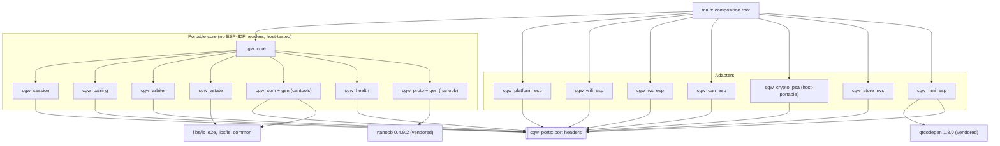
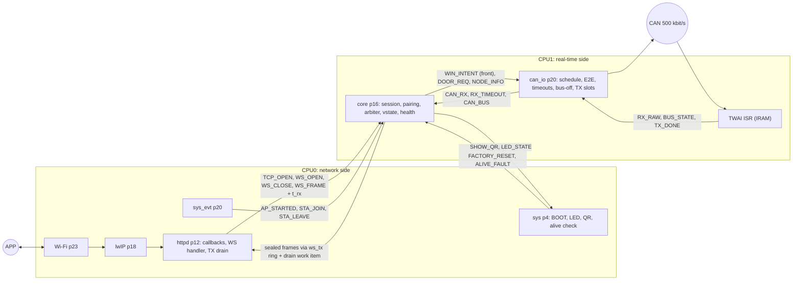
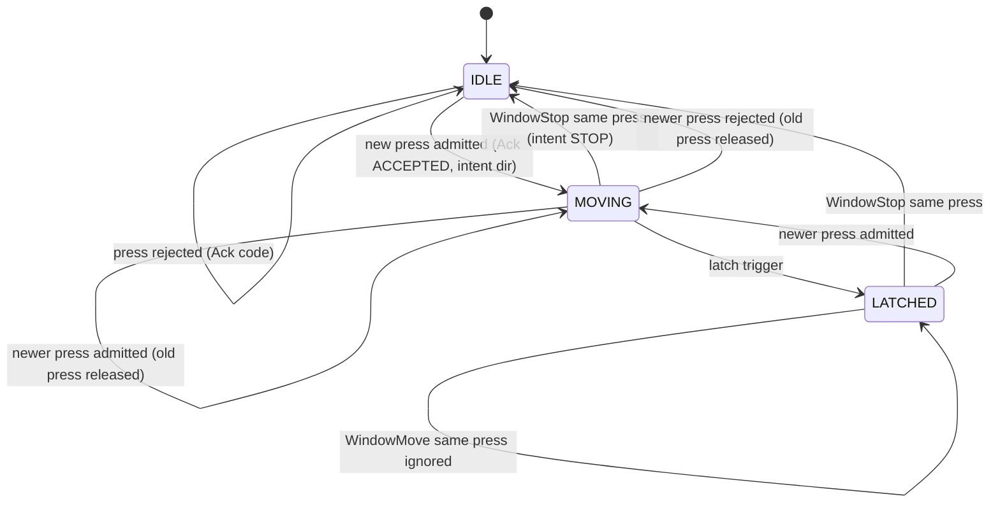

# LockSys CGW Software Architecture

| Field | Value |
|---|---|
| Document ID | LS-CGW-SAD-001 |
| Version | 0.1 |
| Status | Draft |
| Owner | jlurg |
| Contract | LS-SAIC-001 v0.2 ([LS-SAIC](../../02_system/LS-SAIC.md)) |
| Requirements | [CGW software requirements](software_requirements.md) (LS-CGW-SRS-001) |
| Scope | Stage A (release v1.0) |

## 1. Purpose and scope

This document defines the software architecture of the Central Gateway (CGW) firmware: the static structure (portable core, ports and adapters), the runtime model (active objects on FreeRTOS), the data flows and their latency budgets, the security functions, the command arbiter, the CAN interface, diagnostics, storage and build configurations, and the quality measures.

- The CGW runs on an ESP32-S3-DevKitC-1 v1.1 (N8R8) with a Waveshare SN65HVD230 CAN board and ESP-IDF v5.5.5, pinned by the container image digest in `tools/versions.env` (LS-SAIC-001 §4).
- The CGW bridges the APP protocol 1.0 ([LS-IF-002](../../03_interfaces/app_protocol.md)) and CAN matrix 1.0 ([LS-IF-001](../../03_interfaces/can_matrix.md)). It never drives actuators; the DCU re-checks every permission to move (LS-SAIC-001 §1.2).
- Module headers carry the authoritative function signatures (Doxygen). Detailed designs per component are added with the implementation (milestone M3).

## 2. Architectural principles

1. **Portable core, thin adapters.** Protocol, session, arbitration, CAN communication logic, vehicle state and health are portable C without ESP-IDF headers and are tested on the host. ESP-IDF is used only by adapters behind port interfaces.
2. **Active objects.** Each task owns its state, receives events from one static queue and runs to completion. Cross-task sharing is limited to three documented handoffs (§6.3).
3. **Fail-silent toward motion.** Every loss of information (keep-alive, link quality, session, bus, DCU, mode) latches STOP for the active press. A press never restarts without a newer `press_id` (SYS-035).
4. **Independent STOP computation.** `can_io` computes `Req` and `HoldAge` of CGW_WinCmd at every transmission from the keep-alive age, independently of `core` (SM-16).
5. **No dynamic allocation in project code after initialisation.** ESP-IDF stacks (lwIP, Wi-Fi, httpd, mbedTLS) allocate from the heap and are monitored (§12.4).
6. **Secrets never logged.** The only console output of secrets is the pairing QR block between redaction markers (LS-SAIC-001 §8.5).
7. **Single source of truth.** CAN code, protocol code, enumerations, parameters and DTC tables are generated from `interfaces/` and committed (`uv run tools/codegen/regen.py`).

## 3. Static structure

### 3.1 Components and dependencies



| Rule | Enforcement |
|---|---|
| Core components include no ESP-IDF, FreeRTOS, driver or NVS headers | CI grep over core component directories (`esp_`, `freertos/`, `driver/`, `nvs`); core components build on the host |
| Adapters use ESP-IDF components through `PRIV_REQUIRES` only, so ESP-IDF headers never reach the core | Component `CMakeLists.txt` review; host build of the core |
| Core modules are functions of (state, event, `now_ms`); time comes from the clock port | Host tests with a fake clock |
| Defines that change struct layouts (`PB_BUFFER_ONLY`, `PB_WITHOUT_64BIT`, `PB_MESSAGE_NESTING_MAX=4`) are PUBLIC compile definitions of the `nanopb` component | Same layout in firmware, host tests and fuzzers |
| Only `main` knows concrete adapters | Composition root `cgw_wiring.c` |

### 3.2 Component catalogue

| Component | Kind | Responsibility | Principal API |
|---|---|---|---|
| `cgw_ports` | Header-only | Port interfaces: clock, crypto, RNG, link, CAN, keystore, console, trace (`cgw_<port>_port.h`) | `cgw_clock_now_ms`, `cgw_link_send`, `cgw_link_close`, `cgw_link_set_authenticated`, `cgw_can_tx`, `cgw_rng_fill` |
| `cgw_proto` | Core | nanopb glue around the generated `locksys_app.pb.{c,h}`; Frame and Body codec; enumeration and range validation | `cgw_proto_decode_frame`, `cgw_proto_decode_body`, `cgw_proto_encode_frame` |
| `cgw_session` [SEC] | Core | Session table (3 entries); handshake with a timer from TCP accept; proofs; HKDF; tag seal and verify; counters; rate limit; single-controller arbitration; authentication throttling; close-code decisions | `cgw_session_on_tcp_open`, `_on_open`, `_on_frame`, `_on_close`, `_tick`, `_seal`; verdicts DELIVER, HANDSHAKE_OK, CLOSE(code), DROP |
| `cgw_pairing` [SEC] | Core | Pairing window; pending K_pair; QR payload; base32 passphrase; factory-reset sequencing | `cgw_pairing_open`, `_is_open`, `_tick`, `_commit`, `_close`, `_build_uri` |
| `cgw_arbiter` [SAF] | Core | Window press and door transaction state machines; keep-alive, RTT and backstop supervision; admission checks; CAN PressId and ReqId allocation; intent | `cgw_arbiter_on_move`, `_on_stop`, `_on_door`, `_on_pong`, `_on_link_lost`, `_on_dcu_sts`, `_tick`, `_intent` |
| `cgw_com` [SAF] | Core | Generated pack and unpack (`gen/locksys_cgw.{h,c}`); E2E protect and check (`ls_e2e`); TX schedule from `ls_can_matrix_gen.h`; independent `Req`/`HoldAge` computation; RX timeouts; bus-off policy; TX slot state machine with STOP rewrite and reclaim | `cgw_com_set_intent`, `_request_door`, `_set_node_info`, `_tick`, `_on_rx`, `_on_bus_state`, `_on_tx_done` |
| `cgw_vstate` | Core | Vehicle-state cache with freshness; change detection; StatusUpdate builder; CAN matrix version compatibility | `cgw_vstate_on_rx`, `_on_timeout`, `_build_status`, `_compat` |
| `cgw_health` | Core | CGW mode; DTC table with status bits 0, 2, 3, 5; reset-reason mapping; alive supervision logic | `cgw_health_report`, `_mode`, `_dtc_count` |
| `cgw_core` | Core | Core active object: event catalogue, dispatch, 10 ms time event, wiring of the core modules | `cgw_core_init`, `cgw_core_dispatch` (the 10 ms tick is delivered as the core event `CGW_EV_TICK`), `cgw_core_mode` |
| `cgw_platform_esp` | Adapter | Active-object runtime (static tasks and queues), clock, task watchdog, trace outputs, reset reason, core-dump check, heap and stack statistics, `RTC_NOINIT` counters, fault-injection console (DEV builds) | `cgw_platform_ao_start`, `_ao_post`, `_ao_post_front` |
| `cgw_wifi_esp` | Adapter | SoftAP, Wi-Fi and IP events, MAC-to-IP table, DHCP options without router and DNS | `cgw_wifi_start` |
| `cgw_ws_esp` | Adapter | HTTP server and WebSocket endpoint, open and close callbacks, connection table with the unauthenticated-connection gate, TX slot pool, `ws_tx` ring and drain work item, close with code | Implements the link port |
| `cgw_can_esp` | Adapter | TWAI node lifecycle, ISR callbacks in IRAM, bit timing, acceptance filter, transmit, recover | Implements the CAN port |
| `cgw_crypto_psa` | Adapter (host-portable) | HMAC-SHA256, HKDF-SHA256, constant-time verify, key destruction and zeroisation through the PSA Crypto API; known-answer tests at start-up; RNG through `esp_fill_random` on the target | Implements the crypto and RNG ports |
| `cgw_store_nvs` | Adapter | NVS namespaces, key store, write gating | Implements the keystore port |
| `cgw_hmi_esp` | Adapter | RGB status LED (RMT), BOOT button sampling, QR printer between redaction markers | — |
| `nanopb`, `qrcodegen` | Third-party wrappers | Components over `third_party/nanopb-0.4.9.2/` and `third_party/qrcodegen-1.8.0/` | — |
| `ls_e2e`, `ls_common` | Shared libraries | E2E protection, CRC-8, generated enumerations, parameters, DTC codes and CAN matrix attributes ([shared libraries](../libs/architecture.md)) | `LsE2e_Protect`, `LsE2e_Check` |

Naming (LS-SAIC-001 §14.2): components `cgw_<area>`, functions `cgw_<area>_<verb>()`, types `*_t`, port headers `*_port.h`, ESP-IDF adapters `*_esp.c`, host-portable adapters `*_<backend>.c`.

## 4. Runtime model

### 4.1 Tasks



| Task | Priority | Core | Stack | Trigger | Input queue | Task watchdog |
|---|---|---|---|---|---|---|
| `can_io` | 20 | 1 | 4 KB | Deadline of the next due frame (≤ 20 ms) or a queue event | `q_canio` 32 × 24 B | Yes |
| `core` | 16 | 1 | 8 KB | Event, or the 10 ms time event (`t_cgw_tick_ms`) | `q_core` 12 × 280 B | Yes |
| `httpd` (ESP-IDF) | 12 | 0 | 6 KB | Socket select | Control socket (`httpd_queue_work`) | No; `core` checks a 1 s liveness work item |
| `sys` | 4 | 0 | 4 KB | 20 ms poll or event | `q_sys` 8 × 32 B | Yes |
| `main` | 1 | 0 | 6 KB | Initialisation, then returns | — | No |
| `console` (DEV only) | 2 | 0 | 4 KB | UART0 receive | — | No |

ESP-IDF system tasks: Wi-Fi (priority 23, CPU0), `esp_timer` (22, CPU0), `sys_evt` (20, CPU0), lwIP (18, pinned to CPU0 with `CONFIG_LWIP_TCPIP_TASK_AFFINITY_CPU0`). The TWAI interrupt is allocated on the CPU that creates the node, so `can_io` creates it on CPU1. `CONFIG_FREERTOS_HZ=1000`.

### 4.2 Active-object rules

- Tasks, queues and stacks are static (`xTaskCreateStaticPinnedToCore`, `xQueueCreateStatic`).
- Dispatch runs to completion without blocking calls. Exception: NVS writes in `core`, gated to "no press active" (§11).
- Control events (TCP and WebSocket open and close, Wi-Fi, bus state) are posted with a bounded wait of 20 ms and are never lost. Data events (`WS_FRAME`, `CAN_RX`) never block; an overflow drops the event and is counted, and any `q_core` overflow fails the soak test (SYS-071). `WIN_INTENT` is posted to the front of `q_canio`.
- The connection identifier is (fd << 8 | generation); the generation increments at every TCP accept, so frames that arrive after a file-descriptor reuse are ignored.

### 4.3 Ownership handoffs

| Shared object | Producer → consumer | Protection |
|---|---|---|
| QR buffer | `core` → `sys` | Ownership flag; `sys` zeroises the buffer after printing |
| WebSocket TX slots and `ws_tx` ring (8 entries) | `core` → httpd drain | Single producer, single consumer; atomic head and tail; slot-owner flags |
| Connection table in `cgw_ws_esp` (≤ 3 entries: fd, generation, accept time, state TCP/WS/AUTH) | Open and close callbacks (httpd); AUTH set by `core` through `cgw_link_set_authenticated` | Atomic fields only |

## 5. Data flows and timing

### 5.1 Command path (APP → CAN)

1. The WebSocket handler records `t_rx_ms` at entry, emits the TRACE0 pulse for the frame type as soon as the type is known, copies ≤ 256 B into a static buffer and posts `WS_FRAME`.
2. `core`: `cgw_session_on_frame` decodes the Frame, verifies the tag over the raw body, checks the counter (LS-SAIC-001 §8.2 receive order).
3. `cgw_proto` decodes the Body; `cgw_arbiter` validates the command against the vehicle state and the modes. Keep-alive refreshes use `t_rx_ms`, never the processing time.
4. Outputs: `WIN_INTENT` or `DOOR_REQ` to `can_io`; CommandAck sealed into a TX slot and queued on the `ws_tx` ring.

### 5.2 Status path (CAN → APP)

1. The TWAI receive callback posts `RX_RAW` to `q_canio`.
2. `cgw_com_on_rx`: identifier whitelist, `LsE2e_Check` in arrival order, unpack. `CAN_RX` is posted only for frames that are OK with the receiver state VALID.
3. `cgw_vstate` updates the cache and freshness; the push scheduler builds a StatusUpdate (§10).

### 5.3 Supervision

- The `core` 10 ms tick evaluates the keep-alive age (from `t_rx_ms`), the RTT gate, session and handshake timeouts, the door transaction timeout, push scheduling and drain retries.
- `can_io` recomputes `Req` and `HoldAge` at every CGW_WinCmd transmission from the last intent and the keep-alive reference time, independently of `core`.
- `sys` checks the alive counters of `core` and `can_io` (deadline `t_cgw_alive_deadline_ms`); the task watchdog fires after `t_cgw_task_wdt_ms`.

### 5.4 Latency budget inside the CGW

| Segment | Budget | Measurement |
|---|---|---|
| Wi-Fi and lwIP to handler entry | ≈ 1 ms (UNVERIFIED) | TRACE0 against the air-side reference of the HIL |
| `core` decode, tag check, arbiter | < 0.5 ms (UNVERIFIED) | TRACE3 |
| `can_io` enqueue of the STOP frame | ≤ 5 ms (minimum gap of CGW_WinCmd) | TRACE1 |
| Frame time on the bus | ≈ 0.2 ms | Logic analyser |
| **Design limit: WindowStop received → CAN STOP** | **≤ 10 ms** (`t_cgw_tick_ms` share of the 142 ms chain, LS-SAIC-001 §5.2) | HIL |

## 6. SoftAP

| Item | Setting |
|---|---|
| Mode | `WIFI_MODE_AP` only; station and provisioning are LATER |
| SSID | `LockSys-XXXX` (last 2 bytes of the AP MAC, uppercase hex), not hidden |
| Security, RC and RELEASE | `WIFI_AUTH_WPA3_PSK`, PMF required, `sae_pwe_h2e = WPA3_SAE_PWE_BOTH`, CCMP. Open, WEP, WPA1 and TKIP are never offered (SYS-053) |
| Security, DEV option | Kconfig transition mode `WIFI_AUTH_WPA2_WPA3_PSK`, PMF capable, pairing QR `sec=wpa2wpa3`; absent from RC and RELEASE builds |
| Passphrase | 20 base32 characters (≈ 100 bits) from the hardware RNG at first boot and at factory reset; stored in NVS; Wi-Fi driver storage `WIFI_STORAGE_RAM` |
| Radio | Channel 6 by default (Kconfig 1, 6, 11); country code from Kconfig (default "01"), set once before `esp_wifi_start()`; beacon 100 TU; DTIM 1 |
| Clients | `max_connection` = `n_wifi_clients_max` (2); inactivity `t_ap_inactive_ms` |
| IP | 192.168.4.1/24, DHCP server without router option and without DNS option (`CONFIG_LWIP_DHCPS_ADD_DNS=n`); IPv6 off |
| Start supervision | No `WIFI_EVENT_AP_START` within `t_ap_start_to_ms` after 3 attempts → B1B10, DEGRADED |
| Controller station loss | `WIFI_EVENT_AP_STADISCONNECTED` for the controller's MAC → immediate STOP latch and session close |

Boot-time flash writes (PHY calibration, country code) happen while CGW_WinCmd is STOP.

## 7. WebSocket server and session

### 7.1 Server

| Setting | Value | Reason |
|---|---|---|
| Endpoint | `ws://192.168.4.1:80/ws/v1`, subprotocol `locksys.v1`; one URI handler, every other URI 404 | LS-SAIC-001 §8.2 |
| Subprotocol check | Exact token match (same length and bytes) in the handler; mismatch → close 4001 | Built-in matching is not exact on every IDF version |
| Plain HTTP GET to `/ws/v1` | 400 and close | Keeps the single unauthenticated slot free |
| `max_open_sockets` | `n_ws_sockets_max` (3); `CONFIG_LWIP_MAX_SOCKETS=8` | httpd needs 3 internal sockets |
| `lru_purge_enable` | false | Purge runs before the open callback, so no gate could protect the controller |
| Unauthenticated connections | At most 1; further connections refused in the open callback | Pool exhaustion defence |
| Frames | Binary only; text, continuation or fragmented → 1003; > `ws_frame_max_bytes` → 1009; permessage-deflate never negotiated | LS-SAIC-001 §8.2 |
| Control frames | httpd answers client PING and CLOSE; clients never send PONG; the CGW never sends WebSocket PING | Liveness uses protobuf Ping/Pong |
| `CONFIG_HTTPD_QUEUE_WORK_BLOCKING` | n | Avoids a work-queue deadlock |
| `keep_alive_enable` | false | Application session timeout instead |

**TX path.** `core` seals a frame into a free slot of a pool of 8 × 264 B (status pushes use at most 5; 3 are reserved for acknowledgements, results, handshake, Ping/Pong, Notice and SessionClose) and pushes {slot, connection, DATA or CLOSE(code)} into the `ws_tx` ring. At most one drain work item is outstanding (`httpd_queue_work`); a failed queue attempt is retried at the next tick, and entries stay in the ring, so no frame is dropped silently. The drain runs in httpd context, checks that the connection is still a WebSocket of the same generation, sends with `httpd_ws_send_frame_async` (binary) or sends CLOSE with the 2-byte code and triggers the session close, then releases the slot. `core` never sends directly.

### 7.2 Session

| Policy | Rule | Close code |
|---|---|---|
| Handshake | ServerHello → ClientAuth → AuthResult(OK) + Ping (LS-SAIC-001 §8.3); upgrade and a valid ClientAuth within `t_cgw_handshake_to_ms` of TCP accept | 4006 if upgraded, otherwise TCP close |
| Failed authentication | AuthResult with counter 0 and empty tag: REJECTED_AUTH → 4002, REJECTED_BUSY → 4003, REJECTED_VERSION → 4001, REJECTED_RATE_LIMIT → 4006 | As listed |
| Single controller | Same `client_id` pre-empts the old session (4004, STOP latch); a different `client_id` gets REJECTED_BUSY while the controller is alive, or pre-empts it after `t_session_to_ms` of silence | 4003 / 4004 |
| Session timeout | `t_session_to_ms` without a valid frame → SessionClose, STOP latch | 4004 |
| Integrity | Bad tag, non-increasing counter, counter 0 in a session, malformed protobuf, wrong-direction message → STOP latch | 1008 |
| Rate limit | > `n_rate_limit_frames` frames in any rolling `t_rate_window_ms`, all types counted → STOP latch | 1008 |
| Authentication throttling | After `n_auth_fail_throttle` failures, an attempt within `t_auth_throttle_ms` of the previous failure → REJECTED_RATE_LIMIT; decay after `t_auth_fail_decay_ms` | 4006 |
| Pairing replaced | Sessions using the old key after a pairing commit | 4005 |
| Session scope | `press_id` monotonicity and the door request cache are keyed by session and cleared at authentication | — |

Session table entry: connection, state (TCP, OPEN, HELLO_SENT, AUTH, CLOSING), accept time, open time, last valid receive time, server nonce, `client_id`, PSA key identifier of K_sess, receive and transmit counters, rate-limit window, last RTT and its time.

## 8. Security functions

| Function | Design |
|---|---|
| Proofs | HMAC-SHA256 with K_pair imported as a volatile PSA HMAC key; `psa_mac_verify` compares in constant time |
| Session key | HKDF-SHA256 (`PSA_ALG_HKDF`) with salt = server_nonce ‖ client_nonce and info = "LSv1\|session" ‖ device_id ‖ client_id, output into a volatile key permitted for the 16-byte truncated HMAC; K_sess never leaves the PSA key store (`CONFIG_MBEDTLS_HKDF_C=y`) |
| Frame tag | Multipart MAC over dir ‖ counter_BE32 ‖ raw body; first 16 bytes |
| Initialisation | `psa_crypto_init()` in the adapter; known-answer tests RFC 4231 case 2 and RFC 5869 case 1 (`interfaces/vectors/crypto_kat.json`) before the tasks start; failure → B1B16, SAFE |
| Threading | All PSA calls after start-up run in `core` (`CONFIG_MBEDTLS_THREADING_C` is off) |
| Randomness | `esp_fill_random` only while RF is on or inside the bootloader random-enable bracket: the first-boot passphrase inside the bracket before Wi-Fi start; nonces, K_pair and `session_id` only after `WIFI_EVENT_AP_START`; before that the RNG port returns "no entropy" |
| Key storage (MVP) | Plain NVS on the development board (namespace `cgw_sec`); HMAC-based NVS encryption on a designated hardened board is LATER (LS-SAIC-001 §12) |
| Hygiene | `psa_destroy_key` for K_sess and the imported K_pair; `mbedtls_platform_zeroize` for the pending K_pair and the QR buffer; logs show at most a 4-byte key fingerprint |
| Security events | Authentication failures, replays, bad tags, rate-limit closes and refused connections counted in `RTC_NOINIT` and logged at W level without key material |

### 8.1 Pairing and factory reset

1. `sys` samples BOOT every 20 ms and ignores it for `t_boot_btn_ignore_ms` after boot. A hold of `t_pair_btn_hold_ms` posts `PAIR_REQ`, accepted only while no press is active.
2. `core` generates a pending 32-byte K_pair and opens the window for `t_pairing_window_ms`: `CgwSts_AppLink` = PAIRING, ServerHello `pairing_window_open`, StatusUpdate `pairing_active`, LED blinking blue, Notice 0x0010.
3. `core` writes the payload `locksys://pair?v=1&id=…&s=…&p=…&k=…&b=…&sec=…` to a static buffer and hands it to `sys`, which encodes it with qrcodegen (static buffers, ECC MEDIUM, versions 1–10) and prints it with raw stdout writes between `<<LS-SECRET-BEGIN>>` and `<<LS-SECRET-END>>`, never through the logging system; all buffers are zeroised after printing.
4. During the window ClientAuth is verified against the pending key first, then the current key. The pending K_pair, its generation and the `client_id` are committed to NVS on the first valid tagged APP frame (counter ≥ 1) of a session authenticated with the pending key; sessions using the old key are closed with 4005 and the window closes (Notice 0x0012).
5. On expiry the pending key and the buffers are zeroised (Notice 0x0011); the previous pairing stays valid.
6. Factory reset: a BOOT hold of `t_factory_reset_hold_ms` latches STOP, erases `cgw_sec`, generates a new passphrase and restarts (SYS-057).

## 9. Command arbiter [SAF]

### 9.1 Window press



- **Admission** of a new press: every check of LS-SAIC-001 §8.7 in the stated order (controller session; CGW mode NORMAL and no pairing or factory reset; DCU alive; DCU mode; `DcuSts_WinInhibit`; CAN matrix major version; bus not off and DCU_WinSts VALID and fresh; RTT ≤ `t_rtt_max_ms` sampled within `t_rtt_sample_max_age_ms`; `press_id` greater than the last of the session, direction UP or DOWN, `hold_ms` ≤ `t_new_press_max_ms`). The first failing check gives the CommandAck code.
- **Keep-alive.** The reference time is the receipt time `t_rx_ms` of each WindowMove with the current `press_id` and direction.
- **Latch triggers:** keep-alive age > `t_cgw_ka_to_ms`; RTT > `t_rtt_max_ms` or no Pong within `t_pong_to_ms` (Ping every `t_ping_motion_ms` during a press); direction change within the press; session loss or pre-emption; controller station disconnect; bus-off; DCU lost; CGW or DCU mode change; DCU rejection or stop reported through `WinSts_PressIdEcho` and `WinSts_WinResult` (LS-SAIC-001 §7.5); the backstop `t_cgw_max_run_backstop_ms`, which lets the DCU MAX_RUNTIME act first. Every non-release latch sends one further CommandAck with the mapped result and the Notice of LS-SAIC-001 §8.9.
- **CAN PressId.** 8-bit counter 1…255, wrapping, skipping 0 and the current `WinSts_PressIdEcho`; seeded with `WinSts_PressIdEcho + 1`, or from the RNG when no DCU_WinSts has been received.
- **Intent** {active, direction, CAN PressId, keep-alive reference time, latched} is posted to `can_io` on every change and refresh.

### 9.2 Door transaction

- IDLE → PENDING on a valid DoorCommand after the checks of LS-SAIC-001 §8.7 (action; DCU_DoorSts fresh; `DoorSts_RateLimited`; `DcuSts_LockInhibit`; mode, communication and version; no transaction PENDING, else REJECTED_BUSY, also across sessions).
- On entry: CommandAck(DOOR, ACCEPTED) at once; next CAN ReqId (1…255, skipping 0; seeded with `DoorSts_LastReqId + 1`, or random; FAILED_COMM until the first DCU_DoorSts); `can_io` sends CGW_DoorCmd at 0, 20 and 40 ms with a new alive counter each time.
- Completion when `DoorSts_LastReqId` equals the ReqId and `DoorSts_LastResult` is neither UNSPECIFIED nor ACCEPTED → DoorCommandResult(request_id, result, lock_state); FAILED_TIMEOUT after `t_cgw_door_result_to_ms`. No automatic retry.
- A repeated `request_id` of the current session is re-acknowledged while in flight, or answered with the cached result within `t_cgw_door_cache_ms`.

### 9.3 Safe defaults

At start-up the intent is STOP, the first CGW_WinCmd is STOP with PressId 0 and HoldAge raw 255, and the door arbiter is IDLE. Disconnect, reset and SAFE latch STOP; a door transaction already sent completes on the DCU and the APP reads the result from the status.

## 10. CAN interface

### 10.1 Driver and configuration

| Item | Setting |
|---|---|
| Driver | ESP-IDF node API (`esp_driver_twai`, `twai_new_node_onchip`); the legacy `driver/twai.h` is never linked |
| Pins | TX GPIO4, RX GPIO5; CAN_STB (GPIO6) reserved and not connected in the MVP: the Waveshare board has no standby pin, so CAN silence relies on the controller staying disabled until `twai_node_enable()` |
| Bit timing | `twai_timing_advanced_config_t` {brp 10, prop_seg 0, tseg_1 13, tseg_2 2, sjw 2, ssp_offset 0}: 16 tq, 87.5 %, applied with `twai_node_reconfig_timing()` before enable; basic-mode timing is never used |
| Retries | `fail_retry_cnt = -1` (any other value is single-shot on ESP32-S3) |
| TX queue | Depth 8; frames are queued by pointer, so transmit slots are static |
| ISR | `CONFIG_TWAI_ISR_CACHE_SAFE=y`; callbacks in IRAM with context in DRAM; callbacks only post to `q_canio` |
| Acceptance filter | Dual filter: 0x200–0x23F (identifier 0x200, mask 0x7C0) and {0x510, 0x590} (identifier 0x510, mask 0x77F); a software whitelist in `cgw_com` checks again |

### 10.2 Transmission

| Frame | Schedule | Content |
|---|---|---|
| CGW_WinCmd (0x100) | 20 ms cyclic and on a `Req` change with a minimum gap of 5 ms | `Req` = direction only while the intent is active, not latched and the keep-alive age ≤ `t_cgw_ka_to_ms`; `HoldAge` = min(255, age / 10 ms) at send time, 255 after a non-release latch |
| CGW_DoorCmd (0x110) | 3 transmissions at 0, 20, 40 ms per new ReqId | Req, ReqId |
| CGW_NodeSts (0x500) | 100 ms, phase 7 ms | Mode, CAN matrix version 1.0, AppLink, client count, ResetReason, DtcCount |
| CGW_Version (0x580) | 1000 ms, phase 13 ms | SemVer, git hash, dirty flag, BuildType |

- `can_io` is deadline-driven (queue receive with the next due time as timeout) on CPU1 at priority 20; jitter ≤ 1 ms. `esp_timer` callbacks are not used.
- Each message has 2 static slots; a slot always holds a complete E2E-protected frame and stays busy until its TX-done callback or a reclaim. If both slots are busy the cycle is skipped and counted. The alive counter increments only on a successful enqueue.
- `can_io` is the single producer of `twai_node_transmit()`.

### 10.3 Reception and E2E

Every received frame of a message is checked in arrival order with `LsE2e_Check` (DataID, DLC, CRC-8, alive counter with the MaxDelta of the matrix); VALID after `n_e2e_ok_valid` OK frames, INVALID after `n_e2e_err_invalid` errors or an RX timeout. RX timeouts: DCU_WinSts 250 ms, DCU_WinMotion 250 ms, DCU_DoorSts 500 ms, DCU_TempSts 3000 ms, DCU_NodeSts 500 ms (from the DBC). DCU_Version has no E2E and is only cached. CRC and DLC errors raise U1B02-83, sequence errors U1B02-82.

### 10.4 Bus-off

| Phase | Reaction |
|---|---|
| Entry (`on_state_change` BUS_OFF) | `can_io` stops scheduling and rewrites every CGW_WinCmd slot still owned by the driver in place to a complete STOP frame (HoldAge 255, new alive counter) before recovery starts; `core` latches STOP, sets U1B01, mode DEGRADED, commands get FAILED_COMM |
| Recovery | `twai_node_recover()` from the task: `n_busoff_fast` attempts every `t_busoff_fast_ms`, then every `t_busoff_slow_ms`; the attempt counter resets and U1B01 heals after `t_busoff_heal_ms` without errors |
| Recovery complete | Slots without a TX-done callback 50 ms after BUS_OFF → ERROR_ACTIVE are reclaimed and counted |
| Error counters | TEC and REC read at 1 Hz with `twai_node_get_info()`; error flags counted |

Frames left in the driver queue are transmitted after recovery; the STOP rewrite and the DCU re-arm rule (S2) make them harmless (LS-SAIC-001 §7.5, SM-04). Worst-case resumption ≤ 0.51 s after the fault is removed (SYS-063).

## 11. Vehicle state and status push

- `cgw_vstate` keeps the last valid content of every DCU frame with its receive time and maps it to StatusUpdate fields 1–23 with the stale and invalid rules of LS-SAIC-001 §8.8 ([LS-IF-002](../../03_interfaces/app_protocol.md) §9.2).
- Push policy (LS-SAIC-001 §5.5): DoorLockState, last door result, WindowState and stop-reason changes at the next tick; other changes coalesced with `t_status_push_gap_ms`; snapshots every `t_status_push_idle_ms`, or `t_status_push_motion_ms` while a press is active or the window moves; temperature changes ≥ `temp_push_delta_cdeg`; StatusRequest at the next tick. `seq`, `status_age_ms`, `vbat_dv` and `window_speed_rpm_x10` never trigger a push.
- Version check: `n_ver_debounce` consecutive DCU_NodeSts with a major version ≠ 1 → U1B03, DEGRADED, REJECTED_VERSION; minor differences are logged. ServerHello carries `fw_version` (application description version) and `com_matrix` 1.0.

## 12. Modes, diagnostics and health

### 12.1 Modes

| Mode | Entry | Effect |
|---|---|---|
| INIT | Reset | Commands rejected; WinCmd STOP |
| NORMAL | SoftAP started, TWAI error-active, first DCU_NodeSts received, matrix major versions equal | Commands admitted |
| DEGRADED | DCU lost, bus-off, version mismatch, SoftAP start failure, NVS fault | Window and door commands rejected (FAILED_COMM or REJECTED_VERSION); status pushes continue with stale markers |
| SAFE | B1B11 (TWAI fault), B1B16 (crypto self-test), `n_wdt_reset_safe` watchdog or panic resets within `t_wdt_reset_window_ms` | WinCmd STOP, every command rejected; exit only by reset |

Pairing is a flag, not a mode. The DTC catalogue is [LS-IF-004](../../03_interfaces/dtc_catalog.md) §6; CGW DTCs are kept in RAM with `RTC_NOINIT` reset counters (no NVS in the MVP), carry status bits 0, 2, 3 and 5, and send a Notice with their 24-bit value on every testFailed change.

### 12.2 Reset reasons

`esp_reset_reason()` is mapped per LS-SAIC-001 §6.2: POWERON (which includes EN resets on ESP32-S3) → POWER_ON; USB, EXT, JTAG → PIN; SW → SOFTWARE; PANIC, CPU_LOCKUP → SOFTWARE with B1B14; INT_WDT, TASK_WDT, WDT → WATCHDOG with B1B12; DEEPSLEEP → LOW_POWER; BROWNOUT, PWR_GLITCH → BROWNOUT with B1B13; others → UNKNOWN. A core dump found at boot (`esp_core_dump_image_check`) is summarised in the log and kept until the HIL collects it.

### 12.3 Watchdogs

Task watchdog `t_cgw_task_wdt_ms` with panic (subscribers `can_io`, `core`, `sys`, both idle tasks); interrupt watchdog `t_cgw_int_wdt_ms` on both CPUs; brown-out detector at the default level; alive supervision by `sys` (SM-16).

### 12.4 Health metrics

Every second `sys` collects free and minimum internal heap, stack high-water marks per task, queue high-water marks and overflow counts, `ws_tx` high-water mark and drain retries, CAN, E2E, bus-off and slot-reclaim counts, WebSocket drops, authentication failures and RTT statistics. DEV builds log them every 10 s; CGW_NodeSts carries the DTC count; UDS on 0x7B0/0x7B8 is LATER. SYS-070 requires ≥ 30 % free internal heap.

### 12.5 Trace pins and fault injection

| Pin | Meaning (all builds, LS-SAIC-001 §3.5) |
|---|---|
| TRACE0 (GPIO7) | RMT width-coded event pulse emitted by the WebSocket receive path ≤ 0.5 ms after handler entry: 5 µs WindowMove keep-alive, 20 µs WindowStop, 50 µs DoorCommand, 100 µs session authenticated, 200 µs session closed, 500 µs AP start |
| TRACE1 (GPIO15) | Set when `core` decides STOP; cleared when `can_io` enqueues the STOP frame |
| TRACE2 (GPIO16) | Pulse on every CGW_WinCmd enqueue |
| TRACE3 (GPIO17) | High while `core` dispatches |

Fault injection exists only in DEV builds (`CONFIG_CGW_FAULT_INJECTION`, console commands `fi core_hang <ms>`, `fi canio_hang`, `fi can_silent`, `fi e2e_crc <n>`, `fi e2e_ctr <n>`, `fi drop_stop`, `fi wifi_off`). CI fails if an RC or RELEASE ELF contains a `cgw_fi_` symbol.

### 12.6 Logging and console

| Item | DEV | RC and RELEASE |
|---|---|---|
| Log level (default / maximum) | INFO / DEBUG | WARN / INFO |
| Console | UART0 and the USB-Serial-JTAG secondary output; `esp_console` with fault injection | UART0 output only, no REPL |
| Heap and stack checks | Comprehensive poisoning, end-of-stack watchpoint, run-time statistics | Light poisoning, stack canary (strong) |
| Core dump | Flash, ELF, SHA-256, DRAM capture | Flash, ELF, SHA-256 |

## 13. Storage and build configuration

### 13.1 NVS

| Namespace | Key | Content |
|---|---|---|
| `cgw_sec` | `kpair` (32 B), `kpair_gen`, `client_id` (16 B), `wifi_pass` | Pairing and SoftAP secrets |
| `cgw_cfg` | `country`, `wifi_chan` | Service overrides (LATER) |

Writes happen only while no press is active, because a flash erase stalls both CPUs. An NVS or key-store error erases the namespace, sets B1B15 and leaves the CGW unpaired (4005).

### 13.2 Partitions

`CONFIG_PARTITION_TABLE_OFFSET=0x11000`, the smallest offset that fits a 64 KB Secure Boot v2 bootloader with its 4 KB signature sector. Partitions: `nvs` (0x12000, 24 KB), `otadata`, `nvs_keys` and `efuse_em` (reserved for LATER hardening), `ota_0` and `ota_1` (3 MB each), `coredump` (256 KB); no factory partition. The partition table is `firmware/cgw/partitions.csv`.

### 13.3 Build variants

| Variant | sdkconfig | BuildType | Differences |
|---|---|---|---|
| dev | `sdkconfig.defaults` + `sdkconfig.defaults.dev` | DEV | Fault injection, console REPL, transition-mode Kconfig option available, verbose logging |
| release | `sdkconfig.defaults` + `sdkconfig.defaults.release` | RC or RELEASE (from the tag) | No fault injection, WPA3-only, reduced logging |

Common options include `CONFIG_FREERTOS_HZ=1000`, 240 MHz CPU, task watchdog with panic, interrupt watchdog on both CPUs, brown-out detector, core dump to flash in ELF format, `CONFIG_PM_ENABLE=n`, `CONFIG_LWIP_IPV6=n`, `CONFIG_LWIP_DHCPS_ADD_DNS=n` and `CONFIG_APP_COMPILE_TIME_DATE=n` for reproducible images. Release hardening (Secure Boot v2, flash encryption, HMAC-based NVS encryption, JTAG disable) is documented only and LATER (LS-SAIC-001 §12).

### 13.4 Repository layout

```text
firmware/cgw/
├── CMakeLists.txt            # EXTRA_COMPONENT_DIRS: libs/ls_e2e, libs/ls_common
├── partitions.csv  sdkconfig.defaults  sdkconfig.defaults.dev  sdkconfig.defaults.release
├── main/                     # cgw_main.c (app_main), cgw_wiring.c (static tasks, queues, port binding), Kconfig.projbuild
├── components/
│   ├── cgw_ports/  cgw_proto/gen/  cgw_com/gen/
│   ├── cgw_session/  cgw_pairing/  cgw_arbiter/  cgw_vstate/  cgw_health/  cgw_core/
│   ├── cgw_platform_esp/  cgw_wifi_esp/  cgw_ws_esp/  cgw_can_esp/  cgw_crypto_psa/  cgw_store_nvs/  cgw_hmi_esp/
│   └── nanopb/  qrcodegen/   # wrappers over third_party/
├── test/host/                # Ceedling project for the portable core
├── test/target/              # ESP-IDF Unity test application (TWAI self-test loopback, NVS, crypto KAT)
└── README.md
```

## 14. Quality measures

| Measure | Scope | Gate |
|---|---|---|
| Host unit tests: Ceedling 1.1.9 in the `locksys/ceedling:1.1.9` container, fake clock, link and CAN ports, shared vectors from `interfaces/vectors/` | Core components (`firmware/cgw/test/host/project.yml`) | `cgw-unit`; coverage per LS-VER-001: `cgw_arbiter`, `cgw_com`, `cgw_session` 100 % statements and ≥ 95 % branches, other core components ≥ 85 % statements (enforced from the M3 exit) |
| Target build: `idf.py build` in `espressif/idf:v5.5.5` pinned by digest; size report; `cgw_fi_` symbol check for release variants | All variants | `cgw-build` |
| Compiler warnings: `-Werror -Wall -Wextra -Wshadow -Wundef -Wcast-align -Wstrict-prototypes -Wmissing-prototypes -Wformat=2 -Wvla -Wnull-dereference`; core adds `-Wconversion -Wsign-conversion` | Project components | `cgw-build`, `cgw-unit` |
| Coding standard: MISRA-inspired subset (no allocation after init, no recursion, fixed-width types, checked conversions, `default` in every `switch`, checked return values, internal linkage) | Project components | Review; [coding standard](../../08_process/coding_standard.md) |
| Static analysis: clang-tidy and cppcheck on the host compile database; complexity ≤ 15 per function | Core components | `cgw-unit` (cppcheck blocking from M3) |
| Target tests: ESP-IDF Unity application with TWAI self-test loopback on GPIO18 (no bus traffic), NVS store, crypto KAT | Adapters | Lab Host, release gate |
| Traceability: `/* @satisfies SWR-CGW-nnn */`, `/* @verifies SWR-CGW-nnn */` | All | `uv run tools/trace/trace.py --report` |

## 15. Assumptions and open points

| ID | Topic | Handling |
|---|---|---|
| CGW-A1 | Wi-Fi to handler latency ≈ 1 ms and core processing < 0.5 ms | Measured with TRACE0 and TRACE3 at M3 |
| CGW-A2 | The DevKitC auto-program circuit drives EN and GPIO0 from DTR and RTS | HIL opens the serial port with DTR and RTS deasserted |
| O5 | Country code and channel for the bench location | Kconfig; default "01" |
| O16 | Recessive bus while the ESP32-S3 is in reset (CAN TX floating) | BU-05 |
| CGW-O1 | Phone routing without router and DNS options in the DHCP offer | APP platform tests (TST-MAN-APP-003) |
| CGW-O2 | SPI flash auto-suspend on the module flash chip | Not used; NVS writes gated to no active press |

## 16. Rationale

- **Ports and adapters.** The safety- and security-relevant logic (arbiter, session, E2E, TX slot handling) is tested exhaustively on the host with fake time; ESP-IDF behaviour is confined to adapters that are tested on the target and in the HIL.
- **Two tasks on CPU1.** Separating `can_io` from `core` keeps CAN timing independent of protocol processing and gives an independent path to STOP when `core` hangs (SYS-021).
- **One drain work item for WebSocket TX.** The httpd control socket has a small mailbox; a coalesced drain never overflows it and never interleaves with httpd's automatic control frames.
- **STOP rewrite before bus-off recovery.** The driver transmits queued frames after recovery and cannot flush them; rewriting the owned slots guarantees that every post-recovery CGW_WinCmd is a STOP.
- **qrcodegen instead of the registry QR component.** The registry component logs its input and allocates from the heap; the pairing payload contains K_pair and the passphrase.

## 17. References

- [LS-SAIC-001](../../02_system/LS-SAIC.md) §1–§8, §11–§13; [LS-SRS-001](../../02_system/system_requirements.md)
- [CGW software requirements](software_requirements.md) (LS-CGW-SRS-001), [shared libraries architecture](../libs/architecture.md) (LS-LIB-SAD-001)
- [LS-IF-001 CAN matrix](../../03_interfaces/can_matrix.md), [LS-IF-002 APP protocol](../../03_interfaces/app_protocol.md), [LS-IF-004 DTC catalogue](../../03_interfaces/dtc_catalog.md)
- [Safety concept](../../05_safety/safety_concept.md) (LS-SAF-001), [security concept](../../06_security/security_concept.md) (LS-SEC-001), [verification strategy](../../07_verification/verification_strategy.md) (LS-VER-001)
- [Coding standard](../../08_process/coding_standard.md), [Toolchains](../../08_process/toolchains.md), [CI/CD](../../08_process/ci_cd.md)
- [ADR 0007: Pin ESP-IDF v5.5.5](../../adr/0007-pin-esp-idf-v5-5-5.md), [ADR 0009: Vendor nanopb and qrcodegen](../../adr/0009-vendor-nanopb-and-qrcodegen.md)
- ESP-IDF v5.5 Programming Guide (TWAI node driver, HTTP server WebSocket support, Wi-Fi SoftAP, NVS, PSA Crypto); ESP32-S3 Technical Reference Manual; RFC 2104, RFC 4231, RFC 5869, RFC 6455
