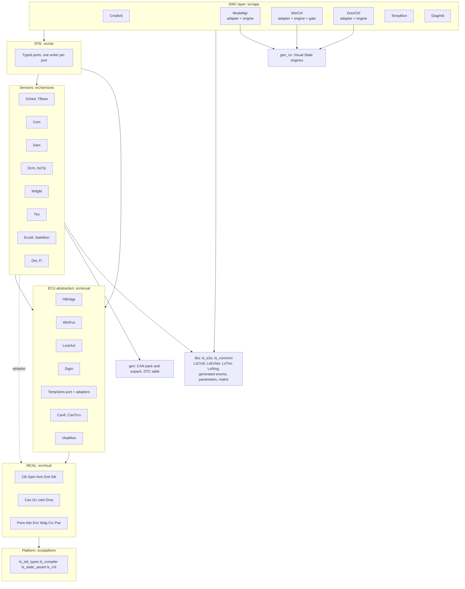
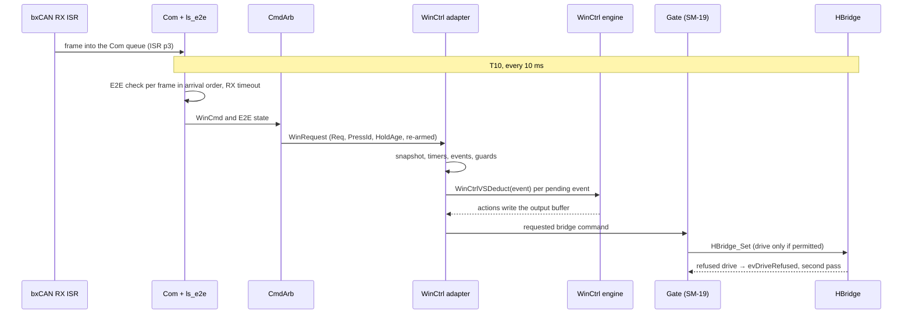

# LockSys DCU Software Architecture

| Field | Value |
|---|---|
| Document ID | LS-DCU-SAD-001 |
| Version | 0.1 |
| Status | Draft |
| Owner | jlurg |
| Contract | LS-SAIC-001 v0.2 ([LS-SAIC](../../02_system/LS-SAIC.md)) |
| Requirements | [DCU software requirements](software_requirements.md) (LS-DCU-SRS-001) |
| Scope | Stage A (release v1.0) |

## 1. Purpose and scope

This document defines the software architecture of the Door Control Unit (DCU) firmware: layers and dependency rules, the module catalogue, scheduling and interrupt priorities, design patterns, the integration of the IAR Visual State engines, the state machines and their transition identifiers, start-up and shutdown, diagnostics, resource budgets, the pin and peripheral allocation, error handling and the quality measures.

- It covers stage A of the window function (free-spinning JGB37-520 encoder motor, hold-to-run, no position limits) and the door lock. Elements of later stages are named only where the architecture reserves room for them.
- Detailed module designs are added under `docs/04_software/dcu/swdd/` together with the implementation (milestones M1 and M2). Module headers carry the authoritative function signatures (Doxygen); the API names below are the module contracts.
- Inputs: LS-SAIC-001 v0.2, LS-SRS-001, the [safety concept](../../05_safety/safety_concept.md) (LS-SAF-001), the [verification strategy](../../07_verification/verification_strategy.md) (LS-VER-001), the [coding standard](../../08_process/coding_standard.md) and the [Guideline Enforcement Plan](../../08_process/misra/gep.md).

### 1.1 Platform

| Item | Value |
|---|---|
| MCU | STM32F103RBT6: Cortex-M3 at 72 MHz, 128 KB flash, 20 KB SRAM, no MPU, no FPU |
| Board | NUCLEO-F103RB (MB1136 revision C-02 or later), powered from USB through the ST-LINK/V2-1 |
| Power stage | Pololu Dual VNH5019 Motor Driver Shield #2507: M1 = window, M2 = lock |
| Toolchain | IAR EWARM 9.70 baseline with C-STAT (exact build in `tools/versions.env`); Arm GNU Toolchain 13.3.rel1 for the shadow build and host tests |
| Device support | CMSIS-Core 5.9.0 and `cmsis_device_f1` v4.3.5, vendored in `third_party/`; no ST HAL or LL |
| State machines | IAR Visual State 11.2.1 or later, Classic Coder, Adaptive API, readable C |

## 2. Architectural principles

1. **Last line of defence.** The DCU re-checks every permission to move: E2E state, timeouts, HoldAge, PressId, supply, temperature, mode, active DTC inhibits, encoder plausibility and the CAN matrix version. The APP and the CGW are untrusted for safety.
2. **Sequencing in models, protection below them.** WinCtrl, DoorCtrl and ModeMgr are Visual State models. Reflexes, backstops, caps, the output permission gate (SM-19), SafeMon and the watchdog are hand-written and act without the models.
3. **Time-triggered and cooperative.** One 1 ms SysTick drives a static task table; tasks never preempt each other; interrupt handlers only capture data or perform reflexes.
4. **Static everything.** No heap, no recursion, no function pointers in authored code, no floating point. Bindings between layers are resolved statically in `cfg/` with static assertions.
5. **De-energised by default.** Enumeration value 0 is the safe value; outputs start switched off; every stop path ends in brake and off.
6. **Single source of truth.** CAN packing, frame attributes, parameters, enumerations and the DTC table are generated from `interfaces/`; the engines are generated from the committed Visual State model. Generated code is committed and never edited.
7. **Stage A simplifications.** No non-volatile memory (DTCs in RAM plus a `noinit` latch), no calibration block (parameters are build-time constants from `interfaces/params/timing.yaml`), no CAN transceiver standby control, no limit switches.

## 3. Layered architecture

### 3.1 Layers

| Layer | Directory | May include and call | Must not |
|---|---|---|---|
| Platform | `src/platform/` | `<stdint.h>`, `<stdbool.h>`, `<stddef.h>`; IAR or GCC intrinsics only inside `ls_compiler.h` | Any other project header |
| MCAL | `src/mcal/<module>/` | Platform, CMSIS-Core, ST device header, its own `cfg` | ECUAL and above, except notification bindings declared in `cfg/mcal/*_cfg.c` |
| ECUAL | `src/ecual/<module>/` | Platform, MCAL, `libs/ls_common`, generated parameters and enumerations | Services, RTE, SWCs, except notification bindings in `cfg/ecual/*_cfg.c` |
| Services | `src/services/<module>/` | Platform, ECUAL, `libs/`, `gen/`; from MCAL only `Wdg`, `Crc`, `Uart`, `Dma`, `Pwr`, `Stk`, `Clk` (reset flags, clock query) and `Nvic` (fault information, debugger query) | RTE, SWCs, except bindings in `cfg/services/*_cfg.c` |
| RTE | `src/rte/` | Services, ECUAL (read-through getters), `libs/`, `gen/` | MCAL |
| SWC | `src/app/<swc>/` | Its own RTE view `rte/rte_<swc>.h`, platform, `libs/ls_common`, generated enumerations and parameters; WinCtrl, DoorCtrl and ModeMgr also their own `gen_vs/<variant>/<System>.h` and the project header | Other SWCs, services, ECUAL, MCAL |
| Configuration | `cfg/<layer>/<module>_cfg.{h,c}` | The configured module and the binding targets declared in `tools/arch/layers.yaml` | — |
| Generated (interfaces) | `gen/`, `libs/ls_common/gen/` | Platform types | Edited by hand |
| Generated (Visual State) | `gen_vs/release/`, `gen_vs/debug/` | Platform types; actions declared by the SWC | Edited by hand; included outside the owning SWC |

`cfg/services/sched_cfg.c` is the only place where task bodies of every layer are bound to the task table. Lower-to-upper notifications (for example a reflex reported to `Dem`) are direct calls bound in the `cfg` file of the lower module, so the call graph stays static and analysable.

### 3.2 Enforcement

| Rule | Mechanism |
|---|---|
| Layer-qualified includes (`#include "ecual/hbridge/hbridge.h"`); include roots `src/`, `cfg/`, `gen/`, `libs/*/include`, `libs/ls_common/gen` | Build files; review |
| Register headers (`stm32f1xx.h`, `core_cm3.h`) only in platform, MCAL and startup | CMSIS include paths exist only for those groups in the IAR project and the CMake target; `tools/arch/check_layers.py` |
| Include matrix of §3.1; `*_priv.h` only inside its module; no SWC-to-SWC include; `extern` objects only in `rte/`, `gen/` and `gen_vs/` | `tools/arch/check_layers.py` with `tools/arch/layers.yaml` in the `dcu-static` CI job and as a pre-commit hook |
| A generated system header only in its own SWC; one generated system header per translation unit | `tools/arch/check_layers.py` |
| One writer per RTE port | Each SWC view declares only its own `Rte_Write_*`; the compiler option "require prototypes" turns a call to an undeclared write into an error |
| No heap, no recursion | Linker map check, linker stack-usage analysis, C-STAT |

## 4. Module catalogue

Context: `T<n>` = task with period n ms, `ISR p<n>` = interrupt at NVIC priority n, `init` = start-up only. Milestone: the milestone in which the module is first delivered complete.

### 4.1 Platform

| Module | Responsibility | Principal API | Milestone |
|---|---|---|---|
| `ls_std_types.h` | `Ls_ReturnType` (`LS_E_OK` = 0, `LS_E_NOT_OK`, `LS_E_BUSY`, `LS_E_PENDING`); fixed-width types | — | M1 |
| `ls_compiler.h` | The only place using language extensions (permit DP-02): `LS_NOINIT`, `LS_SECTION(s)`, `LS_ISR_ROOT` (call-graph root for stack analysis), barriers; IAR, GCC and host branches | Macros (permit DP-04) | M1 |
| `ls_static_assert.h` | `LS_STATIC_ASSERT(cond, msg)` for table sizes and enumeration equalities | Macro | M1 |
| `ls_crit.{h,c}` | Nestable critical sections on BASEPRI (§5.3) | `LsCrit_Enter`, `LsCrit_Exit`, `LsCrit_EnterReflex` | M1 |

### 4.2 MCAL

| Module | Responsibility | Principal API | Context | Milestone |
|---|---|---|---|---|
| `Clk` | HSE72 profile: HSE bypass 8 MHz (ST-LINK MCO) → PLL × 9 = 72 MHz, APB1 36 MHz, APB2 72 MHz, ADC 12 MHz, flash 2 wait states, CSS on. HSI64 profile (SAFE only). Reset flags (RCC_CSR). Every clock-derived setting is computed from `Clk_Get*Hz()`. | `Clk_Init`, `Clk_GetSysclkHz`, `Clk_GetPclk1Hz`, `Clk_GetResetFlags`, `Clk_ClearResetFlags`, `Clk_CssNmi` | init, NMI | M1 (CSS: M6) |
| `Gpio` | Pin table (§12), safe initialisation, single `AFIO->MAPR` write, BSRR writes, readback, trace pins | `Gpio_InitSafe`, `Gpio_Init`, `Gpio_Write`, `Gpio_Read`, `Gpio_ReadOutput`, `Gpio_TraceSet` | any | M1 |
| `Nvic` | Priority grouping (4 preemption bits), priority table (§5.2), fault enables, fault register snapshot, debugger query | `Nvic_Init`, `Nvic_GetFaultInfo`, `Nvic_IsDebuggerAttached` | init, fault | M1 |
| `Exti` | Lines 4 or 6 (lock EN/DIAG by option), 10 (window EN/DIAG), 13 (B1, DEV), 16 (PVD) | `Exti_Init` | ISR p1 | M1 |
| `Stk` | SysTick 1 ms (LOAD = HCLK/1000 − 1); DWT cycle counter | `Stk_Init`, `Stk_CycNow` | ISR p2 | M1 |
| `Can` | bxCAN: `CAN_BTR = 0x00050008`, ABOM = 0, TTCM = 0, TXFP = 0, NART = 0; identifier-list filters (LS-IF-001 §3.2); initialisation-mode control; recovery by INRQ; mailbox access; RX interrupt passes the filter match index | `Can_Init`, `Can_Start`, `Can_Stop`, `Can_Write`, `Can_GetErrorState`, `Can_Recover`, `Can_RxIsr`, `Can_TxIsr`, `Can_SceIsr` | ISR p3, p4 | M1 |
| `I2c` | I2C1 on PB8/PB9 at `i2c_clock_hz` (100 kHz; 88 kHz fallback); interrupt-driven job state machine at priority 0; errata handling ES096 §2.8; non-blocking recovery chain (LS-SAIC-001 §5.4); job timeout 5 ms | `I2c_Init`, `I2c_Submit`, `I2c_GetStatus`, `I2c_MainFunction`, `I2c_EvIsr`, `I2c_ErIsr` | ISR p0, T5 | M2 |
| `Uart` | USART2 115200 8N1; TX through DMA1 Ch7; RX through DMA1 Ch6 into a circular buffer in DEV and HIL builds only | `Uart_Init`, `Uart_Send`, `Uart_IsBusy`, `Uart_RxRead`, `Uart_DmaTxIsr` | ISR p5, tasks | M1 |
| `Dma` | DMA1 Ch1 (ADC1, circular), Ch6 (USART2 RX, DEV and HIL), Ch7 (USART2 TX) | `Dma_Init` | init | M1 |
| `Pwm` | TIM3_CH2 on PC7 (window) and TIM4_CH1 on PB6 (lock), 20 kHz (PSC 0, ARR 3599 at 72 MHz); compare 0 at start; unused channels keep CCxE = 0 | `Pwm_Init`, `Pwm_SetDuty`, `Pwm_GetDuty` | T1, ISR | M1 |
| `Adc` | ADC1 regular scan of IN0 (window CS), IN1 (lock CS), IN4 (KL30), IN17 (VREFINT) at 1 kHz, triggered by TIM1 CC1 (TIM1 has no output pins: CC1E–CC4E = 0, MOE = 0); single-ADC mode; no injected conversions (ES096 §2.5.1); DMA circular; self-calibration at start-up | `Adc_Init`, `Adc_GetRaw`, `Adc_IsFresh` | T1 | M1 |
| `Enc` | TIM2 encoder mode 3 (x4, SMS = 011) on PA15/PB3 (remap 01), ARR 0xFFFF, input filter ICxF = 0xF (≈ 3.6 µs, far below the 119 µs minimum edge spacing), no overflow interrupt | `Enc_Init`, `Enc_GetCount` | T10 | M2 |
| `Wdg` | IWDG prescaler /4, reload 499 (50 ms nominal, 33–67 ms); never refreshed from an ISR | `Wdg_Start`, `Wdg_Refresh` | EcuM, WdgM | M1 |
| `Crc` | CRC-32 unit (polynomial 0x04C11DB7, initial 0xFFFFFFFF, 32-bit words); owned by SafeMon | `Crc_Reset`, `Crc_Feed`, `Crc_Value` | init, T100 | M1 |
| `Pwr` | PVD with PLS = 111 (falling 2.66 / 2.78 / 2.90 V), EXTI16; backup registers for the reset counter | `Pwr_Init`, `Pwr_PvdIsr`, `Pwr_BkpRead`, `Pwr_BkpWrite` | ISR p1 | M1 |

### 4.3 ECU abstraction (ECUAL)

| Module | Responsibility | Principal API | Context | Milestone |
|---|---|---|---|---|
| `HBridge` | Two VNH5019 channels. Commands DRIVE_UP (INA 1, INB 0, PWM duty), DRIVE_DOWN (0, 1, duty), BRAKE (0, 0, 100 %), OFF (0, 0, 0 %). Soft-start ramp over `t_softstart_ms`. Window current from CS at 1 kHz (`cs_mv_per_a`). Over-current backstop: filtered CS > `i_oc_backstop_ma` for `t_oc_backstop_ms`, from `t_cs_blank_ms` after drive-on. INA/INB output readback every 1 ms. **Reflex latch** per channel (§8.6). EN/DIAG never driven. | `HBridge_Init`, `HBridge_Set`, `HBridge_ReflexStop`, `HBridge_DiagIsr`, `HBridge_ClearReflex`, `HBridge_AllOff`, `HBridge_Main1ms`, `HBridge_GetStatus` | T1, ISR p1 | M1 (drivers), M2 (supervision) |
| `WinPos` | Encoder sampling every 10 ms with 16-bit modular differences and `enc_dir_invert`; 32-bit relative position; speed over 50 ms in 0.1 rpm (= counts × 12000 / `enc_cpr`); encoder supervision NO_MOTION and DIR_MISMATCH (LS-SAIC-001 §5.3) acting through `HBridge_ReflexStop`: a ring of the last `no_motion_window_ms` / `t_dcu_task_ms` (10) per-period differences forms a sliding window that is evaluated every 10 ms, so a count loss is detected ≤ 110 ms after it starts (SYS-042); the ring is cleared at every drive-on and the window is complete only after the start grace; EncoderStatus | `WinPos_Init`, `WinPos_Main10ms`, `WinPos_GetStatus` | T10 | M2 |
| `LockAct` | Lock pulse at 100 % on M2 in the configured direction; hard cap `t_lock_pulse_hard_max_ms` independent of DoorCtrl (SM-09); lock over-current `i_oc_lock_ma` for `t_oc_lock_ms`: before `t_lock_min_stroke_ms` a fault, after it the end of stroke; EN/DIAG reflex; peak current; end reporting | `LockAct_Pulse`, `LockAct_Stop`, `LockAct_IsActive`, `LockAct_GetEnd`, `LockAct_GetPeakMa`, `LockAct_Main1ms`, `LockAct_DiagIsr` | T1, ISR p1 | M2 |
| `DigIn` | Lock position switch PB12 with internal pull-up, sampled every 5 ms, 4 equal samples (`t_debounce_ms`); UNKNOWN until the first debounce; polarity `lock_fb_locked_level`; B1 in DEV builds | `DigIn_Main5ms`, `DigIn_Get` | T5 | M2 |
| `TempSens` | Port with adapters selected at link time: `tempsens_tmp117.c` (default), `tempsens_tmp102.c`, `tempsens_lm75.c`, `tempsens_sim.c` (host tests). TMP117: identity 0x0117 on 16 bits, one-shot configuration 0x0C20, Data_Ready polling, conversion to cdeg with rounding half away from zero | `TempSens_StartIdentify`, `TempSens_StartSample`, `TempSens_Poll` | T5, T1000 | M2 |
| `CanIf` | RX queues filled in the RX interrupt and demultiplexed by filter match index: Com (16 frames) and Diag (4 frames); TX pending slot per frame (newest wins) loaded into free mailboxes from task context and from the TX interrupt, with E2E protection at load through a bound Com callback; bus-off state machine (LS-IF-001 §9.1) | `CanIf_RxIndication`, `CanIf_RxPopCom`, `CanIf_RxPopDiag`, `CanIf_Transmit`, `CanIf_Main10ms`, `CanIf_GetBusState` | ISR p3, p4, T10 | M1 |
| `CanTrcv` | Transceiver mode interface. MVP: the SN65HVD230 board has no standby pin, so the module only reports NORMAL; standby control (TCAN1042V-Q1) is LATER and changes only this module | `CanTrcv_Init`, `CanTrcv_GetMode` | init | M1 |
| `VbatMon` | KL30 from PA4: mV = raw × 3300 / 4095 × `kl30_gain_x1000` / 1000 + `kl30_offset_mv`; VDDA plausibility from VREFINT (`vdda_plaus_min_mv`…`vdda_plaus_max_mv`); states START_OK, RUN_OK, UNDER (< `vbat_uv_dv` for `t_vbat_uv_ms`), OVER (> `vbat_ov_dv`, or a raw reading at ADC full scale (4095), for `t_vbat_ov_ms`; with the 1/5 module 16.5 V is at full scale, so saturation is classified as over-voltage independently of the VDDA tolerance, SM-10, FMEA FM-16), INVALID (`kl30_sense_fitted` false, VDDA implausible or ADC stale); heal after `t_vbat_heal_ms` in the start window | `VbatMon_Main10ms`, `VbatMon_Get` | T10 | M2 |

### 4.4 Services

| Module | Responsibility | Principal API | Context | Milestone |
|---|---|---|---|---|
| `Sched` | Static task table (`cfg/services/sched_cfg.c`), `switch` dispatch, overrun counters, per-task DWT maximum, hang monitor in the SysTick interrupt, CPU load over 1 s windows | `Sched_Start`, `Sched_TickIsr`, `Sched_GetStats` | main loop, ISR p2 | M1 |
| `TBase` | 32-bit millisecond counter written only by the SysTick interrupt; wrap-safe elapsed time | `TBase_Ms`, `TBase_Since` | any | M1 |
| `Com` | Generated pack and unpack (`gen/`); RX in arrival order with E2E check (`ls_e2e`) and RX timeouts; TX schedule from the generated matrix header (cycle, minimum gap, start values); typed getters and setters; E2E counters for DID 0xFD08 | `Com_MainRx`, `Com_MainTx`, `Com_GetWinCmd`, `Com_GetDoorCmd`, `Com_GetCgwNodeSts`, `Com_SetWinSts`, `Com_SetWinMotion`, `Com_SetDoorSts`, `Com_SetTempSts`, `Com_SetNodeSts`, `Com_TriggerTx`, `Com_TxLoad` | T10, ISR p4 | M1 |
| `Dem` | Event table generated from `interfaces/dtc/dtc_catalog.yaml`; status bits 0, 2, 3, 5; 16 entries in `noinit` RAM protected by CRC-32; aging over 40 operation cycles; per-event flags written by interrupt handlers; occurrence time stamps for escalation; fan-out to Tlm (`$LSDTC`), Com (`DcuSts_DtcCount`) and ModeMgr | `Dem_Report`, `Dem_ReportIsr`, `Dem_Main100ms`, `Dem_GetStatus`, `Dem_ConfirmedCount`, `Dem_ClearAll`, `Dem_GetEntry` | T100, any | M2 |
| `IsoTp` | ISO 15765-2 on 0x7A0/0x7A8: BS 0, STmin 5 ms, padding 0xCC, 128 bytes, N_Bs and N_Cr 1000 ms; fed by the CanIf Diag queue | `IsoTp_Main5ms` | T5 | M2 |
| `Dcm` | Sessions (default, extended; S3 5 s); services 0x10, 0x11, 0x14, 0x19 0x02, 0x22, 0x3E; negative responses; DID and reset handlers bound to DiagHdl in `cfg/services/dcm_cfg.c` | `Dcm_Main10ms`, `Dcm_GetSession` | T10 | M2 |
| `WdgM` | One supervised entity per task; alive counters checked against windows every 10 ms; all correct → `Wdg_Refresh`; failure → `SafeMon_EnterSafe` and no further refresh | `WdgM_Checkpoint`, `WdgM_Main10ms` | tasks | M1 |
| `Tlm` | UART telemetry version 1 ([LS-IF-003](../../03_interfaces/uart_telemetry.md)); no `printf`; per-type sequence counters; 1024-byte ring to DMA; whole-line drop with `DROPPED n`; ≤ 20 log lines per second; D-level logs compiled out of Release | `Tlm_Temp`, `Tlm_Status`, `Tlm_Motion`, `Tlm_Version`, `Tlm_Reset`, `Tlm_Dtc`, `Tlm_Log`, `Tlm_Main10ms`, `Tlm_Main1000ms` | tasks | M1 |
| `EcuM` | Early initialisation, reset-reason decoding (priority IWDG > WWDG > SFT > LPWR > POR > PIN), `noinit` record (magic, layout version, CRC-32), watchdog and fault reset counter in backup registers (per power cycle), init order (§9), IWDG refresh points before the scheduler, controlled reset | `EcuM_EarlyInit`, `EcuM_Init`, `EcuM_GetResetReason`, `EcuM_RequestReset` | init | M1 |
| `SafeMon` | Interrupt-safe SAFE entry (both bridges off, SAFE latch in `noinit`); fault-handler entry with safe outputs in < 1 µs and a fault record; stack painting and canary check every 100 ms; ROM CRC-32 at start-up (background slices: M6); CPU and stack statistics | `SafeMon_EnterSafe`, `SafeMon_FaultEntry`, `SafeMon_RomCheckFull`, `SafeMon_Main100ms`, `SafeMon_GetStats` | any, T100 | M1 |
| `Det` | Development errors: DEV and HIL builds log `#LOG E DET` and keep 8 entries; a breakpoint when a debugger is attached; compiled out of Release | `Det_Report` | any | M1 |
| `Fi` | DEV and HIL builds only: `!LSFI` parser on the USART2 RX buffer and the injections of [LS-IF-003](../../03_interfaces/uart_telemetry.md) §7; RC and RELEASE images contain no `Fi_` symbols | `Fi_Main10ms` | T10 | M1 (HANG, ROMCRC), M2 (rest) |

### 4.5 RTE

`src/rte/` implements the typed ports of §7.1. It holds the buffers of SWC-written ports, read-through getters for ECUAL and service data, and the forwarding of SWC status to Com and Tlm. API pattern: `Ls_ReturnType Rte_Read_<Port>(Rte_<Port>Type *out)`, `void Rte_Write_<Port>(const Rte_<Port>Type *in)`, `Ls_ReturnType Rte_Call_<Op>(…)`.

### 4.6 Software components

| SWC | Responsibility | Runnables | Milestone |
|---|---|---|---|
| `CmdArb` | Communication-level validation: CGW_WinCmd E2E state, RX timeout and re-arm (S2), Req range (S3), HoldAge (S4); first PressId with E2E OK; CGW_DoorCmd new-ReqId detection; CGW_NodeSts mode, liveness and version (S6, U1A00, U1A03) | `CmdArb_Init`, `CmdArb_Main10ms` | M2 |
| `ModeMgr` | NodeMode statechart (Visual State) and hand-written inhibit computation from the active DTCs, their release conditions and the escalation counters | `ModeMgr_Init`, `ModeMgr_Main10ms` | M2 |
| `WinCtrl` | Hold-to-run window statechart (Visual State); start and run permissions (LS-SAIC-001 §5.2); stop-reason arbitration; output permission gate and PressId latch (SM-19); WindowState and WinResult reporting | `WinCtrl_Init`, `WinCtrl_Main10ms` | M2 |
| `DoorCtrl` | Lock transaction statechart (Visual State): pulse, settle, verify, retry, rate limit; DoorLockState from the position switch only | `DoorCtrl_Init`, `DoorCtrl_Main10ms` | M2 |
| `TempMon` | One-shot sampling (T1000 start, T5 completion), plausibility, over-temperature hysteresis, `$LSTMP` and DCU_TempSts | `TempMon_Init`, `TempMon_Main5ms`, `TempMon_Main1000ms` | M2 |
| `DiagHdl` | DID read handlers (F18C, F195, FD00–FD09); ECU reset coordination with the SAFE-latch rule; DTC clear coordination | `DiagHdl_ReadDid`, `DiagHdl_EcuReset`, `DiagHdl_ClearDtc` | M2 |

## 5. Scheduling and interrupts

### 5.1 Task table

SysTick runs at 1 ms (LOAD 71999 at 72 MHz; 63999 in the HSI64 profile). The SysTick interrupt increments `TBase`, sets the tick flag and runs the hang monitor. The main loop runs due tasks in the order T1, T5, T10, T100, T1000, then the idle loop. Missed ticks are counted, not replayed.

| Task | Period / offset | WCET budget | Runnables in order | WdgM supervised entity |
|---|---|---|---|---|
| T1 | 1 ms / 0 | 100 µs | `HBridge_Main1ms`, `LockAct_Main1ms` | SE_T1: 10 ± 1 checkpoints per 10 ms |
| T5 | 5 ms / 1 | 250 µs | `DigIn_Main5ms`, `I2c_MainFunction`, `TempMon_Main5ms`, `IsoTp_Main5ms` | SE_T5: 2 ± 1 per 10 ms |
| T10 | 10 ms / 2 | 600 µs | `CanIf_Main10ms` → `Com_MainRx` → `WinPos_Main10ms` → `VbatMon_Main10ms` → `CmdArb_Main10ms` → `ModeMgr_Main10ms` → `WinCtrl_Main10ms` → `DoorCtrl_Main10ms` → `Dcm_Main10ms` → `Fi_Main10ms` (DEV, HIL) → `Com_MainTx` → `Tlm_Main10ms` → `WdgM_Main10ms` (last) | SE_T10: 1 per 10 ms |
| T100 | 100 ms / 4 | 400 µs | `Dem_Main100ms`, `SafeMon_Main100ms` | SE_T100: 1 per 100 ms |
| T1000 | 1000 ms / 8 | 300 µs | `TempMon_Main1000ms`, `Tlm_Main1000ms` | SE_T1000: 1 per 1000 ms |
| Idle | — | — | Idle-cycle accounting for the CPU load | Not supervised |

- Offsets keep at most two tasks in one tick; the worst tick is T1 + T10 = 700 µs.
- Load from the budgets is ≈ 21 %; the expected load is 6–10 %; the requirement is ≤ 60 % (SYS-070).
- The order inside T10 puts the encoder supervision and the supply state before the arbitration, so every SWC sees the same input snapshot, and puts Com TX after the SWCs, so a status change leaves in the same cycle. `WdgM_Main10ms` runs last.
- Sub-budgets inside T10 (to be replaced by measurements): WinCtrl ≤ 60 µs, DoorCtrl ≤ 40 µs, ModeMgr ≤ 30 µs.

### 5.2 Interrupts

`Nvic_Init` sets 4 preemption bits and no sub-priority.

| Exception or IRQ | Priority | Budget | Action |
|---|---|---|---|
| NMI (clock security system) | Fixed | — | `Clk_CssNmi`: safe outputs, `noinit` cause, SAFE latch, reset (M6) |
| HardFault | Fixed | — | Assembly stub `LDR R0,=FAULT_STACK$$Limit` then `MOV SP,R0` (ES096 §2.1.3), then `SafeMon_FaultEntry` |
| BusFault, UsageFault | 0 | — | Same stub |
| I2C1_EV, I2C1_ER | 0 | ≤ 5 µs | I2C job state machine; never masked by BASEPRI (ES096 §2.8) |
| EXTI15_10 (PB10 window EN/DIAG; PC13 B1 in DEV), EXTI4 (PB4 lock EN/DIAG, option B) or EXTI9_5 (PA6, option A), PVD (EXTI16) | 1 | ≤ 3 µs | `HBridge_DiagIsr` or `LockAct_DiagIsr`: bridge off, reflex latch, DTC flag; `Pwr_PvdIsr`: safe outputs, `noinit` flag |
| SysTick | 2 | ≤ 2 µs | Tick, hang monitor |
| USB_LP_CAN1_RX0, CAN1_RX1, CAN1_SCE | 3 | ≤ 4 µs per frame | Frame with time stamp into the Com or Diag queue by filter match index; error and bus-off flags |
| USB_HP_CAN1_TX | 4 | ≤ 4 µs | Load the next pending frame into the free mailbox (E2E protection at load) |
| DMA1_Channel7 | 5 | ≤ 3 µs | Start the next telemetry chunk |

- Every handler is declared with `LS_ISR_ROOT`, so the linker stack analysis includes interrupt stacks; CI fails if a handler appears among the uncalled functions of the stack report.
- DMA1 Ch1 (ADC) and Ch6 (USART2 RX) run without interrupts; tasks read their buffers.
- The USB peripheral stays off: it shares its SRAM with bxCAN.
- Jitter of the 1 ms tick from priorities 0 and 1 and from reflex sections stays ≤ 10 µs, inside the SYS-090 limit of 50 µs.

### 5.3 Critical sections

| Section | Mechanism | Masks | Use |
|---|---|---|---|
| `LsCrit_Enter` / `LsCrit_Exit` | BASEPRI = 0x30, nestable | Priorities ≥ 3 (CAN, DMA) | Task access to data shared with the CAN and DMA handlers |
| `LsCrit_EnterReflex` | BASEPRI = 0x10, ≤ 2 µs | Priorities ≥ 1 | HBridge check-then-write against the reflex handlers |
| PRIMASK | Global disable | All configurable | Fault and SAFE-entry paths only |

The I2C handlers (priority 0) are never masked. The SysTick handler is masked only by reflex sections.

### 5.4 Supervision of the scheduler

- **Hang monitor.** If a task (T1…T1000) has run for more than `t_hang_detect_ms` (20 ms), the SysTick handler calls `HBridge_AllOff()` and reports the event; the IWDG then resets the MCU. Outputs are off ≈ 21 ms after the hang starts (SYS-023 ≤ 100 ms). A hang in an interrupt at priority ≤ 2 blocks the monitor; then the IWDG reset (≤ 67 ms) leaves the pins floating and the bridges coasting.
- **Overrun.** If the tick counter advanced by more than one during a dispatch, the overrun counter increments, `#LOG W SCH` is emitted and `Det` reports.
- **CPU load.** Load = 1 − idle cycles / window cycles over 1 s windows, including interrupt time. The maximum is reported in `DcuSts_CpuLoadMax` and DID 0xFD07.
- **Alive supervision.** `WdgM_Main10ms` compares the checkpoint counts of every supervised entity with their windows and refreshes the IWDG only if all are correct.

### 5.5 Trace pins (DEV and HIL builds)

| Pin | Meaning | Written by |
|---|---|---|
| TRACE0 (PC0) | High while any task runs; held high during an injected hang | `Sched` |
| TRACE1 (PC1) | Toggles on every window or lock bridge command change | `HBridge` |
| TRACE2 (PC2) | Toggles on every CGW_WinCmd accepted with E2E state VALID | `Com` |
| TRACE3 (PC3) | Pulse inside a reflex handler (EN/DIAG, hang monitor) | `HBridge`, `Sched` |

All four pins are written by single GPIOC BSRR stores through `Gpio_TraceSet`; the calls compile to nothing when `LS_CFG_TRACE` is 0.

## 6. Design patterns

| Pattern | Where | Reason |
|---|---|---|
| Strict layering, ports and adapters | All layers; TempSens port; RTE views | Small interfaces; include rules checkable by script and compiler |
| Time-triggered cyclic executive | Sched | No preemption between tasks, so RTE data needs no locks; WCET analysable |
| Modelled statechart with a hand-written adapter | WinCtrl, DoorCtrl, ModeMgr (§8) | Model-level verification; the adapter keeps the engine free of RTE, timing and output side effects |
| Prioritised event bitset, timestamp timer pool, buffered outputs with one apply phase | SWC adapters (`LsEvSet`, `LsTmr`) | Deterministic event order, no overflow, exact minimum times, one final output per cycle |
| Hand-written state machine (enumeration and `switch`) | I2C job and recovery, CanIf bus-off, `ls_e2e` receiver, TempMon sampling, IsoTp | Interrupt context, layering or sharing with the CGW rule out generated code |
| Reflex latch (set by the reflex, cleared by policy, atomic check-then-act) | HBridge, LockAct | A reflex stop can never be overridden by a later task command |
| Output permission gate | WinCtrl (`win_ctrl_gate.c`) | Independent check of every applied drive (SM-19) |
| Static observer | Dem → ModeMgr, Tlm, Com; reflexes → Dem | Direct calls bound in `cfg`; exact stack analysis |
| Strategy at link time | TempSens adapters | One implementation linked per configuration; no indirect calls |
| Command validation pipeline | CmdArb (communication level) → WinCtrl and DoorCtrl guards (physical level) | Pure functions returning a CommandResult; unit-testable |
| Single-producer single-consumer rings | CanIf RX queues, Tlm ring, USART2 RX buffer | One writer per index; no read-modify-write races |
| Configuration tables | Pin table, CAN filters, task table, WdgM entities, Com frames, Dem events | `const` in flash; static assertions against enumeration counts |
| Link-time test doubles | Ceedling mocks of lower-layer headers; register fakes | No production code changes for testing |
| Defensive programming | Range checks with `Det`; every return value checked; bounded hardware waits; safe value 0; output readback | MISRA Dir 4.1, Rule 17.7 |

## 7. Data flow

### 7.1 RTE ports

Each port has exactly one writer. Read-through ports return data owned by ECUAL or a service through its getter.

| Port | Content | Writer | Readers |
|---|---|---|---|
| `WinRequest` | WindowRequest, PressId, HoldAge (ms), frame state (VALID, INVALID, TIMEOUT), re-armed flag, first PressId seen and its validity | CmdArb | WinCtrl |
| `DoorRequest` | DoorRequest, ReqId, new-request flag | CmdArb | DoorCtrl |
| `CgwStatus` | CGW NodeMode, CAN matrix major and minor, version known, version matching, alive | CmdArb | ModeMgr, WinCtrl, DoorCtrl, DiagHdl |
| `EcuMode` | NodeMode; inhibits window UP, window DOWN, lock; SAFE latched | ModeMgr | WinCtrl, DoorCtrl, TempMon, DiagHdl |
| `WinStatus` | WindowState, StopReason, PressIdEcho, WinResult, window fault flags | WinCtrl | ModeMgr, DiagHdl; forwarded to Com (DCU_WinSts) and Tlm |
| `DoorStatus` | DoorLockState, LastReqId, LastResult, switch level, actuator and driver faults, RateLimited, actuation count, peak current | DoorCtrl | ModeMgr, DiagHdl; forwarded to Com (DCU_DoorSts) and Tlm |
| `TempStatus` | cdeg, TempStatus, sample sequence, over-temperature | TempMon | WinCtrl, DoorCtrl, ModeMgr, DiagHdl; forwarded to Com (DCU_TempSts) |
| `DtcStatus` | Active DTCs with severity and inhibit policy, confirmed count, escalation counters | Dem (read-through) | ModeMgr, DiagHdl |
| `Supply` | VbatMon state, KL30 in dV, validity | VbatMon (read-through) | WinCtrl, DoorCtrl, ModeMgr, DiagHdl |
| `LockSwitch` | Debounced level, LOCKED, UNLOCKED or UNKNOWN | DigIn (read-through) | DoorCtrl, DiagHdl |
| `WinMotor` | Window bridge command, duty, current, reflex latch causes, drive-on time stamp | HBridge (read-through) | WinCtrl, DiagHdl |
| `WinMotion` | EncoderStatus, speed, position, motion faults | WinPos (read-through) | WinCtrl, DiagHdl; forwarded to Com (DCU_WinMotion) and Tlm (`$LSMOT`) |
| `LockMotor` | Pulse active, end state and cause, peak current, reflex latch | LockAct (read-through) | DoorCtrl, DiagHdl |

| Call | Implemented by | Callers |
|---|---|---|
| `Rte_Call_WinBridge_Set(cmd, duty)` | `HBridge_Set` | WinCtrl apply phase |
| `Rte_Call_WinBridge_ClearReflex(causes)` | `HBridge_ClearReflex` | WinCtrl gate |
| `Rte_Call_LockAct_Pulse(direction, ms)`, `Rte_Call_LockAct_Stop()` | `LockAct` | DoorCtrl apply phase |
| `Rte_Call_EnterSafe(cause)` | `SafeMon_EnterSafe` | ModeMgr, WinCtrl, DoorCtrl |
| `Rte_Call_Dem_Report(event, status)` | `Dem_Report` | All SWCs |
| `Rte_Call_Tlm_Log(level, module, code, text)` | `Tlm_Log` | All SWCs |

DCU_NodeSts is assembled by the RTE from `EcuMode`, `Supply`, `DtcStatus`, the SafeMon statistics and the EcuM reset reason.

Consistency: RTE buffers are accessed from task context only; tasks never preempt each other, so a structure copy is consistent. Data written by interrupt handlers (edge counters, current samples, reflex latches) is read through ECUAL getters with 32-bit atomic reads or inside `LsCrit` sections.

### 7.2 Window command path

DCU share of the release-to-stop chain: frame reception to bridge brake ≤ 10 ms (next T10) + ≤ 1 ms (dispatch to `HBridge_Set`), the 11 ms of the LS-SAIC-001 §5.2 budget.

## 8. State machines and Visual State integration

### 8.1 Scope

| State machine | Implementation | Reason |
|---|---|---|
| WinCtrl, DoorCtrl, ModeMgr | IAR Visual State models in one project `dcu_fsm.vsp` with three systems | Sequencing logic with timers and fault paths; Verificator and Validator evidence; animation with C-SPYLink |
| I2C job and recovery, CanIf bus-off, `ls_e2e` receiver, TempMon sampling, IsoTp, Dcm sessions | Hand-written enumeration and `switch` | Interrupt context, layering, or shared with the CGW |
| EcuM start-up, SafeMon, hang monitor, HBridge reflex latch, LockAct hard cap, encoder supervision, output permission gate | Hand-written, permanently | Safety layer: must work when a model or the generator is wrong (§8.12) |

### 8.2 Generated code and project layout

- Generator: Classic Coder, Adaptive API (`-api_type0`), readable code (`-readable1`); direct calls, no function pointers, no heap (`-useheap0`); API names prefixed with the system name (`WinCtrlVSDeduct`). Options live in `firmware/dcu/model/visualstate/options/` and are passed to `Coder.exe` by `firmware/dcu/scripts/vs/Invoke-VsGenerate.ps1`; the modelling rules are in the [Visual State modelling guide](visual_state_guide.md).
- Variants: `gen_vs/release/` (used by the Hil and Release configurations and by the unit tests) and `gen_vs/debug/` (adds C-SPYLink instrumentation, Debug configuration only).
- The engines contain no event parameters. The adapter is the only caller of its engine; it calls the engine only from its own runnable in T10, never from an interrupt.

### 8.3 Adapter structure

| File (`src/app/<swc>/`) | Content |
|---|---|
| `<swc>.c` | `<Swc>_Init`, `<Swc>_Main10ms`; the only file that calls the engine |
| `<swc>_guards.c` | Pure functions: start and run permissions, stop-reason arbitration, state mapping; inputs in a structure, so tests need no mocks |
| `<swc>_actions.c` | Bodies of the generated action prototypes; they write only the static output buffer of the SWC |
| `<swc>_priv.h` | Input, output and event identifiers of the SWC |
| `win_ctrl_gate.c` (WinCtrl only) | Output permission gate, PressId latch store and reflex-latch release policy (§8.6) |
| `mode_mgr_inhibit.c` (ModeMgr only) | Inhibit mask, escalation counters and mode-cause evaluation |

Call sequence of `<Swc>_Main10ms` in T10:

1. If the engine has failed (§8.7), run the fail-safe routine and return.
2. Read all RTE inputs into one snapshot.
3. Poll the timer pool (`LsTmr`); expired timers set their event bits.
4. Derive the event bits from the snapshot (`LsEvSet_Post`).
5. Evaluate the guards once and write the external variables (`x…`) of the engine.
6. Drain the event set in priority order: one `…VSDeduct(event)` call per pending bit; check every return code.
7. Apply the output buffer once. WinCtrl passes a drive through the gate; a refused drive posts `evDriveRefused` and a single bounded second drain follows; brake and off are never refused.
8. Write the status ports (state mapping in C).

Bounds per cycle: WinCtrl ≤ 11 events plus one re-post, DoorCtrl ≤ 7 events, ModeMgr ≤ 6 events. Each event set is initialised with this drain budget (`LsEvSet_Init`); the adapter drains with `LsEvSet_BeginDrain` and `LsEvSet_Next`, and `LS_EVSET_E_LIMIT` is treated as an engine fault (§8.7). A re-entry flag detects a deduct call from inside an action.

### 8.4 Events and priorities

Pending events are kept in a 32-bit bitset per SWC and drained lowest bit first. The principle is safety, then physical stops, then time, then supervision, then new requests. Bits marked B are reserved for stage B and are not posted in stage A.

| Bit | WinCtrl | DoorCtrl | ModeMgr |
|---|---|---|---|
| 0 | `evSafe` | `evSafe` | `evSafeReq` |
| 1 | `evDriverFault` | `evPulseEnd` | `evTmInitMax` |
| 2 | `evLimitUp` (B) | `evTmPulseGuard` | `evNonCritFault` |
| 3 | `evLimitDn` (B) | `evTmSettle` | `evHealedNow` |
| 4 | `evMotionFault` | `evTmPause` | `evTmHeal` |
| 5 | `evDriveRefused` | `evTick` | `evSelfTestOk` |
| 6 | `evTmBrake` | `evDoorReq` | — |
| 7 | `evTmDead` | — | — |
| 8 | `evTick` | — | — |
| 9 | `evReqUp` | — | — |
| 10 | `evReqDown` | — | — |

Event sources:

| Event | Posted when |
|---|---|
| `evSafe` (WinCtrl, DoorCtrl) | `EcuMode` is SAFE |
| `evDriverFault` | The window EN/DIAG reflex latch is newly set |
| `evMotionFault` | WinPos reports a new NO_MOTION or DIR_MISMATCH reflex |
| `evDriveRefused` | The gate refused a drive in the apply phase |
| `evTmBrake`, `evTmDead`, `evTmPulseGuard`, `evTmSettle`, `evTmPause`, `evTmInitMax`, `evTmHeal` | The timer expired (§8.5) |
| `evTick` | Once per T10 cycle |
| `evReqUp`, `evReqDown` | `WinRequest` carries UP or DOWN with a PressId that is neither 0 nor the latched PressId (start condition S5) |
| `evPulseEnd` | LockAct reports the end of a pulse |
| `evDoorReq` | `DoorRequest` carries a new ReqId |
| `evSafeReq` | The SAFE latch is set, or a critical cause is active (§8.11) |
| `evNonCritFault`, `evHealedNow` | A DTC of severity DEGRADED became active, or the last one became inactive |
| `evSelfTestOk` | The INIT completion conditions hold (§8.11) |

### 8.5 Timers

Visual State provides no timers. Each SWC owns a static `LsTmr` pool with one slot per timer event. The timer action function `aTmStart(event, ticks)` maps to `LsTmr_Start(pool, event, TBase_Ms(), ticks)` (1 tick = 1 ms) and its generated `_stop` variant to `LsTmr_Stop`. `LsTmr_Poll` posts the event of a slot into the event set when the elapsed time reaches the duration, which guarantees minimum times (for example the dead time) independently of jitter; expiry is seen at the next T10 (≤ 10 ms later). Model constants mirror parameters and are checked against `libs/ls_common/gen/ls_params_gen.h` by `tools/vs/check_vs_constants.py`.

| Timer event | Model constant | Value | Parameter |
|---|---|---|---|
| `evTmBrake` | `kBrakeMs` | 100 ms | `t_win_brake_ms` |
| `evTmDead` | `kRevDeadMs` | 150 ms | `t_win_rev_dead_ms` |
| `evTmPulseGuard` | `kPulseGuardMs` | 600 ms | `t_lock_pulse_guard_ms` |
| `evTmSettle` | `kSettleMs` | 70 ms | `t_lock_settle_ms` + `t_debounce_ms` |
| `evTmPause` | `kRetryPauseMs` | 500 ms | `t_lock_retry_pause_ms` |
| `evTmInitMax` | `kInitMaxMs` | 200 ms | `t_init_max_ms` |
| `evTmHeal` | `kModeHealMs` | 1000 ms | `t_mode_heal_ms` |

The maximum run time (`t_win_max_run_ms`) is deliberately not a model timer: it is one of the run conditions, so the stop-reason priority sees every cause in the same evaluation.

### 8.6 Outputs, the output permission gate and the reflex latch [SAF]

Actions write only the output buffer of their SWC (bridge command and duty, PressId to latch, stop reason, result, phase, trace identifier). The adapter applies the buffer once per cycle.

**Output permission gate (SM-19, `win_ctrl_gate.c`).** Every window command passes the gate before `HBridge_Set`:

| Check for a drive in direction d | Source |
|---|---|
| `WinRequest` is VALID, re-armed and carries direction d with the active PressId | CmdArb |
| The PressId is not latched | Gate latch store |
| No reflex latch cause blocks direction d | `WinMotor` |
| The mode allows motion and no inhibit covers direction d | `EcuMode` |
| Continuous drive time < `t_win_max_run_ms` + `t_dcu_task_ms` | `WinMotor` drive-on time stamp |

- A drive that fails any check is refused and replaced by BRAKE; the adapter posts `evDriveRefused`. Brake and off are never refused.
- The gate owns the PressId latch store. It latches the active PressId whenever an applied drive ends, whatever the reason, in addition to the latching done by the model actions. After reset the store is seeded with the first PressId received with E2E OK.
- The gate decision is a pure function and is covered with 100 % statement and branch coverage, like the guards.
- **Max-run backstop and its release in stage A.** The drive-on time stamp is set at every applied drive that follows Off (every start passes Brake and Dead). When the drive time reaches `t_win_max_run_ms` + `t_dcu_task_ms` the gate refuses the drive and latches the active PressId, independently of the MAX_RUNTIME stop of the model. In stage A neither this refusal nor B1A13 inhibits a direction (LS-SAIC-001 §13.2: inhibit none, release "next press"): the only latch is the PressId, so a new press (new PressId, re-armed, after the dead time) may drive again in either direction. The direction-blocking release "end position reached" of B1A13 applies from stage B, when end positions exist.

**Reflex latch (HBridge).** Each channel has a latch with one bit per cause. A set bit blocks drives (both directions in stage A; end-position causes of stage B/D block one direction). `HBridge_Set` runs inside `LsCrit_EnterReflex`, checks the latch and writes CCR and BSRR in one section, so a reflex between the check and the write cannot be lost.

| Cause | Set by | Reaction | Released by the gate when |
|---|---|---|---|
| DIAG | EN/DIAG falling edge (EXTI) | Off at once; B1A10 | B1A10 inhibit release `test_after(t_diag_heal_ms)` allows a test drive |
| OC | Over-current backstop (T1) | Brake; B1A16 | Window back in Idle after the dead time; starts stay inhibited by B1A16 `timeout(t_win_oc_inhibit_ms)` |
| MOTION | NO_MOTION (T10) | Brake; B1A11 | Window back in Idle after the dead time |
| DIRM | DIR_MISMATCH (T10) | Brake; B1A15 | B1A15 cleared by UDS 0x14 or power-on reset |
| HANG | Hang monitor (SysTick) | All off | Not released (the IWDG resets the MCU) |
| READBACK | INA/INB readback mismatch (T1) | Off; B1A10 | As DIAG |

LockAct keeps the same structure for the lock channel (DIAG, OC before minimum stroke, READBACK; release per B1A21).

### 8.7 Engine return codes and the engine fault path [SAF]

With `-semnextstatechg0`, `SES_OKAY` and `SES_FOUND` are success. `SES_CONTRADICTION`, `SES_RANGE_ERR`, `SES_SIGNAL_QUEUE_FULL` and any other value are engine faults, as are a drain-budget overrun (`LS_EVSET_E_LIMIT`) and a deduct call from inside an action. On an engine fault the adapter:

1. Writes the fail-safe output directly, bypassing the engine: WinCtrl brakes and switches off after `t_win_brake_ms` with a hand-written timer; DoorCtrl stops LockAct; ModeMgr has no output.
2. Reports WindowState FAULT or DoorLockState FAULT and calls `Det`.
3. Reports B1A55 (`DTC_SWC_FSM_ERROR`, CRITICAL).
4. Calls `Rte_Call_EnterSafe(SAFEMON_CAUSE_ENGINE)`.
5. Marks the engine as failed; it is not called again until reset.

### 8.8 Transition identifiers, trace and coverage

Every transition carries an identifier that is the trace key in the model, the unit tests, the HIL and DID 0xFD09. The first action of every transition is `aTr(kTr<ID>)`; it sets bit n of the 64-bit coverage bitmap (DEV and HIL builds) and pushes n into an 8-entry ring (all builds).

| Machine | Model identifiers | Numeric identifier n |
|---|---|---|
| WinCtrl | W1…W19 | Wk → k (1–19) |
| DoorCtrl | D1…D19 | Dk → 20 + k (21–39) |
| ModeMgr | M1…M23 | Mk → 40 + k (41–63) |

Identifier 0 means "none"; 20 and 40 are unused. DID 0xFD09 returns the layout version (1), the bitmap, the trace count and the last 8 numeric identifiers, oldest first ([LS-IF-001](../../03_interfaces/can_matrix.md) §10.3). Transitions marked [SAF] below must be hit on target in the HIL regression.

### 8.9 WinCtrl (stage A)

States: `Init`; `Operational` with `Idle`, `Moving` (`MovingUp`, `MovingDown`), `Brake` and `Dead`; `Fault`. Entry actions command the bridge: `MovingUp`/`MovingDown` drive, `Brake` brakes and starts `evTmBrake`, `Dead` switches off and starts `evTmDead`, `Fault` switches off.

External variables (computed in `win_ctrl_guards.c`):

| Variable | Meaning |
|---|---|
| `xModeReady` | NodeMode is NORMAL or DEGRADED |
| `xStartOk` | Start conditions S1–S4 and S6–S11 of LS-SAIC-001 §5.2 hold for the requested direction |
| `xRunOk` | Every run condition of LS-SAIC-001 §5.2 holds for the active press and direction |
| `xWinFaultLatched` | A window fault with inhibit release `clear` is latched (DIR_MISMATCH) |
| `xFaultCleared` | No window fault remains whose release condition is pending, and the mode is not SAFE |

The rejection code, the stop reason (priority DRIVER_FAULT > OVERCURRENT > DIR_MISMATCH > STALL > OBSTACLE > UPPER_LIMIT / LOWER_LIMIT > OVERVOLTAGE > UNDERVOLTAGE > OVERTEMP > MODE_INHIBIT > E2E_ERROR > CAN_TIMEOUT > HOLD_TIMEOUT > MAX_RUNTIME > RELEASED) and the WinResult mapping of LS-SAIC-001 §6.5 are computed in C and passed through the output buffer.

| ID | From | Event | Guard | Actions | To | Tag |
|---|---|---|---|---|---|---|
| W1 | Init | `evTick` | `xModeReady` | — | Idle | |
| W2 | Idle | `evReqUp` | `xStartOk` | `aAcceptPress` (active PressId, WinResult ACCEPTED) | MovingUp | [SAF] |
| W3 | Idle | `evReqDown` | `xStartOk` | `aAcceptPress` | MovingDown | [SAF] |
| W4 | Idle | `evReqUp` | `!xStartOk` | `aRejectPress` (latch PressId, rejection code) | Idle (internal) | [SAF] |
| W5 | Idle | `evReqDown` | `!xStartOk` | `aRejectPress` | Idle (internal) | [SAF] |
| W6 | Moving | `evTick` | `!xRunOk` | `aStopPress` (latch PressId, stop reason, WinResult) | Brake | [SAF] |
| W7 | Moving | `evMotionFault` | — | `aStopPress` | Brake | [SAF] |
| W8 | Moving | `evDriveRefused` | — | `aStopPress` | Brake | [SAF] |
| W9 | Brake | `evTmBrake` | `!xWinFaultLatched` | — | Dead | |
| W10 | Brake | `evTmBrake` | `xWinFaultLatched` | — | Fault | [SAF] |
| W11 | Dead | `evTmDead` | — | — | Idle | [SAF] |
| W12 | Operational | `evDriverFault` | — | `aStopPress` (if a press is active) | Fault | [SAF] |
| W13 | Operational | `evSafe` | — | `aStopPress` (if a press is active) | Fault | [SAF] |
| W14 | Init | `evSafe` | — | — | Fault | |
| W15 | Fault | `evTick` | `xFaultCleared` | — | Dead | |
| W16 | MovingUp | `evLimitUp` | — | Stage B: `aStopPress` (UPPER_LIMIT) | Brake | B |
| W17 | MovingDown | `evLimitDn` | — | Stage B: `aStopPress` (LOWER_LIMIT) | Brake | B |

Reported WindowState (`WinCtrl_MapState`): Init → UNKNOWN; Idle → BLOCKED after a STALL or OBSTACLE stop until the next start, FULLY_CLOSED or FULLY_OPEN at an end position (stages B and D), otherwise STOPPED; MovingUp → MOVING_UP; MovingDown → MOVING_DOWN; Brake and Dead → STOPPED; Fault → FAULT. `WinSts_PosPct` is 255 in stage A.

Properties: a PressId can start motion at most once, because every stop, rejection and refusal latches it (model actions and gate); every restart passes Brake and Dead, so the dead time applies to reversals and same-direction restarts; SAFE and driver faults switch off without braking.

### 8.10 DoorCtrl (stage A)

States: `Init`; `Idle`; `Busy` with `Pulse`, `Settle` and `Pause`. `Pulse` entry starts the LockAct pulse in the requested direction (`t_lock_pulse_ms`) and `evTmPulseGuard`; `Settle` starts `evTmSettle`; `Pause` starts `evTmPause`. Internal variables: `vAttempts`, `vDir`.

External variables:

| Variable | Meaning |
|---|---|
| `xFbDebounced` | The lock switch has a debounced level |
| `xDoorStartOk` | No rejection applies: Req is LOCK or UNLOCK; mode allows the lock; CGW version known and equal; no lock inhibit; supply in the start window (if `kl30_sense_fitted`); with `act_serialise`, the window bridge is not driving; rate limit not reached |
| `xAlreadyInTarget` | The switch already shows the requested state |
| `xPulseFault` | The pulse ended with EN/DIAG low, under-voltage, or over-current before `t_lock_min_stroke_ms` |
| `xFbAtTarget` | The debounced switch shows the requested state |
| `xRetryOk` | Supply, mode, inhibit and serialisation still allow a pulse |

| ID | From | Event | Guard | Actions | To | Tag |
|---|---|---|---|---|---|---|
| D1 | Init | `evTick` | `xFbDebounced` | — | Idle | |
| D2 | Idle | `evDoorReq` | `xDoorStartOk && !xAlreadyInTarget` | `aAcceptReq` (LastReqId, ACCEPTED, `vDir`, `vAttempts` = 1, rate stamp) | Pulse | [SAF] |
| D3 | Idle | `evDoorReq` | `xDoorStartOk && xAlreadyInTarget` | `aCompleteReq(OK)` without a pulse | Idle (internal) | |
| D4 | Idle | `evDoorReq` | `!xDoorStartOk` | `aRejectReq` (REJECTED_INVALID, REJECTED_MODE, REJECTED_VERSION, REJECTED_INTERLOCK or REJECTED_RATE_LIMIT) | Idle (internal) | [SAF] |
| D5 | Pulse | `evPulseEnd` | `!xPulseFault` | — | Settle | |
| D6 | Pulse | `evPulseEnd` | `xPulseFault` | `aCompleteReq(FAILED_ACTUATOR)` | Idle | [SAF] |
| D7 | Pulse | `evTmPulseGuard` | — | `aLockOff`, `aCompleteReq(FAILED_ACTUATOR)`, `aReportNoFeedback` | Idle | [SAF] |
| D8 | Settle | `evTmSettle` | `xFbAtTarget` | `aCompleteReq(OK)` | Idle | |
| D9 | Settle | `evTmSettle` | `!xFbAtTarget && vAttempts < kMaxAttempts` | — | Pause | |
| D10 | Settle | `evTmSettle` | `!xFbAtTarget && vAttempts >= kMaxAttempts` | `aCompleteReq(FAILED_ACTUATOR)`, `aReportNoFeedback` (B1A20) | Idle | [SAF] |
| D11 | Pause | `evTmPause` | `xRetryOk` | `vAttempts` = `vAttempts` + 1 | Pulse | |
| D12 | Pause | `evTmPause` | `!xRetryOk` | `aCompleteReq(FAILED_ACTUATOR)` | Idle | |
| D13 | Busy | `evSafe` | — | `aLockOff`, `aCompleteReq(REJECTED_MODE)` | Idle | [SAF] |
| D14 | Init | `evDoorReq` | — | `aRejectReq(REJECTED_MODE)` | Init (internal) | |
| D15 | Busy | `evDoorReq` | — | `aDropReq` (logged, LastReqId unchanged) | Busy (internal) | [SAF] |

`kMaxAttempts` = `n_lock_max_attempts` (2). The pulse guard (600 ms) exceeds the LockAct hard cap (500 ms), so D7 fires only if LockAct failed to report an end; it bounds the `Pulse` state. Reported DoorLockState (`DoorCtrl_MapLockState`): Init → UNKNOWN; Busy → LOCKING or UNLOCKING by `vDir`; Idle → FAULT while B1A20 is active, otherwise LOCKED, UNLOCKED or UNKNOWN from the debounced switch, never from the command. The rate limit is a ring of `n_lock_rate_max` time stamps over `t_lock_rate_window_ms`; one request counts once, retries included.

### 8.11 ModeMgr

States: composite `Alive` with `Init`, `Normal` and `Degraded`; `Safe` (terminal). `Init` entry starts `evTmInitMax`; `Safe` entry requests `Rte_Call_EnterSafe`. The mode is reported through the entry action `aSetMode`.

| ID | From | Event | Guard | Actions | To | Tag |
|---|---|---|---|---|---|---|
| M1 | Alive | `evSafeReq` | — | `aSetMode(SAFE)`, `aEnterSafe` | Safe | [SAF] |
| M2 | Init | `evSelfTestOk` | `!xDegradedActive` | `aSetMode(NORMAL)` | Normal | |
| M3 | Init | `evSelfTestOk` | `xDegradedActive` | `aSetMode(DEGRADED)` | Degraded | |
| M4 | Init | `evTmInitMax` | — | `aSetMode(DEGRADED)` | Degraded | [SAF] |
| M5 | Normal | `evNonCritFault` | — | `aSetMode(DEGRADED)` | Degraded | [SAF] |
| M6 | Degraded | `evHealedNow` | — | Start `evTmHeal` | Degraded (internal) | |
| M7 | Degraded | `evNonCritFault` | — | Stop `evTmHeal` | Degraded (internal) | |
| M8 | Degraded | `evTmHeal` | — | `aSetMode(NORMAL)` | Normal | |

Hand-written evaluation in `mode_mgr_inhibit.c`:

| Item | Rule |
|---|---|
| INIT completion (`evSelfTestOk`) | ROM CRC correct, HSE72 profile running, stack canary intact, lock switch debounced, KL30 measurement available if `kl30_sense_fitted` (available means ADC fresh and VDDA plausible, not inside the window) |
| Critical cause (`evSafeReq`) | SAFE latch set; any CRITICAL DTC active (B1A50, B1A51, B1A53, B1A55; B1A12 in stage D); `n_driver_fault_safe` driver faults (B1A10, B1A21) within `t_driver_fault_window_ms`; `n_wdt_reset_safe` watchdog or fault resets (B1A52, B1A54) within `t_wdt_reset_window_ms` |
| `xDegradedActive` | Any DTC of severity DEGRADED active |
| Inhibit mask | Per active DTC: target (`window`, `window_dir`, `lock`, `window_lock`) and release (`heal`, `timeout(T)`, `test_after(T)`, `clear`) from the generated DTC table; plus the mode: INIT and SAFE inhibit everything |
| Reported flags | `DcuSts_WinInhibit` = any window inhibit; `DcuSts_LockInhibit` = lock inhibit |

The SAFE latch lives in `noinit` RAM, survives software and watchdog resets, and is cleared only by a power-on reset or by UDS 0x11 0x01 received in the extended session (0x10 0x03).

### 8.12 Independence from the safety reflexes [SAF]

| Mechanism | Acts without the models |
|---|---|
| EN/DIAG reflex (EXTI, priority 1) | Bridge off ≤ 1 ms, reflex latch, DTC flag |
| Over-current backstop (T1) and encoder supervision (T10) | Brake through `HBridge_ReflexStop`, reflex latch, DTC |
| LockAct hard cap (T1) | Pulse cut at `t_lock_pulse_hard_max_ms` |
| Output permission gate | Refuses drives that are not currently permitted; latches PressIds; max-run backstop |
| Hang monitor (SysTick) and IWDG through WdgM | All outputs off; reset |
| SafeMon | SAFE entry, SAFE latch, ROM CRC, stack canary, fault handling |
| Com, `ls_e2e`, CmdArb | E2E, RX timeout, re-arm, HoldAge and PressId validation before any request reaches a model |

A wrong model or wrong generated code can at worst fail to start, or stop up to one T10 period late; the reflexes, the gate and the caps still bound the hazard (LS-SAF-001 §8).

## 9. Start-up and shutdown

### 9.1 Start-up sequence

| Step | Where | Action | Budget |
|---|---|---|---|
| S0 | `Reset_Handler` (startup assembly) | SP from the vector table; C runtime start | — |
| S1 | Low-level init → `EcuM_EarlyInit` | Copy RCC_CSR reset flags to `noinit`; `Gpio_InitSafe`: bridge PWM pins driven low, INA = INB = 0, EN/DIAG floating inputs, trace pins low; paint the stack and write the canary | < 0.1 ms |
| S2 | `EcuM_Init` | `Clk_Init`: HSE ready within 5 ms → HSE72 profile; otherwise HSI64 profile, B1A53, SAFE with CAN silent. `Stk_Init`, `Nvic_Init` | ≤ 6 ms |
| S3 | `EcuM_Init` | Reset reason; validate the `noinit` record; watchdog and fault reset counter; SAFE latch | — |
| S4 | `EcuM_Init` | `Wdg_Start` (50 ms); from here EcuM refreshes the IWDG after every step, each ≤ 10 ms | — |
| S5 | `EcuM_Init` | `SafeMon_RomCheckFull` (≈ 3 ms): mismatch → B1A50, SAFE (report only when `LS_CFG_ROMCRC_ENFORCE` is 0) | 3 ms |
| S6 | `EcuM_Init` | Single `AFIO->MAPR = 0x02000D02` write, then MCAL: Exti, Adc with calibration, Pwm (compare 0), Enc, Can (initialisation mode, filters), I2c (bus clear if SDA is low), Uart and Dma, Pwr | ≤ 3 ms |
| S7 | `EcuM_Init` | ECUAL: HBridge (off, latches clear), LockAct, DigIn, WinPos, VbatMon, CanIf, CanTrcv; TempSens identity job (first access ≥ `t_tmp117_boot_ms` after power-up) | ≤ 2 ms |
| S8 | `EcuM_Init` | Services: Dem (restore from `noinit`, new operation cycle, aging), IsoTp, Dcm, Com, WdgM, Tlm (`$LSRST`, `$LSVER`); RTE; SWCs: `<Sys>VSInitAll` and `<Sys>VSDeduct(SE_RESET)` per engine | ≤ 2 ms |
| S9 | `Sched_Start` | WdgM takes over the IWDG; `Can_Start` leaves initialisation mode (not after a clock failure); first DCU_NodeSts with NodeMode INIT ≤ 100 ms after reset; INIT → NORMAL within `t_init_max_ms` | — |

From reset to S1 every pin is a floating input; the VNH5019 PWM inputs read low and the bridges coast (SM-15, SYS-036). The AFIO remap is written before any timer output is enabled.

### 9.2 Shutdown and reset paths

| Trigger | Sequence |
|---|---|
| UDS 0x11 0x01 | Positive response; bridges off; telemetry flushed (bounded); SAFE latch cleared only if received in the extended session; `EcuM_RequestReset` |
| Alive-supervision failure | `SafeMon_EnterSafe`; no further refresh; IWDG reset |
| HardFault, BusFault, UsageFault | Stub on FAULT_STACK; `SafeMon_FaultEntry`: outputs safe in < 1 µs (BSRR clears INx, compare 0), record PC, LR, xPSR, CFSR, HFSR and BFAR in `noinit`; reset; B1A54 at the next start-up |
| NMI (CSS) | Safe outputs, `noinit` cause, SAFE latch, reset; restart on HSI64 in SAFE with CAN silent; exit only by power-on reset (M6) |
| PVD | Safe outputs, `noinit` flag, logged after the next start-up (no BROWNOUT reset reason on the F103) |
| Watchdog or fault resets | Counted per power cycle in backup registers; `n_wdt_reset_safe` within `t_wdt_reset_window_ms` → SAFE |

### 9.3 Stage A hardware: steps of the generic design that do not apply

The safe-output and CAN-silence steps above are defined for the stage A modules (Pololu shield #2507, Waveshare SN65HVD230 board). Steps of the generic DCU design that assume other hardware are not implemented:

| Generic step | Stage A hardware fact | Stage A implementation |
|---|---|---|
| Pull EN/DIAG low (open drain) to disable a bridge on fault entry | The shield pulls EN/DIAG up to 5 V through 4.7 kΩ with 1 kΩ in series to the MCU pin; an MCU low reaches only about 0.91 V, above VIL max, so it cannot disable the bridge (LS-SAIC-001 §2.2) | EN/DIAG stays a floating input in every state. Safe outputs = INA = INB = 0 by one BSRR write and PWM compare 0 (coast); brake only where the sequence requires it |
| Clear MOE to kill the PWM outputs | TIM3 and TIM4 have no MOE and no break input (O19) | Compare registers set to 0 and INx cleared; a hardware PWM kill is LATER (window PWM on TIM1) |
| Drive the transceiver Rs pin high (standby) during reset, SAFE on HSI or fault entry; release Rs ≥ 1 ms before CAN start | The Waveshare board ties Rs to GND through 10 kΩ; no MCU pin is connected (LS-SAIC-001 §2.6) | CAN silence is achieved by the controller only: bxCAN stays in initialisation mode until `Sched_Start` and is returned to initialisation mode for SAFE with CAN silent; `CanTrcv` reports NORMAL. Recessive bus during MCU reset relies on the transceiver input behaviour (O16, BU-05) |
| Discrete pull-downs on INA, INB and PWM keep the bridge off during reset | The shield has 1 kΩ series resistors and no discrete pull-downs; the VNH5019 inputs have weak internal pull-downs (inferred, UNVERIFIED) | Pins are floating inputs from reset to S1; S1 drives them low first (O17, BU-04) |

A change to transceiver boards with a standby pin (for example TCAN1042V-Q1) changes only `CanTrcv` and the start-up steps S2, S9 and the SAFE entry; the architecture reserves no other dependency on it.

## 10. Diagnostics

### 10.1 DTC detection

The catalogue is [LS-IF-004](../../03_interfaces/dtc_catalog.md). Detection is placed in the layer that owns the evidence; reflex-detected DTCs are reported by the safety layer, independently of the models.

| DTC | Detected by |
|---|---|
| B1A10-96 | HBridge (EN/DIAG reflex, readback) |
| B1A11-71, B1A15-64 | WinPos (encoder supervision) |
| B1A13-92 | WinCtrl adapter (MAX_RUNTIME stop) |
| B1A16-19 | HBridge (over-current backstop) |
| B1A20-71, B1A22-98 | DoorCtrl adapter |
| B1A21-96 | LockAct (EN/DIAG reflex, over-current before the minimum stroke) |
| B1A30-96, B1A31-64, B1A32-98 | TempMon |
| B1A40-16, B1A40-17 | VbatMon |
| B1A50-45, B1A51-44 | SafeMon |
| B1A52-47, B1A53-96, B1A54-48 | EcuM (reset reason, clock profile, fault record) |
| B1A55-48 | WinCtrl, DoorCtrl or ModeMgr adapter (engine fault) |
| U1A00-87, U1A03-56 | CmdArb |
| U1A01-88 | CanIf |
| U1A02-82, U1A02-83 | Com |

Notifications from ECUAL and interrupt handlers reach Dem through calls bound in `cfg`; `Dem_ReportIsr` sets one byte flag per event and `Dem_Main100ms` processes the flags.

### 10.2 UDS-lite

Services, negative responses and the DID layout are defined in [LS-IF-001](../../03_interfaces/can_matrix.md) §10. Implementation split: IsoTp (T5) assembles and segments; Dcm (T10) handles sessions, services and negative responses; DiagHdl provides the DID contents and coordinates ECU reset and DTC clearing.

| DID | Data source |
|---|---|
| 0xF18C | Device UID (0x1FFFF7E8) |
| 0xF195 | Generated build information (`ls_build_info_gen.h`) |
| 0xFD00 | Generated matrix header |
| 0xFD01 | `TempStatus` |
| 0xFD02 | `Supply` and raw ADC values |
| 0xFD03 | `WinStatus`, `WinMotion`, `WinMotor` |
| 0xFD04 | `DoorStatus` |
| 0xFD05 | EcuM reset history and the `noinit` fault record |
| 0xFD06, 0xFD07 | SafeMon and Sched statistics |
| 0xFD08 | Com E2E counters |
| 0xFD09 | Transition coverage bitmap and trace ring of the three adapters (§8.8) |

### 10.3 Telemetry producers

| Sentence | Producer | Trigger |
|---|---|---|
| `$LSTMP` | TempMon | Each completed sample |
| `$LSSTA` | Tlm (from RTE data) | T1000 |
| `$LSMOT` | WinCtrl adapter (from `WinMotion`, `WinMotor`) | Every 100 ms while the window bridge drives or brakes, once after off |
| `$LSVER` | Tlm | Start-up and every 60 s |
| `$LSRST` | EcuM | Start-up |
| `$LSDTC` | Dem | testFailed changes; stored entries after start-up |
| `#LOG` | Any module through `Tlm_Log` | Events |

### 10.4 Log module and event codes

| Module code | Modules | Event codes |
|---|---|---|
| `SCH` | Sched, TBase | 0001 overrun, 0002 hang monitor tripped |
| `ECUM` | EcuM | 0001 PVD recorded, 0002 `noinit` record invalid |
| `SAFE` | SafeMon | 00nn SAFE entered with cause nn |
| `WDG` | WdgM | 00nn supervised entity nn failed |
| `COM` | Com | 01nn E2E INVALID for message nn, 02nn RX timeout for message nn |
| `CAN` | CanIf, Can | 0001 bus-off entered, 0002 bus-off recovered |
| `DCM` | IsoTp, Dcm | 0001 SAFE latch cleared by ECU reset, 0002 DTCs cleared |
| `DEM` | Dem | 0001 fault memory full |
| `WIN` | WinCtrl, WinPos, HBridge | 01nn start rejected with CommandResult nn; 02nn stop with WindowStopReason nn |
| `DOOR` | DoorCtrl, LockAct | 01nn result CommandResult nn; 0200 new ReqId dropped while busy |
| `TEMP` | TempMon, TempSens, I2c | 0001 identity mismatch (raw identity in the text), 0002 I2C recovery executed |
| `VBAT` | VbatMon | 0001 VDDA implausible |
| `MODE` | ModeMgr | 00nn NodeMode changed to nn |
| `FI` | Fi | 00nn command nn acknowledged (`ACK`) or refused (`NAK`) |
| `TLM` | Tlm | 0001 `DROPPED n` |
| `DET` | Det | mmaa development error in module mm, API aa |

Engine faults are logged by the owning module with code 0Fnn, nn = engine return code. The numbering is part of this design, not of the telemetry contract; the HIL parser reads it from this table.

## 11. Resources

### 11.1 Memory map

| Region | Addresses | Content |
|---|---|---|
| Application flash | 0x08000000–0x0801EFFB | Vectors, code, constants; covered by the ROM CRC |
| ROM CRC word | 0x0801EFFC | `ls_rom_crc`, written after linking by `ielftool --checksum "ls_rom_crc:4,crc32:Li,0xFFFFFFFF;0x08000000-0x0801EFFB"` after `--fill "0xFF;0x08000000-0x0801EFFB"` |
| Reserved flash | 0x0801F000–0x0801FFFF | NvM (LATER); never filled by the post-link step |
| CSTACK | 0x20000000–0x200007FF (2 KB) | Main stack at the bottom of SRAM, so an overflow faults |
| `noinit` | 256 B above CSTACK | Reset history, SAFE latch, fault record, DTC memory (16 entries of 4 bytes), each protected by magic, layout version and CRC-32 |
| Data and BSS | Rest of SRAM | Static data; FAULT_STACK (128 B); no heap |

The linker configuration (`firmware/dcu/linker/`) places these regions, keeps the checksum placeholder and checks that CSTACK covers the maximum call depth of `main` plus every interrupt root plus a margin.

### 11.2 Budget

Estimates, replaced by the map-file measurements at M1 and M2. The gates are enforced on the map files of the IAR and GCC builds.

| Part | Flash (KB) | RAM (B) |
|---|---|---|
| Start-up, vectors, IAR DLIB (no `printf`) | 2.5 | — |
| Platform and MCAL | 9.5 | 500 |
| ECUAL | 6.5 | 450 |
| Services (Com and generated CAN code 7, Dem 3.5, Dcm and IsoTp 5.5, Tlm 3, others 6) | 25 | 2,200 (Tlm ring 1,024, ISO-TP 2 × 128, CanIf queues 320) |
| RTE and SWC adapters, guards and actions | 9 | 600 |
| Visual State engines (3 systems, readable Adaptive API) | 6–10 | 150–300 |
| Constant tables and strings | 3 | — |
| **Total** | **≈ 62–66 (50–53 % of 124 KB; gate ≤ 75 %)** | **≈ 4.2 KB + CSTACK 2 KB + `noinit` 256 B + FAULT_STACK 128 B ≈ 6.6 KB (33 % of 20 KB; gate ≤ 60 %)** |

| Budget | Limit | Evidence |
|---|---|---|
| CPU load | ≤ 60 % (SYS-070) | `DcuSts_CpuLoadMax`, DID 0xFD07 |
| Stack high-water | ≤ 75 % of CSTACK (SYS-070) | DID 0xFD06; linker stack analysis |
| Heap | 0 | Map check (no `malloc` or heap symbols) |
| Bus load contribution | Part of 2.92 % total | [LS-IF-001](../../03_interfaces/can_matrix.md) §9.2 |

## 12. Pin and peripheral allocation

Authoritative source: LS-SAIC-001 §3.1; the M0 implementation specification fixes the same table.

| Function | Pin | Peripheral and mode |
|---|---|---|
| Window PWM / INA / INB | PC7 / PA10 / PB5 | TIM3_CH2 (full remap) 20 kHz / GPIO push-pull / GPIO push-pull (never AF) |
| Window EN/DIAG / CS | PB10 / PA0 | Floating input, EXTI10 falling, never driven / ADC12_IN0, regular conversions only (ES096 §2.5.1) |
| Lock PWM / INA / INB | PB6 / PA8 / PA9 | TIM4_CH1 at 100 % (or GPIO high) during a pulse / GPIO / GPIO (TIM1 outputs never enabled) |
| Lock EN/DIAG / CS | PB4 (option B, recommended) or PA6 (option A) / PA1 | Floating input, EXTI4 or EXTI6 falling / ADC12_IN1 |
| Encoder A / B | PA15 / PB3 | TIM2_CH1 / TIM2_CH2 (remap 01), encoder mode x4 (SMS = 011) |
| CAN RX / TX | PA11 / PA12 | bxCAN default pins |
| I2C1 SCL / SDA | PB8 / PB9 | I2C1 remap, open drain (pull-ups on the TMP117 module) |
| VCP TX / RX | PA2 / PA3 | USART2 (ST-LINK VCP), 115200 8N1; RX in DEV and HIL builds only |
| Lock position switch | PB12 | GPIO input with pull-up, polled every 5 ms |
| KL30 sense (optional module) | PA4 | ADC12_IN4, 239.5-cycle sample time |
| TRACE0–TRACE3 | PC0–PC3 | GPIO push-pull, one GPIOC BSRR store (DEV and HIL builds) |
| LD2 / B1 / SWD | PA5 / PC13 / PA13–PA14 | Heartbeat LED / button (DEV) / unchanged |

- `AFIO->MAPR = 0x02000D02`, written once as a single store after enabling AFIOEN: SWJ_CFG = 010 (JTAG off, SWD on; frees PA15, PB3, PB4), TIM3_REMAP = 11, TIM2_REMAP = 01, I2C1_REMAP = 1, CAN_REMAP = 00, USART2_REMAP = 0. SWJ_CFG is write-only, so MAPR is never read-modified-written.
- Unused remapped channels keep CCxE = 0: TIM3 CH1/CH3/CH4 (PC6, PC8, PC9), TIM2 CH3/CH4 (PA2, PA3), all TIM1 channels (PA8–PA11).
- VNH5019 rules: stop = PWM 0 (coast); brake = INA = INB = 0 with PWM 100 %; EN/DIAG low = fault, cleared by toggling INA/INB only when the DTC policy allows a test actuation; EN/DIAG is never used to disable a bridge.
- Clock: HSE bypass 8 MHz from the ST-LINK MCO → 72 MHz; the HSI64 profile is used only in SAFE because HSI tolerance exceeds the CAN limit.
- Reserved: PC14/PC15 (LSE), PD0/PD1 (HSE bypass input), PB2 (BOOT1). Spare: PA7, PB0, PB1, PB7, PB11, PB13–PB15, PC4–PC6, PC8–PC12, PD2, and PA6 or PB4 depending on the lock EN/DIAG option.

| Peripheral | Use |
|---|---|
| TIM1 | ADC1 trigger (CC1 event at 1 kHz); no output pins |
| TIM2 | Window encoder |
| TIM3 | Window PWM (CH2) |
| TIM4 | Lock PWM (CH1) |
| ADC1 + DMA1 Ch1 | IN0, IN1, IN4, IN17 scan at 1 kHz |
| USART2 + DMA1 Ch7 (TX), Ch6 (RX, DEV and HIL) | Telemetry and fault-injection input |
| I2C1 | TMP117 |
| bxCAN | CAN 500 kbit/s |
| IWDG, CRC, PVD, backup registers | Supervision |

## 13. Error handling

| Class | Mechanism | Reaction |
|---|---|---|
| Development error (bad parameter, illegal state) | `Det` | DEV and HIL: log and breakpoint if a debugger is attached. Release: code removed; the safe `default` branch remains |
| Transient runtime error | Return codes; debounced Dem events | Retry where defined; substitute values (start values, INVALID raw values) |
| Safety-relevant condition | Guards, gate, reflexes and latches, ModeMgr | Brake or off; DEGRADED or SAFE; PressId latched |
| Fatal error | Fault handlers, hang monitor, IWDG | Safe outputs, `noinit` evidence, reset; SAFE latch when critical |

Every function returns an `Ls_ReturnType` or a defined status, and every return value is checked or explicitly discarded. Hardware polling loops have a time limit. Every `switch` has a `default` that reports to `Det` and selects the safe value.

## 14. Build configurations

| Item | Debug | Hil | Release |
|---|---|---|---|
| Purpose | Development, C-SPY, C-SPYLink animation | HIL evidence image: same sources and optimisation as Release, with trace pins and fault injection | Delivered image |
| BuildType reported | DEV | DEV | From the version generator: DEV, RC (`-rc.N` tag) or RELEASE (final tag) |
| Optimisation | Low | High, balanced | High, balanced (identical to Hil) |
| `LS_CFG_DET` | 1 | 1 | 0 |
| `LS_CFG_FI` | 1 | 1 | 0 |
| `LS_CFG_TRACE` | 1 | 1 | 0 |
| `LS_CFG_TRCOV` (transition coverage bitmap) | 1 | 1 | 0 |
| `LS_CFG_ROMCRC_ENFORCE` | 0 | 1 | 1 |
| Visual State variant | `gen_vs/debug` (C-SPYLink) | `gen_vs/release` | `gen_vs/release` |
| USART2 RX | Enabled | Enabled | Disabled |

The GCC shadow build compiles the Hil and Release variants with the same switches. Project settings for IAR are in the [IAR project setup guide](iar_project_setup.md).

## 15. Quality measures

| Measure | Scope | Gate |
|---|---|---|
| IAR C-STAT with the MISRA C:2023 rule set for MISRA C:2012 (Amendments 1–4), CERT C subset and standard checks | `src/`, `cfg/`, `libs/`, `gen/`, `gen_vs/release/` | Zero unsuppressed findings ([GEP](../../08_process/misra/gep.md)); `iar-gate` |
| GCC shadow build (`arm-none-eabi-gcc` 13.3.rel1, `-Werror`) | All target sources, Hil and Release switches | Zero warnings; flash ≤ 75 %, RAM ≤ 60 %; `dcu-gcc` |
| Unit tests: Ceedling 1.1.9 with Unity and CMock in the `locksys/ceedling:1.1.9` container; MCAL against register fakes | `firmware/dcu/` (project file `firmware/dcu/project.yml`, tests in `firmware/dcu/test/`) | Coverage targets of LS-VER-001 §6; `dcu-unit` |
| Engine tests: real generated engine with the real actions; assertions on the output buffer and the transition trace | WinCtrl, DoorCtrl, ModeMgr | 100 % transition coverage (trace bitmap) |
| Architecture and complexity | `tools/arch/check_layers.py`; lizard limits of the coding standard; cppcheck MISRA addon (advisory) | `dcu-static` |
| Model checks | Verificator (0 critical findings; no dead ends except the SAFE terminal); `tools/vs/vs_manifest.py --check` | `vs-gen` (`iar-gate`), `vs-manifest` (`ci-gate`) |
| Traceability | `/* @satisfies SWR-DCU-nnn */` on implementations; `/* @verifies SWR-DCU-nnn */` on tests | `uv run tools/trace/trace.py --report`; blocking for SWR-DCU from the M2 exit |

Coverage targets beyond LS-VER-001: the gate decision (`win_ctrl_gate.c`), the guards and the inhibit computation reach 100 % statement and branch coverage, with MC/DC reported.

## 16. Assumptions and open points

| ID | Topic | Handling |
|---|---|---|
| DCU-A1 | Visual State Classic Coder output is readable, direct-call C without function pointers; generated names `<System>VSDeduct`; no `va_arg` use | Lab Host check D9; otherwise the "model as specification" fallback ([ADR 0013](../../adr/0013-iar-visual-state-for-dcu-state-machines.md)) |
| DCU-A2 | TIM1 CC1 can trigger ADC1 regular conversions with CC1E = 0 and MOE = 0 | Bring-up; fallback: software start of the scan at the beginning of T1 |
| DCU-A3 | Engine flash and RAM cost (6–10 KB, 150–300 B) | Measured from the map file at M2 |
| O15 | Lock EN/DIAG option A (PA6) or B (PB4) | Build-time pin configuration in `cfg/mcal/gpio_cfg.c` and `cfg/mcal/exti_cfg.c`; decided at BU-02 |
| O16, O17 | Recessive bus during MCU reset; VNH5019 inputs low at reset without discrete pull-downs | BU-04, BU-05; verified by SYS-036 tests |
| O19 | Hardware PWM kill (SM-17): TIM3 and TIM4 have no break input | LATER; would move the window PWM to TIM1 |
| DCU-O1 | Lock direction mapping (which bridge direction locks) | Build-time constant in `cfg/ecual/lockact_cfg.c`, set at BU-08 |

## 17. Rationale

- **Gate below the model.** Generated code is produced by an unqualified tool; the gate and the reflexes keep the safety argument independent of it (LS-SAF-001 §8).
- **Encoder supervision in ECUAL, not in the model.** It must act within one task period through the reflex latch, and it is shared by every stage that drives the window.
- **One T10 chain.** The whole command path from CAN reception to the bridge runs in one task, so the DCU share of every stop budget is one period plus dispatch.
- **Timestamp timers.** Comparing elapsed time with "greater or equal" gives exact minimum times for brake and dead time, which is what SYS-033 requires.
- **No NvM in the MVP.** The flash erase stalls of EEPROM emulation would need watchdog and timing exceptions; `noinit` RAM keeps DTCs across the resets that matter.

## 18. References

- [LS-SAIC-001](../../02_system/LS-SAIC.md) §1–§7, §9, §11, §13, §15
- [LS-SRS-001](../../02_system/system_requirements.md)
- [DCU software requirements](software_requirements.md) (LS-DCU-SRS-001)
- [Visual State modelling guide](visual_state_guide.md) (LS-DCU-GDE-001), [IAR project setup guide](iar_project_setup.md) (LS-DCU-GDE-002), [DCU MISRA compliance record](misra_compliance.md) (LS-DCU-MCR-001)
- [Shared libraries architecture](../libs/architecture.md) (LS-LIB-SAD-001)
- [LS-IF-001 CAN matrix](../../03_interfaces/can_matrix.md), [LS-IF-003 UART telemetry](../../03_interfaces/uart_telemetry.md), [LS-IF-004 DTC catalogue](../../03_interfaces/dtc_catalog.md)
- [Safety concept](../../05_safety/safety_concept.md) (LS-SAF-001), [verification strategy](../../07_verification/verification_strategy.md) (LS-VER-001)
- [Coding standard](../../08_process/coding_standard.md), [Guideline Enforcement Plan](../../08_process/misra/gep.md)
- [ADR 0013: IAR Visual State for DCU state machines](../../adr/0013-iar-visual-state-for-dcu-state-machines.md), [ADR 0014: Module-based bench hardware and free-spinning encoder motor](../../adr/0014-module-based-bench-hardware-and-free-spinning-encoder-motor.md)
- ST RM0008, DS5319, ES096 Rev 15, UM1724; ST VNH5019A-E DocID15701 Rev 11; Pololu 0J49; IAR Visual State User Guide
