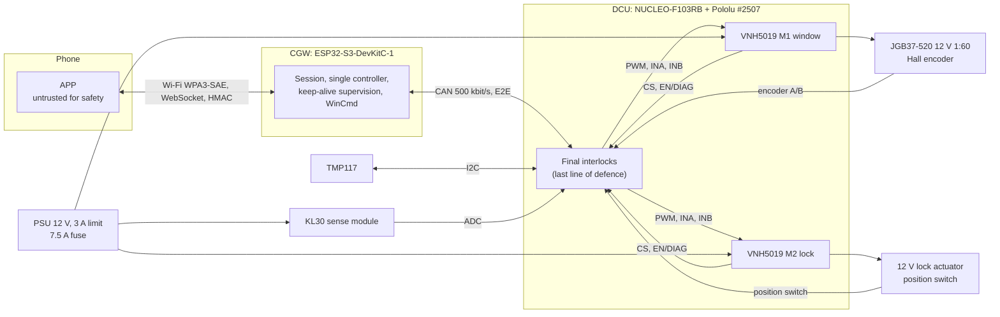

# LockSys Functional Safety Concept

| Field | Value |
|---|---|
| Document ID | LS-SAF-001 |
| Version | 0.2 |
| Status | Draft |
| Owner | jlurg |

## 1. Purpose and scope

This document defines the functional safety concept of LockSys: item definition, assumptions, hazard analysis and risk assessment (lite), safety goals, safe states, safety mechanisms and their allocation, the independence argument for model-generated state machines, the stage roadmap towards anti-pinch, and the traceability to verification.

- **Approach.** ISO 26262-inspired and not certified. Ratings are indicative; they set the priority of mechanisms and the depth of verification.
- **Configuration.** Stage A of the window function: a JGB37-520 12 V encoder gear motor turning freely (no mechanics, no limit switches, no position limits), operated UP/DOWN only while the APP control is held. Module-based electronics (Pololu Dual VNH5019 shield #2507 on the NUCLEO-F103RB).
- **HARA basis.** Hazards are rated for the intended vehicle function (remote hold-to-run window and door lock), so that goals and mechanisms carry forward to stages B–E. Where the stage A bench differs, the difference is stated.
- **Normative inputs.** LS-SAIC-001 v0.2 (system architecture and interface contract; §11 fixes the HAZ, SG and SM identifiers, §13 the DTC reactions and inhibits) and LS-SRS-001 v0.2 (system requirements). On conflict, LS-SRS-001 governs requirement wording; this document governs the allocation of safety mechanisms.
- **Companion documents.** [FMEA-lite](fmea_lite.md) (LS-SAF-002), [security concept](../06_security/security_concept.md) (LS-SEC-001), [verification strategy](../07_verification/verification_strategy.md) (LS-VER-001), [HIL architecture](../07_verification/hil_architecture.md) (LS-HIL-001), [HIL test catalogue](../07_verification/hil_test_catalog.md) (LS-HIL-002).

## 2. Item definition

### 2.1 Functions

| ID | Function | Nodes |
|---|---|---|
| F-01 | Window hold-to-run: the window actuator turns UP (close) or DOWN (open) only while the operator holds the matching APP control | APP, CGW, DCU |
| F-02 | Door lock/unlock; the lock state is derived from the actuator position switch only | APP, CGW, DCU |
| F-03 | Temperature acquisition (TMP117), ECU over-temperature interlock, UART telemetry | DCU |
| F-04 | Status reporting with freshness, DTCs, UDS-lite diagnostics | DCU, CGW, APP |

### 2.2 Boundary

### 2.3 Elements (stage A)

| Element | Part | Safety role |
|---|---|---|
| DCU MCU | STM32F103RB on NUCLEO-F103RB (MB1136 rev C-02 or later), powered from USB through the ST-LINK | Evaluates every motion permission; owns all final interlocks |
| Window driver | VNH5019 channel M1: PWM PC7 (TIM3_CH2, 20 kHz), INA PA10, INB PB5, EN/DIAG PB10 (fault input), CS PA0 | Final element of the window path |
| Lock driver | VNH5019 channel M2: PWM PB6 (TIM4_CH1), INA PA8, INB PA9, EN/DIAG PA6 (option A) or PB4 (option B), CS PA1 | Final element of the lock path |
| Window actuator | JGB37-520 12 V 1:60, 11 PPR Hall encoder on TIM2 (PA15/PB3, x4 = 2640 counts per output revolution); 170 rpm no load, 0.53 A rated, 3.2 A stall (vendor data) | Source of motion; the encoder provides the motion evidence |
| Lock actuator | 12 V 5-wire automotive actuator with built-in position switch on PB12 (pull-up, software debounce) | Lock state source |
| Temperature sensor | Adafruit TMP117 #4821 at 0x48 on I2C1 (PB8/PB9) | ECU temperature for the over-temperature interlock |
| KL30 sense | 0–25 V divider module (ratio 1/5) on PA4 | Supply window; required on the HIL bench |
| CAN transceivers | Waveshare SN65HVD230 boards at both bus ends (120 Ω fitted, Rs to GND through 10 kΩ) | No standby control in the MVP |
| CGW | ESP32-S3-DevKitC-1 N8R8 v1.1, ESP-IDF v5.5.5 | Keep-alive supervision, single controller, `CGW_WinCmd` generation |
| APP | Flutter, Android ≥ 10 / iOS ≥ 15 | Keep-alive and explicit STOP; not credited in the safety argument |
| Bench power | PSU 12.0 V with 3 A current limit, 7.5 A blade fuse, shield VIN; NUCLEO from USB only (shield jumper JP9 not fitted) | Limits fault energy on the bench |

### 2.4 Operating modes

- DCU `NodeMode`: INIT, NORMAL, DEGRADED, SAFE (SERVICE is LATER). SAFE is latched in `noinit` RAM and is cleared only by power-on reset or by UDS 10 03 followed by 11 01.
- CGW `NodeMode`: INIT, NORMAL, DEGRADED, SAFE.

### 2.5 Stage A specifics

- The window actuator has no load, no end stops and no limit switches. Position is not reported (`PosPct` = 255). SYS-006, SYS-007 and SYS-032 move to stages B and D.
- Stall and no-motion detection use encoder counts (`NO_MOTION`, `DIR_MISMATCH`). The VNH5019 current sense (≈ 140 mV/A, ±19 % gain tolerance at 3 A, offset of the order of the free-running current) cannot resolve 0.1–0.5 A, so it is used only as a gross over-current backstop.
- No NvM: DTCs are kept in RAM plus a `noinit` latch. No calibration block.
- No CAN transceiver standby (Rs) control.

## 3. Assumptions

| ID | Assumption | Consequence if violated |
|---|---|---|
| A-SAF-01 | Bench demonstrator operated by a trained developer; no other person within reach of moving parts | Exposure and controllability of the bench hazards change; bench rules (LS-HIL-001 §12) must be re-assessed |
| A-SAF-02 | HIL-REAL runs are attended; the PSU output switch is the emergency stop | Unattended energisation of real actuators |
| A-SAF-03 | PSU current limit 3 A (5 A only for an attended lock stall test); 7.5 A main fuse; 18 AWG power wiring | Higher fault energy (BH-02) |
| A-SAF-04 | Motor fixed in its bracket; only a light indicator disc on the shaft; nothing can wind onto the shaft; the shaft is not touched while powered | Entanglement hazard BH-01 |
| A-SAF-05 | NUCLEO powered from USB only; shield jumper JP9 (ARDVIN=VOUT) not fitted | 12 V on the NUCLEO VIN |
| A-SAF-06 | The APP and the CGW are untrusted for safety; the DCU re-checks every permission | Safety argument invalid |
| A-SAF-07 | FTTI for SG-01 and SG-02 is 500 ms (assumed); it is re-derived from the closing speed and pinch geometry when stage B or E exists | Timing budgets must be revisited |
| A-SAF-08 | VNH5019 internal protections (current limitation, thermal shutdown, under/over-voltage) are available and are reported on EN/DIAG. EN/DIAG cannot be used by the MCU to disable the bridge (a low drive reaches ≈ 0.91 V, above VIL max 0.9 V). | SM-07 and the safe-state definition change |
| A-SAF-09 | VNH5019 inputs have weak internal pull-downs (inferred from the input-current specification; the shield has 1 kΩ series resistors and no discrete pull-downs), so MCU pins floating during reset leave PWM low and the bridge in high impedance | SM-15 is weakened; detected by the SYS-036 test |
| A-SAF-10 | IAR Visual State and the IAR toolchain are not qualified tools; generated code is handled per §8 | Additional tool-confidence measures needed |
| A-SAF-11 | The encoder delivers 11 PPR quadrature at 3.3 V logic; counts per revolution are calibrated on the bench (TST-MAN-SYS-015) | `NO_MOTION` thresholds invalid |
| A-SAF-12 | The bench CAN bus carries only the CGW, the DCU and the HIL USB-CAN adapter | Bus-load and timing analysis invalid |

## 4. Hazard analysis and risk assessment (lite)

### 4.1 Method

- Severity, exposure and controllability use the ISO 26262-3 classes. The ratings follow LS-SAIC-001 §11 and are indicative.
- Worst credible situation: remote hold-to-run closing with a person or animal at the window while the operator may have no line of sight.
- Bench hazards that do not belong to the item are listed separately and are controlled by the bench safety rules.

### 4.2 Item hazards

| ID | Hazard | S | E | C | Rating | Rationale | Stage A note |
|---|---|---|---|---|---|---|---|
| HAZ-01 | Window closes on a body part during remote hold-to-run | S3 | E2 | C3 | B | The remote operator may not see the window; the victim cannot control it; remote closing is rare | No pinch point exists on the free-spinning bench; rating kept for carry-over to stages B–E |
| HAZ-02 | Unintended closing: motion without a valid current request, or motion opposite to the requested direction | S3 | E2 | C3 | B | As HAZ-01 | Opposite motion is detected as `DIR_MISMATCH` |
| HAZ-03 | Window does not stop on release, on obstruction or stall, or at an end position | S3 | E2 | C3 | B | As HAZ-01 | End positions exist from stage B |
| HAZ-04 | Motor or actuator overheats from continuous energisation | S2 | E2 | C3 | A | Vehicle parked and unattended | Bench: overheated actuator or wiring |
| HAZ-05 | Unintended lock or unlock | — | — | — | QM | No injury mechanism | Treated as cybersecurity goal CSG-01 |
| HAZ-06 | Wrong or stale status shown | — | — | — | QM | Freshness flags | — |

### 4.3 Bench hazards (outside the item)

| ID | Hazard | Controls |
|---|---|---|
| BH-01 | Contact with or entanglement on the rotating shaft or indicator disc | A-SAF-04; attended REAL runs; soak runs only in HIL-SIM |
| BH-02 | Electrical fault energy: short circuit, overheated wiring, reverse polarity | PSU current limit; 7.5 A fuse; shield reverse protection to −16 V; PSU output off while connecting or disconnecting |
| BH-03 | Damage to equipment: 12 V on the NUCLEO, back-powering, ground loops | A-SAF-05; isolated USB-CAN adapter; logic analyser only on 3.3 V nets |
| BH-04 | Finger pinch in the lock actuator mechanism | Actuator clamped; hands clear during actuation |

### 4.4 Regulatory note

FMVSS 118 S4(d) permits closing by continuous remote activation only if the remote cannot close the window from more than 6 m (S4(g): 11 m with an opaque-surface condition); otherwise S5 automatic reversal is required. Wi-Fi range exceeds 6 m, so remote closing is acceptable on the bench only. A vehicle implementation needs S5 automatic reversal or proximity limiting.

## 5. Safety goals

| ID | Rating | Safety goal | Safe state | FTTI |
|---|---|---|---|---|
| SG-01 | B | Window motion only while an authenticated operator continuously requests it, and only in the requested direction. Motor off ≤ 400 ms after the request stops or can no longer be confirmed. | SS-W | 500 ms (A-SAF-07) |
| SG-02 | B | Stop when motion is implausible or obstructed and at end positions. Stage A: no encoder motion while driving → stop ≤ 100 ms after the motion evidence ceases (once the start grace has elapsed); motion opposite to the command → stop ≤ 110 ms after the start grace; gross over-current → stop ≤ 100 ms. Stage B: virtual end positions ≤ 10 ms. Stage D: physical limit switches ≤ 5 ms. | SS-W | 500 ms (A-SAF-07) |
| SG-03 | A | No energisation beyond thermal limits: continuous window drive ≤ 8 s per press; lock pulse ≤ 500 ms, ≤ 2 attempts per request, ≤ 10 actuations per 60 s; no window start above 85 °C ECU temperature. | SS-W, SS-L | Thermal (seconds) |
| SG-04 | QM | Status shown to the operator is either fresh or flagged stale. | — | — |

## 6. Safe states

| ID | Definition | Exit |
|---|---|---|
| SS-W | Window bridge brakes to ground for 100 ms (INA = INB = 0, PWM = 100 %), then switches off (PWM = 0, coast) | New press with all permissions valid, after the dead time |
| SS-L | Lock bridge off (PWM = 0, INA = INB = 0); position held mechanically | New lock request |
| SS-DCU | `NodeMode` SAFE: both bridges off; all requests rejected (REJECTED_MODE); CAN status, UART telemetry and diagnostics continue (CAN silent after a clock failure); latched in `noinit` RAM | Power-on reset, or UDS 10 03 followed by 11 01 |
| SS-CGW | `CGW_WinCmd` = STOP; all commands rejected | CGW reset |

Rules for the VNH5019 shield:

- Stop is PWM = 0 (coast) or brake (INA = INB = 0 with PWM = 100 %). EN/DIAG is a fault input only and is never driven by the MCU.
- A latched driver fault is cleared by toggling INA/INB, only from the idle state.
- During MCU reset the bridge inputs float; PWM low (A-SAF-09) puts all four switches off (high impedance, coast).

## 7. Safety mechanisms

### 7.1 Window stop chain

```mermaid
flowchart LR
  A1["APP<br/>WindowMove every 100 ms,<br/>WindowStop (SM-01)"]
  C1["CGW keep-alive supervision<br/>350 ms, RTT gate, STOP latch (SM-02)"]
  C2["CGW can_io<br/>Req and HoldAge every 20 ms (SM-03, SM-16)"]
  D1["DCU Com + E2E<br/>RX timeout 100 ms (SM-03, SM-04)"]
  D2["CmdArb<br/>HoldAge, PressId rules (SM-03, SM-05)"]
  D3["WinCtrl statechart<br/>generated, sequencing only"]
  D4["Output permission gate (SM-19)"]
  D5["HBridge + reflex latch"]
  D6["Reflexes: EN/DIAG, over-current,<br/>NO_MOTION, DIR_MISMATCH, hang monitor,<br/>IWDG (SM-07, SM-11, SM-18)"]
  M["VNH5019 M1 + motor + encoder"]
  A1 --> C1 --> C2 --> D1 --> D2 --> D3 --> D4 --> D5 --> M
  D2 --> D4
  M -->|"encoder, CS, EN/DIAG"| D6
  D6 --> D5
```

### 7.2 Mechanism catalogue

Parameter values are defaults; the authoritative values live in `interfaces/params/timing.yaml`, generated from the parameter registry of LS-SAIC-001 §5.0. The identifiers SM-01…SM-19, their goals and their stages are those of LS-SAIC-001 §11.3; this catalogue details each mechanism for the stage A hardware. SM-06, SM-07, SM-15 and SM-17 carry the v0.2 definitions; SM-18 and SM-19 are new in v0.2.

| ID | Mechanism | Alloc | Goals | Requirements | Stage | Verification |
|---|---|---|---|---|---|---|
| SM-01 | APP keep-alive: `WindowMove` every 100 ms while held; explicit `WindowStop` on release, pointer cancel, lifecycle change and connectivity loss. Performance measure only; not credited. | APP | SG-01 | SYS-020, SYS-096 | A | TST-HIL-SYS-002; APP integration tests |
| SM-02 | CGW keep-alive supervision: timeout 350 ms measured from frame receipt; STOP latched per press; RTT gate (last RTT ≤ 200 ms sampled within 2 s, Pong within 500 ms); session timeout 3 s; controller station disconnect → STOP; first `WindowMove` of a press only with `hold_ms` ≤ 300 ms | CGW | SG-01 | SYS-020, SYS-021, SYS-035 | A | TST-HIL-SYS-002, -003, -009 |
| SM-03 | Cyclic `CGW_WinCmd` every 20 ms plus on change; DCU RX timeout 100 ms; HoldAge ≤ 400 ms | CGW, DCU | SG-01 | SYS-021, SYS-022 | A | TST-HIL-SYS-003, -004 |
| SM-04 | E2E on every application frame: CRC-8/SAE-J1850 over DataID and payload, 4-bit alive counter, MaxDelta 2 for `WinCmd`; VALID after 2 consecutive good frames; INVALID and STOP after 3 consecutive errors. Stale-frame defence: the CGW rewrites its pending `WinCmd` transmit slots to STOP on bus-off; the DCU requires a re-arm (valid STOP) after a timeout, bus-off or reset | CGW, DCU | SG-01, SG-02 | SYS-037 | A | TST-HIL-SYS-010; unit tests with the shared vectors |
| SM-05 | PressId latch: motion only with a PressId ≠ 0, ≠ the PressId seen at startup (the first PressId after reset is latched) and ≠ the last latched PressId; every stop and every rejected start latches the active PressId; after a reset or bus-off a valid STOP frame is required before a new press is accepted | CGW, DCU | SG-01 | SYS-035 | A | TST-HIL-SYS-009, -022 |
| SM-06 | End-position stop and plausibility. Stage B: virtual limits from the 32-bit encoder position, stop ≤ 10 ms. Stage D: NC limit switches, EXTI stop ≤ 5 ms, both active → inhibit ≤ 50 ms, a limit must be left within 1 s. | DCU, HW | SG-02 | SYS-006, SYS-032 | B, D | Backlog (LS-HIL-002 §5) |
| SM-07 | Over-current backstop on the filtered window CS (`i_oc_backstop_ma`, default 2.5 A, range 2.0–2.5 A; `t_oc_backstop_ms` 50 ms qualification after the blanking `t_cs_blank_ms` of 100 ms from drive-on) → brake, OVERCURRENT, B1A16; VNH5019 internal protections (current limitation, thermal shutdown) reported on EN/DIAG: reflex stop ≤ 1 ms, B1A10 or B1A21, `n_driver_fault_safe` (3) driver faults within 60 s → SAFE; the same EN/DIAG reflex on the lock channel. Stage A redefinition: a gross over-current backstop, not a stall detector (stall detection is SM-18) | DCU, HW | SG-02, SG-03 | SYS-031 | A | TST-HIL-SYS-008 |
| SM-08 | Maximum continuous run `t_win_max_run_ms` (8.0 s, calibratable) per press → brake, MAX_RUNTIME, B1A13, press latched; stop sequence 100 ms brake, then bridge off ≥ 150 ms before any new drive (reversal or restart); soft-start ramp `t_softstart_ms` (200 ms) at every start | DCU | SG-02, SG-03 | SYS-030, SYS-033 | A | TST-HIL-SYS-006 |
| SM-09 | Lock pulse 300 ms nominal with a 500 ms hard cap enforced by `LockAct` independently of `DoorCtrl`; ≤ 2 attempts per request; ≤ 10 actuations per 60 s | DCU | SG-03 | SYS-034 | A | TST-HIL-SYS-015 |
| SM-10 | Supply window (KL30 sense module fitted): starts only at 9.0–16.0 V; stop if < 8.0 V for 100 ms or > 16.5 V for 20 ms, an ADC reading at full scale counting as over-voltage; KL30 measured within ± 0.2 V after a 2-point calibration, VREFINT used only for VDDA plausibility; PVD; ECU over-temperature interlock: starts inhibited and motion stopped above 85 °C, released below 80 °C | DCU, HW | SG-01, SG-03 | SYS-039, SYS-040, SYS-043 | A | TST-HIL-SYS-013, -014 |
| SM-11 | IWDG (50 ms nominal, 33–67 ms over LSI tolerance) refreshed only when alive supervision of every task passes; SysTick hang monitor (task running > 20 ms → all outputs off); fault handlers → safe outputs and reset; ≥ 3 watchdog or fault resets within 10 min → SAFE | DCU | All | SYS-023 | A | TST-HIL-SYS-005 |
| SM-12 | ROM CRC-32 at startup (STM32 CRC unit; checksum inserted by `ielftool`) → SAFE. Background check at M6; RAM test LATER. | DCU | All | SYS-038 | A (M1) | TST-HIL-SYS-012 |
| SM-13 | Stack painting and canary check every 100 ms; stack placed at the bottom of SRAM so that an overflow faults (the F103 has no MPU) | DCU | All | SYS-023, SYS-070 | A | TST-HIL-SYS-005 |
| SM-14 | Clock security system on HSE → NMI → SAFE on the internal-oscillator clock profile with CAN silent; HSE not ready at start-up → same reaction; DTC B1A53. Implemented at milestone M6 | DCU | All | SYS-038 | A | TST-MAN-SYS-014 |
| SM-15 | De-energised by default: VNH5019 PWM low at reset (coast, A-SAF-09); safe GPIO initialisation first (PWM low, INA = INB = 0, EN/DIAG input) before any timer output is enabled; controller-silent CAN start (no transmission before the node is initialised); no actuator output during INIT | DCU, HW | All | SYS-036 | A | TST-HIL-SYS-011 |
| SM-16 | CGW task watchdog 2 s, interrupt watchdog 300 ms, brownout detector; `can_io` computes Req and HoldAge at every transmission independently of the `core` task | CGW | SG-01 | SYS-021 | A | TST-HIL-SYS-003 |
| SM-17 | Hardware PWM kill independent of software. TIM3 and TIM4 have no break input, so it needs a timer with a break input (window PWM moved to TIM1) or an external enable gate on the bridge inputs (LS-SAIC-001 O19). | DCU, HW | SG-02 | — | LATER | — |
| SM-18 | Encoder motion plausibility. `NO_MOTION`: with \|duty\| ≥ 25 % and after `t_start_grace_ms` (200–300 ms), fewer than `no_motion_min_pct` (10–15 %) of the expected counts within `no_motion_window_ms` (100 ms, sliding, evaluated every 10 ms). `DIR_MISMATCH`: at least `dir_mismatch_min_counts` (20) counts opposite to the commanded direction within `t_dir_mismatch_ms` (100 ms) after the start grace. Reactions through the reflex latch: `NO_MOTION` → brake, StopReason STALL, WindowState BLOCKED, B1A11, press latched (healed by the next press that passes the supervision); `DIR_MISMATCH` → brake, StopReason DIR_MISMATCH, WindowState FAULT, B1A15, window inhibited until UDS 0x14 or power-on reset. Encoder polarity is configuration data. | DCU | SG-01, SG-02 | SYS-042 | A | TST-HIL-SYS-007 |
| SM-19 | Model-independent safety layer: the reflexes, backstops and caps act below the Visual State models, and a hand-written output permission gate sits between the statechart and HBridge. A drive is applied only if: CmdArb reports a valid request for the same direction and PressId; the PressId is not latched (the gate latches the PressId whenever an applied drive ends); no reflex latch is set for that direction; the mode permits motion; continuous drive time is below the max-run backstop (T_WIN_MAX_RUN + one task period). Brake and off are never refused. A statechart engine error (contradiction, range error, signal queue full) bypasses the engine, brakes or switches off the affected bridge, sets B1A55 and enters SAFE. | DCU | SG-01, SG-02, SG-03 | SYS-005, SYS-030, SYS-035 | A | Unit tests; TST-HIL-SYS-001, -006, -009 |

### 7.3 Allocation summary

| Node | Mechanisms |
|---|---|
| APP | SM-01 |
| CGW | SM-02, SM-03 (transmit side), SM-04, SM-05, SM-16 |
| DCU | SM-03 (receive side), SM-04, SM-05, SM-07…SM-15, SM-18, SM-19 |
| Hardware | SM-07 (VNH5019 internal protection), SM-10 (KL30 sense module), SM-15 (VNH5019 input pull-downs); bench energy limits per §3 |

### 7.4 Stop budget (stage A)

| Stop cause | Detection | Worst-case motor-off time | Requirement |
|---|---|---|---|
| Release, nominal link (RTT ≤ 200 ms) | `WindowStop` → immediate `WinCmd` STOP: APP 20 + Wi-Fi 100 + CGW 10 + CAN 1 + DCU 10 + bridge 1 ms | 142 ms | SYS-020 ≤ 150 ms |
| Lost STOP, Wi-Fi loss, APP crash or backgrounding | CGW keep-alive timeout | 372 ms after the last keep-alive received by the CGW | SYS-021 ≤ 400 ms |
| CGW `core` task hung, CAN transmit path alive | `can_io` HoldAge ageing → STOP; DCU HoldAge check as backstop | ≤ 372 ms | SYS-021 |
| CGW reset or power loss; CAN open or short | DCU RX timeout | 130 ms after the last valid `WinCmd` | SYS-022 |
| Corrupted, replayed or out-of-sequence frames | 3 consecutive E2E errors | ≤ 70 ms | SYS-037 |
| DCU task hang | Hang monitor → outputs off; IWDG reset as backstop | ≈ 21 ms; ≤ 67 ms + 10 ms through IWDG | SYS-023 ≤ 100 ms |
| Stall or dead encoder (after the start grace) | SM-18 sliding window | ≤ 100 ms after motion evidence ceases | SYS-042 |
| Wrong direction | SM-18 | ≤ `t_start_grace_ms` + 110 ms after drive-on | SYS-042 |
| Gross over-current | SM-07, 50 ms qualification | ≤ 60 ms after the threshold crossing | SYS-031 ≤ 100 ms |
| Driver fault (EN/DIAG low) | EXTI reflex | ≤ 1 ms | SM-07 |
| Under-voltage / over-voltage | 100 ms / 20 ms filters | ≤ 110 ms / ≤ 30 ms | SYS-039 |
| Maximum run time | Run timer | 8.00 ± 0.05 s after drive-on | SYS-030 |

### 7.5 Safety-related system requirements

[SAF] requirements in stage A (LS-SRS-001 v0.2): SYS-005, SYS-020, SYS-021, SYS-022, SYS-023, SYS-030, SYS-031, SYS-033, SYS-034, SYS-035, SYS-036, SYS-037, SYS-038, SYS-039, SYS-040, SYS-042, SYS-043, SYS-096. Deferred [SAF] requirements: SYS-006 and SYS-032 (stages B and D), SYS-041 (stage E).

Stage A notes on the requirements (normative wording in LS-SRS-001):

- **SYS-030.** The free-spinning actuator never reaches a limit, so the 8.0 s stop is observed directly. In stage A B1A13 inhibits nothing: the press is latched and the next press in either direction is accepted (LS-SAIC-001 §13.2); stages B and D inhibit the direction until an end position is reached.
- **SYS-031.** Stage A wording (v0.2): the window stops ≤ 100 ms after the filtered current exceeds `i_oc_backstop_ma` for `t_oc_backstop_ms` outside the start blanking, with StopReason OVERCURRENT and B1A16. The former current-based stall threshold (4.0 A for 50 ms) is not reachable with the stage A motor (3.2 A stall) behind a 3 A PSU limit, so stall detection is allocated to SYS-042 and SM-18.
- **SYS-039.** Requires the KL30 sense module, which is therefore part of the HIL bench (HWR-008). With the 1/5 module, 16.5 V corresponds to ADC full scale; an ADC reading at full scale counts as over-voltage (LS-SAIC-001 `vbat_ov_dv`, B1A40-17), so the over-voltage stop does not depend on the VDDA tolerance.
- **SYS-043.** KL30 measurement accuracy ± 0.2 V over 8.0–16.0 V after a 2-point calibration (`lim_kl30_accuracy_mv`); VREFINT is used only for VDDA plausibility. It underpins the thresholds of SYS-039 and is verified by TST-MAN-SYS-010. The accuracy requirement was proposed as SYS-042 in the HIL design and renumbered because SYS-042 is motion plausibility.
- **SYS-042.** New for stage A: motion plausibility (`NO_MOTION`, `DIR_MISMATCH`) per SM-18; stop ≤ `lim_no_motion_stop_ms` (110 ms).

### 7.6 Temperature sensor fault policy (B1A30)

Decision: B1A30-96 (temperature sensor communication or identity fault) sets `TempStatus` SENSOR_FAULT and the node mode DEGRADED but inhibits no actuator, as defined in LS-SAIC-001 §13.2. This document confirms the contract policy.

- The TMP117 measures the ECU board temperature, not the motor winding or the bridge junction. The over-temperature interlock of SM-10 protects the electronics against operation in a hot environment; it is not the primary thermal protection of the actuators.
- SG-03 for the window is met without the sensor by SM-08 (maximum run 8 s per press, then the press is latched), SM-07 (over-current backstop and the VNH5019 thermal shutdown reported on EN/DIAG) and SM-18 (a stalled motor is stopped ≤ 110 ms); on the bench, the PSU current limit bounds the energy (A-SAF-03). SG-03 for the lock is met by SM-09.
- Inhibiting the window on a sensor fault would turn a single sensor or I2C fault into a loss of function without a safety gain for the stage A actuator.
- The fault is visible: DTC B1A30, `TempStatus` in the CAN status and the telemetry, mode DEGRADED. The residual risk is RR-08.

The recommendation of LS-SAF-002 to inhibit window starts while `TempStatus` is not VALID is not adopted for stage A. It is re-assessed when a load is coupled to the window (stage B or later), together with A-SAF-07.

## 8. Independence argument for model-generated state machines

### 8.1 Context

WinCtrl, DoorCtrl and ModeMgr are modelled in IAR Visual State and generated with the Classic Coder, Adaptive API and readable C (direct calls, no function pointers, no heap; options in committed `.opt` files). The generator is not qualified (A-SAF-10). The models sequence behaviour; they do not protect.

### 8.2 Claim

A defect in a model or in the generated code cannot violate SG-01, SG-02 or SG-03. Its worst effects are loss of function (no start) or a stop delayed by at most one 10 ms task period.

### 8.3 Argument

| Ref | Argument |
|---|---|
| ARG-1 Separation | The safety layer is hand-written, sits below the models and never consults them: EN/DIAG reflex ISRs and the HBridge reflex latch; the 1 ms over-current backstop; encoder supervision (SM-18) acting through the reflex latch; the `LockAct` 500 ms hard cap; the SysTick hang monitor; `SafeMon` (safe outputs, SAFE latch, stack canary, ROM CRC); IWDG through `WdgM`; E2E, RX timeout and HoldAge validation in `Com` and `CmdArb`; the output permission gate (SM-19). |
| ARG-2 Authority | The models only write an output buffer through their actions. The adapter applies the buffer once per cycle through `HBridge_Set`, behind the permission gate. A drive that is not currently permitted is refused; brake and off are never refused. |
| ARG-3 Bounded delay | The engine runs once per event inside the 10 ms task, never in an ISR. A model that fails to stop delays the stop by at most one task period, inside the 130 ms and 400 ms budgets; the reflexes act within 1 ms regardless of the model. |
| ARG-4 Fault containment | Engine error codes lead to brake or off, a DTC and SAFE. The coder's contradiction tests are kept. Re-entry into a deduct call is detected. The PressId latch and the max-run backstop exist in the gate independently of the model. |
| ARG-5 Freedom from interference | Static data per system (`-useheap0`), no recursion, exact linker stack analysis, cooperative scheduling with measured per-runnable WCET; generated code is included only by its owning SWC. |

### 8.4 Evidence

| Level | Evidence |
|---|---|
| Model | Verificator full mode per system: 0 critical findings; project policy: no dead ends except the SAFE terminal; Validator sequences covering every transition (states, transitions, events and actions at 100 %) |
| Generated code | Regenerated on the Lab Host runner and compared with `git diff --exit-code`; `vs_manifest.py --check` in cloud CI; never hand-edited; C-STAT on `gen_vs/release` with zero unjustified Mandatory/Required findings (path-scoped deviation permits only) |
| Unit | Real engine plus real actions in Ceedling: 100 % transition coverage from the trace bitmap; guards 100 % statement and branch; MC/DC reported |
| Safety layer | Unit tests of HBridge, SafeMon, WdgM and the gate; HIL fault-injection tests TST-HIL-SYS-005, -007, -008, -009 |
| Target | DID FD09 transition bitmap read after the HIL regression; every safety-relevant transition is hit on target |

### 8.5 Conditions of validity

- Classic Coder with readable output; `-useheap0`; generation only through the committed option files and scripts.
- If a Mandatory MISRA rule cannot be met by options or model changes, the affected SWC falls back to "model as specification": the C code is written by hand from the model and the Validator sequences become unit tests.
- The safety layer and the gate remain outside the model in every stage.

## 9. Stage roadmap towards anti-pinch

| Stage | Content | Change to this concept |
|---|---|---|
| A | Free-spinning actuator, hold-to-run | This document |
| B | Virtual limits from encoder counts; position 0–100 %; stop at 0 % and 100 % | SM-06 (virtual) active; SYS-006 and SYS-007 re-enabled; position validity and homing rules; position loss → limits invalid → motion restricted |
| C | PI speed control with the encoder | Controller output bounds; speed-tracking plausibility added to SM-18 |
| D | Physical limit switches (NC) | SM-06 (physical): EXTI stop ≤ 5 ms, plausibility, SYS-032 |
| E | Anti-pinch from speed drop (encoder) and current signature | SYS-041: obstacle while closing → stop and reverse (FMVSS 118 S5 analogue: reverse before 100 N, to the open position or ≥ 125 mm more open); spring-gauge test; not certified |

Anti-pinch detection concept (stage E):

- A current profile learned per position bin (20 bins); obstacle when I > profile + max(30 %, 0.8 A) for 30 ms in the closing direction, excluding the seal zone.
- Encoder speed drop as the second, independent detection path.
- Stages B and D are prerequisites, because detection and reversal need a position reference.

## 10. Residual risks (stage A)

| ID | Residual risk | Rationale for acceptance on the bench | Production-intent mitigation |
|---|---|---|---|
| RR-01 | Single shut-off path: the bridge is switched off only through the MCU outputs; EN/DIAG cannot disable it; no independently controlled actuator supply switch | Attended REAL runs; PSU output switch as emergency stop; PSU current limit | Independent high-side switch or relay on the actuator supply, controlled by a monitoring element |
| RR-02 | The de-energised state during reset relies on weak VNH5019 input pull-downs (A-SAF-09); the shield has no discrete pull-downs | Verified by TST-HIL-SYS-011; INIT drives the outputs low within the first 0.1 ms after reset | Discrete pull-downs on PWM and INx |
| RR-03 | `NO_MOTION` cannot distinguish a mechanical stall from a dead encoder | Both lead to the same safe reaction; availability loss only | — |
| RR-04 | Spurious encoder edges (noise) could mask a stall | Input filter (ICxF); backstops: over-current, maximum run, PSU limit, VNH5019 thermal shutdown | Implausible-speed check (counts above the physical maximum) |
| RR-05 | CS gain and offset error makes the over-current backstop coarse | Stall detection does not depend on CS in stage A | Calibrated current sensing |
| RR-06 | The CAN transceiver is not silenced during DCU reset (Rs tied low on the module) | Affects bus availability only; no actuation is possible during reset | Rs control or a transceiver with TXD dominant time-out and silent mode |
| RR-07 | A phone touchscreen fault that reports a permanent touch keeps the keep-alive alive | APP not credited; maximum run 8 s; operator presence | Proximity or second-factor hold confirmation |
| RR-08 | With the temperature sensor faulty (B1A30), the ECU over-temperature interlock is unavailable while window and lock remain enabled (§7.6) | The interlock protects the electronics, not the actuators; maximum run, over-current backstop, VNH5019 thermal shutdown and PSU limit remain; fault reported as DEGRADED | Redundant temperature measurement, or window inhibition after a sensor fault once a load is coupled |

## 11. Traceability

| Hazard | Goal | Mechanisms | Requirements | HIL tests (LS-HIL-002) |
|---|---|---|---|---|
| HAZ-01, HAZ-02 | SG-01 | SM-01…SM-05, SM-16, SM-19 | SYS-005, SYS-020, SYS-021, SYS-022, SYS-035, SYS-037 | TST-HIL-SYS-001…004, -009, -010 |
| HAZ-02 | SG-01 | SM-18 | SYS-042 | TST-HIL-SYS-007 |
| HAZ-03 | SG-02 | SM-07, SM-08, SM-18; SM-06 (stages B/D) | SYS-031, SYS-033, SYS-042; SYS-006, SYS-032 (later) | TST-HIL-SYS-006…008 |
| HAZ-04 | SG-03 | SM-07, SM-08, SM-09, SM-10 | SYS-030, SYS-034, SYS-040 | TST-HIL-SYS-006, -014, -015 |
| HAZ-01…HAZ-04 | All | SM-10…SM-15 | SYS-023, SYS-036, SYS-038, SYS-039, SYS-043 | TST-HIL-SYS-005, -011, -012, -013; TST-MAN-SYS-010 |
| HAZ-06 | SG-04 | Freshness flags and stale marking | SYS-025, SYS-095 | Backlog; APP integration tests |

## 12. Rationale

- **Encoder as primary stall detection.** At free-running currents of 0.1–0.5 A the VNH5019 CS signal is 14–70 mV, inside its offset; the encoder gives direct motion evidence at 10 ms resolution.
- **DCU as last line of defence.** The APP runs on a general-purpose phone and the CGW on a Wi-Fi-exposed node; both are treated as untrusted, so every permission is re-checked at the DCU and every hop has its own timeout.
- **Brake, then off.** Braking stops the rotor quickly; switching off afterwards limits current and heating; the dead time prevents reversal into back-EMF.
- **Permission gate below the models.** It makes the unqualified generator acceptable without a tool-qualification effort and keeps the safety argument valid if the models change.

## 13. References

| Reference | Title |
|---|---|
| LS-SAIC-001 | LockSys system architecture and interface contract (`docs/02_system/LS-SAIC.md`) |
| LS-SRS-001 | LockSys system requirements (`docs/02_system/system_requirements.md`) |
| LS-DCU-SAD-001 | DCU software architecture (`docs/04_software/dcu/architecture.md`) |
| LS-SAF-002 | [FMEA-lite](fmea_lite.md) |
| LS-SEC-001 | [Security concept](../06_security/security_concept.md) |
| LS-VER-001 | [Verification strategy](../07_verification/verification_strategy.md) |
| LS-HIL-001 | [HIL architecture](../07_verification/hil_architecture.md) |
| LS-HIL-002 | [HIL test catalogue](../07_verification/hil_test_catalog.md) |
| ISO 26262:2018 | Road vehicles — Functional safety (parts 3, 4, 6, 8 and 9; informative use) |
| 49 CFR 571.118 | FMVSS 118, power-operated window, partition and roof panel systems |
| ST DocID15701 | VNH5019A-E datasheet (Rev 11) |
| Pololu 0J49 | Dual VNH5019 Motor Driver Shield user guide |
| ST ES096 | STM32F10xx8/B errata sheet (Rev 15) |
| IAR UVS | IAR Visual State User Guide |
