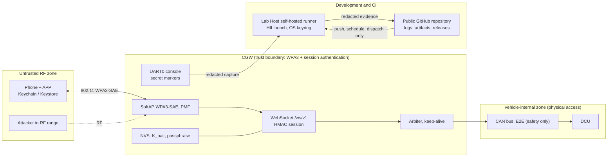
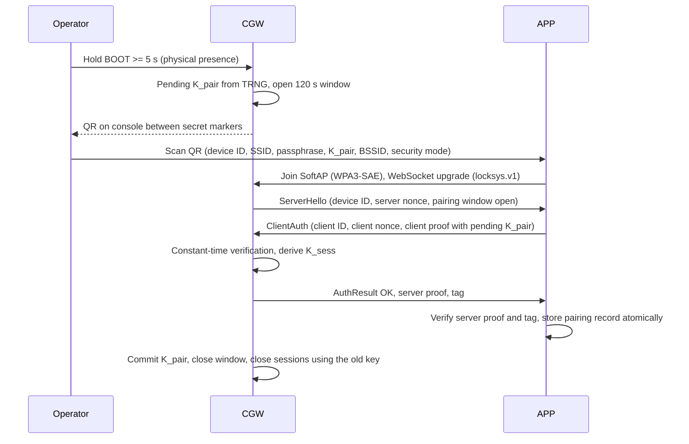

# LockSys Cybersecurity Concept

| Field | Value |
|---|---|
| Document ID | LS-SEC-001 |
| Version | 0.1 |
| Status | Draft |
| Owner | jlurg |

## 1. Purpose and scope

This document defines the cybersecurity concept of LockSys: assets, attack surfaces, threats, cybersecurity goals, controls and requirements, key management, pairing, the logging and redaction rule, the threats that come from developing in a public repository with a self-hosted runner, and the release hardening that is deliberately deferred.

- **Approach.** ISO/SAE 21434-inspired and not certified. The risk analysis is in the [TARA-lite](tara_lite.md) (LS-SEC-002); this document holds the resulting goals and requirements.
- **Scope.** The MVP of the bench demonstrator (APP, CGW, DCU, CAN bus), the development and CI infrastructure (GitHub repository, Lab Host, self-hosted runner, HIL bench) and the release process.
- **Relation to safety.** Unauthorised motion is also a safety concern; the DCU safety mechanisms of [LS-SAF-001](../05_safety/safety_concept.md) remain effective regardless of the authentication state. E2E protection on CAN is a safety mechanism, not a security control.
- **Normative inputs.** LS-SAIC-001 §8 (APP↔CGW protocol) and §12, LS-SRS-001 (SYS-050…SYS-057).

## 2. Context and trust boundaries

## 3. Assets

| ID | Asset | Property | Notes |
|---|---|---|---|
| AS-01 | Lock function | Integrity | Only the paired operator locks or unlocks |
| AS-02 | Window function | Integrity, availability | Unauthorised motion is a safety concern (HAZ-02) |
| AS-03 | K_pair (32 B pairing key) | Confidentiality, integrity | CGW NVS and APP secure storage |
| AS-04 | K_sess (session key) | Confidentiality | Volatile, per session |
| AS-05 | Wi-Fi passphrase | Confidentiality | CGW NVS and APP secure storage |
| AS-06 | Firmware and configuration (DCU, CGW, APP) | Integrity | Includes calibration constants and generated code |
| AS-07 | Status data | Confidentiality | The lock state reveals presence |
| AS-08 | CI and HIL infrastructure | Integrity, availability | Lab Host, self-hosted runner, bench instruments, future signing keys |
| AS-09 | Repository and release integrity | Integrity | Source history, tags, release artifacts and verification evidence |

## 4. Attack surfaces

| Surface | Exposure | Assets | Notes |
|---|---|---|---|
| SoftAP (802.11) | Adjacent (RF range) | AS-01, AS-02, AS-05, AS-07 | WPA3-SAE with PMF required |
| WebSocket API `/ws/v1` | Adjacent, after association | AS-01…AS-04, AS-07 | Binary protobuf frames ≤ 256 B |
| CGW IP stack (DHCP, TCP) | Adjacent, after association | AS-02, AS-06 | No router or DNS offer, IPv6 off |
| CGW BOOT button | Physical | AS-03, AS-05 | Pairing (≥ 5 s), factory reset (≥ 10 s) |
| CGW UART0 console, USB-Serial-JTAG | Physical / local | AS-03, AS-05, AS-06 | Prints the pairing QR between secret markers |
| CAN bus | Physical (door access) | AS-01, AS-02 | No authentication in the MVP |
| DCU USART2 (ST-LINK VCP) | Local | AS-06 | Transmit-only in release; fault injection receive path in DEV/HIL builds only |
| SWD (DCU), USB-JTAG (CGW) | Physical | AS-03, AS-05, AS-06 | Hardening deferred (§13) |
| APP binary and storage | Local (phone) | AS-03, AS-05, AS-07 | Rooted or jailbroken phones are out of scope |
| Software supply chain | Network | AS-06, AS-09 | pub.dev, ESP component registry, PyPI, GitHub Actions, container images, vendored sources |
| Public repository and CI | Network | AS-08, AS-09, AS-03, AS-05 | Pull requests, workflows, logs, artifacts, releases |
| Lab Host remote access | LAN / private overlay network | AS-08 | SSH, RDP, runner services, instrument LAN |

## 5. Threat summary

TS-01…TS-10 are the threat scenarios of LS-SAIC-001 v0.2 §12 with unchanged identifiers; TS-11…TS-18 extend them for the public repository, the CI and the Lab Host. Analysis, feasibility and risk values are in LS-SEC-002. Risk values: 1 (lowest) to 5.

| ID | Threat | STRIDE | Initial risk | Controls | Residual risk |
|---|---|---|---|---|---|
| TS-01 | Spoofed APP commands | S | 4 | CSR-001, CSR-004…CSR-006, CSR-008 | 2 |
| TS-02 | Replay of captured frames | T | 3 | CSR-005, CSR-006 | 2 |
| TS-03 | Guessing the passphrase or the key | S | 3 | CSR-001, CSR-002, CSR-007, CSR-010 | 1 |
| TS-04 | Wi-Fi denial of service (deauthentication, jamming, flooding) | D | 2 | CSR-001, CSR-008; safe stop per SG-01 | 2 (accepted: availability only) |
| TS-05 | Rogue access point / evil twin | S | 3 | CSR-001, CSR-004 (server proof, device ID pinning) | 1 |
| TS-06 | Sniffing of application traffic | I | 2 | CSR-001 (link encryption) | 2 (accepted; AEAD LATER) |
| TS-07 | CAN injection with physical access | S, T | 2 | None in the MVP | 2 (accepted; authenticated CAN LATER) |
| TS-08 | Firmware extraction or tampering through debug ports | T, I | 2 | CSR-016 (release); §13 deferred hardening | 2 (accepted in the MVP) |
| TS-09 | Key extraction from the phone | I | 2 | CSR-014 | 1 |
| TS-10 | Supply-chain compromise | T | 5 | CSR-018, CSR-019 | 3 (retained, monitored) |
| TS-11 | Secret disclosure through console output, logs, test evidence or public artifacts | I | 4 | CSR-012, CSR-013 | 1 |
| TS-12 | Fork pull request executes code on the self-hosted runner | E, T | 4 | CSR-017, CSR-019 | 1 |
| TS-13 | Workflow injection through untrusted event data | T, E | 3 | CSR-018 | 1 |
| TS-14 | Debug or fault-injection features present in release images | E | 3 | CSR-015 | 2 |
| TS-15 | Hijack of an open pairing window | S | 1 | CSR-010 | 1 |
| TS-16 | Malformed input exploiting protocol decoder defects | T, E | 3 | CSR-003, CSR-006, CSR-008, CSR-009 | 2 |
| TS-17 | Compromise of the maintainer account or commit-signing key | S, E | 3 | CSR-019 | 2 |
| TS-18 | Remote access to the Lab Host from outside the lab network | E | 4 | CSR-020 | 2 |

## 6. Cybersecurity goals

| ID | Goal | Threats |
|---|---|---|
| CSG-01 | Only the paired, authenticated controller can lock, unlock or move the window | TS-01, TS-03, TS-05, TS-15 |
| CSG-02 | Commands cannot be replayed or tampered with between the APP and the CGW | TS-02, TS-16 |
| CSG-03 | K_pair and the Wi-Fi passphrase stay confidential | TS-03, TS-09, TS-11 |
| CSG-04 | Loss of availability ends in a safe state | TS-04 |
| CSG-05 | Firmware integrity is preserved (release hardening) | TS-08, TS-10, TS-14 |
| CSG-06 | Secrets never appear in console captures, logs, test evidence or public artifacts | TS-11 |
| CSG-07 | The CI and HIL infrastructure executes only trusted code from the repository owner | TS-10, TS-12, TS-13, TS-17, TS-18 |

## 7. Cybersecurity requirements

Requirements carry the [SEC] tag. Verification: R = review or inspection, UT = unit test, IT = integration test, HIL = hardware-in-the-loop test (LS-HIL-002), M = manual procedure (LS-VER-002), CI = automated repository check.

| ID | Requirement | Alloc | Goals | Parent | Verification |
|---|---|---|---|---|---|
| CSR-001 | The SoftAP offers WPA3-SAE only (`WIFI_AUTH_WPA3_PSK`, CCMP), PMF required, `sae_pwe_h2e` = BOTH. Open, WEP, WPA1 and TKIP are never offered. WPA2/WPA3 transition mode exists only as a DEV build option. | CGW | CSG-01, CSG-03 | SYS-053 | M (TST-MAN-SYS-013), R |
| CSR-002 | The Wi-Fi passphrase is 20 base32 characters (≈ 100 bit) from the hardware RNG, generated at first boot and at factory reset. The Wi-Fi driver stores its configuration in RAM only. | CGW | CSG-03 | SYS-053, SYS-054 | UT, R |
| CSR-003 | The DHCP server offers no router and no DNS option; IPv6 is disabled; the HTTP server registers only `/ws/v1`; a plain HTTP request to it is answered with 400 and closed. | CGW | CSG-02 | SYS-055 | IT, HIL (TST-HIL-SYS-019) |
| CSR-004 | Mutual challenge-response authentication with HMAC-SHA256 over the device ID, both nonces and the client ID with domain-separation labels; constant-time verification; the APP verifies `server_proof` before it trusts any `ServerHello` field except the device ID pinned from the pairing QR. | CGW, APP | CSG-01 | SYS-050 | UT (shared vectors), HIL (TST-HIL-SYS-018) |
| CSR-005 | A fresh K_sess is derived per session with HKDF-SHA256 (salt = server nonce ‖ client nonce); it exists only as a volatile key and is zeroised at session close. | CGW, APP | CSG-02, CSG-03 | SYS-050, SYS-051 | UT, R |
| CSR-006 | Every session frame carries a 16-byte truncated HMAC-SHA256 tag over direction ‖ counter ‖ raw body; counters start at 1 and strictly increase per direction; the tag is verified before the body is decoded; any violation closes the session with 1008 and latches STOP. | CGW, APP | CSG-02 | SYS-051 | UT, HIL (TST-HIL-SYS-018) |
| CSR-007 | After 3 failed authentications, each further verification is delayed ≥ 5 s; the failure counter decays after 60 s without failures; security events are counted. | CGW | CSG-01 | SYS-056 | UT, HIL (TST-HIL-SYS-018) |
| CSR-008 | Session policies: one controller (a second client gets REJECTED_BUSY and close 4003); at most one unauthenticated connection; WebSocket upgrade and a valid `ClientAuth` within 2000 ms of TCP accept; session timeout 3000 ms; rate limit 30 frames per rolling 1000 ms; binary frames ≤ 256 B; exact subprotocol `locksys.v1`; LRU purge disabled. | CGW | CSG-01, CSG-04 | SYS-052, SYS-055 | UT, HIL (TST-HIL-SYS-019) |
| CSR-009 | Protocol decoding is bounded: nanopb 0.4.9.2 with static allocation and no callbacks; message nesting ≤ 4; enum and range validation after decoding; the frame and body decoders are fuzzed on the host. | CGW | CSG-02 | SYS-055 | UT, fuzzing, HIL (TST-HIL-SYS-019) |
| CSR-010 | Pairing requires physical presence: BOOT held ≥ 5 s opens a 120 s window; the pending K_pair (32 B) comes from the hardware RNG with RF enabled; it is committed to NVS only after the first successful authentication inside the window, otherwise discarded; one paired controller. | CGW | CSG-01, CSG-03 | SYS-054 | HIL (TST-HIL-SYS-020) |
| CSR-011 | Factory reset: BOOT held ≥ 10 s latches STOP, erases K_pair and the pairing record, generates a new passphrase, restarts the access point and requires re-pairing. | CGW | CSG-03 | SYS-057 | HIL (TST-HIL-SYS-020) |
| CSR-012 | Secrets never pass through a logger. The pairing QR is written to raw stdout only, between `<<LS-SECRET-BEGIN>>` and `<<LS-SECRET-END>>`. Logs show key fingerprints only (first 4 bytes of SHA-256). Every log consumer redacts the marked block and masks `locksys://pair`, `p=`, `k=` and key material. Secret buffers are zeroised after use. | CGW, APP, HIL | CSG-03, CSG-06 | SYS-054 | R, UT (log-scan tests), HIL (TST-HIL-SYS-020) |
| CSR-013 | Before any upload, all HIL evidence and CI artifacts are scanned for the current K_pair (raw, hex, base64, base64url) and passphrase; a hit fails the job and blocks the upload. HIL secrets use a redacting type; pytest never runs with `--showlocals`. | HIL, CI | CSG-06 | SYS-054 | UT (HIL unit tests), CI |
| CSR-014 | The APP keeps one pairing record in secure storage (iOS Keychain `unlocked_this_device`, Android Keystore-backed storage), excluded from backups and device transfer; a decryption failure wipes the record and forces re-pairing; secrets are wrapped in a redacting type; no analytics or crash-reporting SDK. | APP | CSG-03 | SYS-054 | UT, R |
| CSR-015 | Fault-injection and debug command paths are compiled out of RC and RELEASE images; CI fails if `Fi_` or `cgw_fi_` symbols are present; the DCU ignores UART input in release builds; the CGW release console has no REPL. | DCU, CGW, CI | CSG-05 | — | CI, R |
| CSR-016 | DCU release images for demonstration boards set flash read-out protection level 1 (removal mass-erases the flash). The HIL bench board stays unprotected. | DCU | CSG-05 | — | R (release checklist) |
| CSR-017 | Self-hosted runner jobs run only on `push`, `schedule` and `workflow_dispatch` (never `pull_request`, `pull_request_target`, `workflow_run` or `issue_comment`), enforced by `tools/ci/check_self_hosted.py`. A pre-job hook on the Lab Host checks repository, event and actor allowlist and fails closed. Runner accounts have no administrator rights. After every job the PSU outputs are switched off and the workspace is cleaned. The host holds no secrets other than the HIL K_pair and passphrase in the OS keyring. | CI, HIL | CSG-07 | — | CI, R |
| CSR-018 | Supply chain: actions pinned by full commit SHA; container images pinned by digest; toolchains and packages pinned (`tools/versions.env`, lock files); vendored sources with recorded SHA-256; Dependabot; secret scanning with push protection; CodeQL (Python, Actions); actionlint and zizmor on workflows; default `GITHUB_TOKEN` permission `contents: read`; untrusted event data reaches scripts only through environment variables; `persist-credentials: false` on self-hosted checkouts. | CI | CSG-05, CSG-07 | — | CI, R |
| CSR-019 | Repository integrity: rulesets on `main` and `develop` (pull request required, required checks, signed commits, no force-push or deletion); signed annotated release tags; immutable releases with `SHA256SUMS`; pull-request creation limited to collaborators; approval required for workflows from external contributors. | Process | CSG-07 | — | R |
| CSR-020 | Lab Host remote access: OpenSSH with key authentication only and RDP with network-level authentication, reachable only from the lab LAN or a private overlay network, never port-forwarded; instruments on an isolated subnet without a gateway. | HIL | CSG-07 | — | R |

## 8. Key management

| Key | Format | Generated | Stored | Lifecycle | Never |
|---|---|---|---|---|---|
| K_pair | 32 B | CGW hardware RNG with RF enabled, at pairing | CGW NVS (plaintext in the MVP); APP secure storage | Replaced by re-pairing; erased by factory reset | Logged, printed outside the secret markers, committed |
| K_sess | 32 B HMAC key | HKDF-SHA256 per session | Volatile key in RAM (CGW PSA key store; APP memory) | Zeroised at session close; best effort in Dart (garbage-collector copies) | Persisted |
| Wi-Fi passphrase | 20 base32 characters | CGW hardware RNG at first boot and factory reset | CGW NVS; APP secure storage | Regenerated by factory reset | Logged |
| HIL test K_pair and passphrase | As above | Pairing on the bench | Lab Host OS keyring; HIL NVS image generated at flash time, temporary files deleted | Rotated per bench and after any suspected disclosure | Committed, uploaded, written to evidence |
| Commit-signing key | SSH key | Developer workstation | Workstation; public key registered with GitHub | Rotated on compromise | Stored on the runner |
| Secure Boot / OTA signing key (LATER) | RSA-3072 | Offline | Offline storage | Defined with release hardening | Present on the runner or in the repository |

## 9. Pairing and factory reset

- The QR payload is `locksys://pair?v=1&id=…&s=…&p=…&k=…&b=…&sec=…`. It is a payload format, not an OS-registered URL scheme.
- On window expiry the pending key and the QR buffer are zeroised and the previous pairing stays valid.
- Factory reset (CSR-011) is the recovery path when the paired phone is lost.

## 10. Session protection

The handshake and frame protection follow LS-SAIC-001 §8.2–§8.3:

- `client_proof` = HMAC-SHA256(K_pair, `LSv1|cli` ‖ device_id ‖ server_nonce ‖ client_nonce ‖ client_id).
- `server_proof` = HMAC-SHA256(K_pair, `LSv1|srv` ‖ device_id ‖ client_nonce ‖ server_nonce ‖ client_id).
- K_sess = HKDF-SHA256(IKM = K_pair, salt = server_nonce ‖ client_nonce, info = `LSv1|session` ‖ device_id ‖ client_id, L = 32).
- Frame tag = first 16 bytes of HMAC-SHA256(K_sess, dir ‖ counter_BE32 ‖ body), with dir = 0x41 (APP → CGW) and 0x43 (CGW → APP); the MAC is computed over the received raw body bytes.
- Handshake frames use counter 0 and an empty tag. The shared vectors in `interfaces/vectors/app_session_v1.json` are used by the APP, CGW host tests and the HIL APP simulator.

## 11. Logging and redaction rule

Logs are public. CI logs, workflow artifacts, release assets and issue attachments of the public repository are readable by anyone, and console captures become test evidence. Therefore:

1. No component logs a secret. Secrets are handled in types whose string form is redacted (C: never formatted; Dart and Python: redacting wrapper types).
2. The only channel that may carry a secret in clear is the CGW pairing output, written to raw stdout between `<<LS-SECRET-BEGIN>>` and `<<LS-SECRET-END>>`.
3. Every log consumer (HIL console reader, developer tools, CI steps) replaces the marked block with `<redacted N lines>` before any sink, and masks `locksys://pair`, `p=`, `k=` and base64url key material outside the markers.
4. Console captures are never streamed to CI logs; they are stored as redacted evidence files.
5. Evidence and artifacts are scanned for the current secrets before upload (CSR-013); the scan fails closed.
6. pytest runs without `--showlocals`; failure reports never include fixture values of secret type.
7. A leaked secret is treated as compromised: the bench is re-paired, the passphrase regenerated by factory reset and the affected artifacts deleted.

## 12. Public repository and CI infrastructure

| Threat | Control |
|---|---|
| A fork pull request supplies a workflow that runs on the self-hosted runner | No self-hosted job is triggered by `pull_request`, `pull_request_target`, `workflow_run` or `issue_comment` (CSR-017). Status checks produced by `push` runs attach to the pull-request head SHA. |
| A compromised or unexpected actor triggers a bench job | Lab Host pre-job hook: repository, event and actor allowlist; fails closed (CSR-017) |
| Malicious code reaches the runner through a dependency or action | Pinned SHAs, digests and lock files; Dependabot; CodeQL; review of dependency updates (CSR-018) |
| Script injection through issue titles, branch names or pull-request bodies | Untrusted values only through environment variables; zizmor and actionlint gates (CSR-018) |
| Token exfiltration from a job | Default `contents: read`; job-level permission increases only where needed; `persist-credentials: false`; no long-lived tokens on the runner |
| Persistent compromise of the runner | Non-administrator runner accounts; workspace cleaned after every job; PSU outputs off after every job; Lab Host reachable only from the LAN or overlay network (CSR-020) |
| Secrets in public logs or artifacts | §11 and CSR-013 |
| Tampered releases or history | Signed commits and tags, rulesets, immutable releases, `SHA256SUMS` (CSR-019) |

## 13. Deferred release hardening

The following measures are documented and prepared, not enabled. ESP32-S3 eFuse programming is one-time and irreversible; it is never performed on the development board, because it would end reflashing and debugging.

| Measure | Status in the MVP | Preparation |
|---|---|---|
| ESP32-S3 Secure Boot v2 (RSA-3072, up to 3 key digests) | Not enabled | Partition table offset 0x11000 leaves room for a 64 KB bootloader plus its 4 KB signature sector |
| ESP32-S3 Flash Encryption (XTS-AES) | Not enabled | Development mode first on a dedicated board; release mode disables plaintext reflashing |
| HMAC-based NVS encryption | Not enabled | Uses one eFuse key block; `nvs_keys` partition reserved |
| JTAG disable and download-mode restriction (eFuse) | Not enabled | — |
| Anti-rollback (secure version eFuse) | Not enabled | No factory partition, as anti-rollback requires |
| Signed OTA images without Secure Boot | LATER | OTA slots and rollback already in the partition layout |
| DCU flash read-out protection | Release demo boards only (CSR-016) | — |

Procedure when hardening is scheduled:

1. Rehearse with virtual eFuses (`CONFIG_EFUSE_VIRTUAL=y`, `CONFIG_EFUSE_VIRTUAL_KEEP_IN_FLASH=y`) using the reserved `efuse_em` partition.
2. Use a dedicated, sacrificial DevKitC; never the HIL bench board.
3. Generate signing and encryption keys offline; never on the runner.
4. Archive `espefuse summary` output before and after every burn.
5. eFuse key-block budget (KEY0–KEY5): Secure Boot digests 2, Flash Encryption 1, NVS HMAC 1, spare 2.

The HIL flashing tool refuses `espefuse` and `espsecure` operations.

## 14. Accepted risks and out of scope

| Item | Rationale |
|---|---|
| Application payload not encrypted beyond the WPA3 link (TS-06) | Link encryption with SAE forward secrecy; authenticity and replay protection from the HMAC session. Application-layer AEAD keyed from K_sess is LATER. |
| CAN messages not authenticated (TS-07) | Requires physical access to the vehicle-internal bus. Authenticated CAN (truncated AES-CMAC with freshness on `DoorCmd`) is LATER. |
| Debug ports open in the MVP (TS-08) | Physical access; hardening deferred per §13 |
| K_pair stored in plaintext NVS in the MVP | Physical access needed; HMAC-based NVS encryption is part of release hardening |
| RF jamming (TS-04) | Cannot be prevented; ends in the safe stop of SG-01 |
| Rooted or jailbroken phones | Outside the threat model |
| Physical tampering with DCU or CGW hardware | Outside the threat model of the bench demonstrator |

## 15. References

| Reference | Title |
|---|---|
| LS-SEC-002 | [TARA-lite](tara_lite.md) |
| LS-SAF-001 | [Functional safety concept](../05_safety/safety_concept.md) |
| LS-SAIC-001 | System architecture and interface contract (`docs/02_system/LS-SAIC.md`) |
| LS-SRS-001 | System requirements (`docs/02_system/system_requirements.md`) |
| LS-CGW-SAD-001 | CGW software architecture (`docs/04_software/cgw/architecture.md`) |
| LS-APP-SAD-001 | APP software architecture (`docs/04_software/app/architecture.md`) |
| LS-HIL-001 | [HIL architecture](../07_verification/hil_architecture.md) |
| ISO/SAE 21434:2021 | Road vehicles — Cybersecurity engineering (informative use) |
| RFC 2104, RFC 4231 | HMAC and HMAC-SHA256 test vectors |
| RFC 5869 | HKDF |
| Espressif | ESP-IDF v5.5 security guides: Secure Boot v2, Flash Encryption, NVS encryption, virtual eFuses |
