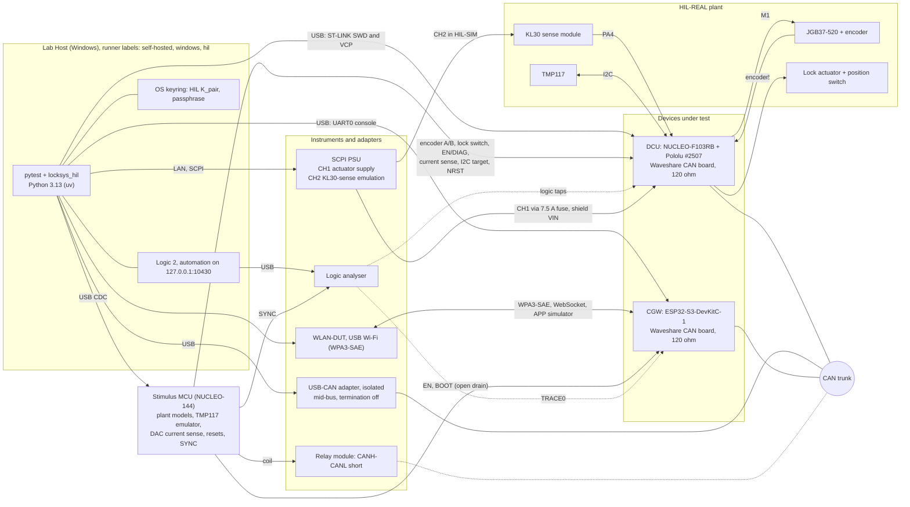

# LockSys HIL Architecture

| Field | Value |
|---|---|
| Document ID | LS-HIL-001 |
| Version | 0.2 |
| Status | Draft |
| Owner | jlurg |

## 1. Purpose and scope

This document defines the hardware-in-the-loop (HIL) bench of LockSys for stage A: bench architecture, integration topologies, the HIL-SIM and HIL-REAL configurations, module-based wiring, the stimulus MCU, the CAN adapter, instruments, the Python test framework, CI integration, bench qualification and bench safety rules.

- Implementation is scheduled for M5; the tests are specified in the [HIL test catalogue](hil_test_catalog.md) (LS-HIL-002), the verification approach in the [verification strategy](verification_strategy.md) (LS-VER-001).
- Stage A: JGB37-520 encoder motor turning freely, real lock actuator, module-based electronics; no limits, no mechanics.
- Code lives in `hil/` (framework `hil/src/locksys_hil/`, tests `hil/tests/`, stimulus firmware `hil/stimulus_fw/`, bench configuration `hil/config/`, procedures `hil/procedures/`, qualification records `hil/qualification/`, wiring tables `hil/hardware/`).

## 2. Decisions

| ID | Topic | Decision |
|---|---|---|
| H1 | USB-CAN adapter | PEAK PCAN-USB FD recommended (§8.1); requirements fixed, purchase pending |
| H2 | Stimulus MCU | NUCLEO-144 with USB OTG FS and two DACs preferred; NUCLEO-G474RE alternative; nRF52840-DK option (§7) |
| H3 | Logic analyser | Saleae with Logic 2 automation (`logic2-automation` 1.0.11); 16 channels preferred, 8-channel units through profiles (§8.2) |
| H4 | SCPI instruments | PSU with ≥ 2 programmable outputs on the instrument LAN; DMM optional; oscilloscope used manually in the MVP (§8.3) |
| H5 | Framework | Python 3.13 managed by uv; pytest with a project plugin; versions pinned (§9) |
| H6 | Wiring | No interface board and no breadboard in the MVP: Dupont jumpers to the shield's stackable top sockets and to the NUCLEO morpho pins; one relay module for the CAN short (§6) |
| H7 | Actuator power | The PSU actuator output, switched over SCPI, is the actuator power enable; its front-panel output switch is the emergency stop (§6.3) |

## 3. Bench architecture

### 3.1 Host links

Devices are identified by USB serial number or instrument identity, never by COM port number.

| Link | Device | Identification | Notes |
|---|---|---|---|
| USB | NUCLEO-F103RB ST-LINK/V2-1: SWD and VCP (USART2, 115200 8N1) | ST-LINK serial | Flashing with STM32CubeProgrammer CLI; telemetry; the NUCLEO is powered from this port |
| USB | DevKitC UART port: UART0 console and flashing | USB-UART bridge serial | Open with DTR and RTS deasserted before `open()`; the auto-reset circuit drives EN and GPIO0 |
| USB | Stimulus MCU: USB OTG FS user port (control and event CDC interfaces) and its ST-LINK (flashing) | USB serial, product string | — |
| USB | USB-CAN adapter | Adapter device ID | python-can |
| USB (dedicated root port) | Logic analyser | Logic 2 device ID | Not behind a hub |
| USB | WLAN-DUT Wi-Fi adapter (WPA3-SAE, H2E preferred) | Interface alias | Interface metric 9000; no default route through the SoftAP; MAC randomisation off |
| LAN (isolated subnet, no gateway) | PSU, DMM | VISA resource plus `*IDN?` serial | — |
| USB (optional) | Hub with per-port power switching for the DCU and CGW USB ports | Hub serial and port | DCU power-on reset (SAFE latch, SYS-036 power-cycle sub-case); silencing a node in T1/T2 (§4) |

### 3.2 Wi-Fi link

- The Lab Host acts as the APP through the APP simulator (Python, same protobuf schema and session crypto as the APP, shared vectors in `interfaces/vectors/`).
- The WLAN-DUT joins `LockSys-XXXX` with a WPA3-SAE profile rendered from a template; the passphrase comes from the OS keyring; the rendered file is written with restricted permissions and deleted right after import.
- The CGW DHCP server offers no router, and the WLAN-DUT has a high interface metric, so the Lab Host keeps its default route on the wired network.
- Before every Wi-Fi test the association and the CGW address are checked and re-established if needed.
- No phone or other client is associated during HIL runs: the SoftAP allows two clients and the single-controller test uses both.

## 4. Integration topologies

| Topology | Under test | USB-CAN role | Other node | Used for |
|---|---|---|---|---|
| T1 | DCU in the loop | CGW restbus: `CGW_WinCmd`, `CGW_DoorCmd`, `CGW_NodeSts`, `CGW_Version` with E2E applied per transmission and fault hooks | CGW silent (see below) | DCU functions, E2E and timeout injection, UDS-lite |
| T2 | CGW in the loop | DCU restbus: `DCU_WinSts`, `DCU_DoorSts`, `DCU_TempSts`, `DCU_NodeSts`, `DCU_Version` | DCU silent (see below) | Session security, keep-alive supervision, arbiter |
| T3 | System | Listen-only monitor; injecting only for bus faults | — | End-to-end chains |

Silencing the other node in stage A: the Waveshare boards tie Rs low, so a node held in reset is not guaranteed recessive (its CAN TX pin floats). The preferred method is to remove the node's USB power (optional switchable hub); an unpowered transceiver is expected not to load the bus and its 120 Ω termination stays in place. Holding the node in reset (NRST or EN low) is allowed only if the bench qualification shows 0 CAN errors over 10 min in that state (§11).

## 5. Bench configurations (stage A)

| Aspect | HIL-SIM | HIL-REAL |
|---|---|---|
| Purpose | Deterministic, unattended regression of logic and timing | Physical validation and calibration evidence |
| PSU CH1 (actuator supply) | Off; both VNH5019 channels unpowered | On: 12.0 V, 3 A limit; attended |
| Window encoder | Stimulus generates A/B on PA15/PB3 from the measured PWM duty and INA/INB (plant model); real encoder unplugged | Real encoder |
| Window current sense | Stimulus DAC on the A0 socket (PA0) | VNH5019 CS; DAC disconnected |
| Lock position switch | Stimulus output on PB12 (lock plant model); real switch unplugged | Real switch |
| Lock current sense | Stimulus DAC on the A1 socket (PA1) | VNH5019 CS |
| EN/DIAG | Stimulus open-drain outputs; released = no fault | VNH5019; stimulus lines released and used as inputs |
| TMP117 | Stimulus I2C target at 0x48 (emulator with fault injection); real sensor unplugged | Real TMP117 |
| KL30 sense module input | PSU CH2 (emulated KL30 with SCPI ramps) | Fused KL30 (CH1) |
| Bridge command taps | Stimulus inputs: PWM capture, INA/INB | Same (monitoring) |
| Measurement | Logic analyser, stimulus capture, USB-CAN timestamps | Same, plus DMM, oscilloscope (manual) and PSU read-back |
| Attendance | Unattended allowed | Attended only |
| Suites | smoke, regression, nightly, soak | real (manual dispatch) |

Configuration changes are made with all PSU outputs off. The self-test checks that the observed configuration matches the bench YAML before any test runs (§11.3).

### 5.1 Plant models

Parameters live in `hil/config/plant/*.yaml`; values marked ASSUMED are bench estimates, replaced by measured values after the first HIL-REAL run.

| Model | Behaviour | Injections |
|---|---|---|
| Window | Output speed = n0 × duty × V_KL30 / 12 V, n0 = 170 rpm (1:60, no load); counts per revolution = `enc_cpr` (2640 nominal); first-order speed response (time constant 30 ms, ASSUMED); coast-down when PWM is low; fast stop on brake; direction from INA/INB with configurable polarity; current-sense voltage 0.140 V/A only while driving | STALL (edges stop at a defined time), DEAD (no edges), REVERSED (counts opposite to the command), ONE_CHANNEL (B constant), SLOW (scaled speed), current steps (inrush, over-current) |
| Lock | Stroke 200 ms (ASSUMED); the position switch changes state at the end of the stroke (polarity per calibration); current-sense profile during the stroke | FB_STUCK, SLOW (600 ms), BOUNCE (n × t), REVERSED, DIAG (EN/DIAG low) |
| TMP117 | Register model: temperature (7.8125 m°C/LSB, reset value 0x8000), configuration incl. one-shot (MOD = 11), averaging, Data_Ready cleared by reading, pointer retention, EEPROM busy after power-on, device ID 0x0117; value sources constant, ramp, step, CSV | Address NACK, data NACK, wrong ID (0x0119, 0x2117), clock stretching, stuck SDA (released after k clocks or never), Data_Ready never set, 0x8000, out-of-range values |

## 6. Module-based wiring and power control

### 6.1 Principle

- No interface board, no breadboard and no loose through-hole components. The stimulus MCU connects with Dupont jumpers to the shield's stackable top sockets and to the NUCLEO morpho pins.
- Where a top socket is occupied by a stimulus jumper, the logic analyser probes the same MCU pin on the morpho header.
- Morpho pin numbers are taken from UM1724 and checked against the board silkscreen at bring-up; the authoritative wiring tables are in `hil/hardware/wiring/`.

### 6.2 Stimulus connections (HIL-SIM)

| Signal | DCU pin | Access point | Stimulus function | Notes |
|---|---|---|---|---|
| ENC_A | PA15 | Morpho CN7-17 | Quadrature output | Real encoder unplugged; 5 V-tolerant pin |
| ENC_B | PB3 | Top D3 socket | Quadrature output | 5 V-tolerant pin |
| WIN_PWM | PC7 | Top D9 socket | Timer input capture | 20 kHz |
| WIN_INA, WIN_INB | PA10, PB5 | Top D2, D4 sockets | GPIO inputs | — |
| LOCK_PWM | PB6 | Top D10 socket | Timer input capture | — |
| LOCK_INA, LOCK_INB | PA8, PA9 | Top D7, D8 sockets | GPIO inputs | — |
| WIN_CS | PA0 | Top A0 socket | DAC channel 1 | HIL-SIM only (§6.5) |
| LOCK_CS | PA1 | Top A1 socket | DAC channel 2 | HIL-SIM only (§6.5) |
| WIN_EN_DIAG | PB10 | Top D6 socket | Open-drain output on a 5 V-tolerant pin | The shield pulls the line to 5 V through 4.7 kΩ + 1 kΩ |
| LOCK_EN_DIAG | PA6 (option A) or PB4 (option B) | Top D12 or D5 socket | Open-drain output on a 5 V-tolerant pin | Per the shield option chosen in M1 |
| LOCK_POS | PB12 | Morpho CN10-16 | Output (lock plant model) | Real switch unplugged |
| I2C_SCL, I2C_SDA | PB8, PB9 | Top SCL, SDA sockets | I2C target at 0x48 | Real TMP117 unplugged; pull-ups per §6.4 |
| DCU_NRST | NRST | Morpho CN7-14 | Open-drain output | — |
| DCU_3V3 | 3V3 | Top 3V3 socket | ADC input | Back-powering guard (§6.5) |
| KL30_SENSE | PA4 | Top A2 socket | ADC input in parallel to the DCU | SYNC at threshold crossings (SYS-039) |
| CGW_EN | EN | DevKitC J1-3 | Open-drain output | — |
| CGW_BOOT | GPIO0 | DevKitC J3-14 | Open-drain output with interlock | Never low while EN is released or at power-up |
| SYNC | — | Logic analyser D0 | Width-coded timer output | §7.3 |
| CAN_SHORT | — | Relay module input | GPIO output | Optional module |
| GND | GND | Top GND socket, morpho GND | Common reference | Motor return current never on these wires |

### 6.3 Power control

| Supply | Wiring | Setting | Control |
|---|---|---|---|
| PSU CH1, actuator supply (KL30) | PSU + → 7.5 A blade fuse → WAGO → shield VIN; PSU − → shield GND terminal; 18 AWG | 12.0 V; current limit 3.0 A (5.0 A only for an attended lock stall test); OVP 14.0 V where available (stage A never raises the actuator supply above 13 V; over-voltage tests use CH2); output OFF at power-up | Enabled only in an attended `hil_real` session; switched off by `safe_state()` and by the job-completed hook of runner `hil` after every job; the front-panel output switch is the emergency stop; a periodic idle-off task on the Lab Host is LATER |
| PSU CH2, KL30-sense emulation | PSU + → KL30 sense module input (HIL-SIM only) | 12.0 V nominal; current limit 0.1 A; OVP 18.0 V; tests ≤ 17.0 V (3.4 V at PA4; the module's ≈ 6 kΩ source impedance limits the clamp current) | SCPI ramps for SYS-039 |
| DCU logic | USB from the Lab Host through the ST-LINK; shield jumper JP9 not fitted | — | Optional switchable hub port for power-on resets |
| CGW logic | USB from the Lab Host | — | EN reset by the stimulus; optional switchable hub port |
| Relay module | Coil supply from the stimulus board 5 V pin or a separate 5 V supply, never from a DUT rail | Dry contact across CANH–CANL | Stimulus GPIO; without the module the bus-off test runs manually with a jumper |

### 6.4 I2C pull-ups in HIL-SIM

The Adafruit TMP117 board provides the 10 kΩ pull-ups. When it is unplugged in HIL-SIM, equivalent pull-ups are needed so that SIM and REAL bus timing match (TST-MAN-SYS-008). The bench uses a second Adafruit TMP117 board with its address set to 0x49 (BOM item H9), plugged in place of the real sensor in HIL-SIM; it provides the pull-ups, does not answer at 0x48 and doubles as the reference sensor for TST-MAN-SYS-011. Alternative: a STEMMA QT pull-up module with 10 kΩ.

### 6.5 Electrical rules

- The DAC outputs, which drive DCU pins that are not 5 V-tolerant (PA0, PA1), are disabled while the stimulus measures DCU 3V3 below 3.0 V, so that they cannot back-power an unpowered DCU. Open-drain lines only sink current and the push-pull outputs drive 5 V-tolerant pins (PA15, PB3, PB12).
- EN/DIAG emulation uses open-drain outputs on 5 V-tolerant stimulus pins, because the shield pulls the lines to 5 V.
- Stimulus outputs are high-impedance after a stimulus reset and stay so until the host selects HIL-SIM.
- In HIL-REAL the DAC channels are disabled and the encoder and lock-switch outputs are high-impedance; the host refuses HIL-REAL if the stimulus reports SIM outputs enabled.
- Current-sense injection: with CH1 off the VNH5019 is unpowered, and the shield's series resistor between the CS output and the A0/A1 node isolates it from the injected voltage. The transfer from DAC code to DCU ADC reading and the DAC stability with the shield's filter capacitor are calibrated in the bench qualification.
- Logic analyser inputs only on 3.3 V MCU-side nets; never on CANH, CANL, VIN or motor nets.
- PSU outputs are floating (not earthed).

## 7. Stimulus MCU

### 7.1 Requirements

| ID | Requirement | Reason |
|---|---|---|
| ST-01 | ≥ 20 GPIO at 3.3 V (18 used in §6.2, plus 2 DAC and 2 ADC pins), including ≥ 4 open-drain outputs on 5 V-tolerant pins | NRST, CGW EN and BOOT; EN/DIAG lines, which the shield pulls to 5 V |
| ST-02 | I2C target mode with controllable clock stretching | TMP117 emulation including one-shot, Data_Ready, NACK and stuck-SDA faults |
| ST-03 | 2 DAC channels, 12 bit | Window and lock current-sense emulation |
| ST-04 | Timer input capture at ≥ 10 MHz on 2 channels; one timer that generates quadrature A/B with a defined phase up to ≥ 10 k edges/s | PWM duty and direction measurement; encoder emulation (nominal 7.5 k counts/s at 1:60) |
| ST-05 | ≥ 2 ADC inputs | DCU 3V3 and KL30 sense monitoring |
| ST-06 | Native USB device (CDC) | Host link independent of a debug-probe VCP |
| ST-07 | Cortex-M4 or Cortex-M7 with FPU | Plant models at 10 kHz |
| ST-08 | Professional toolchain without Arduino; vendor HAL/LL allowed | Test equipment, not product code |

### 7.2 Candidates

| Rank | Board | Fit | Gaps |
|---|---|---|---|
| 1 (preferred) | NUCLEO-144: F429ZI, F446ZE, F746ZG, F767ZI, H743ZI2 or H723ZG | Same ecosystem as the DCU; USB OTG FS on its own connector; 2 DAC channels; I2C target; many timers; CAN for a future fault-injection node | — |
| 2 | NUCLEO-G474RE (or G491RE) | DACs, HRTIM, FDCAN | USB needs a breakout on PA11/PA12; otherwise the STLINK-V3 VCP |
| 3 | nRF52840-DK | Native USB, PPI timestamps, I2C target (TWIS) | No DAC (external DAC module, e.g. MCP4822); radio must stay off near the SoftAP; Zephyr toolchain |
| — | LaunchPad, Curiosity boards | Only if ST-01…ST-08 are met | No advantage over a NUCLEO |

The board is fixed at the start of M5 and recorded in `hil/stimulus_fw/README.md`.

### 7.3 Firmware architecture

- Portable core: command protocol, plant models, TMP117 register model; a port layer per board.
- 10 kHz control loop for the plant models; 1 µs event timestamps.
- SYNC output with width-coded pulses: 10 µs host marker, 20 µs injected event, 50 µs power or reset event, 100 µs KL30 threshold crossing, 200 µs self-test pattern.
- Hardware watchdog; host heartbeat: if it is missing for 2 s, all SIM outputs are released and the relay output is cleared.
- Host-side unit tests for the core (plant models, command parser, TMP117 model).
- The stimulus is test equipment: not MISRA-bound; covered by the tool-confidence measures (§11.5).

### 7.4 Command protocol (USB CDC, SCPI-like, version 1.0)

- ASCII lines, terminated by LF; queries end in `?` and return exactly one line; commands return nothing and are confirmed with `*OPC?`.
- Errors go to an SCPI error queue (`SYST:ERR?`). The host requires an equal major version from `SYST:VERS?`; minor versions only add commands, discovered with `SYST:CAP?`.
- Events are reported on the second CDC interface as `!EVT,<t_us>,<type>,<key=value>…`.
- Command groups (examples): `*IDN?`, `*RST`, `*TST?`; `SYST:VERS?`, `SYST:TIME?`, `SYST:HB`; `MODE SIM`, `MODE REAL`; `PLANT:WIN:CONF`, `PLANT:WIN:INJ STALL`, `PLANT:LOCK:INJ FB_STUCK`; `TEMP:VAL 23.4531`, `TEMP:FAULT STUCK_SDA,9`; `SOUR:CS WIN,2.80`; `DIO:DIAG WIN,FAULT`; `RST:DCU:PULSE 20`, `RST:CGW:HOLD ON`, `BOOT:CGW:HOLD 6000`; `REL:CANSHORT ON`; `MEAS:DCU3V3?`, `MEAS:KL30?`; `SYNC:PULSE? 10`.

## 8. Instruments and adapters

### 8.1 USB-CAN adapter

| Requirement | Reason |
|---|---|
| CAN 2.0A/B at 500 kbit/s with configurable bit timing (BRP, TSEG1, TSEG2, SJW or sample point) | Match the 87.5 % sample point of both nodes |
| Maintained Windows 11 driver and python-can support | The HIL runs on the Lab Host |
| Hardware timestamps with ≤ 1 µs resolution | SYS-020/022 measurements and cyclic-frame jitter |
| Galvanic isolation USB ↔ CAN | Bench with 12 V and a motor: avoids ground loops, protects the Lab Host |
| Listen-only mode; reporting of error frames and bus-off | Passive monitoring (T3), bus-off and E2E tests |
| Termination switchable or known | The bench defines the bus ends (adapter mid-bus, termination off) |
| Desirable: CAN FD, macOS support, free monitoring software | Future use; use from the Mac |

| Option | Assessment |
|---|---|
| PEAK PCAN-USB FD (IPEH-004022 USB-A, IPEH-004023 USB-C) | **Recommended.** Isolated; 1 µs timestamps; python-can `pcan` interface (PCAN-Basic on Windows, MacCAN on macOS); free PCAN-View; termination configured internally and off by default (confirmed by the 60 Ω check) |
| Kvaser U100 or Leaf v3 | Good Windows support (CANlib, python-can `kvaser`); no official macOS driver; confirm that the chosen model is isolated |
| CANable 2.x / candleLight (gs_usb) | Low cost, acceptable for monitoring; usually not isolated and without precise timestamps (latencies then measured with the logic analyser); needs WinUSB (Zadig) on Windows |
| Adapters with a proprietary serial protocol and no python-can support | Avoid |

python-can configuration: `can.BitTiming(f_clock=8_000_000, brp=1, tseg1=13, tseg2=2, sjw=1)` (16 tq, sample point 87.5 %); listen-only (`can.BusState.PASSIVE`) in T3; logs in `.blf` or `.asc`.

### 8.2 Logic analyser

Usage with `logic2-automation` 1.0.11:

- Logic 2 runs in the interactive lab session with automation enabled on 127.0.0.1:10430 (inbound connections blocked by the host firewall; Logic 2 version pinned, automatic updates off). The framework connects with `automation.Manager.connect(port=10430)`.
- One capture per test, using the profile the test declares. Trials are segmented afterwards by their SYNC pulses. The trigger is a digital pulse-width trigger on the SYNC code, or a timed capture.
- Analyzers: CAN at 500 kbit/s on CAN_RX, Async Serial 115200 8N1 on UART_TX, I2C on SCL/SDA. Exports: raw CSV and analyzer data tables; the `.sal` file is kept for failed tests and for evidence tests. All paths are absolute.
- Sample rate: 25 MS/s by default; ≥ 100 MS/s for the reset-glitch test; ≥ 10 MS/s on ≤ 2 channels for long captures. Threshold for 3.3 V logic (1.65 V switching point on models with selectable thresholds).

16-channel map:

| Ch | Signal | DCU pin | Ch | Signal | DCU pin |
|---|---|---|---|---|---|
| D0 | SYNC (stimulus) | — | D8 | ENC_B | PB3 |
| D1 | WIN_INA | PA10 | D9 | LOCK_POS | PB12 |
| D2 | WIN_INB | PB5 | D10 | CAN_RX (DCU) | PA11 |
| D3 | WIN_PWM | PC7 | D11 | UART_TX (DCU) | PA2 |
| D4 | LOCK_INA | PA8 | D12 | I2C_SCL | PB8 |
| D5 | LOCK_INB | PA9 | D13 | I2C_SDA | PB9 |
| D6 | LOCK_PWM | PB6 | D14 | DCU TRACE0 | PC0 |
| D7 | ENC_A | PA15 | D15 | CGW TRACE0 | GPIO7 |

Tests that need NRST or the EN/DIAG lines re-probe D12/D13 (profile C or D on a 16-channel unit).

8-channel profiles (re-probing between profiles; a test whose profile is not wired is reported as skipped, not passed):

| Profile | Channels |
|---|---|
| A, window timing | SYNC, WIN_INA, WIN_INB, WIN_PWM, ENC_A, ENC_B, CAN_RX, CGW TRACE0 |
| B, lock and communication | SYNC, LOCK_INA, LOCK_INB, LOCK_PWM, LOCK_POS, CAN_RX, UART_TX, DCU TRACE0 |
| C, sensor and diagnostics | SYNC, I2C_SCL, I2C_SDA, UART_TX, CAN_RX, DCU TRACE0, WIN_EN_DIAG, LOCK_EN_DIAG |
| D, reset glitch | SYNC, WIN_INA, WIN_INB, WIN_PWM, LOCK_INA, LOCK_INB, LOCK_PWM, NRST |

### 8.3 SCPI instruments

| Instrument | Requirements | Use |
|---|---|---|
| PSU (required) | ≥ 2 independently programmable outputs (CH1 ≥ 20 V / ≥ 5 A, CH2 ≥ 18 V); per-channel current limit and OVP; output OFF at power-on; voltage and current read-back; LAN interface (VXI-11, HiSLIP or raw socket) preferred; floating outputs | Actuator power enable and emergency stop; KL30 emulation and ramps |
| DMM (optional) | SCPI over LAN or USB; DC voltage, current, resistance | Procedures, bench qualification, cross-checks |
| Oscilloscope | Manual use in the MVP; automation LATER | Physical-layer procedures, current waveforms |

- PyVISA 1.16.2 with the pyvisa-py 0.8.1 backend (`@py`) by default; a vendor VISA (`@ivi`) only for USB-only instruments on Windows.
- Vendor command sets are abstracted by drivers selected from `*IDN?`; `SYST:ERR?` is checked after every configuration step.
- Ramp timing is referenced to the measured crossing (stimulus ADC on the KL30 sense node, SYNC-marked), never to the time of the SCPI command.

### 8.4 Measurement methods and decision rules

| Method | Use | Uncertainty |
|---|---|---|
| M1 Logic analyser, edge to edge on one timebase | All safety timings | U = 2/fs + 5 × 10⁻⁵ · t (two quantisation steps plus the ±0.005 % clock); 80 ns + 50 ppm at 25 MS/s |
| M2 Stimulus timestamps | Endurance counters, in-loop cross-check | 1 µs |
| M3 USB-CAN hardware timestamps | Cyclic timing, bus load | 1 µs (relative) |
| M4 Host clock mapped to the logic-analyser timebase by regression over SYNC pairs | APP-level latencies | ≤ ±2 ms |
| M5 Oscilloscope (manual) | Analog evidence (supply, current) | Instrument specification |
| M6 DUT self-report (DIDs, `t_ms`, CGW log) | Informative only; always cross-checked | — |

Signal definitions (VNH5019: a low PWM level turns off both low-side switches):

- **Drive-on:** INA ≠ INB and PWM high.
- **Brake:** INA = INB = 0 and PWM continuously high.
- **Drive-off instant:** the first of INA = INB, or PWM continuously low for ≥ 100 µs (two PWM periods).

Decision rules:

- **Guard band:** a timing result passes only if measured value + U ≤ limit.
- **Statistics:** multi-trial criteria are judged on the maximum over all trials; p50, p95, p99 and maximum are always reported.
- **Margin flag:** a maximum above 80 % of the limit passes with a "low margin" flag.
- **APP-simulator allocation:** when the APP simulator replaces the APP, the APP allocations of LS-SAIC-001 §5 (send ≤ 20 ms, render ≤ 16 ms) are subtracted: SYS-020 send → off ≤ 130 ms; SYS-024 send → transitional state ≤ 264 ms, send → final state ≤ 964 ms (≤ 1964 ms with one retry). The APP verifies its own allocations in APP integration tests.

## 9. Python framework

### 9.1 Layers

| Layer | Content | Package |
|---|---|---|
| 1 Transports | PyVISA + pyvisa-py, pyserial, python-can, logic2-automation, websockets | Dependencies |
| 2 Instrument drivers | Abstract classes `Psu`, `Dmm`, `LogicAnalyzer`, `CanBus`, `Stimulus`; vendor adapters selected from `*IDN?`; fakes for hardware-free tests | `locksys_hil.instruments` |
| 3 Protocols and DUT adapters | E2E (shared vectors); CAN codec on `interfaces/can/locksys.dbc`; restbus (CGW or DCU role with fault hooks); UDS (udsoncan over can-isotp); telemetry parser for the `$LS…` grammar; APP simulator (protobuf, HMAC, HKDF); flashing and version checks | `locksys_hil.protocols`, `locksys_hil.dut`, `locksys_hil.gen` |
| 4 Bench facade | `Bench`: bench lock, configuration presets, `safe_state()`, self-test, SYNC-based timebase, evidence recorder; edge and timing analysis | `locksys_hil.bench`, `locksys_hil.analysis`, `locksys_hil.reporting` |
| 5 pytest plugin | Fixtures, markers, collection checks, outcome classification, JUnit properties, HTML report, evidence attachment | `locksys_hil.pytest_plugin` |
| Tests and CLI | Catalogue tests (LS-HIL-002) in `hil/tests/`; hardware-free framework tests in `hil/unit/`; CLI `hil` (`selftest`, `flash`, `verify-dut`, `safe-state`, `bench acquire`, `bench release`, `evidence scan-secrets`) | `hil/tests`, `hil/unit` |

### 9.2 Pinned packages

| Package | Version |
|---|---|
| Python | 3.13 (uv) |
| python-can | 4.6.1 |
| cantools | 44.1.0 |
| udsoncan / can-isotp | 1.26.1 / 2.0.7 |
| PyVISA / pyvisa-py | 1.16.2 / 0.8.1 |
| logic2-automation | 1.0.11 |
| protobuf (Python) | 6.33.x (constrained by logic2-automation) |
| esptool | 5.4.0 |

Other packages (pyserial, websockets, pydantic, pytest and plugins) are pinned in `hil/pyproject.toml` and `uv.lock`.

### 9.3 Markers and collection rules

- Markers: `smoke`, `regression`, `nightly`, `soak`, `hil_sim`, `hil_real`, `verifies("SYS-nnn", …)`, `test_id("TST-HIL-SYS-nnn")`, `requires("<capability>")`, `dev_build` (needs fault injection or trace pins), `destructive`.
- `--strict-markers` is set. A collection hook rejects any test without exactly one `test_id` and at least one `verifies`, or whose identifiers are not in the requirement registry.
- Identifiers are written as JUnit properties and to `trace.json`, which `tools/trace/trace.py` consumes.

### 9.4 Fixtures

| Fixture | Scope | Function |
|---|---|---|
| `bench` | Session | Loads the bench YAML, takes the bench lock, runs the self-test, registers `safe_state()` |
| `baseline` | Function (autouse) | Default configuration, PSU nominal, plant reset, DUTs in NORMAL, DTCs cleared when the test requests it; Wi-Fi association check for Wi-Fi tests |
| `topology` | Function | Silences the right node and starts the restbus or the monitor (§4) |
| `app` | Function | Authenticated APP-simulator session |
| `capture` | Function | Logic-analyser capture with the declared profile; captures kept on failure or for evidence tests |
| `dut_logs` | Function | DCU telemetry, redacted CGW console, CAN log, stimulus events; attached on failure |
| `restbus`, `uds`, `psu`, `stim` | Session | Drivers |

### 9.5 Outcome classification and evidence

- Infrastructure errors (instrument time-out, enumeration failure, version mismatch after flashing, self-test failure) are reported as ERROR, not FAIL, and end the session with exit code 10.
- Functional failures are never retried (`-p no:rerunfailures`); multi-trial criteria count every trial.
- `safe_state()` runs in fixture teardown, at interpreter exit and in signal handlers, and completes within 5 s.
- Each run writes `reports/<run-id>/`: `junit.xml`, `report.html`, `manifest.json`, `trace.json`, `metrics.json` and `evidence/<test-id>/` (captures, CSV exports, CAN logs, telemetry, redacted console, stimulus events).
- Before any upload, `hil evidence scan-secrets` searches all evidence for the current K_pair (raw, hex, base64, base64url) and the passphrase; a hit fails the job and blocks the upload (LS-SEC-001 CSR-013).

## 10. CI suites and triggers

| Suite | Marker expression | Trigger | Target duration | Gate |
|---|---|---|---|---|
| smoke | `smoke and hil_sim` | Push to `develop` | ≤ 15 min | `hil-gate`; a skipped run (bench offline) is a warning on `develop` |
| regression | `(smoke or regression) and hil_sim` | Push to `release/**` and `hotfix/**`; manual dispatch | ≤ 3 h | `hil-gate`, required for merges to `main` from M5 |
| nightly | `(smoke or regression or nightly) and hil_sim` | Schedule, 02:17 Lab Host time (default branch `develop`) | ≤ 8 h | Issue on failure |
| soak | `soak` | From M5: weekly schedule; manual dispatch per release candidate | 8 h (SYS-071; the 24 h soak is LATER) | Release entry criterion |
| real | `hil_real` | Manual dispatch with attended approval | ≤ 1 h | Release entry criterion |

Pipeline and runner rules:

- Workflow `hil.yml` runs on `[self-hosted, windows, hil]`: the `hil` runner instance under a non-administrator account in the interactive session that Logic 2 requires.
- Triggers are restricted to `push`, `schedule` and `workflow_dispatch`; `pull_request`, `pull_request_target`, `workflow_run` and `issue_comment` never start a bench job (checked by `tools/ci/check_self_hosted.py`). A pre-job hook on the Lab Host checks repository, event and actor allowlist and fails closed.
- Steps: job-started hook (trust check; fails while a manual reservation `bench.lock` exists) → framework bench lock → self-test (pre) → flash the CI-built images after checking their SHA-256 against the build manifest → verify DUT versions → pytest with the suite's marker expression → `hil safe-state` (always) → release the framework lock → secret scan → upload evidence → job-completed hook (supply output off, workspace clean).
- Concurrency group `hil-bench`: runs are queued, never cancelled by newer runs.
- When the bench is offline or in maintenance, the `hil-gate` aggregator reports a warning on `develop` and fails on `release/**` and `hotfix/**`.

## 11. Test-environment qualification

### 11.1 Instruments

| Instrument | Verification | Interval | Acceptance |
|---|---|---|---|
| DMM | Accredited calibration, or check against a DC reference and 0.1 % resistors | 12 months | Within specification |
| PSU read-back | Against the DMM at 5, 12 and 17 V | 6 months | Within the vendor specification |
| Logic analyser | Timing against the stimulus reference pulses (every self-test) | Every run | ±0.01 % |
| USB-CAN timestamps | Against the logic-analyser CAN decode | Per bench qualification | Offset and jitter < 50 µs |
| Stimulus DAC and ADC | Against the DMM | 6 months | ±5 mV |

### 11.2 Bench qualification report (BQR)

One report per bench hardware revision; repeated after any change of wiring, instrument or DUT board. Checklist:

- [ ] Wiring continuity against the wiring tables; shield jumper JP9 not fitted; NUCLEO powered from USB only.
- [ ] CAN bus resistance 60 Ω ± 5 % with all nodes unpowered (TST-MAN-SYS-001).
- [ ] Node silencing (§4): 0 CAN errors over 10 min with the silenced node unpowered, and with it held in reset if that method is used.
- [ ] Every stimulus injection reaches its DCU pin at the correct level; with CH1 off the DCU reads EN/DIAG high (no fault) when the stimulus lines are released.
- [ ] Current-sense injection transfer calibrated per channel (DAC code → DCU ADC reading through the DCU diagnostic DID) and DAC output stable.
- [ ] Back-powering: DCU 3V3 < 0.3 V with the DCU USB power removed while the stimulus is connected.
- [ ] Logic-analyser SYNC timing self-check: 10 pulses at 1.000 ms ± 0.01 %.
- [ ] 0 CAN errors and 0 telemetry checksum errors over 10 min idle.
- [ ] WLAN-DUT associates with WPA3-SAE; idle RTT p99 < 50 ms.
- [ ] PSU: output OFF at power-on, OVP and current limit trip, outputs floating; emergency stop by the front-panel output switch works.
- [ ] Bench YAML matches the observed configuration (encoder source, TMP117 source, DAC state, PSU channels).

The report header states **QUALIFIED** or **NOT QUALIFIED**. The release regression refuses to run on a NOT QUALIFIED bench.

### 11.3 Self-test levels

| Level | Content |
|---|---|
| pre (≈ 2 min) | Instrument identity and error queues; logic-analyser SYNC pattern; stimulus `*TST?`; USB-CAN bus state; DUT USB presence; bench lock; configuration consistency (SIM or REAL); PSU CH1 state matches the configuration |
| post-flash | DUT versions match the build manifest; DCU and CGW in NORMAL |
| full (weekly) | BQR subset |

### 11.4 Run manifest

DUT identities (DCU UID, ST-LINK serial, CGW MAC and chip revision, stimulus board ID, USB-CAN ID); firmware versions, git hashes, build types and image SHA-256; interface versions read back from the DUTs; instrument identities and calibration due dates; software versions (Logic 2 and its API, CAN driver, VISA backend, STM32CubeProgrammer, protobuf runtime); bench YAML hash, `uv.lock` hash and operating system.

### 11.5 Tool confidence and negative controls

The framework and the stimulus firmware are test tools whose errors could hide DUT faults. Measures: self-tests, dual measurement of safety timings (logic analyser and stimulus capture), and weekly negative controls with DEV-build fault seeds:

| Seed | Seeded fault | Test that must fail |
|---|---|---|
| N1 | DCU `WinCmd` RX timeout disabled | TST-HIL-SYS-004 |
| N2 | Encoder supervision (`NO_MOTION`) disabled | TST-HIL-SYS-007 |
| N3 | E2E CRC check bypassed | TST-HIL-SYS-010 |
| N4 | Temperature rounding error of 0.01 °C | TST-HIL-SYS-017 |

A negative control that passes is a bench defect; the bench becomes NOT QUALIFIED.

## 12. Bench safety rules

1. 12 V only on terminal blocks and cables; no breadboard; 18 AWG power wiring; motor return current only through the shield GND terminal.
2. PSU CH1 limited to 3 A (5 A only for an attended lock stall test, never higher with the motor connected); 7.5 A main fuse; PSU outputs floating.
3. Shield jumper JP9 (ARDVIN=VOUT) not fitted; the NUCLEO is powered from USB only; nothing on VIN or E5V.
4. All PSU outputs off while connecting or disconnecting anything and while changing between HIL-SIM and HIL-REAL.
5. HIL-REAL only attended, with the operator at the PSU output switch (emergency stop). Soak and unattended runs only in HIL-SIM with CH1 off.
6. Motor fixed in its bracket; only a light indicator disc on the shaft; nothing that can wind onto the shaft; the shaft is not touched while powered; the lock actuator is clamped.
7. Firmware never drives EN/DIAG high and never relies on EN to stop a motor; the lock pulse has a hard time-out.
8. While debugging with breakpoints (software protections halted), CH1 is off or limited to 0.5 A.
9. Logic analyser only on 3.3 V MCU-side nets; oscilloscope ground clip only to the PSU negative; the USB-CAN adapter is isolated.
10. CH1 is switched off by `safe_state()` on any abort and by the job-completed hook after every job (a periodic idle-off task is LATER).
11. HIL-REAL thermal limit: ≤ 10 window cycles per minute; check the driver temperature after long runs.
12. No eFuse operation on the bench CGW; the HIL tooling refuses `espefuse` and `espsecure` commands.

## 13. Open points

| ID | Topic | Resolution path |
|---|---|---|
| OP-HIL-01 | USB-CAN adapter not yet purchased | Buy per §8.1 (PCAN-USB FD recommended); an owned adapter is acceptable if python-can supports it and the 87.5 % sample point can be set |
| OP-HIL-02 | Stimulus board variant | Fixed at M5 start (§7.2) |
| OP-HIL-03 | Logic analyser model and channel count | 8-channel profiles until a 16-channel unit is available |
| OP-HIL-04 | PSU model with ≥ 2 outputs and LAN | Purchase decision before M2 |
| OP-HIL-05 | Behaviour of the unpowered VNH5019 on EN/DIAG and CS in HIL-SIM | BQR check (§11.2) |
| OP-HIL-06 | Waveshare SN65HVD230 boards: TXD level while the node MCU is in reset; bus loading when unpowered | BQR check (§4, §11.2) |
| OP-HIL-07 | Current-sense injection transfer and DAC stability with the shield's filter network | BQR calibration (§6.5) |
| OP-HIL-08 | Switchable USB hub with Windows control for DCU and CGW power cycling | Optional capability `power.dcu_usb` / `power.cgw_usb`; tests skip the sub-cases without it |
| OP-HIL-09 | Morpho pin access with the shield mounted; exact morpho pin numbers | Checked against UM1724 and the silkscreen at bring-up |

## 14. References

| Reference | Title |
|---|---|
| LS-HIL-002 | [HIL test catalogue](hil_test_catalog.md) |
| LS-VER-001 | [Verification strategy](verification_strategy.md) |
| LS-VER-002 | [Manual test procedures](procedures/README.md) |
| LS-SAF-001 | [Functional safety concept](../05_safety/safety_concept.md) |
| LS-SEC-001 | [Cybersecurity concept](../06_security/security_concept.md) |
| LS-SAIC-001 | System architecture and interface contract (`docs/02_system/LS-SAIC.md`) |
| ST UM1724 | STM32 Nucleo-64 boards user manual |
| Pololu 0J49 | Dual VNH5019 Motor Driver Shield user guide |
| Saleae | Logic 2 automation API documentation (`logic2-automation`) |
| python-can | python-can 4.6 documentation (PCAN, Kvaser, gs_usb interfaces) |
| PEAK-System | PCAN-USB FD product documentation |
