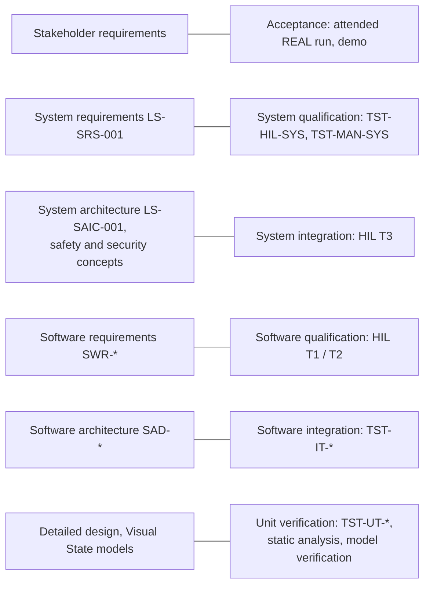

# LockSys Verification Strategy

| Field | Value |
|---|---|
| Document ID | LS-VER-001 |
| Version | 0.2 |
| Status | Draft |
| Owner | jlurg |

## 1. Purpose and scope

This document defines how LockSys is verified: test levels and their mapping to the specification documents, verification methods, tools, coverage targets, static-analysis gates, traceability gates and their phasing, evidence retention, milestone exit criteria and the handling of failures.

- Scope: DCU, CGW and APP software, the shared C libraries, interface artefacts and generated code, the HIL bench, and the system as a whole (stage A of the window function).
- Normative relations: requirements in LS-SRS-001 and the software architecture documents; safety and security requirements in [LS-SAF-001](../05_safety/safety_concept.md) and [LS-SEC-001](../06_security/security_concept.md); bench and HIL tests in [LS-HIL-001](hil_architecture.md) and [LS-HIL-002](hil_test_catalog.md); manual procedures in [LS-VER-002](procedures/README.md).
- Process reference: Automotive SPICE SYS.4/SYS.5 and SWE.4–SWE.6 (informative), ISO 26262-6 and -8 (informative).

## 2. Principles

1. Every MVP requirement is verified by at least one method; the method is stated in the requirement table.
2. [SAF] system requirements of the current stage are verified on target with fault injection (HIL); unit tests alone are not sufficient for them.
3. Safety timings are measured with an instrument on a common timebase (logic analyser, CAN adapter timestamps). DUT self-reports are informative only.
4. Automated gates are preferred over manual sign-off; a manual step produces a record that is part of the evidence.
5. Every tool and package is pinned (`tools/versions.env`, lock files, container digests), so evidence is reproducible.
6. Functional failures are never retried automatically; every defect fix adds a test that fails before the fix.
7. Generated code is verified like hand-written code, except where §6 and LS-SAF-001 §8 state otherwise.

## 3. V-model and test levels

| Level | Specification | Verification | Test IDs | Environment | Gate |
|---|---|---|---|---|---|
| Unit | Detailed design, module headers, Visual State models | Unit tests, static analysis, model verification and validation | TST-UT-DCU/CGW/APP/LIB-nnn | Host: Ceedling in Docker, `flutter test`, pytest | `ci-gate`, `iar-gate` |
| Software integration | Software architecture documents | Component integration on the host (CGW core scenarios, APP against the CGW simulator) and restbus scripts on target | TST-IT-DCU/CGW/APP-nnn | Host; DCU with USB-CAN restbus | `ci-gate` |
| Software qualification | Software requirements | Node in the loop: DCU (topology T1), CGW (T2) | TST-HIL-SYS-nnn run in T1/T2; node-specific TST-HIL-DCU/CGW-nnn reserved | HIL bench | `hil-gate` |
| System integration | LS-SAIC-001 | Full chain APP-sim → CGW → CAN → DCU (T3) | TST-HIL-SYS-nnn run in T3 | HIL bench | `hil-gate` |
| System qualification | LS-SRS-001, LS-SAF-001, LS-SEC-001 | HIL in HIL-SIM and HIL-REAL; manual procedures | TST-HIL-SYS-nnn, TST-MAN-SYS-nnn | HIL bench | `hil-gate`; release checklist |
| Acceptance | Stakeholder requirements | Attended HIL-REAL run with the phone APP; demonstration | — | Bench | Release checklist |

## 4. Verification methods

| Code | Method | Typical use |
|---|---|---|
| R | Review or inspection with a recorded checklist | Architecture rules, deviations, hardware wiring, security configuration |
| A | Analysis (timing budget, stack and WCET analysis, coverage analysis) | Budgets of LS-SAF-001 §7.4, stack and CPU load |
| UT | Unit test | Every SWR; guards and state machines |
| IT | Integration test on the host or target | Interfaces between components, protocol interoperability |
| HIL | Automated test on the HIL bench | [SAF] and [SEC] SYS requirements, timing, fault reactions |
| M | Manual bench procedure (TST-MAN) | Physical-layer measurements, calibration, one-time hardware checks |

Selection rules:

- [SAF] SYS requirement of the current stage: HIL is mandatory, plus UT of the implementing SWRs.
- [SEC] SYS requirement: HIL, or M where the property is physical (for example the WPA3 beacon).
- SWR: UT is mandatory; IT or HIL when the behaviour depends on timing or hardware.
- HWR: M or R.
- Interface artefacts (DBC, proto, YAML): regenerate-and-diff gate plus the shared test vectors in `interfaces/vectors/`.

## 5. Tools

Versions are pinned in `tools/versions.env`; Python packages in `uv.lock`; the values below are the baseline.

| Tool | Version | Use |
|---|---|---|
| Ceedling (container `locksys/ceedling:1.1.9`) | 1.1.9 | C unit tests for the DCU, `libs` and CGW portable cores |
| gcovr | 8.6 | Coverage reports and thresholds |
| Arm GNU toolchain (`arm-none-eabi-gcc`) | 13.3.rel1 | DCU shadow build with warnings as errors |
| IAR Embedded Workbench for Arm + C-STAT | 9.70 baseline | DCU release build; MISRA C:2012 (C-STAT MISRAC2023 set) and CERT C checks |
| IAR Visual State | ≥ 11.2.1 | Code generation, Verificator, Validator |
| ESP-IDF (container `espressif/idf:v5.5.5`, pinned by digest) | v5.5.5 | CGW build and target tests |
| Flutter / Dart | 3.47.6 / 3.13.5 | APP analysis and tests |
| Python (uv) | 3.13 | Tools, HIL framework, simulators |
| cantools | 44.1.0 | CAN code generation, CAN decoding in tests |
| python-can | 4.6.1 | HIL CAN access |
| udsoncan / can-isotp | 1.26.1 / 2.0.7 | UDS-lite tests |
| PyVISA / pyvisa-py | 1.16.2 / 0.8.1 | SCPI instruments |
| logic2-automation | 1.0.11 | Logic analyser automation |
| esptool | 5.4.0 | CGW flashing on the bench |
| STM32CubeProgrammer CLI | from STM32CubeCLT 1.19.0 | DCU flashing on the bench |
| actionlint / shellcheck | 1.7.12 / 0.11.0 | Workflow and shell linting |
| pre-commit | 4.6.x | Local and CI lint gates |
| ruff, mypy, pytest, zizmor, cppcheck, lizard | pinned in the lock files and the pre-commit configuration | Python analysis and tests; workflow security lint; C advisory analysis and complexity |
| CodeQL | GitHub-managed | Python and GitHub Actions |

## 6. Coverage targets

| Scope | Statement | Branch | MC/DC | Job | Enforced from |
|---|---|---|---|---|---|
| `libs/ls_e2e` | 100 % | 100 % | Reported | `libs-unit` | M0 |
| `LsCrc8`, `LsEvSet`, `LsTmr` (`libs/ls_common`) | 100 % | 100 % | Reported | `libs-unit` | M0 |
| Other `libs/ls_common` modules | ≥ 95 % | ≥ 90 % | — | `libs-unit` | M0 |
| DCU safety guards: CmdArb validation, WinCtrl guards | 100 % | 100 % | Reported | `dcu-unit` | M1 exit |
| Other DCU safety-related code: WinCtrl, DoorCtrl and ModeMgr adapters and actions; HBridge (reflex latch, permission gate); WinPos (encoder supervision); LockAct; VbatMon; TempMon interlock; SafeMon; WdgM; EcuM startup checks; Com and E2E path; CanIf bus-off | ≥ 95 % | ≥ 90 % | Reported | `dcu-unit` | M1 exit |
| Generated Visual State engines (`gen_vs/release`) | ≥ 95 %; transitions 100 % (trace bitmap) | Reported | — | `dcu-unit` | M1 exit (code exists from M2) |
| Other DCU code (MCAL against register fakes, services) | ≥ 85 % | ≥ 75 % | — | `dcu-unit` | M1 exit |
| CGW safety- and security-related cores: `cgw_arbiter`, `cgw_session`, `cgw_com` | ≥ 95 % | ≥ 90 % | Reported | `cgw-unit` | M3 exit |
| Other CGW components | ≥ 90 % | ≥ 80 % | — | `cgw-unit` | M3 exit |
| APP `locksys_protocol` package | ≥ 95 % lines | ≥ 90 % | — | `app` | M4 exit |
| APP domain layer | ≥ 95 % lines | ≥ 85 % | — | `app` | M4 exit |
| Other APP code | ≥ 85 % lines | — | — | `app` | M4 exit |
| Python code generation, CI gates and HIL framework (hardware-free tests) | ≥ 80 % | — | — | `python` | M2 exit |

Rules:

- The thresholds are implemented in `tools/ci/quality_gates.yaml` and checked by `tools/ci/coverage_gate.py`. Before the milestone in the last column a scope is reported but does not fail the job.
- Thresholds apply to the aggregate of each scope; a file belongs to the first scope whose pattern matches it.
- Thresholds are minimums; a software architecture document may set stricter targets for its components.
- Generated code other than the Visual State engines (cantools, nanopb, protobuf, enum and parameter headers) is excluded from coverage; it is verified by the regenerate-and-diff gate and the shared vectors.
- The contradiction-test branches of the Visual State engines are unreachable in a verified model; the Verificator report is the justification for not reaching 100 % branch coverage there.
- MC/DC is measured where the toolchain supports it (GCC condition coverage with gcovr ≥ 8) and is reported only; it becomes a gate only after the toolchain has been proven in CI.

## 7. Static analysis gates

| Scope | Tool | Criterion | Job / check | Blocking from |
|---|---|---|---|---|
| DCU firmware, `libs`, `gen_vs/release` | IAR C-STAT (MISRAC2023 set, CERT C) via `tools/ci/cstat_gate.py` | 0 unsuppressed findings; every suppression references an approved `DEV-DCU-nnn` or `DEV-LIB-nnn` deviation or a `DP-nn` permit; generated code uses path-scoped permits only, never in-code suppressions; no heap symbols; no fault-injection symbols in release images | `iar-gate` | Lab Host runner online |
| DCU firmware | `arm-none-eabi-gcc` shadow build with warnings as errors | 0 warnings; flash ≤ 75 % and RAM ≤ 60 % of the STM32F103RB (section `size` of `tools/ci/quality_gates.yaml`) | `dcu-gcc` (`ci-gate`) | M0 (warnings), M1 (budget) |
| DCU architecture | `tools/arch/check_layers.py` | No forbidden include across layers; generated headers included only by their owning SWC | `dcu-static` | M0 |
| DCU, `libs`, CGW components | lizard (`tools/ci/complexity_gate.py`); cppcheck | Cyclomatic complexity ≤ 15 (11–15 needs a justification); ≤ 5 parameters per function; cppcheck advisory | `dcu-static` | M1 |
| `libs`, CGW portable cores | Host build with AddressSanitizer and UndefinedBehaviorSanitizer | 0 findings | `libs-unit`, `cgw-unit` | M0 |
| CGW firmware | ESP-IDF build with component warnings as errors; cppcheck on `cgw_*` | 0 | `cgw-build`, `cgw-unit` | M0 |
| Visual State models and generated code | `vs_manifest.py --check`, `check_vs_*.py`; Verificator | Manifest consistent; 0 critical findings; no dead ends except the SAFE terminal | `vs-manifest` (`ci-gate`); `vs-gen` (`iar-gate`) | M0 (manifest), M2 (Verificator) |
| Interface artefacts | `uv run tools/codegen/regen.py --check` | No drift | `codegen` | M0 |
| APP | `flutter analyze --fatal-infos`, format check | 0 | `app` | When the Flutter job is enabled |
| Python | ruff; mypy (strict for packages under `src/`) | 0 | `python` | M0 |
| Workflows and scripts | actionlint, zizmor, shellcheck, `tools/ci/check_self_hosted.py` | 0 | `workflow-lint` | M0 |
| Repository | pre-commit hooks; pull-request policy (branch, title, linked issue, attribution) | 0 | `lint`, `pr-policy` | M0 |
| Security | CodeQL (Python, Actions); secret scanning with push protection | No open high-severity alert | `codeql.yml`; repository settings | M0 |

## 8. Model verification (Visual State)

| Activity | Evidence | When |
|---|---|---|
| Verificator, full mode, per system | Report with 0 critical findings; project policy: no dead ends except the SAFE terminal, no unused elements | Every regeneration (`vs-gen`) |
| Validator sequences | One sequence per transition plus scenarios; 100 % of states, transitions, events and actions; report archived per release | Model change; release |
| Engine unit tests | Real engine and real actions; assertions on the output buffer and the transition trace; 100 % transition coverage | Every pull request (`dcu-unit`) |
| Target coverage | DID FD09 transition bitmap read after the HIL regression; every safety-relevant transition hit | Release regression |
| Reproducibility | Regeneration on the Lab Host equals the committed code; manifest hashes match | Every push (`iar-gate`) and pull request (`ci-gate`) |

## 9. CI gates and test selection

| Check | Workflow | Trigger | Content |
|---|---|---|---|
| `pr-policy` | `pr-policy.yml` | Pull request | Branch name, base/head combination, conventional title, linked issue, attribution policy |
| `ci-gate` | `ci.yml` | Pull request; push to `develop` and `main` | Aggregates lint, codegen, model manifest, unit tests, shadow build, static analysis, CGW build, APP, Python, docs and trace report, workflow lint |
| `iar-gate` | `dcu-iar.yml` → `_iar-build.yml` | Push to repository branches; manual dispatch | Model regeneration check, IAR Debug and Release builds, C-STAT gate, SARIF |
| `hil-gate` | `hil.yml` | Push to `develop` (smoke), `release/**` and `hotfix/**` (regression); schedule (nightly; weekly soak from M5); manual dispatch | HIL suites per LS-HIL-001 §10; required on `main` from M5 |

- Self-hosted jobs (`iar-gate`, `hil-gate`) are never triggered by `pull_request`, `pull_request_target`, `workflow_run` or `issue_comment`. Their checks attach to the pull-request head SHA through the `push` run.
- HIL suite selection uses pytest markers: `smoke` on `develop`, `smoke or regression` on release and hotfix branches, `nightly` on schedule, `soak` weekly from M5, `hil_real` by attended manual dispatch only.

## 10. Traceability

### 10.1 Tags and identifiers

| Language | Implementation tag | Verification tag |
|---|---|---|
| C | `/* @satisfies SWR-DCU-012 */` | `/* @verifies SWR-DCU-012 */` |
| Python | — | `@pytest.mark.verifies("SYS-021")`; HIL tests also carry exactly one `@pytest.mark.test_id("TST-HIL-SYS-nnn")` |
| Dart | — | `// @verifies SWR-APP-012` |

| Identifier class | Format |
|---|---|
| STK, SYS, HWR, CSR | `^(STK\|SYS\|HWR\|CSR)-[0-9]{3}$` |
| Software requirements | `^SWR-(DCU\|CGW\|APP\|LIB)-[0-9]{3}$` |
| Safety and security analysis items | `^(HAZ\|SG\|SM\|AS\|TS\|CSG)-[0-9]{2}$` |
| Tests | `^TST-(UT\|IT\|HIL\|MAN)-(DCU\|CGW\|APP\|SYS\|LIB)-[0-9]{3}$` |

Identifiers are defined in the requirement tables of LS-SRS-001, the software requirement documents, LS-SAF-001 and LS-SEC-001; `tools/trace/trace.py` extracts them and joins them with the code tags and the JUnit results.

### 10.2 Rules

| Rule | Check |
|---|---|
| T1 | Every tag references a defined identifier with a valid format |
| T2 | Every MVP SYS requirement is satisfied by at least one SWR or HWR |
| T3 | Every MVP SWR has at least one `@satisfies` location and at least one `@verifies` test |
| T4 | Every MVP SYS requirement whose method includes HIL has at least one HIL test; every [SAF] SYS requirement of the current stage has at least one HIL test |
| T5 | Every SM of the current stage has an implementing requirement and at least one test |
| T6 | Every CSR has at least one verification entry (test or review record) |
| T7 | On `release/*` and `hotfix/*`: every MVP requirement has passing evidence in the release regression results; [SAF] requirements have passing HIL results |

### 10.3 Phasing

| Phase | Period | Mode |
|---|---|---|
| 1 | M0 until the M2 exit | Report only: `uv run tools/trace/trace.py --report` publishes the matrix as a job summary and artifact |
| 2 | From the M2 exit | T1, T2 and T3 (SWR-DCU) blocking in `ci-gate` |
| 3 | From the M3 and M4 exits | T3 extended to SWR-CGW (M3) and SWR-APP (M4) |
| 4 | From the M5 exit | T4, T5 and T6 blocking; T7 blocking on release and hotfix branches |

## 11. Evidence and retention

| Evidence | Produced by | Retention |
|---|---|---|
| Unit-test JUnit, coverage (HTML, JSON, Cobertura), sanitizer logs | `ci-gate` jobs | Workflow artifacts (public repository: at most 90 days; pull-request artifacts shorter) |
| C-STAT report, SARIF, build logs, map and size reports | `iar-gate` | Workflow artifacts; SARIF in code scanning |
| HIL run: `junit.xml`, `report.html`, `manifest.json`, `metrics.json`, `trace.json`, per-test evidence (logic captures, CSV exports, CAN logs, redacted console and telemetry logs, stimulus events) | `hil-gate` | Workflow artifacts after the secret scan |
| Manual procedure records (TST-MAN) | Operator | Committed under the procedure's record directory or attached to the release |
| Release evidence pack | `release.yml` | Immutable GitHub Release assets (permanent) |

Release evidence pack (one per `vX.Y.Z`):

- Build outputs: DCU `elf`, `hex`, `bin` (after the `ielftool` checksum) and `map`; CGW images, `elf`, `map` and flash arguments; APP package.
- C-STAT HTML report and SARIF, Guideline Compliance Summary, deviation list in force.
- Unit-test JUnit, coverage reports and complexity report of the release commit.
- HIL regression, soak and HIL-REAL reports with CAN logs, telemetry logs and logic-analyser exports, each with its run manifest and the bench qualification status.
- Trace matrix (T7 green) and the manual procedure records of the release.
- CGW software bill of materials, `build-env.json`, `SHA256SUMS`, release notes with the interface compatibility table.
- The release record `docs/09_releases/vX.Y.Z.md` indexes every evidence file with its SHA-256 (release process LS-PRC-006).

Rules:

- Evidence is scanned for secrets before any upload (CSR-013); a hit blocks the upload.
- Pull-request descriptions carry a pasted result summary, because workflow-run links expire.
- The release regression refuses to run on a bench whose qualification status is NOT QUALIFIED (LS-HIL-001 §11).

## 12. Milestone verification exit criteria

| Milestone | Verification exit criteria |
|---|---|
| M0 Foundation | A test pull request passes `pr-policy` and `ci-gate`; an IAR hello build produces a C-STAT report on the runner; a commit with an AI attribution trailer is rejected locally and in CI; codegen drift-free; `ls_e2e`, `LsEvSet` and `LsTmr` at 100 % statement and branch coverage; trace report runs |
| M1 DCU platform | `DCU_NodeSts` at 100 ms ± 10 %; E2E vectors pass on host and target; injected task hang → outputs off ≤ 100 ms; corrupted ROM image → SAFE; C-STAT 0 open findings |
| M2 DCU functions | The window turns while the restbus holds the command and stops at release; SYS-022, SYS-030, SYS-031, SYS-033, SYS-034, SYS-037, SYS-039, SYS-040, SYS-042 and SYS-043 met on hardware with archived captures; SWR-DCU trace blocking |
| M3 CGW | SYS-020, SYS-021 and SYS-050…SYS-056 pass with the APP simulator |
| M4 APP | SYS-095 and SYS-096 pass; release-to-stop ≤ 150 ms measured with a phone in ≥ 20 trials |
| M5 HIL and integration | Every MVP [SAF] SYS requirement of stage A has a passing HIL test linked in the trace matrix; 3 consecutive green nightly runs; SIM soak passed; `hil-gate` required on `main` |
| M6 Release hardening | Release evidence pack complete; safety and security case reviewed; immutable `v1.0.0` release |

## 13. Failure handling

| Class | Handling |
|---|---|
| Functional failure (FAIL) | Never retried automatically. A manual re-run requires a written reason; the original failure stays in the history. Two failures of the same test within 7 days → mandatory issue. |
| Infrastructure error (ERROR) | Instrument time-out, enumeration failure, self-test failure: reported as ERROR (HIL exit code 10), not FAIL. One automatic bench recovery and one re-run of the affected suite; then the bench goes to maintenance. |
| Quarantine | Allowed for at most 14 days with an issue; never for tests that verify [SAF] requirements in the release regression. |
| Defect fix | A regression test that fails before the fix is mandatory; the test carries the `@verifies` tag of the affected requirement. |

## 14. Tool confidence

| Tool | Impact (TI) | Detection (TD) | Measures |
|---|---|---|---|
| IAR compiler and linker | TI2 | TD2 | Pinned version; GCC shadow build as a diverse compilation; HIL on the exact release binary |
| C-STAT | TI2 | TD2 | Treated as unqualified; cppcheck as second opinion; seeded-defect file run at each IAR upgrade |
| Visual State Coder | TI2 | TD2 | Architectural independence (LS-SAF-001 §8); transition coverage on host and target |
| Ceedling, Unity, CMock, gcovr | TI2 | TD2 | Failing-first tests for [SAF] requirements; review of test code |
| cantools, nanopb, protoc generators | TI2 | TD1 | Regenerate-and-diff gate; shared vectors; HIL |
| HIL framework and stimulus firmware | TI2 | TD2 | Bench self-test; dual measurement (logic analyser and stimulus capture); negative controls: DEV-build fault seeds that must make the corresponding tests fail |
| GitHub Actions | TI2 | TD1 | Pinned SHAs; evidence re-verified in the release workflow |

## 15. Open points

| ID | Topic | Proposal |
|---|---|---|
| OP-VER-01 | SYS-071 soak duration | Closed: LS-SRS-001 v0.2 defines SYS-071 as an 8 h HIL-SIM soak (≥ 3 000 window presses, ≥ 300 lock cycles); the 24 h soak is LATER |
| OP-VER-02 | MC/DC support in the Ceedling container (GCC condition coverage, gcovr ≥ 8) | Reported only until proven in CI |
| OP-VER-03 | IAR licence use from the runner | If automated use is not permitted, `iar-gate` becomes a recorded manual attestation |
| OP-VER-04 | Logic analyser channel count (8 or 16) | 8-channel profiles with re-probing; nightly coverage of profile-specific tests is reported, not assumed |

## 16. References

| Reference | Title |
|---|---|
| LS-SRS-001 | System requirements (`docs/02_system/system_requirements.md`) |
| LS-SAIC-001 | System architecture and interface contract (`docs/02_system/LS-SAIC.md`) |
| LS-SAF-001 | [Functional safety concept](../05_safety/safety_concept.md) |
| LS-SEC-001 | [Cybersecurity concept](../06_security/security_concept.md) |
| LS-HIL-001 | [HIL architecture](hil_architecture.md) |
| LS-HIL-002 | [HIL test catalogue](hil_test_catalog.md) |
| LS-VER-002 | [Manual test procedures](procedures/README.md) |
| Automotive SPICE 4.0 | Process reference model (informative) |
| ISO 26262:2018 | Parts 6 and 8 (informative) |
