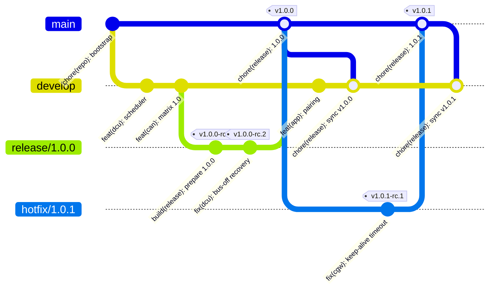

# Branching model

| Field | Value |
| --- | --- |
| Document ID | LS-PRC-001 |
| Version | 1.0 |
| Status | Approved |
| Owner | jlurg |

## Purpose and scope

This document defines the branch model of the `jlurg/locksys` repository: branch types and names, merge methods, the release freeze, the hotfix and back-merge procedures, tag rules, the definition of a stable state and the handling of external contributions.

It is the authoritative reference for the branch checks of the `pr-policy` workflow and for the branch and tag rulesets listed in [GitHub settings](github_settings.md). Commit and pull request (PR) conventions are defined in [Commits and pull requests](commits_and_prs.md).

## Model overview

LockSys uses a reduced GitFlow ("GitFlow-lite"), recorded in [ADR 0003](../adr/0003-gitflow-lite-with-develop-as-default-branch.md):

- `develop` is the default branch and the integration branch. Every work branch starts from `develop` and is merged back into it.
- `main` carries released states only. It receives merge commits from `release/*` and `hotfix/*` branches; each merge commit is tagged `vX.Y.Z`.
- Work branches are short-lived and squash-merged, so `develop` holds one commit per PR plus the back-merge commits.



The diagram draws back-merges as direct merges. In practice each back-merge goes through a `sync/*` branch and a PR.

## Branch types

| Type | Name | Created from | Merged into | Merge method | Maximum lifetime |
| --- | --- | --- | --- | --- | --- |
| Work | `<type>/<issue>-<slug>`, `<type>` one of `feature`, `fix`, `docs`, `ci`, `build`, `refactor`, `test`, `chore`, `perf` | `develop` | `develop` | Squash | 5 working days |
| Release fix | Work branch of type `fix`, `docs`, `test` or `build` | `release/X.Y.Z` | `release/X.Y.Z` | Squash | 2 working days |
| Release | `release/X.Y.Z` | `develop` | `main` | Merge commit | 2 weeks |
| Hotfix | `hotfix/X.Y.Z` | Latest release tag on `main` | `main` | Merge commit | 3 working days |
| Hotfix fix | Work branch of type `fix`, `docs`, `test` or `build` | `hotfix/X.Y.Z` | `hotfix/X.Y.Z` | Squash | 2 working days |
| Back-merge | `sync/main-to-develop-vX.Y.Z` or `sync/main-to-release-A.B.C-vX.Y.Z` | `main` | `develop` or the open `release/A.B.C` | Merge commit | Hours |
| External | `ext/<pr>-<slug>` | Reviewed fork commits | `develop` | Squash | 5 working days |
| Dependency bot | `dependabot/**` | Created by Dependabot | `develop` | Squash | Not limited |
| Spike | `spike/<issue>-<slug>` | `develop` | Never merged | Not applicable | 2 weeks |

Naming rules:

- `<issue>` is the number of the GitHub issue the branch implements. `<pr>` is the number of the original fork PR.
- `<slug>` consists of lowercase letters and digits in words separated by single hyphens.
- The full branch name is at most 60 characters, except for `dependabot/**`.
- A branch name outside these patterns fails `pr-policy`. This also rejects tool-generated namespaces.

Normative patterns, implemented by `pr-policy`:

```text
work      ^(feature|fix|docs|ci|build|refactor|test|chore|perf)/[0-9]+-[a-z0-9]+(-[a-z0-9]+)*$
release   ^release/[0-9]+\.[0-9]+\.[0-9]+$
hotfix    ^hotfix/[0-9]+\.[0-9]+\.[0-9]+$
sync      ^sync/main-to-(develop|release-[0-9]+\.[0-9]+\.[0-9]+)-v[0-9]+\.[0-9]+\.[0-9]+$
external  ^ext/[0-9]+-[a-z0-9]+(-[a-z0-9]+)*$
spike     ^spike/[0-9]+-[a-z0-9]+(-[a-z0-9]+)*$
bot       ^dependabot/.+$
```

## Allowed pull request combinations

`pr-policy` accepts a PR only if its head and base form one of the following pairs.

| Head branch | Base branch | Merge method |
| --- | --- | --- |
| Work branch, any type | `develop` | Squash |
| Work branch of type `fix`, `docs`, `test` or `build` | `release/X.Y.Z` or `hotfix/X.Y.Z` | Squash |
| `release/X.Y.Z` | `main` | Merge commit |
| `hotfix/X.Y.Z` | `main` | Merge commit |
| `sync/main-to-develop-vX.Y.Z` | `develop` | Merge commit |
| `sync/main-to-release-A.B.C-vX.Y.Z` | `release/A.B.C` | Merge commit |
| `ext/<pr>-<slug>` | `develop` | Squash |
| `dependabot/**` | `develop` | Squash |

A PR from a `spike/*` branch always fails `pr-policy`. Spike results reach `develop` through a new work branch.

The merge method is selected when the PR is merged. The `main` ruleset allows merge commits only. The `develop` and `release-hotfix` rulesets allow squash and merge commits, because back-merges need merge commits. PRs are merged with `tools/git/pr-merge.sh <pr>`, which selects the method for the base and head pair and pins the merge to the reviewed head commit.

The executable form of the patterns and of this table is `tools/git/conventions.py`, used by `pr-policy`, by the commit-msg hook and by the branch helper scripts.

## Working on a branch

1. Create the branch from the current remote state with `tools/git/new-branch.sh <type> <issue> <slug> [<base>]`, for example `tools/git/new-branch.sh feature 42 win-ctrl-model`, and publish it with `git push -u origin HEAD`.
2. Commit with SSH-signed commits under the maintainer identity, push, and open the PR early, as a draft if work is still in progress.
3. Keep the branch current by rebasing it onto `origin/develop` and pushing with `git push --force-with-lease`. Rebasing is allowed on one's own work branch only.
4. Never rewrite `develop`, `main`, `release/*` or `hotfix/*`. The rulesets reject force pushes on these branches.
5. Edit a branch in one clone at a time (the Mac clone or the Lab Host clone). Commit and push before switching machines; see [Lab Host](lab_host.md).

Every push to a repository branch other than `main` runs `dcu-iar.yml`, which reports `iar-gate` on the pushed commit. That check counts for the PR whose head is that commit.

## History shape

- `develop` is linear except for back-merge commits.
- `git log --first-parent main` is the release log: one merge commit per release or hotfix.
- The `required_linear_history` rule is not used, because `main` and the back-merges need merge commits.
- Rebase merging is disabled in the repository settings. GitHub cannot sign commits created by a rebase merge, and every commit on a protected branch must be signed.

## Release freeze

The freeze starts when `release/X.Y.Z` is created and ends when it is merged into `main`.

- Only `fix`, `docs`, `test` and `build` PRs are accepted. The version bump and the changelog update are a `build(release)` PR.
- Features, refactorings and interface changes are not accepted. A fix that requires an interface minor version change needs an ADR. A fix that requires an interface major version change is not allowed on a release branch; it goes to `develop` and into a later release.
- Every push to the release branch runs the regression HIL suite and `iar-gate`.
- After a green regression run, the release head is tagged `vX.Y.Z-rc.N` (signed), starting at `rc.1`.
- A fix that `develop` needs before the release completes is applied to `develop` by a separate PR. The back-merge after the release reconciles both changes.
- A release branch older than 2 weeks is abandoned and a new release branch is cut from `develop`.

The release steps are defined in [Release process](release_process.md).

## Hotfix procedure

1. Create `hotfix/X.Y.Z` from the latest release tag, where `Z` is the next patch number. This creates the branch without new commits:

   ```bash
   git fetch origin --tags
   git switch -c hotfix/1.0.1 v1.0.0
   git push -u origin hotfix/1.0.1
   ```

2. Fix through a `fix/<issue>-<slug>` PR into the hotfix branch (squash), created with `tools/git/new-branch.sh fix <issue> <slug> hotfix/1.0.1`. A `build(release)` PR sets `VERSION` and updates the changelog.
3. Run the regression HIL suite on the hotfix head and tag `vX.Y.Z-rc.N` after a green run.
4. Open the PR `hotfix/X.Y.Z` into `main` and merge it with a merge commit once all required checks pass.
5. Tag the merge commit `vX.Y.Z` (signed) and push the tag. `release.yml` publishes the release.
6. Back-merge `main` into `develop` and into every open `release/*` branch. The back-merge into an open release branch is required anyway: the strict status-check rule on `main` only accepts a release branch that already contains `main`.

## Back-merge procedure

```bash
git fetch origin
git switch -c sync/main-to-develop-v1.0.0 origin/main
git push -u origin HEAD
gh pr create --base develop --head sync/main-to-develop-v1.0.0 \
  --title "chore(release): merge main into develop after v1.0.0" \
  --body "Back-merge of main after v1.0.0."
```

- On conflicts, merge `origin/develop` into the sync branch with a signed merge commit (`git merge --no-ff -S origin/develop`), resolve, and push.
- Merge the PR with `tools/git/pr-merge.sh`, which uses a merge commit for `sync/*` branches.
- For an open release branch, use `sync/main-to-release-A.B.C-vX.Y.Z` with base `release/A.B.C`.

## Tags

- Tags are annotated and SSH-signed: `git tag -s vX.Y.Z -m "LockSys X.Y.Z"`.
- `vX.Y.Z` is placed only on a merge commit on `main` created by a release or hotfix PR.
- `vX.Y.Z-rc.N` is placed only on the head of a `release/*` or `hotfix/*` branch.
- No other tag names are used. Interface versions live in their interface files, not in tags.
- Tags are immutable. The `tags` ruleset blocks updates and deletion, and a published immutable release blocks reuse of its tag name even after deletion. A tag is never re-created: increment `rc.N` or the patch number instead.
- `release.yml` verifies the tag signature and rejects a tag whose version differs from the `VERSION` file.

## Definition of stable

A commit is stable if and only if all of the following hold:

1. It is a first-parent commit of `main` created by GitHub as the merge commit of a `release/*` or `hotfix/*` PR, and it carries a `vX.Y.Z` tag.
2. Its second parent, the release or hotfix head, passed `pr-policy`, `ci-gate`, `iar-gate` and the full `hil-gate`.
3. Its tree is identical to the tree of its second parent. The strict status-check rule on `main` guarantees this, and `release.yml` checks it again before publishing.

`develop` is integrated, not stable: each change passed the PR checks and the nightly HIL runs on it. No release branch is cut before the HIL gate exists (milestone M5). Until then `main` holds only the bootstrap commit.

## External contributions

- During the MVP, PR creation is limited to collaborators (`pull_request_creation_policy = collaborators_only`). Forks cannot open PRs.
- When external contributions are opened (LATER):
  - Fork PRs run GitHub-hosted workflows only, after maintainer approval (approval required for all external contributors).
  - Self-hosted workflows have no PR trigger, and the Lab Host hook rejects any other event, so fork code never reaches the Lab Host.
  - After review, the maintainer fetches `pull/<pr>/head`, re-signs the commits with the maintainer key while keeping the original author, pushes the result as `ext/<pr>-<slug>` and opens an internal PR into `develop`. The squash commit credits the contributor with a `Co-authored-by:` trailer (human contributors only). The fork PR is closed with a link to the internal PR.
  - The re-push is required because unsigned head commits block even a squash merge under the required-signatures rule.

```bash
git fetch origin pull/57/head:ext/57-tmp117-retry
git switch ext/57-tmp117-retry
git rebase --exec "git commit --amend --no-edit -S" origin/develop
git push -u origin ext/57-tmp117-retry
```

## Dependency update branches

- Dependabot opens `dependabot/**` branches against `develop` (the default branch). Commit-message prefixes produce Conventional titles such as `ci(deps): ...` and `build(deps): ...`.
- Dependabot pushes do not run self-hosted jobs because the triggering actor is not trusted. After reviewing the diff, the maintainer re-runs the failed `iar-gate` run ("Re-run failed jobs"), which makes the maintainer the triggering actor.

## Rationale

- **`develop` as default branch.** GitHub closing keywords close issues only when the PR merges into the default branch, Dependabot targets the default branch, and scheduled workflows run on it. With `develop` as default, issues close on integration, dependency updates go through integration, and the nightly HIL runs test `develop`.
- **Squash for work branches.** Each PR becomes one reviewed, signed commit whose subject is the Conventional PR title, which keeps `develop` readable and changelog generation reliable.
- **Merge commits for release, hotfix and back-merge branches.** The exact tested tree reaches `main` unchanged, `main` gets a first-parent release log, and back-merges never rewrite history.
- **Regex-validated branch names.** Branch-name and commit-metadata restrictions in rulesets are not available to repositories owned by personal accounts, so `pr-policy` enforces them.

## References

- [ADR 0003: GitFlow-lite with develop as default branch](../adr/0003-gitflow-lite-with-develop-as-default-branch.md)
- [Commits and pull requests](commits_and_prs.md)
- [Release process](release_process.md)
- [GitHub settings](github_settings.md)
- [CI/CD](ci_cd.md)
- [Mermaid gitGraph syntax](https://mermaid.js.org/syntax/gitgraph.html)
- [GitHub: linking a pull request to an issue](https://docs.github.com/en/issues/tracking-your-work-with-issues/using-issues/linking-a-pull-request-to-an-issue)
- [GitHub: available rules for rulesets](https://docs.github.com/en/repositories/configuring-branches-and-merges-in-your-repository/managing-rulesets/available-rules-for-rulesets)
