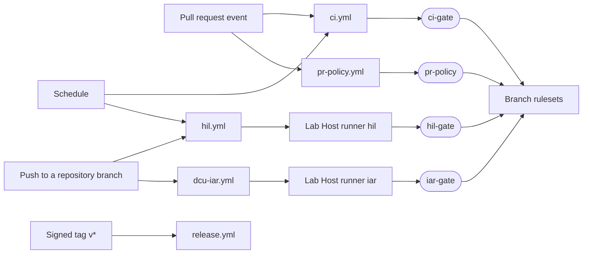

# CI/CD

| Field | Value |
| --- | --- |
| Document ID | LS-PRC-007 |
| Version | 1.1 |
| Status | Approved |
| Owner | jlurg |

## Purpose and scope

This document defines the CI/CD contract of the repository: workflows, jobs, required checks, triggers, runner placement, workflow security rules, pinning, caching and retention. The workflow files in `.github/workflows/` implement this contract.

The names of the required checks (`pr-policy`, `ci-gate`, `iar-gate`, `hil-gate`) are referenced by the rulesets in [GitHub settings](github_settings.md) and do not change.

## Principles

1. **Required checks are aggregator jobs.** Each required check is a GitHub-hosted job with `if: always()` that evaluates the results of the jobs it depends on. GitHub reports a job skipped by a condition as successful, so a required check must never be skippable itself.
2. **Required workflows have no path or branch filters.** A workflow skipped by a filter leaves its required check pending forever. Path selection happens inside the workflow (job `changes`).
3. **Checks belong to commits.** A required check must pass on the head commit of the PR. Check runs from `push`-triggered workflows on that commit count; runs triggered by `workflow_dispatch` or `schedule` never satisfy a required check. A required check is re-validated with "Re-run failed jobs" on the `push` run.
4. **Self-hosted jobs run only on trusted events.** Workflows with self-hosted jobs are triggered only by `push` (repository branches), `schedule` and `workflow_dispatch`. `tools/ci/check_self_hosted.py` enforces this in the `workflow-lint` job, including indirect use through reusable workflows; a GitHub-hosted job checks the repository and the triggering actor against `TRUSTED_ACTORS` before a self-hosted job is queued; the Lab Host hook enforces the rules again on the host ([ADR 0004](../adr/0004-lab-host-self-hosted-runner-trust-model.md)).
5. **Least privilege.** The default token permission is `contents: read`. Write permissions are granted per job, only in GitHub-hosted jobs.
6. **Everything pinned.** Actions by full commit SHA, container images by digest, downloaded archives by SHA-256, toolchains by `tools/versions.env`.
7. **Same commands locally and in CI.** CI runs the canonical commands listed at the end of this document.

## Required checks

| Check | Workflow | Where it runs | Required on | Added to the rulesets |
| --- | --- | --- | --- | --- |
| `pr-policy` | `pr-policy.yml` | GitHub-hosted | `develop`, `release/*`, `hotfix/*`, `main` | At bootstrap |
| `ci-gate` | `ci.yml` | GitHub-hosted | `develop`, `release/*`, `hotfix/*`, `main` | At bootstrap |
| `iar-gate` | `dcu-iar.yml` | Gate GitHub-hosted; build on the Lab Host runner `iar` | `develop`, `release/*`, `hotfix/*`, `main` | When the Lab Host runner is online |
| `hil-gate` | `hil.yml` | Gate GitHub-hosted; tests on the Lab Host runner `hil` | `main` | Milestone M5 |

## Workflows

| Workflow | Triggers | Purpose | Check |
| --- | --- | --- | --- |
| `ci.yml` | `pull_request` into `develop`, `main`, `release/**`, `hotfix/**`; `push` to `develop` and `main`; weekly `schedule` (Monday 05:23 UTC) on `develop`; `workflow_dispatch` | Lint, code generation check, builds, unit tests, documentation checks | `ci-gate` |
| `pr-policy.yml` | `pull_request` (opened, edited, synchronize, reopened, ready_for_review) | Branch, title, issue and attribution policy (job `pr-policy`); size label (job `size-label`, best effort) | `pr-policy` |
| `dcu-iar.yml` | `push` to every branch except `main`; `workflow_dispatch` | IAR build and C-STAT on the Lab Host | `iar-gate` |
| `_iar-build.yml` | `workflow_call` only | Shared IAR build definition used by `dcu-iar.yml`, `hil.yml` and `release.yml` | None |
| `hil.yml` | `push` to `develop` (smoke), `push` to `release/**` and `hotfix/**` (regression), `schedule` (nightly, 02:17 Lab Host time; weekly soak from milestone M5), `workflow_dispatch` (suite `smoke`, `regression` or `nightly`) | HIL tests on the Lab Host bench | `hil-gate` |
| `codeql.yml` | `push` and `pull_request` for `develop` and `main`; weekly schedule (Tuesday 04:41 UTC) | CodeQL for Python and GitHub Actions | None |
| `release.yml` | `push` of tags `v*` | Release verification, build and publication | None |

## Jobs of `ci.yml`

| Job | Runs when | Content | Blocking |
| --- | --- | --- | --- |
| `changes` | Always | Path classification with `.github/filters.yml`; selects the jobs to run | Yes: `ci-gate` fails if `changes` fails |
| `lint` | Always | `SKIP=no-commit-to-branch,dart-format uv run pre-commit run --all-files`: file hygiene, clang-format, ruff, gitleaks, actionlint, zizmor, JSON schemas, typos, shellcheck, markdownlint-cli2, attribution and DBC checks (Dart formatting is checked in `app`) | Yes |
| `codegen` | Interfaces, generators or generated code changed | `uv run tools/codegen/regen.py --check`; enumeration consistency between YAML, DBC and protobuf | Yes |
| `vs-manifest` | DCU changed | `uv run tools/vs/vs_manifest.py --check`: model files against generated engines | Yes |
| `dcu-unit` | DCU or libraries changed | `tools/docker/ceedling/run.sh firmware/dcu test:all` with coverage thresholds (`tools/ci/coverage_gate.py`) | Yes |
| `dcu-gcc` | DCU or libraries changed | GCC shadow build with `-Werror` and size report | Yes |
| `dcu-static` | DCU or libraries changed | Complexity limits (lizard with `tools/ci/complexity_gate.py`), `tools/arch/check_layers.py`; cppcheck MISRA addon | Complexity and layers yes; cppcheck advisory |
| `libs-unit` | Libraries or interface vectors changed | `tools/docker/ceedling/run.sh libs/ls_e2e test:all` and `libs/ls_common`, with the contract test vectors | Yes |
| `cgw-build` | CGW or libraries changed | ESP-IDF build in `espressif/idf:v5.5.5` pinned by digest; size report | Yes |
| `cgw-unit` | CGW or libraries changed | Host tests of the portable CGW core | Yes |
| `app` | APP or protocol changed | Flutter from the pinned archive; `flutter analyze --fatal-infos`, `flutter test`, format check | Yes |
| `python` | HIL or tools changed | `uv run ruff check .`, `uv run mypy`, `uv run pytest` (no hardware) | Yes |
| `docs` | Documentation or traced sources changed | Relative link check (lychee, offline, pinned archive with SHA-256 check), `uv run tools/trace/trace.py --report`; Markdown lint runs in `lint` | Links yes; trace see below |
| `workflow-lint` | Workflows, CI tools or PowerShell scripts changed | actionlint, zizmor, `uv run tools/ci/check_self_hosted.py`; PowerShell checks `tools/labhost/tests/Invoke-LabhostChecks.ps1` (parse, PSScriptAnalyzer, Pester) | Yes |
| `ci-gate` | Always | Succeeds only if `changes` succeeded and every other job succeeded or was skipped | Required check |

Path rules:

- A change under `.github/` runs all jobs.
- `push`, `schedule` and `workflow_dispatch` runs execute all jobs.
- Pull requests are classified against their base branch.
- A job whose inputs do not exist yet (for example `firmware/dcu/project.yml` or `app/pubspec.yaml` during milestone M0) is not run; `changes` reports it with a notice and `ci-gate` treats it as skipped.

Trace gate phases: report only until the exit of milestone M2; blocking for DCU software requirements from M2; blocking for all MVP requirements on `release/*` branches, where passing test results are also required.

## `pr-policy.yml`

The job `pr-policy` checks:

- the branch name and the base and head combination against [Branching model](branching.md);
- the Conventional Commits title and its scopes against [Commits and pull requests](commits_and_prs.md);
- a linked issue, with the documented exemptions;
- the absence of AI attribution in all commit messages of the PR, in author and committer names and e-mail addresses, and in the PR title and body ([AI policy](ai_policy.md)).

The job reads PR data through the API with a read-only token. PR titles, bodies and branch names reach scripts only through environment variables and files. The policy scripts are taken from the base commit of the PR, so a PR cannot relax the rules it is checked against.

The separate job `size-label` applies one `size/*` label from the changed lines, excluding generated code, vendored code and lock files. It has `pull-requests: write`, runs with `continue-on-error: true` and is not a required check: the tokens of Dependabot and fork PRs are read-only.

## `dcu-iar.yml` and `_iar-build.yml`

| Job | Runner | Behaviour |
| --- | --- | --- |
| `changes` | GitHub-hosted | Decides whether the push is DCU-relevant (paths compared with `develop`): `firmware/dcu/`, `libs/`, `interfaces/`, `third_party/`, the IAR workflows and the CI tools they use; detects whether the IAR project `firmware/dcu/iar/*.ewp` exists |
| `trust` | GitHub-hosted, no permissions | Fails unless the repository is `jlurg/locksys` and the triggering actor is listed in the variable `TRUSTED_ACTORS` |
| `iar` | Lab Host `[self-hosted, windows, iar]` through `_iar-build.yml` | Runs for DCU-relevant pushes, for manual dispatch and always for `develop`, `release/*` and `hotfix/*`, once the IAR project exists and `trust` succeeded |
| `iar-gate` | GitHub-hosted, `if: always()` | Fails if `changes` failed, or if an IAR build was required and `trust` or `iar` did not succeed; passes with a warning while the IAR project does not exist |

`_iar-build.yml` performs:

1. Clean checkout with `persist-credentials: false`.
2. Once the Visual State model exists: regeneration with the committed coder options, `git diff --exit-code firmware/dcu/gen_vs`, and the Verificator report with zero critical findings.
3. `firmware/dcu/scripts/iar/Invoke-DcuBuild.ps1 -Configs Debug,Release -CStat`. The script supports the command-line forms of EWARM 9.70.x and 10.10.x.
4. The C-STAT gate (`tools/ci/cstat_gate.py`): zero unsuppressed findings; every suppression cites an approved record of the [deviation register](misra/deviations.yaml) that covers the suppressed check, and no suppression appears in generated code; every approved `DEV-DCU` and `DEV-LIB` record is referenced; no heap functions in any map file and no fault-injection symbols in the Release map; the compiler version equals `tools/versions.env`.
5. Upload of images, map files, the C-STAT HTML report and SARIF as artefacts. The SARIF upload to code scanning runs in a GitHub-hosted job.

Operational rules:

- If the Lab Host is offline, the self-hosted job waits in the queue for up to 24 hours and is then cancelled, so `iar-gate` fails. After the host is back, re-run the failed jobs of the `push` run.
- A `workflow_dispatch` run produces evidence only; it never satisfies `iar-gate`.
- Pushes by Dependabot or any other actor not listed in `TRUSTED_ACTORS` fail the `trust` job and never reach the Lab Host, so `iar-gate` fails for DCU-relevant updates by them. After reviewing the diff, the maintainer re-runs the failed jobs, which makes the maintainer the triggering actor.
- Until the IAR project is created on the Lab Host ([IAR project setup guide](../04_software/dcu/iar_project_setup.md)), `iar-gate` passes with a warning. Removing `firmware/dcu/iar/*.ewp` therefore disables the build; such a change requires review by the code owner.

## `hil.yml`

| Suite | Trigger | Content |
| --- | --- | --- |
| Smoke | `push` to `develop` | Short HIL-SIM suite |
| Regression | `push` to `release/**` and `hotfix/**` | Full HIL-SIM regression |
| Nightly | `schedule`, nightly | Full HIL-SIM regression on `develop` |
| Soak | From milestone M5: `schedule`, weekly; manual dispatch per release candidate | 8 h HIL-SIM soak (SYS-071) |
| Manual | `workflow_dispatch` | Selected suite (`smoke`, `regression` or `nightly`); evidence only |

| Job | Runner | Behaviour |
| --- | --- | --- |
| `plan` | GitHub-hosted, no permissions | Selects the suite and its timeout; when the bench is online, checks the repository and the triggering actor against `TRUSTED_ACTORS` |
| `hil` | Lab Host `[self-hosted, windows, hil]` | Runs only when the repository variable `HIL_BENCH_STATE` is `online`; executes the suite, scans the evidence for secrets and uploads it |
| `notify` | GitHub-hosted, `issues: write` | Opens or updates the failure issue when a scheduled run fails |
| `hil-gate` | GitHub-hosted, `if: always()` | Fails if `plan` failed or the bench ran and `hil` did not succeed; passes with a warning when the bench is offline or in maintenance |

- Until milestone M5 every suite runs the `smoke` marker set, and the soak schedule is not configured.
- Bench jobs run on `[self-hosted, windows, hil]` in the concurrency group `hil-bench`, queued and never cancelled by newer runs.
- `hil-gate` is required on `main` from milestone M5.
- Evidence is scanned for secrets before upload. Failure notifications for scheduled runs are created by a GitHub-hosted job.
- Scheduled workflows run on the default branch (`develop`). GitHub disables them after 60 days without repository activity.
- The schedules use the Lab Host time zone.

## `codeql.yml`

CodeQL analyses Python and GitHub Actions (`build-mode: none`). C and C++ analysis of the DCU shadow build and the CGW host build is LATER.

## `release.yml`

The release workflow is defined in [Release process](release_process.md).

## Workflow security rules

- Self-hosted jobs: triggers `push`, `schedule` and `workflow_dispatch` only; `permissions: contents: read`; `actions/checkout` with `persist-credentials: false` and a clean workspace.
- The triggers `pull_request_target`, `workflow_run` and `issue_comment` are not used in this repository.
- Write permissions are granted only to GitHub-hosted jobs that need them: `security-events: write` (SARIF upload), `issues: write` (failure notifications), `pull-requests: write` (size label), `contents: write`, `id-token: write` and `attestations: write` (release publication in the `release` environment).
- There are no repository secrets in the MVP; workflows use the automatic `GITHUB_TOKEN` only. The repository variables `TRUSTED_ACTORS` and `HIL_BENCH_STATE` are defined in [GitHub settings](github_settings.md).
- Workflow logs and artefacts are public. Nothing secret is printed; HIL console captures are redacted and scanned before upload.
- Untrusted values reach scripts only through `env:`.

## Pinning

- Actions are referenced by full commit SHA with a version comment, for example `uses: actions/checkout@<sha> # vX.Y.Z`. The repository setting requiring SHA-pinned actions is enabled ([ADR 0010](../adr/0010-pin-actions-by-commit-sha.md)). SHAs are resolved with `gh api repos/<owner>/<repo>/git/ref/tags/<tag>`; annotated tags are dereferenced to their commit.
- Container images are referenced by digest, for example `espressif/idf:v5.5.5@sha256:<digest>`; the digest is recorded in `tools/versions.env`.
- Flutter is installed in CI from the release archive with a SHA-256 check, not through a third-party action.
- GitHub-hosted runner labels name an explicit image version (`ubuntu-24.04`), never `-latest`.
- Toolchain versions come from `tools/versions.env`; the gates compare installed compiler versions against it.

## Caching

- Caches are written by pushes and schedules on `develop`; pull request runs read them and write only to their own scope.
- `release.yml` uses no caches.

## Retention

| Data | Retention |
| --- | --- |
| IAR build artefacts, HIL evidence, release staging artefacts | 30 days (set per upload) |
| Other artefacts, workflow runs, logs and check results | 90 days (repository setting; maximum for public repositories) |
| Release evidence | Permanent, as assets of immutable releases |

## Canonical commands

| Purpose | Command |
| --- | --- |
| Code generation | `uv run tools/codegen/regen.py` (check: `--check`) |
| C unit tests | `tools/docker/ceedling/run.sh <directory with project.yml> test:all` |
| DCU GCC shadow build | `cmake -S firmware/dcu -B build/dcu-gcc -G Ninja -DCMAKE_TOOLCHAIN_FILE=firmware/dcu/cmake/arm-none-eabi-gcc.cmake && cmake --build build/dcu-gcc` |
| CGW build | `docker run --rm -v "$PWD":/project -w /project/firmware/cgw espressif/idf:v5.5.5 idf.py build` |
| Python tests | `uv run pytest` |
| Python lint | `uv run ruff check . && uv run mypy` |
| APP | `cd app && fvm flutter analyze && fvm flutter test` |
| Trace report | `uv run tools/trace/trace.py --report` |
| IAR build (Lab Host, PowerShell) | `firmware/dcu/scripts/iar/Invoke-DcuBuild.ps1 -Configs Debug,Release -CStat` |
| Hooks and linters | `uv run pre-commit run --all-files` |

## Rationale

- Aggregator gates with `if: always()` and in-workflow path classification keep required checks deterministic while path filtering keeps CI time low.
- Running the Lab Host jobs from `push` events lets the IAR result gate PRs without ever executing PR-supplied workflow definitions on the Lab Host.
- Pinning and the absence of caches in releases make release builds reproducible and resistant to supply-chain changes.

## References

- [GitHub settings](github_settings.md)
- [Lab Host](lab_host.md)
- [Toolchains](toolchains.md)
- [Release process](release_process.md)
- [ADR 0004: Lab Host self-hosted runner trust model](../adr/0004-lab-host-self-hosted-runner-trust-model.md)
- [ADR 0010: Pin actions by commit SHA](../adr/0010-pin-actions-by-commit-sha.md)
- [GitHub: troubleshooting required status checks](https://docs.github.com/en/pull-requests/how-tos/merge-and-close-pull-requests/troubleshooting-required-status-checks)
- [GitHub: security hardening for GitHub Actions](https://docs.github.com/en/actions/reference/security/secure-use)
