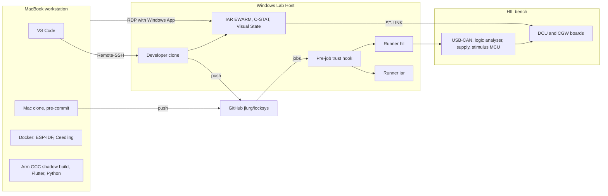

# Lab Host and workstation workflow

| Field | Value |
| --- | --- |
| Document ID | LS-PRC-009 |
| Version | 1.1 |
| Status | Approved |
| Owner | jlurg |

## Purpose and scope

This document defines the split of work between the MacBook workstation and the Windows "Lab Host", the daily working flows, the Lab Host setup, the configuration and security of the self-hosted runners, the day-1 checks that must pass before the IAR and Visual State parts of the plan are relied on, and Lab Host operations. The decisions behind it are recorded in [ADR 0012](../adr/0012-mac-workstation-with-windows-lab-host-for-iar.md) and [ADR 0004](../adr/0004-lab-host-self-hosted-runner-trust-model.md).

## Topology



| Machine | Role |
| --- | --- |
| MacBook | Workstation: editing, git, ESP-IDF builds in a container, Flutter, Ceedling in Docker, the DCU GCC shadow build, Python tools. Holds no IAR licence. |
| Lab Host (Windows 11 Pro) | Holds the node-locked IAR licence (EWARM, C-STAT, Visual State) and the HIL bench. Runs the self-hosted runners `iar` and `hil`, and the developer clone used through Remote-SSH and RDP. |

## Working flows

| Flow | Used for | Working copy | How |
| --- | --- | --- | --- |
| Primary: VS Code Remote-SSH | DCU editing, IAR builds, C-STAT, C-SPY debugging on the bench NUCLEO | Developer clone `C:\dev\locksys` on the Lab Host | VS Code on the Mac connects to host `labhost`; the IAR Build and IAR C-SPY Debug extensions run on the Lab Host side, where the licence and the ST-LINK are |
| Official verification | Reproducible IAR build and C-STAT for every pushed commit | Runner workspace | Push a branch; `dcu-iar.yml` runs on runner `iar` and reports `iar-gate` |
| Remote desktop | Visual State modelling, Validator, Documenter and C-SPYLink animation; IAR IDE project options; C-STAT triage in the IDE | Developer clone | Windows App on the Mac connects to the Lab Host |
| Workstation only | ESP-IDF, Flutter, Ceedling, GCC shadow build, Python, documentation | Mac clone | Local commands; see [CI/CD](ci_cd.md) for the canonical commands |
| Private work-in-progress builds (LATER) | IAR build of unpushed work | Bare repository on the Lab Host | Push to a private remote, build over SSH |

## Working rules

1. A branch is edited in one clone at a time. Before switching machines, commit and push; on the other machine, `git fetch` and `git switch <branch>`.
2. The Lab Host clone uses the same git identity as the Mac and its own SSH signing key, registered on GitHub. Its hooks are installed with `uv run pre-commit install --install-hooks`.
3. Runner work directories are never edited by hand.
4. IAR project files (`.eww`, `.ewp`, `.ewd`) are changed in the IAR IDE and committed from the Lab Host clone. They are never written by hand. The project creation steps are in the [IAR project setup guide](../04_software/dcu/iar_project_setup.md).
5. Visual State code is generated only with `firmware/dcu/scripts/vs/Invoke-VsGenerate.ps1` and committed together with the model change ([Visual State modelling guide](../04_software/dcu/visual_state_guide.md)).
6. Before a remote desktop session or any manual use of the bench, create `C:\labhost\bench.lock`. After the session, return the runner session to the console with `tools/labhost/Restore-ConsoleSession.ps1` and delete the lock.
7. While the CPU is halted in a debug session with a motor connected, the 12 V supply output is off or its current limit is at most 0.5 A. A halted CPU also halts the software protections.

## Lab Host setup

### Operating system and access

- Windows 11 Pro. A remote desktop host requires the Pro edition.
- OpenSSH Server with key authentication only and `pwsh` as default shell. Keys of administrator accounts are in `C:\ProgramData\ssh\administrators_authorized_keys`, with access restricted to Administrators and SYSTEM.
- Remote desktop with Network Level Authentication.
- Windows Firewall inbound: SSH (22) and remote desktop (3389) only from the workstation address (DHCP reservation) or a private tailnet. No port forwarding from the internet.
- BitLocker on the system drive; the recovery key is stored offline.

### Software

| Software | Version | Notes |
| --- | --- | --- |
| IAR Embedded Workbench for Arm with C-STAT | Baseline 9.70.x; 10.10.x only if the licence allows | Exact build recorded in `tools/versions.env` (`IAR_EWARM_BASELINE`) |
| IAR Visual State | 11.2.1 or later | Minimum in `tools/versions.env` (`IAR_VISUAL_STATE_MIN`) |
| Git for Windows | Current | `core.autocrlf false`, `core.longpaths true` |
| PowerShell | 7.x | Default shell for SSH and scripts |
| uv with Python 3.13 | As in `tools/versions.env` | Installed from the pinned release archive (SHA-256 checked) into `C:\labhost\tools\uv` on the machine `PATH`; Python installed per runner through uv. CI gates, version header generator, HIL framework |
| STM32CubeProgrammer CLI and ST-LINK driver | Current | Scripted flashing |
| Saleae Logic 2 | Installed version recorded | Automation interface enabled |
| USB-CAN adapter driver | Vendor driver | After the adapter is purchased ([BOM](../00_project/bom.md)) |
| GitHub Actions runner | Current, auto-update on | Two instances |

### Accounts and directories

| Account | Type | Use |
| --- | --- | --- |
| Developer account | Interactive user | Remote-SSH, remote desktop, developer clone |
| `labrunner` | Standard user, not an administrator; automatic logon to an interactive session, screen locked after logon | Runs both runner instances |

| Path | Content |
| --- | --- |
| `C:\dev\locksys` | Developer clone |
| `C:\labhost\` | Root; Administrators full control, `labrunner` read and execute |
| `C:\labhost\runners\iar`, `C:\labhost\runners\hil` | Runner installations, runner `.env` and work directories `_work`; `labrunner` modify |
| `C:\labhost\hooks\` | Job-started and job-completed hook scripts, copied from `tools/labhost/hooks/` by `setup-labhost.ps1`; `labrunner` read and execute |
| `C:\labhost\trusted.txt` | Trusted triggering actors, one per line (`jlurg`), `#` comments; `labrunner` read |
| `C:\labhost\tools\uv\` | Pinned uv release on the machine `PATH`; `labrunner` read and execute |
| `C:\labhost\evidence\` | Local HIL evidence before upload; `labrunner` modify |
| `C:\labhost\bench.lock` | Manual bench reservation by the maintainer; present only while the bench is reserved; `labrunner` read |

The runner account cannot change the hooks, `trusted.txt` or uv, so a job cannot weaken the gate for later jobs. The HIL framework keeps its runtime bench lock in a directory writable by `labrunner`, never in `bench.lock`.

The host is prepared with `tools/labhost/setup-labhost.ps1` (administrator, idempotent): directories and access control lists, the `labrunner` account, the hooks, OpenSSH, remote desktop, firewall scope, Git, PowerShell 7, uv and power settings. The script lists the remaining manual steps (automatic logon, BitLocker, BIOS power-on after AC loss, IAR installation and licence). The procedure is in [`tools/labhost/README.md`](../../tools/labhost/README.md).

### Workstation side

- `~/.ssh/config` on the Mac:

  ```text
  Host labhost
    HostName <lab-host-address>
    User <developer-account>
    IdentityFile ~/.ssh/<private-key>
  ```

- VS Code with the Remote-SSH extension and the setting `"remote.SSH.remotePlatform": {"labhost": "windows"}`. The IAR Build and IAR C-SPY Debug extensions are installed on the remote side; the remote workspace is trusted.
- Windows App (Microsoft) for remote desktop sessions.

## Runners

| Runner | Labels | Account | Purpose | Available from |
| --- | --- | --- | --- | --- |
| `labhost-iar` | `self-hosted`, `windows`, `iar` | `labrunner` | IAR builds, C-STAT, Visual State regeneration check | M0, after the day-1 checks |
| `labhost-hil` | `self-hosted`, `windows`, `hil` | `labrunner` | HIL suites; the only runner that controls the bench supply | M5 |

- Runners are registered to the repository; runner groups are not available to personal accounts.
- Both instances run in the interactive session of `labrunner`, because the logic analyser automation drives the Logic 2 application. Two instances prevent a long soak run from blocking IAR builds.
- Registration as `labrunner`, not elevated, with a registration token (`gh api -X POST repos/jlurg/locksys/actions/runners/registration-token --jq .token`):

  ```powershell
  .\tools\labhost\register-runner.ps1 -Role iar -EwarmDir '<EWARM installation root>'
  .\tools\labhost\register-runner.ps1 -Role hil -PsuAddress <host>:5025   # from milestone M5
  ```

  The script installs the pinned runner release (SHA-256 checked), writes the runner `.env`, registers `labhost-iar` or `labhost-hil` and installs Python through uv.
- The runner is started at logon of `labrunner` (Startup entry for `run.cmd`), not as a Windows service.

Runner environment (`.env` in the runner directory; it holds no secret and takes effect after a runner restart):

| Key | Runner | Value |
| --- | --- | --- |
| `ACTIONS_RUNNER_HOOK_JOB_STARTED` | Both | `C:\labhost\hooks\Assert-TrustedJob.ps1` |
| `ACTIONS_RUNNER_HOOK_JOB_COMPLETED` | Both | `C:\labhost\hooks\Complete-Job.ps1` |
| `LABHOST_ROOT` | Both | `C:\labhost` |
| `LABHOST_ROLE` | Both | `iar` or `hil` |
| `LS_EWARM_DIR` | `iar` | EWARM installation root, used by `_iar-build.yml` and the IAR build scripts |
| `LABHOST_PSU_ADDRESS` | `hil` | SCPI raw-socket endpoint `host:port` of the bench supply |
| `LABHOST_PSU_OFF_COMMAND`, `LABHOST_PSU_STATE_QUERY` | `hil`, optional | Defaults `OUTP OFF` and `OUTP?`; the read-back must be `0` or `OFF` |

## Runner security

| Control | Implementation |
| --- | --- |
| Trusted triggers only | Workflows with self-hosted jobs use `push`, `schedule` and `workflow_dispatch` only; `tools/ci/check_self_hosted.py` fails CI otherwise |
| Host trust gate | Each runner's `.env` sets `ACTIONS_RUNNER_HOOK_JOB_STARTED` to the job-started script in `C:\labhost\hooks\`. The script (`Assert-TrustedJob.ps1`) performs local checks only and fails closed, also on a missing variable, a missing or empty `trusted.txt` or an unknown role, unless the repository is `jlurg/locksys`, the event is `push`, `schedule` or `workflow_dispatch`, and `GITHUB_TRIGGERING_ACTOR` is listed in `trusted.txt`. On runner `hil` it also fails while `bench.lock` exists. A failing hook stops the job before any step runs. |
| Cleanup | `ACTIONS_RUNNER_HOOK_JOB_COMPLETED` runs the job-completed script (`Complete-Job.ps1`): on runner `hil` the supply output is switched off over SCPI and read back first (a failure fails the job); processes started from the runner's work directory are stopped; the workspace is cleaned and temporary files are removed |
| Token scope | Self-hosted jobs have `permissions: contents: read`; checkout uses `persist-credentials: false` and a clean workspace |
| Account | `labrunner` is not an administrator; IAR, the developer clone and the runners are separate |
| Secrets | No GitHub secrets or tokens on the host. The bench pairing key used by HIL tests is stored in the Windows Credential Manager of `labrunner` and read through `keyring`; it is never in the repository. Runner credential files are protected by file permissions and BitLocker. |
| Public logs | Workflow logs and artefacts are world-readable. HIL console captures are redacted and scanned for secrets before upload. |
| Network | Inbound restricted as above; runners need outbound HTTPS only. The serial bridge for remote CGW flashing (RFC 2217) has no authentication and is reached only through an SSH tunnel. The USB Wi-Fi adapter that joins the CGW access point has a higher interface metric than Ethernet, so the default route stays on Ethernet. |
| Updates | Runner auto-update stays on; a runner that misses updates for 30 days stops receiving jobs. Windows Update active hours cover the nightly HIL window; from milestone M5, updates are paused over soak weekends. IAR and Visual State updates only through an ADR and a pin-change PR. |
| Dependency bot | Dependabot pushes never run on the host: the GitHub-hosted `trust` (IAR) and `plan` (HIL) jobs reject actors not listed in `TRUSTED_ACTORS`, and the host hook rejects actors not listed in `trusted.txt`. The maintainer re-runs the failed jobs after reviewing the diff. |

Deferred hardening (LATER): a check that the head commit carries a GitHub-verified signature; separate hook scripts per runner; a periodic task that switches the bench supply off when no job is running; just-in-time runner registration; headless logic analyser automation, which removes the need for an interactive session.

## Day-1 checks

These checks run when the Lab Host is set up (manual step U4) and when IAR or Visual State are updated. Each result is recorded in this table as GO or NO-GO, with the date, in a documentation PR (title prefix `docs:`).

| ID | Check | Pass criterion | If it fails | Result |
| --- | --- | --- | --- | --- |
| D1 | EWARM version covered by the licence | Licence activates 9.70.x (or 10.10.x); exact build recorded in `tools/versions.env` | Use the licensed line; the build scripts support both command-line forms | Pending |
| D2 | C-STAT included in the licence | C-STAT report produced for a test project | GCC shadow build and cppcheck MISRA addon only; the MISRA claim is suspended ([ADR 0008](../adr/0008-misra-guideline-enforcement-plan.md)) | Pending |
| D3 | Licence usable by `labrunner` | IAR build succeeds when started with `runas /user:labrunner` | Run the runners under the developer account | Pending |
| D4 | Automated builds permitted by the licence terms | Written confirmation from IAR or the distributor | `iar-gate` becomes a manual attestation; decided before M0 closes | Pending |
| D5 | Windows edition | Windows 11 Pro | Upgrade, or use a third-party remote desktop tool | Pending |
| D6 | NUCLEO-F103RB board revision | MB1136 revision C-02 or later (label on the bottom side) | Rework the solder bridges for the 8 MHz clock from the ST-LINK | Pending |
| D7 | Visual State version, licence and headless use | Version 11.2.1 or later; `Coder.exe` and `Verificator.exe` run without GUI over SSH and as `labrunner` | Generate in the developer session; the cloud manifest check still detects stale generated code | Pending |
| D8 | C-SPYLink plugin | `vs.ewplugin` loads for the installed EWARM; animation works in the IDE; behaviour in the VS Code C-SPY extension recorded | Use the IDE over remote desktop for animation | Pending |
| D9 | First generation (step U5) | Classic Coder selected; names `<System>VSDeduct`; use of `va_*` recorded; contradiction tests present; C-STAT baseline of the generated code recorded | The baseline defines the DP-05 guideline list; "model as specification" fallback ([ADR 0013](../adr/0013-iar-visual-state-for-dcu-state-machines.md)) | Pending |
| D10 | IAR extensions over Remote-SSH | Build, C-STAT and debug from VS Code on the Mac | Remote desktop becomes the primary IAR flow | Confirmed by the maintainer before M0 |
| D11 | C-STAT SARIF output | SARIF produced and paths map to repository paths | Publish the HTML report only; SARIF upload LATER | Pending |
| D12 | Remote desktop and the `labrunner` session | Runner instances keep running during and after a remote desktop session; the console return procedure works | Avoid remote desktop sessions during HIL runs | Pending |
| D13 | STM32 device revision marking (ES096 §2.2.9) | Marking recorded | Follow the errata sheet for the marked revision | Pending |

## Operations

- **Lab Host offline.** Self-hosted jobs wait up to 24 hours and are then cancelled, so the required checks fail. When the host is back, re-run the failed jobs of the `push` runs. The BIOS option "power on after AC loss" is enabled.
- **Remote desktop sessions.** Create `bench.lock`, connect, and after disconnecting run `tools/labhost/Restore-ConsoleSession.ps1` from an elevated shell (for example over SSH) so that the `labrunner` session returns to the console. Then delete `bench.lock`.
- **IAR licence.** Before a hardware change or reinstallation, return the licence with the IAR License Manager; reactivate afterwards. Licence numbers and activation data are not stored in the repository.
- **System image.** A full system image is taken after M0 and after every toolchain change.
- **Remote CGW flashing.** Under `bench.lock`, the Lab Host serves the CGW serial port with `esp_rfc2217_server.py -p 4000 <COM port>` from an ESP-IDF v5.5.5 environment. The Mac opens `ssh -N -L 4000:localhost:4000 labhost` and flashes with `idf.py -p "rfc2217://localhost:4000?ign_set_control" flash monitor`.

## Rationale

- The IAR licence is node-locked to the Lab Host, and Visual State has no macOS host. Remote-SSH gives native editing on the Mac while the toolchain, licence and debug probe stay on the Lab Host; remote desktop covers the graphical tools.
- Running both runners under one standard account in an interactive session avoids the open question of whether the node-locked licence works for a service account, and keeps the logic analyser automation working.
- The host trust gate makes the Lab Host decide for itself which jobs it runs, independent of workflow content.

## References

- [ADR 0004: Lab Host self-hosted runner trust model](../adr/0004-lab-host-self-hosted-runner-trust-model.md)
- [ADR 0012: Mac workstation with Windows Lab Host for IAR](../adr/0012-mac-workstation-with-windows-lab-host-for-iar.md)
- [ADR 0013: IAR Visual State for DCU state machines](../adr/0013-iar-visual-state-for-dcu-state-machines.md)
- [CI/CD](ci_cd.md)
- [Toolchains](toolchains.md)
- [IAR project setup guide](../04_software/dcu/iar_project_setup.md)
- [HIL architecture](../07_verification/hil_architecture.md)
- [Lab Host runner tooling](../../tools/labhost/README.md)
- [GitHub: running scripts before or after a job](https://docs.github.com/en/actions/how-tos/manage-runners/self-hosted-runners/run-scripts)
- [VS Code: remote development using SSH](https://code.visualstudio.com/docs/remote/ssh)
